# 인덱스

## **디스크 읽기 방식**

- 데이터 저장 매체는 컴퓨터에서 가장 느린 부분이다. 따라서 데이터베이스의 성능 튜닝은 어떻게 디스크 I/O를 줄이느냐가 관건이다.

### **하드 디스크 드라이브(HDD)와 솔리드 스테이트 드라이브(SSD)**

- CPU, 메모리 ⇒ 전자식 장치
- 하드 디스크 드라이브 ⇒ 기계식 장치
    - 데이터베이스 서버에서는 항상 디스크 장치가 병목이 됨.
    - 이러한 기계식 하드 디스크 드라이브를 대체하기 위해 전자식 저장 매체인 **SSD**가 출시

- SSD도 기존 하드 디스크 드라이브와 같은 인터페이스를 지원
    - ⇒ 내장 디스크나 DAS 또는 SAN에 그대로 사용할 수 있다.
- SSD는 기존 HHD에서 데이터 저장용 플래터(원판)를 제거하고 플래시 메모리를 장착함.
- 저장용 플래터를 기계적으로 회전시킬 필요가 없으므로 **데이터를 빨리 읽고 쓸 수 있음.**
- 플래시 메모리는 전원이 공급되지 않아도 데이터가 삭제되지 않음
- 컴퓨터의 메모리보다는 느리지만 HHD보다는 훨씬 빠름
- 순차 I/O에서는 SSD가 HHD보다 조금 빠르거나 거의 비슷한 성능을 보임.
- 랜덤 I/O에서는 SSD가 HHD보다 훨씬 빠름
    - 데이터베이스 서버에서는 랜덤 I/O를 통해 작은 데이터를 읽고 쓰는 작업이 대부분
    - 따라서 SSD는 DBMS용 스토리지에 최적

### 랜덤 I/O와 순차 I/O

- 순차 I/O
    - 디스크 헤더를 여러번 움직이지 않고 한 번에 많은 데이터를 읽음
- 랜덤 I/O
    - 하드 디스크 드라이브의 플래터를 돌려서 읽어야 할 데이터가 저장된 위치로 디스크 헤더를 이동시킨 다음 데이터를 읽음
- 디스크에 데이터를 쓰고 읽는 데 걸리는 시간은 디스크 헤더를 움직여서 읽고 쓸 위치를 옮기는 단계에서 결정
- 디스크의 성능은 디스크 헤더의 위치 이동 없이 얼마나 많은 데이터를 한 번에 기록하느냐에 의해 결정
- 따라서 여러 번 쓰기 또는 읽기를 요청하는 **랜덤 I/O 작업이 작업 부하가 훨씬 더 큼**
- 데이터베이스 대부분의 작업은 이러한 작은 데이터를 빈번히 읽고 쓰기 때문에 MySQL 서버에는 그룹 커밋이나 바이너리 로그 버퍼 또는 InnoDB 로그 버퍼 등의 기능이 내장돼 있음
- 디스크 원판을 가지지 않은 SSD는 랜덤 I/O와 순차 I/O의 차이가 없을 것으로 예측하지만, 실제로는 아님
    - SSD 드라이브에서도 랜덤 I/O는 여전히 순차 I/O보다 전체 스루풋이 떨어짐.
    - SSD 드라이브의 사양에도 항상 순차 I/O와 랜덤 I/O의 성능 비교를 구분해서 명시함.
- 쿼리를 튜닝하는 것은 **랜덤 I/O 자체를 줄여주는 것**이 목적
    - 쿼리를 처리하는 데 꼭 필요한 데이터만 읽도록 쿼리를 개선하는 것을 의미

- 참고 ) 인덱스 레인지 스캔 = 주로 랜덤 I/O 사용, 풀 테이블 스캔 = 주로 순차 I/O 사용
    - 큰 테이블의 레코드 대부분을 읽는 작업에서는 인덱스를 사용하지 않고 풀 테이블 스캔을 사용하도록 유도할 때도 있음
    - 순차 I/O가 랜덤 I/O보다 훨씬 빨리 많은 레코드를 읽어올 수 있기 때문
    - OLTP 성격의 웹 서비스보다는 데이터 웨어하우스나 통계 작업에서 자주 사용됨

---

## 인덱스란?

### SortedList & ArrayList

- SortedList
    - DBMS의 인덱스와 같은 자료 구조
    - 항상 정렬된 상태로 유지하는 자료 구조
    - 저장될 때마다 항상 값을 정렬해야 하므로 저장 과정이 복잡하고 느림
    - DBMS 관점에서 보면 INSERT, UPDATE, DELETE 문장의 처리 속도가 느림
    - 정렬된 인덱스를 가지고 있기 때문에 SELETE 문장은 매우 빠름
- ArrayList
    - 데이터 파일과 같은 자료 구조
    - 값을 저장되는 순서 그대로 유지하는 자료 구조

⇒ DBMS에서 인덱스는 데이터의 저장 성능을 희생하고 읽기 속도를 높이는 기능

- 테이블의 인덱스 추가 여부 결정
    - 데이터의 저장 속도를 어디까지 희생 가능한가?
    - 읽기 속도를 얼마나 더 빠르게 만들어야 하느냐?
- WHERE 조건절에 사용되는 컬럼이라고 전부 인덱스로 만들면..
    - 데이터 저장 성능이 떨어짐
    - 인덱스의 크기가 비대해짐 → 역효과

### **역할별로 구분한 인덱스**

1. 프라이머리 키 (Primary key)
2. 보조 키 (세컨더리 인덱스, Secondary key)

### **데이터 저장 방식(알고리즘)별로 구분한 인덱스**

1. B-Tree 인덱스
    1. 일반적으로 사용되는 인덱스 알고리즘
    2. 칼럼의 값을 변형하지 않고 원래의 값을 이용해 인덱싱하는 알고리즘
2. Hash 인덱스
    1. 칼럼의 값으로 해시값을 계산해서 인덱싱하는 알고리즘
    2. 매우 빠른 검색 지원
    3. 값을 변형해서 인덱싱하므로 전방 일치와 같이 값의 일부만 검색하거나 범위 검색 시 사용불가
    4. 메모리 기반의 데이터베이스에서 많이 사용

### **데이터의 중복 허용 여부로 구분한 인덱스**

1. 유니크 인덱스 (Unique)
    1. 항상 1건의 레코드만 찾으면 더 찾지 않아도 된다는 것을 옵티마이저에게 알려주는 효과를 냄
2. 유니크하지 않은 인덱스 (Non-Unique)

### **기능별로 구분한 인덱스**

1. 전문 검색용 인덱스
2. 공간 검색용 인덱스

---

## B-Tree 인덱스

- 인덱싱 알고리즘 가운데 가장 일반적인 알고리즘
- 가장 먼저 도입된 알고리즘
- Binary(이진)의 약자가 아닌 “Balanced” 의미함

### **구조 및 특성**

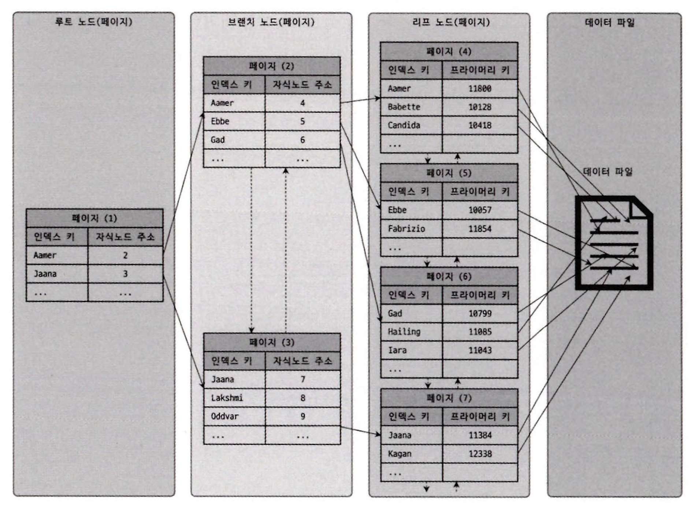

- 최상위에 위치한 **루트 노드(Root node)**
- 하위에 자식 노드가 붙어 있는 형태
- 가장 하위에 위치한 **리프 노드(Leaf node)**
    - 실제 데이터 레코드를 찾아가기 위한 주솟값을 가지고 있음
- 중간에 위치한 **브랜치 노드(Branch node)**
- 인덱스의 키 값은 모두 정렬돼 있으나 데이터 파일의 레코드는 정렬돼 있지 않음
    - 레코드가 삭제되어 빈 공간이 생기면 다음 INSERT는 가능한 한 삭제된 공간을 재활용 하도록 함

- 참고 ) InnoDB 테이블에서 레코드는 클러스터되어 디스크에 저장됨
    - 기본적으로 프라이머리 키 순서로 정렬되어 저장됨
    - InnoDB에서는 사용자가 별도의 명령이나 옵션 선택하지 않아도 클러스터링 테이블이 생성
    - *클러스터링 : 비슷한 값을 최대한 모아서 저장하는 방식

### MyISAM 테이블의 인덱스 | InnoDB 테이블의 인덱스

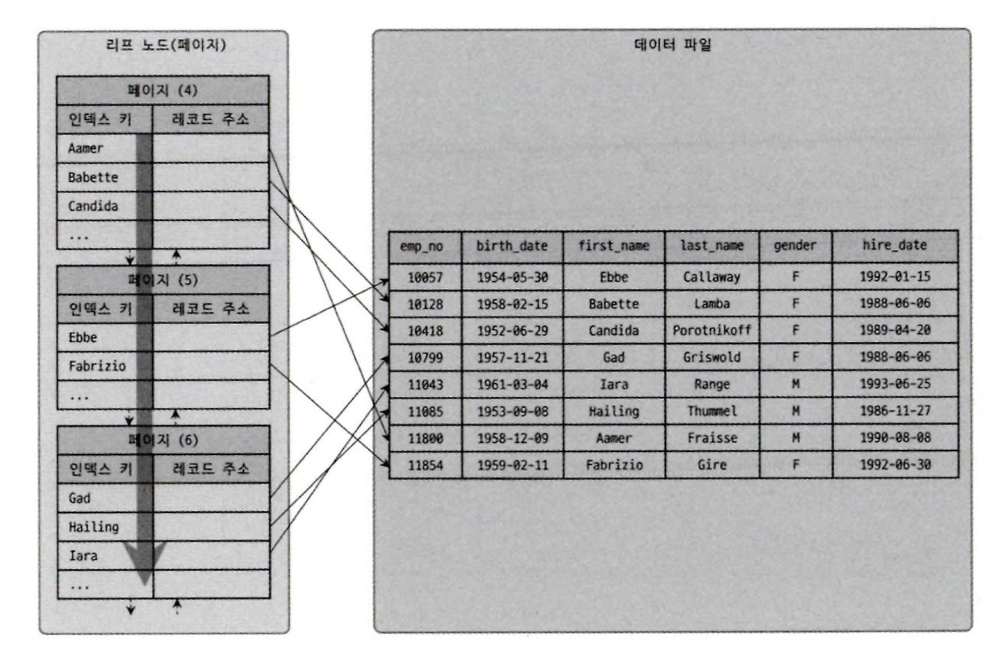

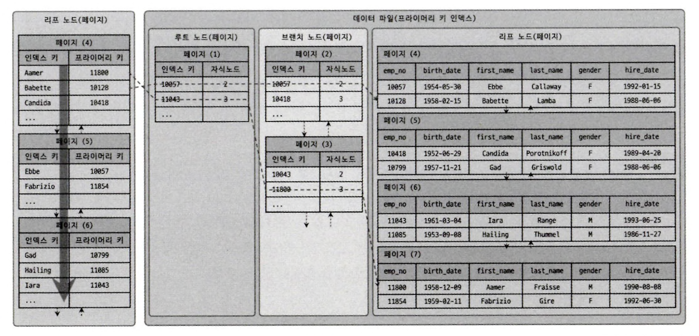

- 인덱스는 테이블의 키 칼럼만 가지고 있음
- 나머지 칼럼을 읽으려면?
    - 데이터 파일에서 해당 레코드를 찾아야 함
    - 이를 위해 인덱스 리프 노드는 데이터 파일에 저장된 레코드 주소 가짐

- **MyISAM** 테이블의 인덱스
    - 레코드 주소는 레코드가 테이블에 INSERT된 순번이거나 데이터 파일 내의 위치(Offset)
    - 세컨더리 인덱스가 **물리적인 주소**를 가짐
- **InnoDB** 테이블의 인덱스
    - 프라이머리 키가 ROWID의 역할
    - 프라이머리 키를 주소처럼 사용하기 떄문에 **논리적인 주소**를 가진다고 볼 수 있음
    - InnoDB 테이블에서 인덱스를 통해 레코드를 읽을때 데이터 파일을 바로 찾아가지 못함
        - 프라이머리 키 인덱스 검색 (인덱스에 저장돼 있는 프라이머리 키 값 이용)
        - 프라이머리 키 인덱스의 리프 페이지에 저장돼 있는 레코드 읽기
        - ⇒ 세컨더리 인덱스 검색에서 데이터 레코드를 읽기 위해서는 반드시 프라이머리 키를 저장하고 있는 B-Tree를 다시 한번 검색해야 함

### B-Tree 인덱스 키 추가 및 삭제

1. **인덱스 키 추가**
- B-Tree에 저장될 때는 저장될 키 값을 이용해 B-Tree상의 적절한 위치를 검색함
- 레코드의 키 값과 대상 레코드의 주소 정보를 B-Tree의 리프 노드에 저장
- 리프 노드가 꽉 차서 저장할 수 없으면 리프 노드 분리
    - 상위 브랜치 노드까지 처리의 범위가 넓어짐
    - ⇒ B-Tree는 상대적으로 쓰기 작업에 비용이 많이 듦
- 즉시 인덱스에 저장되는 경우
    - MyISAM, MEMORY
- 그렇지 않은 경우
    - InnoDB (**체인지 버퍼**)
    - 프라이머리 키나 유니크 인덱스의 경우 중복 체크 필요 → 즉시 추가or삭제

1. **인덱스 키 삭제**
- 해당 키 값이 저장된 B-Tree의 리프 노드를 찾아 삭제 마크
- 삭제 마킹된 인덱스 키 공간은 방치하거나 재활용 가능
- 디스크 쓰기가 필요한 작업임 → 디스크 I/O가 필요함
- InnoDB의 경우 버퍼링되어 지연 처리 가능
    - 처리가 지연된 인덱스 키 삭제는 사용자에게 악영향 없이
    - MySQL 서버가 내부적으로 처리함

1. **인덱스 키 변경**
- 인덱스상의 키 값만 변경하는 것은 불가능
- 인덱스의 키 값은 그 값에 따라 저장될 리프 노드의 위치가 결정되기 때문
- B-Tree의 키 값 변경 작업 순서
    - 키 값 삭제
    - 새로운 키 값 추가
- InnoDB 스토리지 엔진 테이블 → 체인지 버퍼 활용하여 지연 처리 가능

1. **인덱스 키 검색**
- INSERT, UPDATE, DELETE 작업의 추가 비용을 감당하면서 구축하는 이유
- 인덱스를 검색하는 작업 (트리 탐색)
    - B-Tree의 루트 노드 → 브랜드 노드 → 리프 노드 이용하며 비교 작업
- 트리 탐색은 UPDATE, DELETE 처리하기 전 검색할 때도 사용
- B-Tree 인덱스를 이용한 검색은,
    - 100% 일치
    - 값의 앞부분(Left-most part)만 일치하는 경우 사용 할 수 있다.
- **인덱스의 키 값에 변형이 가해진 후** 비교되는 경우 절대 B-Tree의 빠른 검색 기능 사용 불가
- 이미 변형된 값은 B-Tree 인덱스에 존재하는 값이 아님
- 함수나 연산을 수행한 결과로 정렬한다거나, 검색하는 작업은 B-Tree의 장점을 이용할 수 없음
- InnoDB 스토리지 엔진에서의 인덱스
    - InnoDB 테이블에서 지원하는 레코드 잠금, 넥스트 키락이 검색을 수행한 인덱스를 잠근 후 테이블의 레코드를 잠그는 방식으로 구현되어 있음
    - 따라서 UPDATE, DELETE 문장이 실행될 때 테이블에 적절히 사용할 수 있는 인덱스가 없으면 불필요하게 많은 레코드를 잠근다. 모든 레코드를 잠글 수도 있음
    - InnoDB 스토리지엔진에서는 그만큼 인덱스의 설계가 중요하고 많은 부분에 영향을 미친다.

### B-Tree 인덱스 사용에 영향을 미치는 요소

1. **인덱스 키 값의 크기**
- ***페이지(Page)** : InnoDB 스토리지 엔진에서 디스크에 데이터를 저장하는 가장 기본 단위
    - 인덱스도 페이지 단위로 관리됨
    - 루트와 브랜치, 리프노드를 구분한 기준이 페이지 단위임
- MySQL의 B-Tree는 자식 노드를 몇 개까지 가질까?
    - 인덱스의 페이지 크기와 키 값의 크기에 따라 결정
    - 하나의 인덱스 페이지에 저장할 수 있는 키 개수(자식 노드의 수) 구하기
        - 16*1024 / (인덱스 키의 크기 + 자식 노드 주소 크기) = 저장 가능한 자식 노드의 개수

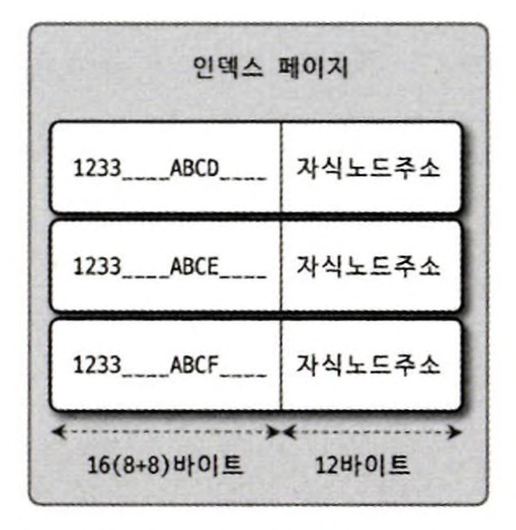

- 16(페이지 크기 기본값은 16KB) * 1024 / (16+12) = 585
- 이 경우 자식 노드를 한 페이지당 585개 가질 수 있는 B-Tree이다.
- 인덱스 키 값이 커지면..? ex) 32바이트 ⇒ 16*1024/(32+12) = 372
- SELECT 쿼리의 개수가 500개라면 전자의 경우 인덱스 페이지 한번으로
- 후자의 경우 최소 2번 이상 디스크로부터 읽어야 함.
- 인덱스 키 값의 길이가 길어지면 → 전체적인 인덱스의 크기가 커짐 → 메모리에 캐시해 둘 수 있는 레코드 수 감소 → 메모리 효율 감소

1. B-Tree 깊이
- B-Tree의 깊이는 상당히 중요하지만 직접 제어할 방법이 없음
- 인덱스 키값의 평균 크기가 늘어나면 어떤 현상이 발생할까?
    - ex) B-Tree 깊이가 3인 경우
        - 키 값이 16바이트 : 최대 2억(585*585*585)
        - 키 값이 32바이트 : 최대 5천만(372*372*372)
    - B-Tree의 깊이는 MySQL에서 값을 검색할 때 몇 번이나 랜덤하게 디스크를 읽어와야 하는지와 직결
    - 인덱스 키 값의 크기가 커짐 → 한 인덱스 페이지가 담을 수 있는 인덱스 키 값의 개수 감소 → B-Tree 깊이가 깊어짐 → 디스크 읽기가 더 많이 필요하게 됨
- 인덱스 키 값의 크기는 가능한 작게 만드는 것이 좋음

1. 선택도(기수성)
- 인덱스에서 선택도(Selectivity) 또는 기수성(Cardinality)는 거의 같은 의미로 사용
- 모든 인덱스 키 값 가운데 유니크한 값의 수를 의미함.
- 전체 인덱스 키 값이 100개인데 유니크한 값의 수가 10이면 ⇒ 카디널리티 10
- 인덱스는 선택도가 높을수록 검색 대상이 줄어듦 → 빠르게 처리

1. 읽어야 하는 레코드의 건수
- 인덱스를 통해 테이블의 레코드를 읽는 것 → 인덱스를 거치지 않고 테이블의 레코드를 읽는 것보다 높은 비용
- ex) 100만 건이 저장된 테이블에 50만건을 읽는 쿼리
    - 전체 테이블을 모두 읽어서 필요 없는 50만 건을 버리는 것이 효율적인가?
    - 인덱스를 통해 필요한 50만 건만 읽어 오는 것이 효율적인가?
- 일반적인 DBMS의 옵티마이저에서는 인덱스를 통해 레코드 1건을 읽는 것이 직접 레코드 1건을 읽는 것보다 4~5배 정도 비용이 더 많이 드는 작업이라고 예측함
- 인덱스를 통해 읽어야 할 레코드의 건수가 전체 테이블 레코드의 20~25%를 넘어서면
    - 인덱스 이용하지 않고
    - 테이블을 모두 직접 읽어 필요한 레코드만 가려내는 필터링 방식으로 처리하는 것이 효율적
- 예시 쿼리 → 인덱스의 손익 분기점인 20~25%보다 훨씬 큼
    - MySQL 옵티마이저는 인덱스를 사용하지 않고 직접 테이블을 처음부터 끝까지 읽어서 처리


B-Tree 인덱스를 통한 데이터 읽기

1. 인덱스 레인지 스캔
- 인덱스 접근 방법 가운데 가장 대표적인 접근 방식
- 나머지 스캔 방식보다 빠른 방법
- 검색해야 할 인덱스의 범위가 결정됐을 때 사용하는 방식
- 루트 노드 비교 시작 → 브랜치 노드 → 리프 노드에서 필요한 레코드 시작 지점 찾음 → 리프 노드의 레코드만 순서대로 읽으면 됨
- 이처럼 차례대로 쭉 읽는 것을 스캔이라고 표현함
- 만약 스캔하다가 리프 노드의 끝까지 읽으면?
    - 리프 노드 간의 링크를 이용해 다음 리프 노드를 찾고 다시 스캔
    - 최종적으로 스캔을 멈춰야 할 위치에 다다르면
    - 지금까지 읽은 레코드를 사용자에게 반환 후 쿼리를 끝냄

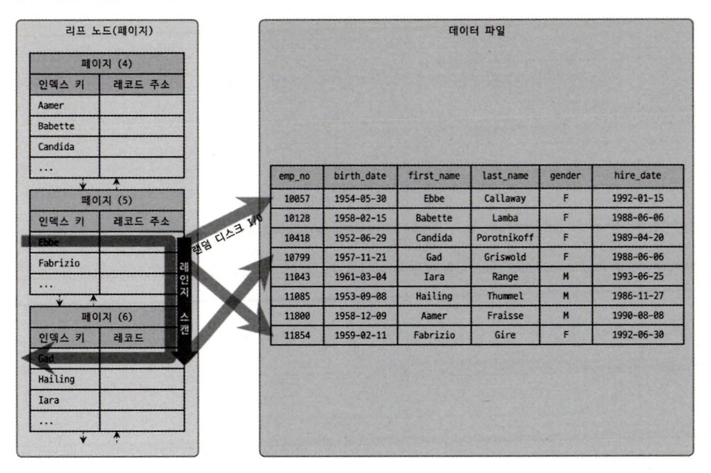

- B-Tree 인덱스에서 루트와 브랜치 노드를 이용해 스캔 시작 위치 검색 :: 인덱스 탐색(Index seek)
- 그 지점부터 필요한 방향으로 인덱스를 읽어 나가는 과정 :: 인덱스 스캔(Index scan)
- 어떤 방식으로 스캔하든 해당 인덱스를 구성하는 칼럼의 정렬된 상태로 가져옴
    - 이는 별도의 정렬 과정이 수반되는 것이 아닌, 인덱스 자체의 정렬 특성 때문에 자동으로 그렇게 됨
- 인덱스의 리프 노드에서 검색 조건에 일치하는 건들은 데이터 파일에서 읽어오는 과정이 필요함
    - 이때 레코드 한 건 한 건 단위로 랜덤 I/O가 한 번씩 일어남
    - 인덱스를 통해 레코드를 읽는 작업은 비용이 많이 드는 작업
    - 인덱스를 통해 읽어야 할 데이터 레코드가 20~25% 넘으면 직접 읽는 것이 더 효율적

1. 인덱스 풀 스캔
- 인덱스의 처음부터 끝까지 모두 읽는 방식
- 대표적으로 쿼리의 조건절에 사용된 칼럼이 인덱스의 첫 번째 칼럼이 아닌 경우 인덱스 풀 스캔 방식 사용됨
    - ex) 인덱스는 (A, B, C) 칼럼의 순서 → 쿼리의 조건절은 B 칼럼이나 C 칼럼으로 검색
- 쿼리가 인덱스에 명시된 칼럼만으로 조건을 처리할 수 있는 경우 사용
- 인덱스 + 데이터 레코드까지 읽어야 한다면? 절대 이 방식으로 처리 안됨

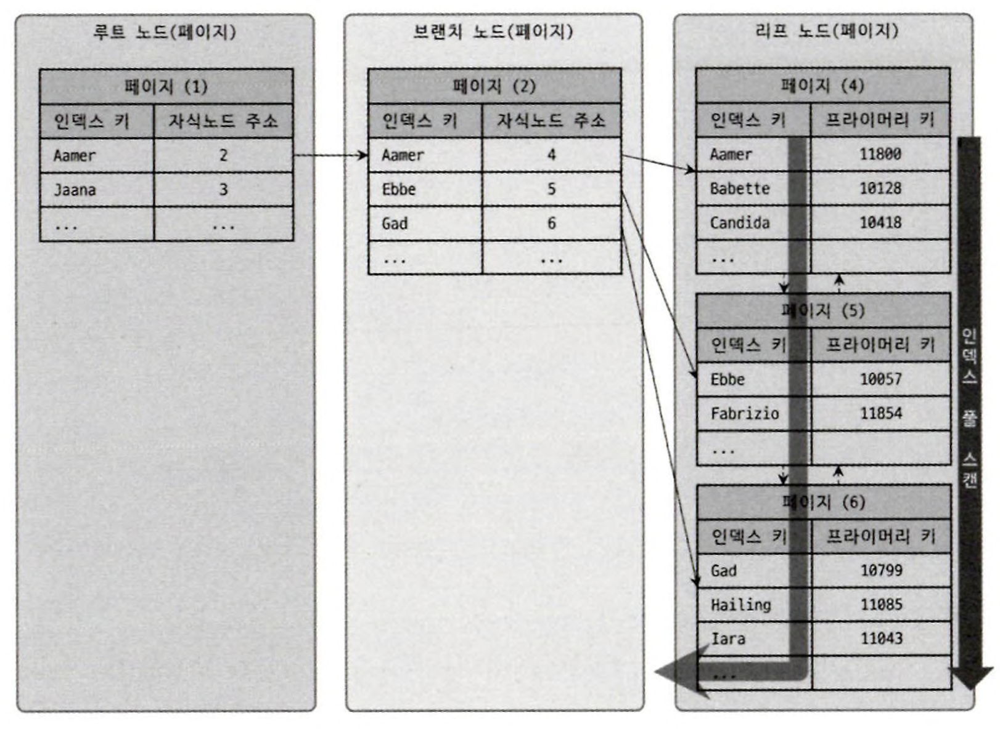

- 인덱스 리프 노드의 제일 앞 또는 제일 뒤로 이동
- 인덱스의 리프 노드를 연결하는 링크드 리스트(Linked list, 리프 노드 사이를 연결하는 두 쌍의 화살표)를 따라 처음부터 끝까지 스캔
- 인덱스 레인지 스캔보다는 빠르지 않지만 테이블 풀 스캔보다 효율적
- 인덱스 풀 스캔 방식 또한 인덱스를 이용하는 것이지만 효율적인 방식은 아님
- 일반적으로 인덱스를 생성하는 목적은 아님
- 인덱스에 포함된 칼럼만으로 쿼리를 처리할 수 있는 경우

1. 루스 인덱스 스캔

- 중간에 필요치 않은 인덱스 키 값은 무시하고 다음으로 넘어가는 형태로 처리
- 인덱스 레인지, 풀 스캔은 루스 인덱스 스캔과 상반된 의미에서 타이트 인덱스 스캔으로 분류
- GROUP BY, MAX(), MIN() 함수에 대해 최적화를 하는 경우 사용

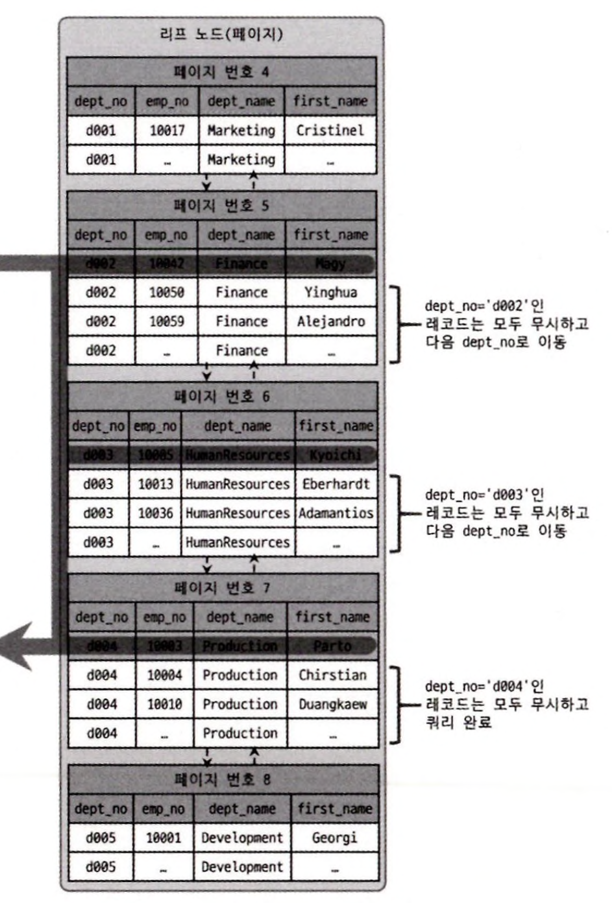

```sql
SELECT dept_no, MIN(emp_no)
FROM dept_emp
WHERE dep_no BETWEEN 'd002' AND 'd004'
GROUP BY dept_no;
```

- dept_no와 emp_no라는 두 개의 칼럼으로 인덱스 생성
- dept_no, emp_no 조합으로 정렬되어 있음
    - dept_no 그룹 별로 첫 번째 레코드의 emp_no 값만 읽으면 됨
    - WHERE 조건을 만족하는 범위 전체를 다 스캔할 필요 없음
    - 옵티마이저는 조건에 만족하지 않는 레코드 무시 후 다음 레코드로 이동

1. 인덱스 스킵 스캔
- ‘값의 정렬’ : 데이터베이스 서버에서 인덱스의 핵심
    - 인덱스를 구성하는 칼럼의 순서가 매우 중료

```sql
ALTER TABLE employees
ADD INDEX ix_gender_birthdate (gender, birth_date);
```

- 해당 인덱스를 사용하려면 WHERE 조건절에 gender 칼럼에 대한 비교 조건이 필수임.

```sql
-- // 인덱스를 사용하지 못하는 쿼리
SELECT * FROM employees WHERE birth_date >= '1965-02-01';

-- // 인덱스를 사용할 수 있는 쿼리
SELECT * FROM employees WHERE gender = 'M' AND birth_date >= '1965-02-01';
```

- 첫번째 쿼리
    - gender 칼럼에 대한 비교 조건이 없음
    - 인덱스를 사용할 수 없음
- 두번째 쿼리
    - gender 칼럼과 birth_date 칼럼 조건 모두 가짐
    - 인덱스 효율적으로 사용가능함
- but>
    - MySQL 8.0 버전부터 인덱스 스킵 스캔(Index skip scan) 최적화 기능 도입
    - 옵티마이저가 gender 칼럼을 건너뛰어 birth_date 만으로 인덱스 검색이 가능하게
- 루스 인덱스 스캔과 다른점?
    - 루스 인덱스 스캔도 인덱스 스킵 스캔과 비슷한 최적화를 수행하나,
    - GROUP BY 작업을 처리하기 위해 인덱스를 사용하는 경우에만 적용가능함.
    - 인덱스 스킵 스캔은 WHERE 조건절의 검색을 위해 사용 가능

인덱스 스킵 스캔 비교

1. 인덱스 스킵 스캔 OFF

```sql
set optimizer_switch = 'skip_scan=off';

explain select gender, birth_date
from employees
where birth_date >= '1965-02-01';
```

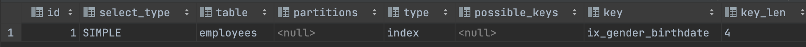

- type 칼럼 “index”
    - 인덱스를 처음부터 끝까지 모두 읽음
    - 풀 인덱스 스캔
    - 인덱스를 비효율적으로 사용
- 해당 예제는 인덱스에 있는 gender, birth_date 칼럼만 있으면 처리 완료
    - 따라서, ix_gender_birthdate 인덱스를 풀 스캔함
    - 만약 인덱스 칼럼이 아닌 다른 칼럼을 가져와야 했다면?
        - 테이블 풀 스캔 실행했을 것….

1. 인덱스 스킵 스캔 ON

```sql
set optimizer_switch = 'skip_scan=on';

explain select gender, birth_date
from employees
where birth_date >= '1965-02-01';
```


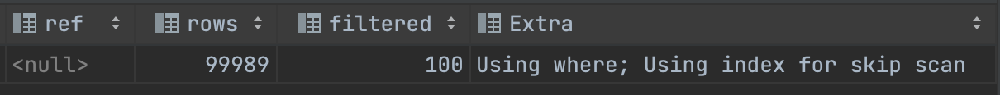

- type 칼럼 “range”
    - 인덱스의 꼭 필요한 부분만 읽음
- Extra 칼럼 “Using index for skip scan”
    - ix_gender_birthdate 인덱스에 대해 인덱스 스킵 스캔을 활용해 데이터를 조회함을 의미

MySQL 옵티마이저

- gender 칼럼에서 유니크한 값을 모두 조회 → 주어진 쿼리에 gender 칼럼의 조건을 추가 → 쿼리 재실행
- gender 칼럼은 성별을 구분하는 컬럼 → ‘M’, ‘F’ ENUM 타입 칼럼
    - gender 칼럼에 대해 가능한 값 2개 (‘M’, ‘F’) 구하고
    - 옵티마이저는 내부적으로 2개의 쿼리를 실행하는 것과 비슷한 형태의 최적화를 진행함

```sql
select gender, birth_date from employees where gender='M' and birth_date >= '1965-02-01';
select gender, birth_date from employees where gender='F' and birth_date >= '1965-02-01';
```

- MySQL 서버는 인덱스를 루스 인덱스 스캔과 동일한 방식으로 읽으면서
- 인덱스에 존재하는 모든 값을 먼저 추출함
- 그 결과를 이용해 인덱스 스킵 스캔 실행

인덱스 스킵 스캔의 단점

- WHERE 조건절에 조건이 없는 인덱스의 선행 칼럼의 유니크한 값의 개수가 적어야 함
    - 유니크한 값의 개수가 많으면?
        - 옵티마이저는 인덱스에서 스캔해야 할 시작 지점을 검색하는 작업이 많이 필요해짐
        - 쿼리 처리 성능이 느려짐 (쿼리 실행 계획의 비용)
- 쿼리가 인덱스에 존재하는 칼럼만으로 처리 가능해야 함(커버링 인덱스)
    - 위에서 언급한 풀 테이블 스캔의 가능성

    ```sql
    explain select *
    from employees
    where birth_date >= '1965-02-01';
    ```

  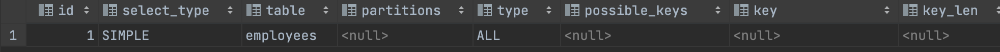

    - ix_gender_birthdate 인덱스에 포함된 gender 칼럼과 birth_date 칼럼 이외 칼럼도 필요
    - 풀 테이블 스캔으로 실행 계획을 수립함


다중 칼럼(Multi-column) 인덱스

- 두 개 이상의 칼럼으로 구성된 인덱스
- 두개 이상의 칼럼이 연결됐다는 의미로 “Concatenated Index” 라고도 함

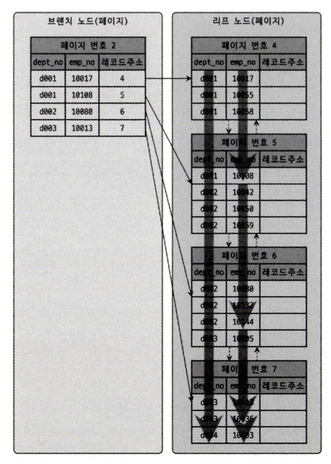

- 왼쪽 예시는 편의상 루트 노드를 생략함
- 실제 데이터 레코드 수가 작은 경우 브랜드 노드는 없을 수도 있음
- 루트 노드와 리프 노드는 항상 존재함
- 인덱스의 두 번째 칼럼은 첫 번째 칼럼에 의존해서 정렬되어 있음
- 두 번째 칼럼의 정렬은 첫 번째 칼럼이 똑같은 레코드에서만 의미가 있다는 것
- emp_no 값의 정렬 순서가 빠르다고 해도 dept_no 값의 정렬 순서가 늦다면 인덱스의 뒤쪽에 위치함
- 다중 칼럼 인덱스 내에서 각 칼럼의 위치가 상당히 중요함
- 신중히 결정해야 함

B-Tree 인덱스의 정렬 및 스캔 방향

- 인덱스를 생성할 때 설정한 정렬 규칙에 따라, 인덱스의 키 값은 항상 설정한 정렬 규칙으로 저장
- 하지만, 오름차순 정렬 규칙으로 생성됐다고 해서 오름차순으로만 읽을 수 있단느 뜻은 아님
- 인덱스 거꾸로 끝에서부터 읽으면 내림차순으로 정렬된 인덱스 사용 가능
- 옵티마이저가 실시간으로 만들어내는 실행 계획에 따라 결정

1. 인덱스의 정렬

```sql
CREATE INDEX ix_teamname_userscore ON employees (team_name ASC, user_score DESC);
```

- MySQL 5.7 이후 버전부터 가능해진 정렬 순서 혼합 인덱스 생성
- team_name은 ASC로, user_score은 DESC로 정렬 순서를 혼합해서 인덱스를 생성함

1. 인덱스 스캔 방향

MySQL 서버에서는 실제 내림차순인지 오름차순인지 관계없이 인덱스를 읽는 순서만 변경해서 해경 가능

```sql
SELECT *
FROM employees
ORDER BY first_name DESC 
LIMIT 1;
```

- 해당 쿼리를 실행하면 처음부터 끝까지 다 읽은 후 마지막 값(오름차순으로 읽었을 떄 가장 마지막 레코드) 값 하나를 가져오는 것인가?
  - NO!
  - 인덱스는 항상 오름차순으로 정렬돼 있다
  - 하지만 최솟값부터 읽으면 오름차순,
  - 최댓값부터 거꾸로 읽으면 내림차순으로 값을 가져올 수 있다는 것을
  - **MySQL 옵티마이저**는 알고 있음

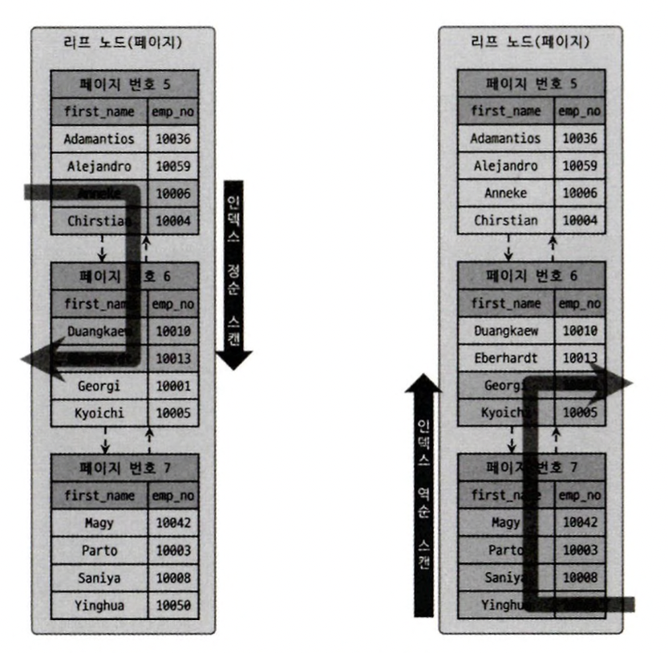

- 인덱스 생성 시점에 오름차순 또는 내림차순으로 결정되지만
- 쿼리가 그 인덱스를 사용하는 시점에 인덱스를 읽는 방향에 따라 오름차순 또는 내림차순 정렬 효과를 얻을 수 있음
- 오름차순으로 생성된 인덱스를 정순으로 읽으면 출력되는 결과 레코드는 자동으로 오름차순 정렬된 결과
- 역순으로 읽으면 그 결과는 내림차순으로 정렬된 상태

1. 내림차순 인덱스
- first_name 칼럼을 역순으로 정렬하는 요건만 있다면 다음 2개 인덱스 중 어떤 것이 성능이 좋을까?

```sql
CREATE INDEX ix_firstname_asc ON employees (first_name ASC);
CREATE INDEX ix_firstname_dasc ON employees (first_name DESC);
```

- 해답을 찾아나가보자
- 일단, 간단히 용어 정리부터

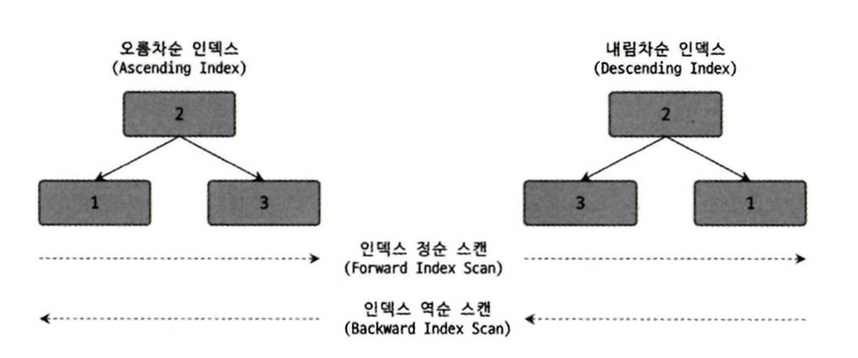

1. 오름차순 인덱스 (Ascending Index)
  - 작은 값의 인덱스 키가 B-Tree의 왼쪽으로 정렬된 인덱스
2. 내림차순 인덱스 (Descending Index)
  - 큰 값의 인덱스 키가 B-Tree의 왼쪽으로 정렬된 인덱스
3. 인덱스 정순 스캔 (Forward Index Scan)
  - 인덱스 키의 크고 작음에 관계없이 인덱스 리프 노드의 왼쪽 페이지부터 오른쪽으로 스캔
4. 인덱스 역순 스캔 (Backward index Scan)
  - 인덱스 키의 크고 작음에 관계없이 인덱스 리프 노드의 오른쪽 페이지부터 왼쪽으로 스캔

- 내림차순 인덱스의 필요성에 대해 알아보는 테스트를 진행해보자

```sql
CREATE TABLE t1 (
tid INT NOT NULL AUTO_INCREMENT,
TABLE_NAME VARCHAR(64),
COLUMN_NAME VARCHAR(64),
ORDINAL_POSITION INT,
PRIMARY KEY(tid)
) ENGINE=InnoDB;
-- 테이블 생성

--
INSERT INTO t1
SELECT NULL, TABLE_NAME, COLUMN_NAME, ORDINAL_POSITION
FROM information_schema.COLUMNS;

INSERT INTO t1
SELECT NULL, TABLE_NAME, COLUMN_NAME, ORDINAL_POSITION
FROM t1;
-- // INSERT 12번 실행
```

- 정렬만 수행하는 쿼리 실행해보기
- 다음 두 쿼리는 테이블의 프라이머리 키를 정순 또는 역순으로 스캔하며 마지막 레코드 1건만 반환

```sql
-- tid 칼럼의 값이 가장 큰 레코드 1건
select * from t1 order by tid asc limit 28796039, 1;

-- tid 칼럼의 값이 가장 작은 레코드 1건
select * from t1 order by tid desc limit 28796039, 1;
```

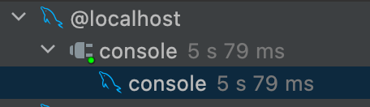

- 1번 쿼리 실행 결과

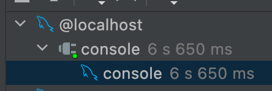

- 2번 쿼리 실행 결과
- 왜 역순 스캔이 정순 스캔에 비해 느린걸까?
  - 페이지 잠금이 인덱스 정순 스캔에 적합한 구조
  - 페이지 내에서 인덱스 레코드가 단방향으로만 연결된 구조

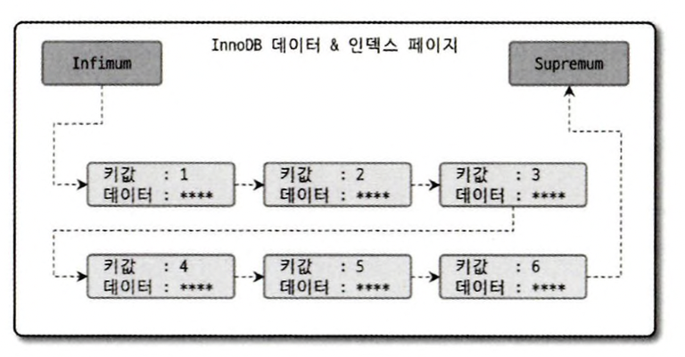

B-Tree 인덱스의 가용성과 효율성

- 어떤 조건에서 인덱스를 사용할 수 있고 어떨 때 사용할 수 없는지에 대해
- 인덱스를 100% 활용하는 방법과 일부만 이용하게 되는 경우에 대해

→ 쿼리의 조건을 최적화하거나 쿼리에 맞게 인덱스를 생성해보자

1. 비교 조건의 종류와 효율성
- 인덱스 칼럼의 활용 형태와 효율이 달라지는 조건들
  - 다중 칼럼 인덱스에서 각 칼럼의 순서
  - 다중 칼럼 인덱스에서 각 칼럼에 사용된 조건
    - 동등 비교(”=”), 크다 또는 작다(”<”)

다중 칼럼 인덱스에서 각 칼럼의 순서

```sql
-- 테스트를 진행할 쿼리
SELECT * FROM dept_emp
WHERE dept_no = 'd002' AND emp_no >= 10114;

-- 테스트에 쓰일 인덱스
A : INDEX(dept_no, emp_no)
B : INDEX(emp_no, dept_no)
```

- 인덱스의 순서가 어떠한 영향을 미칠까?

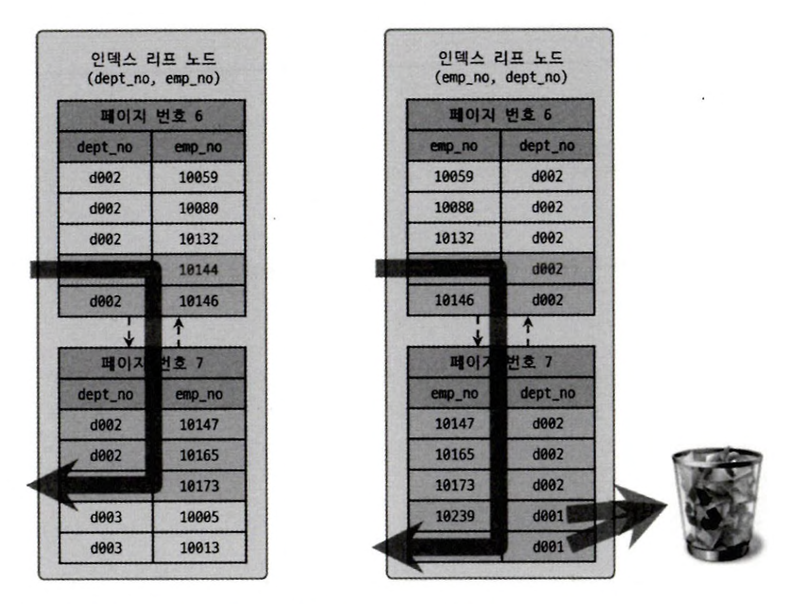

인덱스 A

- “dept_no = ‘d002’ AND emp_no ≥ 10144” 인 레코드를 찾는다.
- dept_no가 ‘d002’가 아닐 때까지 인덱스를 쭉 읽는다.
- 5건의 데이터를 가져오기 위한 5번의 비교 작업

인덱스 B

- “emp_no ≥ 10144 AND dept_no=’d002’” 인 레코드를 찾는다.
- 이후 모든 레코드에 대해 dept_no 가 ‘d002’인지 비교하는 과정을 거친다.
- 5건의 데이터를 가져오기 위한 7번의 비교 작업
- 테스트 케이스보다 칼럼 수가 더 많았다면…?

정리

- 왜 인덱스 B는 7번의 비교 과정을 거쳤을까?
  - A 인덱스에서 2번째 칼럼인 emp_no는 비교 작업의 범위를 좁히는 데 도움을 준다.
  - B 인덱스에서 2번째 칼럼인 dep_no는 비교 작업의 범위를 좁히는 데 도움을 주지 못하고 단지 쿼리의 조건에 맞는지 검사하는 용도로만 사용
- 작업 범위 결정 조건
  - 작업의 범위를 결정하는 조건
  - ex) A 인덱스에서의 두 조건(dept_no = ‘d002’와 emp_no ≥ 10144)
- 필터링 조건 or 체크 조건
  - 단순히 거름종이 역할만 하는 조건
  - ex) B 인덱스의 dept_no = ‘d002’ 조건
- 작업 범위 결정 조건은 많으면 많을수록 쿼리의 처리 성능을 높임
- 체크 조건은 쿼리의 성능을 높이지 못함. 오히려 더 느리게 만들 때가 많음

2. 인덱스의 가용성
- B-Tree 인덱스의 특징은 왼쪽 값에 기준해서 오른쪽 값이 정렬돼 있다는 것임.
- 여기서 왼쪽이란 하나의 칼럼 내에서뿐 아니라 다중 칼럼 인덱스의 칼럼에 대해서도 함께 적용

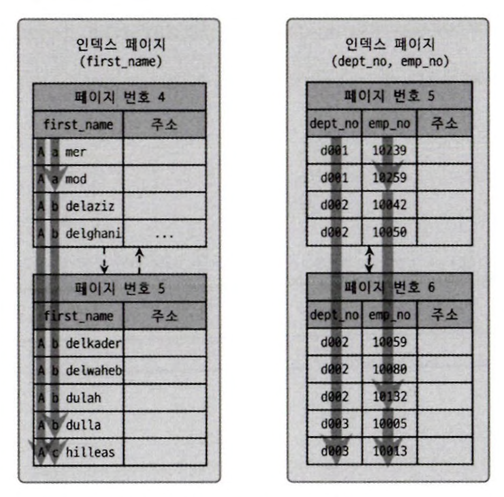

- 인덱스 키 값의 정렬 특성은 빠른 검색의 전제 조건임
- 하나의 칼럼으로 검색해도 값의 왼쪽 부분이 없으면 인덱스 레인지 스캔 방식의 검새깅 불가능함
- 다중 칼럼 인덱스에서도 왼쪽 칼럼의 값을 모르면 레인지 스캔을 사용할 수 없음

```sql
SELECT * FROM employees WHERE first_name LIKE '%mer';
```

- 위 쿼리는 인덱스 레인지 스캔 방식으로 인덱스를 이용할 수 없음
- first_name 칼럼의 가장 왼쪽부터 한 글자씩 비교해 나가는데 조건절에 주어진 상숫값 (’%mer’)에는 왼쪽 부분이 고정되지 않았기 때문
- 따라서 정렬 우선순위가 낮은 뒷부분의 값만으로는 왼쪽 기준 정렬 기반의 인덱스인 B-tree에서는 인덱스의 효과를 얻을 수 없음

```sql
SELECT * FROM dept_emp WHERE emp_no >= 10144;
```

- 결론은 인덱스를 효율적으로 사용할 수 없다.
- 인덱스가 (dept_no, emp_no) 칼럼 순서대로 생성돼 있다면 인덱스의 선행 칼럼인 dept_no 조건 없이 emp_no 값으로만 검색하면 인덱스를 효율적으로 사용할 수 없음
- 해당 케이스의 인덱스는 다중 칼럼으로 구성된 인덱스이므로 dept_no 칼럼에 대해 먼저 정렬한 후, 다시 emp_no 칼럼값으로 정렬돼 있기 때문
- 인덱스의 왼쪽 값 기준 규칙은 GROUP BY 절이나 ORDER BY 절에도 똑같이 적용된다.

3. 가용성과 효율성 판단
- B-Tree 인덱스를 사용할 수 없는 조건 (작업 범위 결정 조건으로 사용할 수 없음)
    - NOT-EQUAL로 비교된 경우 (”<>”, “NOT IN”, “NOT BETWEEN”, “IS NOT NULL”)
        - WHERE column ‘N’
        - WHERE column NOT IN (10, 11, 12)
        - WHERE column IS NOT NULL
    - LIKE ‘%??’(앞부분이 아닌 뒷부분 일치) 형태로 문자열 패턴이 비교된 경우
    - 스토어드 함수나 다른 연산자로 인덱스 칼럼이 변형된 후 비교된 경우
        - WHERE SUBSTRING(column, 1, 1) = ‘X’
        - WHERE DAYOFMONTH(column) = 1
    - NOT-DETERMINISTIC 속성의 스토어드 함수가 비교 조건에 사용된 경우
        - WHERE column = deterministic_function()
    - 데이터 타입이 서로 다른 비교(인덱스 칼럼의 타입을 변환해야 비교가 가능한 경우)
        - WHERE char_column = 10
    - 문자열 데이터 타입의 콜레이션이 다른 경우
        - WHERE utf8_bin_char_column = euckr_bin_char_column
        
- 다중 칼럼 인덱스 사용 기준

```jsx
INDEX ix_test (column_1, column_2, column_3, .., column_n)
```

- 작업 범위 결정 조건으로 인덱스를 사용하지 못하는 경우
    - column_1 칼럼에 대한 조건이 없는 경우
    - column_1 칼럼의 비교 조건이 위의 인덱스 사용 불가 조건 중 하나인 경우
- 작업 범위 결정 조건으로 인덱스를 사용하는 경우(i는 2보다 크고 n보다 작은 임의의 값을 의미)
    - column_1 ~ column_(i-1) 칼럼까지 동등 비교 형태(”=” 또는 “IN”)로 비교
    - column_i 칼럼에 대해 다음 연산자 중 하나로 비교
        - 동등 비교(”=” 또는 “IN”)
        - 크다 작다 형태(”>” 또는 “<”)
        - LIKE로 좌측 일치 패턴(LIKE ‘승환%)
- 위 두 조건을 만족하는 쿼리는 column_1 부터 column_i까지는 작업 범위 결정 조건으로 사용
- column_(i+1) 부터 column_n까지의 조건은 체크 조건으로 사용

---

## R-Tree 인덱스

- MySQL의 공간 인덱스(Spatial Index)
  - R-Tree 인덱스 알고리즘을 이용해 2차원의 데이터를 인덱싱하고 검색하는 목적의 인덱스
  - 기본적인 내부 매커니즘은 B-Tree와 흡사
  - B-Tree는 인덱스 구성 칼럼 값이 1차원인 스칼라 값
  - R-Tree는 인덱스 구성 칼럼 값이 2차원의 공간 개념 값
- MySQL의 공간 확장(Spatial Extension)의 기능
  - 공간 데이터를 저장할 수 있는 데이터 타입
  - 공간 데이터의 검색을 위한 공간 인덱스(R-Tree 알고리즘)
  - 공간 데이터의 연산 함수(거리 또는 포함 관계의 처리)
  - 위치 기반 서비스를 구현하기에 용이함

### **구조 및 특성**

- 공간 정보의 저장, 검색을 위한 기하학적 도형 정보를 관리할 수 있는 데이터 타입
  - POINT
  - LINE
  - POLYGON
  - GEOMETRY
    - 위 3개 타입의 슈퍼 타입
    - POINT, LINE, PLYGON 객체를 모두 저장

### **MBR**

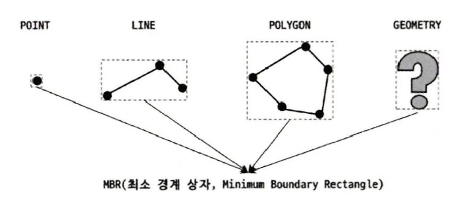

- “Minimum Bounding Rectangle”
- 해당 도형을 감싸는 최소 크기의 사각형을 의미
- 이 사각형들의 포함 관계를 B-Tree 형태로 구현한 인덱스가 R-Tree 인덱스

### R-Tree의 구조

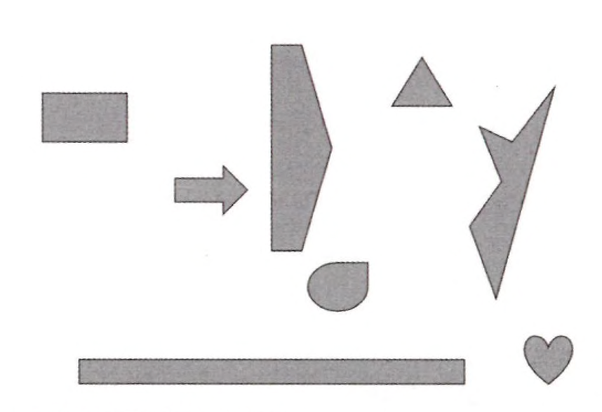

- 공간 데이터
- 이러한 도형이 저장됐을 때 만들어지는 인덱스의 구조를 이해하려면 우선 이 도형들의 MBR이 어떻게 되는지 알아볼 필요가 있음.

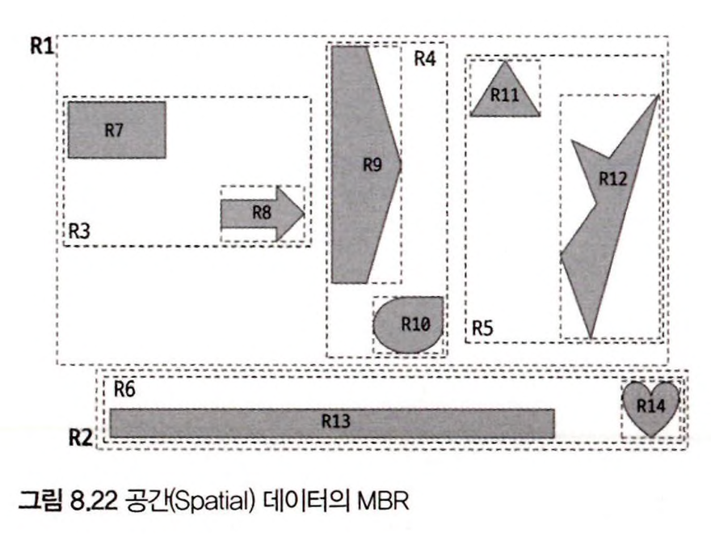

- 최상위 레벨: R1, R2
- 차상위 레벨: R3, R4, R5, R6
- 최하위 레벨: R7 ~ R14
- 최하위 레벨 MBR(각 도형을 제일 안쪽에서 둘러싼 점선 상자)
  - 각 도형 데이터의 MBR을 의미함
- 차상위 레벨의 MBR(도형 객체의 그룹)
  - 중간 크기의 MBR
  - R-Tree의 브랜치 노드
- 최상위 MBR
  - 루트 노드에 저장되는 정보

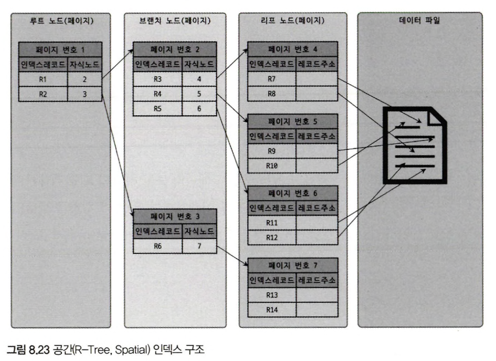

### R-Tree 인덱스의 용도

- R-Tree는 MBR 정보를 이용해 B-Tree 형태로 인덱스를 구축하므로 Rectangle의 ‘R’과 B-Tree의 ‘Tree’를 섞어서 R-Tree라는 이름이 붙여짐
- 일반적으로 WGS84(GPS) 기준의 위도, 경도, 좌표 저장에 주로 사용
- CAD/CAM 소프트웨어 또는 회로 디자인 등과 같이 좌표 시스템에 기반을 둔 정보에 대해서는 모두 적용가능
- R-Tree는 각 도형(도형의 MBR)의 포함 관계를 이용해 만들어진 인덱스
  - 따라서 ST_Contains() 또는 ST_Within() 등과 같은 포함 관계를 비교하는 함수로 검색 수행시에만 인덱스 이용 가능
  - 현재 사용자의 위치로부터 반경 5km이내의 음식점 검색

### **특정 지점을 기준으로 사각 박스 이내의 위치를 검색하는 예시**

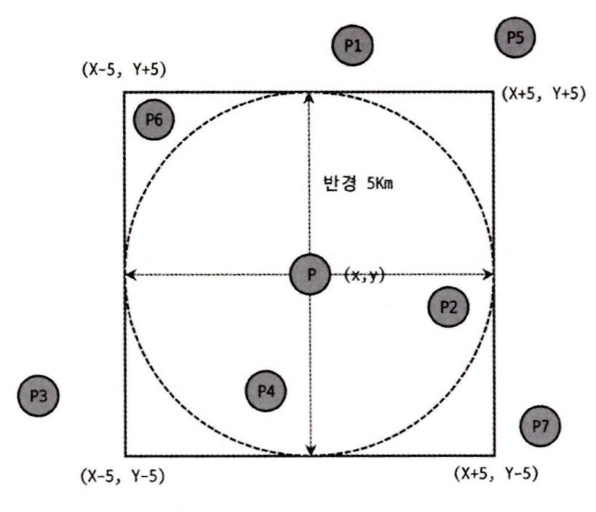

- ‘P’가 기준점
- 기준점으로부터 반경 거리 5km 이내의 점(위치)들을 검색하려면?
  - 사각 점선의 상자에 포함되는 점들을 검색 (ST_Contains() 또는 ST_Within() 함수 이용)
  - ST_Contains()나 ST_Within() 연산은 사각형 박스와 같은 다각형(Polygon)으로만 연산 가능하므로 반경 5km를 그리는 원을 포함하는 최소 사각형(MBR)으로 포함 관계 비교를 수행한 것
  - 점 ‘P6’은 기준점 P로부터 반경 5km 이상 떨어져 있지만 최소 사각형 내에는 포함
  - ‘P6’을 빼고 결과를 조회하려면 조금 더 복잡한 비교가 필요함
  - ‘P6’을 결과에 포함해도 무방하다면 다음 쿼리와 같이 ST_Contains()나 ST_Within() 비교만 수행하는 것이 좋음

```sql
-- // ST_Contains() 또는 ST_Within()을 이용해 "사각 상자"에 포함된 좌표 Px만 검색

SELECT * FROM tb_location
WHERE ST_Contains(사각 상자, px);

SELECT * FROM tb_location
WHERE ST_Within(px, 사각 상자);
```

- ST_Contains()
  - 첫 번째 파라미터로 포함 경계를 가진 도형 명시
  - 두 번째 파라미터로 포함되는 도형(또는 점 좌표)을 명시
- ST_Within()
  - 첫 번째 파라미터로 도형(또는 점 좌표)을 명시
  - 두 번째 파라미터로 포함 경계를 가진 도형 명시
---

## **전문 검색 인덱스**

인덱스 알고리즘

1. 어근 분석 알고리즘
2. n-gram 알고리즘

전문 검색 인덱스의 가용성

---

## 함수 기반 인덱스

가상 칼럼을 이용한 인덱스

함수를 이용한 인덱스

---

## 멀티 밸류 인덱스

---

## 클러스터링 인덱스

- *클러스터링 : 여러 개를 하나로 묶는다
- MySQL 서버에서의 클러스터링
  - 테이블의 레코드를 비슷한 것들끼리 묶어 저장
  - *비슷한 것 : 프라이머리 키 기준
  - InnoDB 스토리지 엔진에서만 지원


### 클러스터링 인덱스

- 테이블의 프라이머리 키에 대해서만 적용
- 프라이머리 키 값이 비슷한 레코드끼리 묶어 저장하는 것
- 프라이머리 키 값에 의해 레코드의 저장 위치 결정
- 클러스터링된 테이블은 프라이머리 키 값 자체에 의존도가 높음
- 프라이머리 키 결정에 신중을 기하여야 함
- 테이블 레코드 저장 방식으로 볼 수 있음
  - 클러스터링 인덱스 = 클러스터링 테이블
- 프라이머리 키 기반의 검색 빠름
- 프라이머리 키의 변경 느림, 레코드 저장 느림

### B-Tree 인덱스도 클러스터링 인덱스인가?

- 결론은 아니다
- B-Tree 인덱스도 인덱스 키 값으로 이미 정렬되어 저장되기는 하나,
- 이러한 일반적인 B-Tree 인덱스를 클러스터링 인덱스라고 부르지는 않음
- 테이블의 레코드기 `프라이머리 키 값`으로 정렬되어 저장된 경우만 해당

### 클러스터링 테이블 구조

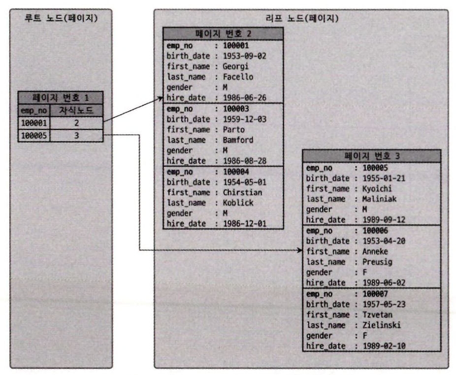

- B-Tree의 리프 노드와 달리 클러스터링 테이블의 리프 노드엔 모든 칼럼이 같이 저장
- 클러스터링 테이블은 그 자체가 하나의 거대한 인덱스 구조로 관리
```sql
UPDATE tb_test SET emp_no = 100002 WHERE emp_no = 100007;
```

- 만약 클러스터링 테이블에서 프라이머리 키 변경시 일어나는 변화

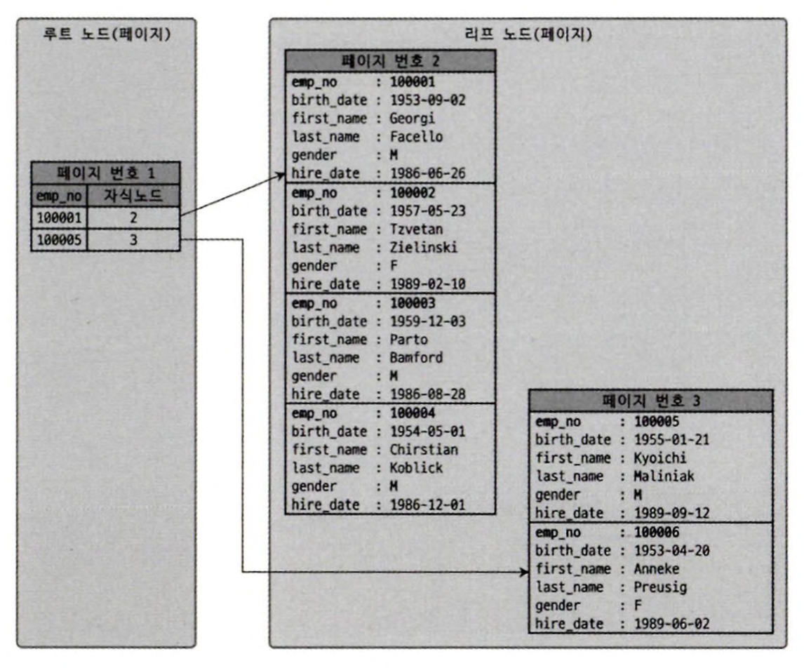

- 3번 페이지에 있던 100007 레코드는 100002로 변경되면서 2번 페이지로 이동
- 실제로 프라이머리 키의 값이 변경되는 경우는 거의 없음.
- 클러스터링 테이블에서 프라이머리 키 값의 중요성을 강조하기 위한 예제~

### MyISAM이나 기타 InnoDB 제외한 테이블

- 해당 테이블의 데이터 레코드는 프라이머리 키나 인덱스 키 값이 변경되어도 실제 레코드 위치 변경 X
- 데이터 레코드 INSERT될 때 데이터 파일의 끝 또는 임의의 빈 공간에 저장
- 한번 결정된 위치는 절대 바뀌지 않음
- 레코드가 저장된 주소는 MySQL 내부적으로 레코드를 식별하는 아이디로 인식됨
- 레코드가 저장된 주소를 로우 아이디라고 표현
- 일부 DBMS에서는 이 값을 사용자가 직접 조회하거나 쿼리의 조건으로 사용가능
- 하지만 MySQL에서는 사용자에게 노출되진 않음

### 프라이머리 키가 없는 InnoDB 테이블은 ?

- 프라이머리 키가 없는 경우에는 프라이머리 키를 대체할 컬럼을 선택함
- 프라이머리 키를 대체할 컬럼 선택 우선순위
  1. 프라이머리 키가 있으면 기본적으로 프라이머리 키를 클러스터링 키로 선택
  2. NOT NULL 옵션의 유니크 인덱스 중에서 첫 번째 인덱스
  3. 자동으로 유니크한 값을 가지도록 증가되는 칼럼을 내부적으로 추가 후 클러스터링 키로 선택
    1. 자동으로 추가된 프라이머리 키는 사용자에게 노출되지 않음
    2. 쿼리 문장에 명시적으로 사용불가
    3. 아무 의미 없는 숫자 값으로 클러스터링
    4. 가능하다면 프라이머리 키를 명시적으로 생성하자

### 세컨더리 인덱스에 미치는 영향

- 클러스터링되지 않은 테이블 (MyISAM이나 MEMORY 테이블)
  - 클러스터링되지 않은 테이블 (MyISAM이나 MEMORY 테이블)은 INSERT시 저장된 공간에서 절대 이동 하지 않음
  - 데이터 레코드가 저장된 주소는 내부적인 레코드 아이디(ROWID) 역할을 함
  - 프라이머리 키나 세컨더리 인덱스의 각 키는 그 주소(ROWID)를 이용해 실제 데이터 레코드를 찾아옴
  - 따라서 MyISAM, MEMORY 테이블에서 프라이머리키와 세컨더리 인덱스는 아무런 차이 없음
- InnoDB 테이블에서 세컨더리 인덱스가 실제 레코드가 저장된 주소를 가지고 있을 때
  - 클러스터링 키 값이 변경될 때마다 데이터 레코드 주소 변경
  - 클러스터링 키 값이 변경될 때마다 해당 테이블의 모든 인덱스에 저장된 주솟값 변경
  - 이런 오버헤드를 제거하기 위해 InnoDB 테이블(클러스터링 테이블)의 모든 세컨더리 인덱스는 해당 레코드가 저장된 주소가 아닌 프라이머리키 값을 저장하도록 구현

### InnoDB vs MyISAM

- 프라이머리 키로 클러스터링된 InnoDB와 그렇지 않은 MyISAM의 차이점을 알아보자

```sql
CREATE TABLE employees (
    emp_no INT NOT NULL,
    first_name VARCHAR(20) NOT NULL,
    PRIMARY KEY (emp_no),
    INDEX ix_firstname (first_name)
);

SELECT * FROM employees WHERE first_name = 'Aamer';
```

- MyISAM
  - ix_firstname 인덱스 검색해 레코드 주소 확인
  - 레코드 주소 이용해 최종 레코드 가져옴
- InnoDB
  - ix_firstname 인덱스 검색해 레코드의 프라이머리 키 값 확인
  - 프라이머리 키 인덱스 검색해 최종 레코드 가져옴

### 클러스터링 인덱스의 장점과 단점

- 장점
  - 프라이머리 키(클러스터링 키)로 검색할 때 처리 성능이 매우 빠름 (특히, 프라이머리 키를 범위 검색하는 경우 매우 빠름)
  - 테이블의 모든 세컨더리 인덱스가 프라이머리 키를 가지고 있기 떄문에 인덱스만으로 처리될 수 있는 경우가 많음(=커버링 인덱스)
- 단점
  - 테이블의 모든 세컨더리 인덱스가 클러스터링 키를 갖기 때문에 클러스터링 키 값의 크기가 클 경우 전체적으로 인덱스의 크기가 커짐
  - 세컨더리 인덱스를 통해 검색할 때 프라이머리 키로 다시 한번 검색해야 하므로 처리 성능이 느림
  - INSERT할 때 프라이머리 키에 의해 레코드의 저장 위치가 결정되기 때문에 처리 성능이 느림
  - 프라이머리 키를 변경할 때 레코드를 DELETE하고 INSERT하는 작업이 필요하기 때문에 처리 성능이 느림
- 정리
  - 빠른 읽기(SELECT), 느린 쓰기(INSERT, UPDATE, DELETE)

세컨더리 인덱스에 미치는 영향

클러스터링 인덱스의 장점과 단점

클러스터링 테이블 사용 시 주의사항

1. 클러스터링 인덱스 키의 크기
2. 프라이머리 키는 AUTO-INCREMENT보다는 업무적인 칼럼으로 생성
3. 프라이머리 키는 반드시 명시할 것
4. AUTO-INCREMENT 칼럼을 인조 식별자로 사용할 경우

---

## 유니크 인덱스

유니크 인덱스와 일반 세컨더리 인덱스의 비교

1. 인덱스 읽기
2. 인덱스 쓰기

유니크 인덱스 사용 시 주의사항

---

## 외래키

자식 테이블의 변경이 대기하는 경우

부모 테이블의 변경 작업이 대기하는 경우
