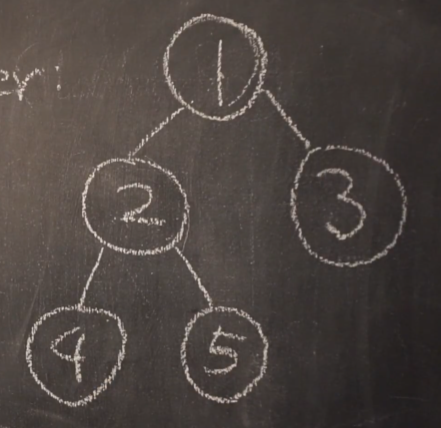

## Graph
- 그래프란 노드와 간선으로 구성된 한정된 자료구조를 의미하며 
  연결되어 있는 객체 간의 관계를 표현할 수 있다.
- 그래프는 노드들 사이에 무방향/방향에서 양방향 경로를 가질 수 있으며 
  self-loop 뿐 아니라 loop/circuit 모두 가능하다.
- 루트 노드, 부모-자식 관계라는 개념이 없으며 순회는 DFS나 BFS로 이루어진다.

## Tree
- 트리란 그래프의 일종으로 부모 자식 관계를 가지는 구조이다.
  모든 자식 노드는 한 개의 부모 노드만을 가지며 노드가 N개인 트리는 항상 N-1개의 간선을 가진다.
- 간단하게 회로가 없고 서로 다른 두 노드를 잇는 길이 하나뿐인 그래프를 트리라고 부른다.
- 트리는 사이클이 없는 하나의 연결 그래프를 의미하거나 
  DAG(Directed Acyclic Graph, 방향성이 있는 비순환 그래프)의 한종류이다.

### Binary Tree 이진 트리
- child 노드가 최대 2개까지만 붙는 트리

#### Binary Tree Traversals 이진 트리 순회

1. Inorder (Left, Root, Right): 4 2 5 1 3
   - 루트 노드를 시작으로 노드의 왼쪽이 먼저, 그 다음은 호출한 노드, 마지막은 오른쪽 순서로 횡단
2. Preorder (Root, Left, Right): 1 2 4 5 3
   - 자기 자신을 먼저 출력하고 그 다음에 왼쪽, 오른쪽으로 횡단
3. Postorder (Left, Right, Root): 4 5 2 3 1
   - 왼쪽, 오른쪽 먼저 출력하고 자기 자신을 나중에 출력
```java
class Node { // 이진 트리는 데이터와 왼쪽, 오른쪽 두개의 child 노드를 가진다.
    int data;
    Node left;
    Node right;
}
class Tree {
    public Node root;
    
    public void setRoot(Node node) {
        this.root = node;
    }
    public Node getRoot() {
        return root;
    }
    public Node makeNode(Node left, int data, Node right) {
        Node node = new Node();
        node.data = data;
        node.left = left;
        node.right = right;
        return node;
    }
    
    public void inorder(Node node) {
        if (node != null) {
            inorder(node.left);
            System.out.println(node.data);
            inorder(node.right);
        }
    }
    public void preorder(Node node) {
        if (node != null) {
            System.out.println(node.data);
            preorder(node.left);
            preorder(node.right);
        }
    }
    public void postorder(Node node) {
        if (node != null) {
            postorder(node.left);
            postorder(node.right);
            System.out.println(node.data);
        }
    }
}
```