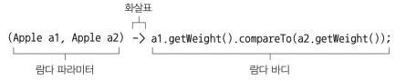
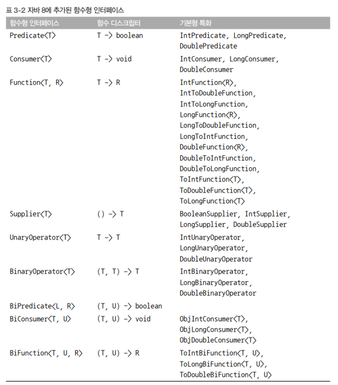
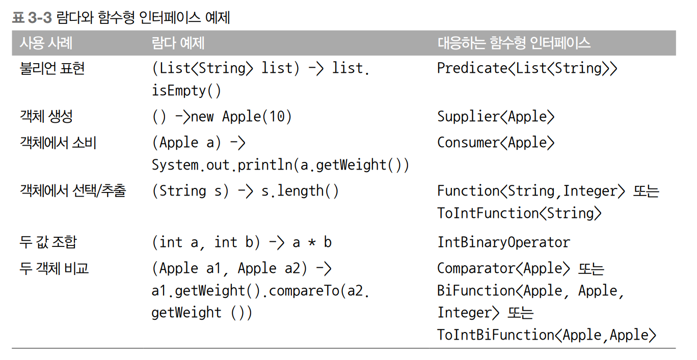
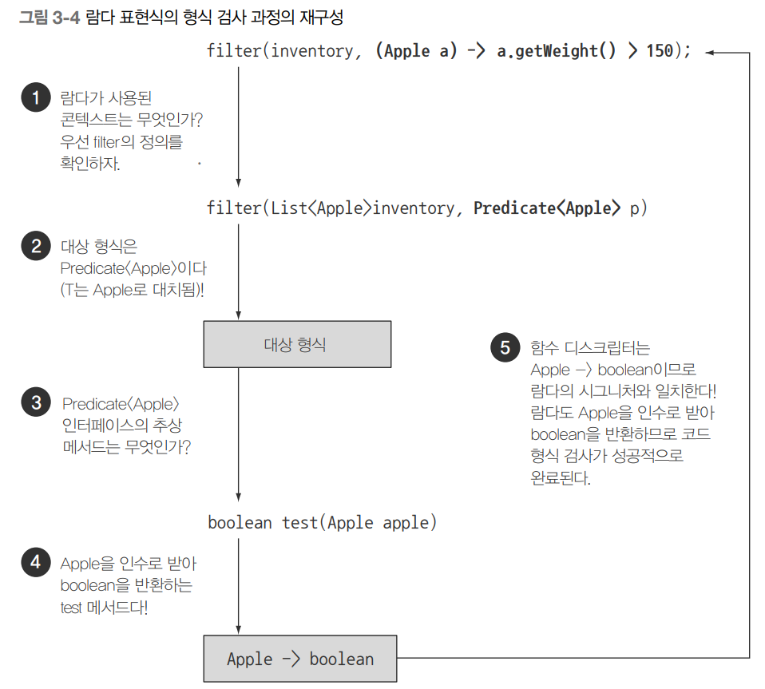

# 람다 표현식

# 람다란 무엇인가?

- 메서드로 전달할 수 있는 익명 함수를 단순화한 것
- 람다 표현식에는 이름은 없지만 파라미터 리스트, 바디, 반환 형식, 발생할 수 있는 예외 리스트는 가질 수 있음

## 1. **람다의 특징**

- **익명**
  - 보통의 메서드와 달리 이름이 없음. 구현해야 할 코드에 대한 걱정거리가 줄어듦
- **함수**
  - 람다는 메서드처럼 특정 클래스에 종속되지 않으므로 함수라 부름
  - 하지만 메서드처럼 파라미터 리스트, 바디, 반환 형식, 가능한 예외 리스트를 포함함
- **전달**
  - 람다 표현식을 메서드 인수로 전달하거나 변수로 저장할 수 있음
- **간결성**
  - 익명 클래스처럼 많은 자질구레한 코드를 구현할 필요가 없음

```java
// 기존 코드
Comparator<Apple> byWeight = new Comparator<Apple>() {
		public int compare(Apple a1, Apple a2) {
				return a1.getWeight().compareTo(a2.getWeight());
		}
}

// 람다 코드
Comparator<Apple> byWeight =
		(Apple a1, Apple a2) -> a1.getWeight().compareTo(a2.getWeight());
```

- 람다 표현식을 이용하면 compare 메서드의 바디를 직접 전달하는 것처럼 코드를 전달할 수 있음

### 람다 표현식의 구성



- **파라미터 리스트**
  - Comparator의 compare 메서드 파라미터(사과 두 개)
- **화살표**
  - 화살표 (→)는 람다의 파라미터 리스트와 바디를 구분함
- **람다 바디**
  - 두 사과의 무게를 비교함. 람다의 반환값에 해당하는 표현식


### 자바 8의 유효한 람다 표현식

```java
(String s) -> s.length()
```

- String 형식의 파라미터 하나를 가지며 Int를 반환
- 람다 표현식에는 return이 함축되어 있으므로 명시하지 않아도 됨

```java
(Apple a) -> a.getWeight() > 150
```

- Apple 형식의 파라미터 하나를 가지며 boolean(사과가 150g 보다 무거운지)를 반환

```java
() -> 42
```

- 파라미터가 없으며 Int 42를 반환

```java
(Apple a1, Apple a2) -> a1.getWeight().compareTo(a2.getWeight())
```

- Apple 형식의 파라미터 두개를 가지며 int(두 사과의 무게 비교 결과)를 반환

### **람다 예제**

| 사용 사례 | 람다 예제 |
| --- | --- |
| 불리언 표현식 | (List<String> list) → list.isEmpty() |
| 객체 생성 | () → new Apple(10) |
| 객체에서 소비 | (Apple a) → System.out.println(a.getWeight()); |
| 객체에서 선택/추출 | (String s) → s.length() |
| 두 값을 조합 | (int a, int b) → a * b |
| 두 객체 비교 | (Apple a1, Apple a2) → a1.getWeight().compareTo(a2.getWeight()) |

## 2. 어디에, 어떻게 람다를 사용할까?

### **함수형 인터페이스**

- 정확히 하나의 추상 메서드를 지정하는 인터페이스

```java
public interface Predicate<T> { // java.util.function.Predicate
		boolean test (T t);
}

public interface Comparator<T> { // java.util.Comparator
		int compare(T o1, T o2);
}

public interface Comparable<T> { // java.lang.Comparable
		public int compareTo(T o);
}

public interface Runnable { // java.lang.Runnable
		void run();
}
```

> 인터페이스는 디폴트 메서드 (인터페이스의 메서드를 구현하지 않은 클래스를 고려해서 기본 구현을 제공하는 바디를 포함하는 메서드)를 포함할 수 있음. 많은 디폴트 메서드가 있어도 추상 메서드가 하나면 함수형 인터페이스
>
- 함수형 인터페이스는 전체 표현식을 함수현 인터페이스의 인스턴스로 취급할 수 있음

```java
Runnable r1 = () -> System.out.println("Hello World 1");    // 람다 사용

Runnable r2 = new Runnable() {          // 익명 클래스 사용
		public void run() {
				System.out.println("Hello World 2");
		}
};
        
public static void process(Runnable r) {
		r.run();
}

process(r1);    // 'Hello World 1' 출력
process(r2);    // 'Hello World 2' 출력
process(() -> System.out.println("Hello World 3")); // 직접 전달된 람다 표현식으로 'Hello World 3' 출력
```

### 함수 디스크립터

- 함수형 인터페이스의 추상 메서드 시그니처 → 람다 표현식의 시그니처
- 람다 표현식의 시그니처를 서술하는 메서드가 함수 디스크립터
- Runnable 인터페이스의 추상 메서드 run
  - 인수와 반환값이 없음(void 반환)
  - Runnable 인터페이스는 인수와 반환값이 없는 시그니처

**함수형 인터페이스를 인수로 받는 메서드에만 람다 표현식을 사용하는 이유**

- 언어를 더 복잡하게 만들지 않기 위해
- 자바 프로그래머가 하나의 추상 메서드를 갖는 인터페이스에 익숙하다는 점 고려

**@FunctionalInterface**

- 함수형 인터페이스임을 가리키는 어노테이션
- @FunctionalInterface로 인터페이스를 선언했으나 함수형 인터페이스가 아니면 컴파일 에러
  - ex) 추상 메서드가 한 개 이상일 시
    - “Multiple nonoverriding abstract methods found in interface Foo”

## 3. 람다 활용 : 실행 어라운드 패턴

- 해당 파트에서는 `실행 어라운드 패턴`에 **람다와 동작 파라미터화를 적용**해본다.
- 자원 처리(데이터베이스 파일 처리 등)에 사용하는 순환 패턴의 예시
  - 자원을 연다.
  - 처리 한다.
  - 자원을 닫는다.
- 설정과 정리 과정은 대부분 비슷
- 실제 자원을 처리하는 코드를 설정과 정리 두 과정이 둘러싸는 형태
- 이를 `실행 어라운드 패턴`이라고 부름

```java
public String processFile() throws IOException {
    try (**BufferedReader br =
            new BufferedReader(new FileReader("data.txt")))** {
        return br.readLine();   // 실제 필요한 작업을 하는 행이다.
    }
}
```

- 현재 코드는 파일에서 한 번에 한 줄만 읽을 수 있음
- 해당 코드를 람다와 동작 파라미터화로 유연하고 간결하게 변경해보자

### **1단계 : 동작 파라미터화를 기억하라**

- 한 번에 두 줄을 읽거나 가장 자주 사용되는 단어를 반환하려면?
  - 기존의 설정, 정리 과정 재사용
  - processFile 메서드만 다른 동작을 수행하도록 명령
  - **processFile의 동작을 파라미터화**
- processFile 메서드로 동작 전달
  - processFile 메서드가 BufferedReader를 이용해서 다른 동작을 수행할 수 있도록
- 람다를 이용해서 동작을 전달

```java
String result = processFile((BufferedReader br) -> br.readLine() + br.readLine());
```

- 해당 코드는 processFile 메서드가 한 번에 두 행을 읽게 하는 코드
- 먼저, BufferedReader를 인수로 받아 String을 반환하는 람다가 필요

### **2단계 : 함수형 인터페이스를 이용해서 동작 전달**

- BufferedReader → String 과 IOException 던지는 시그니처 인터페이스 생성

```java
@FunctionalInterface
public interface BufferedReaderProcessor {
    String process(BufferedReader b) throws IOException;
}
```

- 정의한 인터페이스를 processFile 메서드의 인수로 전달

```java
public static String processFile(BufferedReaderProcessor p) throws IOException {
		...
}
```

### **3단계 : 동작 실행**

- processFile 바디 내에서 BufferedReaderProcessor 객체의 process를 호출

```java
public String processFile(BufferedReaderProcessor p) throws IOException {
				try (BufferedReader br =
									new BufferedReader(new FileReader("data.txt"))) {
				return p.process(br);   // BufferedReader 객체 처리
		}
}
```

- BufferedReaderProcessor에 정의된 process 메서드의 시그니처
  - (BufferedReader → String)
  - 해당 시그니처와 일치하는 람다를 전달하면 끝

**4단계 : 람다 전달**

```java
// 한 행을 처리하는 코드
String oneLine = processFile((BufferedReader br) -> br.readLine());

// 두 행을 처리하는 코드
String twoLines = processFile((BufferedReader br) -> br.readLine() + br.readLine());
```

## 4. 함수형 인터페이스 사용

- 함수형 인터페이스는 오직 하나의 추상 메서드를 지정
- 함수형 인터페이스의 추상 메서드는 람다 표현식의 시그니처 묘사
- 함수형 인터페이스의 추상 메서드 시그니처를 `함수 디스크립터`라고 함

### 다양한 함수형 인터페이스들

### Predicate<T>

- T → boolean
- test 추상 메서드

```java
@FunctionalInterface
public interface Predicate<T> {
    boolean test(T t);
}
public <T> List<T> filter(List<T> list, Predicate<T> p) {
		List<T> result = new ArrayList<>();
		for (T t : list) {
				if (predicate.test(t)) {
						result.add(t);
				}
		}
		return result;
}
Predicate<String> nonEmptyStringPredicate = (String s) -> !s.isEmpty();
List<String> nonEmpty = filter(listOfStrings, nonEmptyStringPredicate);
```

### Consumer<T>

- T → void
- accept 추상 메서드

```java
@FunctionalInterface
public interface Consumer<T> {
    void accept(T t);
}
public <T> void forEach(List<T> list, Consumer<T> c) {
		for(T t: list) {
				t.accept(t);
		}
}
forEach(
			Arrays.asList(1, 2, 3, 4, 5),
			(Integer i) -> System.out.println(i)
);
```

### Function<T, R>

- T → R
- apply 추상 메서드

```java
@FunctionalInterface
public interface Function<T, R> {
    R apply(T t);
}
public <T, R> List<R> map(List<T> list, Function<T, R> f {
		List<R> result = new ArrayList<>();
		for(T t: list) {
				result.add(f.apply(t));
		}
		return result;
}

// [7, 2, 6]
List<Integer> l = map(
				Arrays.asList("lambdas", "in", "action"),
				(String s) -> s.length()
)
```

### 기본형 특화

- 자바의 형식
  - 참조형 reference type
    - Byte, Integer, String, Object, List …
  - 기본형 primitive type
    - int, double, byte, char …
- 제네릭 파라미터에는 참조형만 사용할 수 있음
- 제네릭의 내부 구현 문제 때문
  - 스칼라 같은 언어에 존재하는 문제
  - 20장 에서 자세하게 살펴봄
- 변환하기 제공
  - 기본형 → 참조형
    - boxing
  - 참조형 → 기본형
    - unboxing
  - boxing, unboxing 자동
    - autoboxing
- 문제
  - 변환 과정에서의 비용 소모
  - 박싱한 값은 기본형을 감싸는 래퍼임.
  - 힙에 저장 됨 → 메모리 소비
  - 기본형 가져올 때 메모리 탐색 과정 필요
- 오토박싱 피하기

```java
public interface IntPredicate {
		boolean test(int t);
}
```

- 일반적으로 특정 형식을 입력받는 함수형 인터페이스의 이름 앞에는 형식명이 붙음
  - DoublePredicate, IntConsumer, LongBinaryOperator, IntFunction
  - ToIntFunction<T>, IntToDoubleFunction

#### 자바 API에서 제공하는 대표적인 함수형 인터페이스와 함수 디스크립터

- 해당 표는 자바에서 제공하는 함수형 인터페이스 중 일부에 불과하다는 사실을 기억하자.
- 필요하다면 우리가 직접 함수형 인터페이스를 만들 수 있다.
- (T, U) -> R 같은 표기법으로 함수 디스크립터를 설명할 수 있음을 기억하자.
- 표에서 왼쪽 코드는 인수 형식을 가리킨다.
- 예제의 표기법은 제네릭 형식 T와 U를 인수로 받으며 R을 반환하는 함수다.

#### 람다와 함수형 인터페이스 예제


#### 예외, 람다, 함수형 인터페이스의 관계
- 함수형 인터페이스는 확인된 예외를 던지는 동작을 허용하지 않는다.
- 즉, 예외를 던지는 람다 표현식을 만들려면 확인된 예외를 선언하는 함수형 인터페이스를 직접 정의하거나
- 람다를 try/catch 블록으로 감싸야 한다.
- 예를 들어 3.3절에서 등장했던 IOException을 명시적으로 선언하는 함수형 인터페이스 BufferedReaderProcessor를 살펴보자
```java
@FunctionalInterface
public interface BufferedReaderProcessor {
    String process(BufferedReader b) throws IOException;
}
BufferedReaderProcessor p = (BufferedReader br) -> br.readLine();
```
- 그러나 우리는 Function<T, R> 형식의 함수형 인터페이스를 기대하는 API를 사용하고 있으며
- 직접 함수형 인터페이스를 만들기 어려운 상황이다.
- 이런 상황에서는 다음 예제처럼 명시적으로 확인된 예외를 잡을 수 있다.
```java
        // 예외를 던지는 람다 표현식 만들기
        Function<BufferedReader, String> f = (BufferedReader b) -> {
            try {
                return b.readLine();
            }
            catch (IOException e) {
                throw new RuntimeException(e);
            }
        };
```
- 지금까지 람다를 만드는 방법과 람다를 사용하는 방법을 살펴봤다.
- 이번에는 컴파일러가 람다의 형식을 어떻게 확인하는지,
- 피해야 할 사항은 무엇인지 
  - (예를 들면 람다 표현식에서 바디 안에 있는 지역 변수를 참조하지 않아야 한다든가 void 호환 람다는 멀리해야 한다)
- 등 더 깊이 있는 내용을 살펴본다.


## 3.5 형식 검사, 형식 추론, 제약
- 람다 표현식 자체에는 람다가 어떤 함수형 인터페이스를 구현하는지의 정보가 포함되어 있지 않다.
- 따라서 람다 표현식을 더 제대로 이해하려면 람다의 실제 형식을 파악해야 한다.

### 3.5.1 형식 검사
- 람다가 사용되는 콘텍스트를 이용해서 람다의 형식을 추론할 수 있다.
- 어떤 콘텍스트에서 기대되는 람다 표현식의 형식을 대상 형식이라고 부른다.
- 람다 표현식을 사용할 때 실제 어떤 일이 일어나는지 보여주는 예제
```java
List<Apple> heavierThan150g =
filter(inventory, (Apple apple) -> apple.getWeight() > 150);
```
- 다음과 같은 순서로 형식 확인 과정이 진행된다.
1. filter 메서드의 선언을 확인한다.
2. filter 메서드는 두 번째 파라미터로 Predicate<Apple> 형식을 기대한다.
3. Predicate<Apple>은 test라는 한 개의 추상 메서드를 정의하는 함수형 인터페이스다
4. test 메서드는 Apple을 받아 boolean을 반환하는 함수 디스크립터를 묘사한다.
5. filter 메서드로 전달된 인수는 이와 같은 요구사항을 만족해야 한다.

- 위 예제에서 람다 표현식은 Apple을 인수로 받아 boolean을 반환하므로 유요한 코드다.
- 람다 표현식이 예외를 던질 수 있다면 추상 메서드도 같은 예외를 던질 수 있도록 throws로 선언해야 한다.

### 3.5.2 같은 람다, 다른 함수형 인터페이스
- 대상 형식이라는 특징 때문에,
- 같은 람다 표현식이더라도 호환되는
- 추상 메서드를 가진 다른 함수형 인터페이스로 사용될 수 있다.

> Callable과 PrivilegedAction 인터페이스
- 인수를 받지 않고 제네릭 형식 T를 반환하는 함수를 정의한다.
- 따라서 다음 두 할당문은 모두 유효한 코드다.
```java
Callable<Integer> c = () -> 42;
PrivilegedAction<Integer> p = () -> 42;
```
- 위 코드에서 첫 번째 할당문의 대상 형식은 Callable<Integer>고, 
- 두 번째 할당문의 대상 형식은 PrevilegedAction<Integer>다

> Comparator, ToIntBiFuncion, BiFuncion>
```java
        // 하나의 람다 표현식을 다양한 함수형 인터페이스에서 사용하기
        Comparator<Apple> c1 =
                (Apple a1, Apple a2) -> a1.getWeight().compareTo(a2.getWeight());
        ToIntBiFunction<Apple, Apple> c2 =
                (Apple a1, Apple a2) -> a1.getWeight().compareTo(a2.getWeight());
        BiFunction<Apple, Apple, Integer> c3 =
                (Apple a1, Apple a2) -> a1.getWeight().compareTo(a2.getWeight());
```

#### 다이아몬드 연산자
- 다이아몬드 연산자(<>)로 콘텍스트에 따른 제네릭 형식을 추론할 수 있다.
- 주어진 클래스 인스턴스 표현식을 두 개 이상의 다양한 콘텍스트에 사용할 수 있다.
- 이때 인스턴스 표현식의 형식 인수는 콘텍스트에 의해 추론된다.
```java
        // 다이아몬드 연산자
        List<String> listOfStrings = new ArrayList<>();
        List<Integer> listOfIntegers = new ArrayList<>();
```

#### 특별한 void 호환 규칙
- 람다의 바디에 일반 표현식이 있으면 void를 반환하는 함수 디스크립터와 호환된다.
- (물론 파라미터 리스트도 호환되어야 함)
```java
        // 특별한 void 호환 규칙
        // Predicate는 불리언 반환값을 갖는다.
        Predicate<String> p = s -> list.add(s);
        // Consumer는 void 반환값을 갖는다.
        Consumer<String> b = s -> list.add(s);
```
- 위 두 행의 예제에서 List의 add 메서드는 Consumer 콘텍스트(T -> void)가 기대하는 void 대신
boolean을 반환하지만 유효한 코드다.

#### 정리
- 지금까지 언제, 어디서 람다 표현식을 사용할 수 있는지 이해했다.
- 할당문 콘텍스트, 메서드 호출 콘텍스트(파라미터, 반환값), 형변환 콘텍스트 등으로
- 람다 표현식의 형식을 추론할 수 있다.

#### 퀴즈 ) 형식 검사 문제, 다음 코드를 컴파일할 수 없는 이유는?
```java
Object o = () -> { System.out.println("Tricky example") };
```
- 람다 표현식의 콘텍스트는 Object(대상 형식)다.
- 하지만 Object는 함수형 인터페이스가 아니다.
- 따라서 () -> void 형식의 함수 디스크립터를 갖는 Runnable로 대상 형식을 바꿔서 문제를 해결할 수 있다.
```java
Runnable r = () -> { System.out.println("Tricky example") };
```
- 같은 함수형 디스크립터를 가진 두 함수형 인터페이스를 갖는 메소드를 오버로딩할 떄 이와 같은 기법을 활용할 수 있다.
- 어던 메소드의 시그니처가 사용되어야 하는지를 명시적으로 구분하도록 람다를 캐스트할 수 있다.
- 예를 들어 execute( () -> {} )라는 람다 표현식이 있다면 Runnable과 Action의 함수 디스크립터가 같으므로 누구를 가리키는지가 명확하지 않다.
```java
public void execute(Runnable runnable) {
    runnable.run();
}

public void execute(Action<T> action) {
    action.act();
}

@FunctionlInterface
interface Action {
    void act();
}
```
- 하지만 다음처럼 캐스트를 하면 누구를 호출할 것인지가 명확해진다.
```java
execute((Action) () -> {});
```

- 지금까지 대상 형식을 이용해서 람다 표현식을 특정 콘텍스트에 사용할 수 있는지 확인할 수 있었다.
- 또한 대상 형식으로 람다의 파라미터 형식도 추론할 수 있다.

### 3.5.3 형식 추론
- 우리 코드를 좀 더 단순화할 수 있는 방법이 있다.
- 자바 컴파일러는 람다 표현식이 사용된 콘텍스트(대상 형식)를 이용해서 람다 표현식과 관련된 함수형 인터페이스를 추론한다.
- 대상형 식을 이용해서 함수 디스크립터를 알 수 있으므로 컴파일러는 람다의 시그니처도 추론할 수 있다.
- 결과적으로 컴파일러는 람다 표현식의 파라미터 형식에 접근할 수 있으므로
- 람다 문법에서 이를 생략할 수 있다.
- 즉, 자바 컴파일러는 다음처럼 람다 파라미터 형식을 추론할 수 있다.
```java
// 파라미터 a에는 형식을 명시적으로 지정하지 않았다.
List<Apple> greenApples =
    filter(inventory, apple -> GREEN.equals(apple.getColor()));
```
- 여러 파라미터를 포함하는 람다 표현식에서는 코드 가독성 향상이 더 두드러진다.
- 예를 들어 다음은 Comparator 객체를 만드는 코드다.
````java
        Comparator<Apple> c =   // 형식을 추론하지 않음
                (Apple a1, Apple a2) -> a1.getWeight().compareTo(a2.getWeight());
        Comparator<Apple> c2 =  // 형식을 추론함
                (a1, a2) -> a1.getWeight().compareTo(a2.getWeight());
````
- 상황에 따라 명시적으로 형식을 포함하는 것이 좋을 때도 있고
- 형식을 배제하는 것이 가독성을 향상시킬 때도 있다.
- 개발자 스스로 어떤 코드가 가독성을 향상시킬 수 있는지 결정해야 한다.

### 3.5.4 지역 변수 사용

#### 람다 캡처링
- 람다 표현식에서는 익명 함수가 하는 것처럼
- 자유 변수(파라미터로 넘겨진 변수가 아닌 외부에서 정의된 변수)를 활용하는 것
- 다음은 portNumber 변수를 갭처하는 람다 예제다.
```java
        int portNumber = 1337;
        Runnable r = () -> System.out.println(portNumber);
```
- 하지만 자유 변수에도 약간의 제약이 있다.
- 람다는 인스턴스 변수와 정적 변수를 자유롭게 캡처(자신의 바디에서 참조할 수 있도록)할 수 있다.
- 하지만 그러려면 지역 변수는 명시적으로 final로 선언되어 있어야 하거나
- 실질적으로 final로 선언된 변수와 똑같이 사용되어야 한다.
- 즉 람다 표현식은 한 번만 할당할 수 있는 지역 변수를 캡처할 수 있다.
- (참고 : 인스턴스 변수 캡처는 final 지역 변수 this를 캡처하는 것과 마찬가지다.)
- 예를 들어 다음 예제는 portNumber에 값을 두 번 할당하므로 컴파일할 수 없는 코드다.
```java
        // portNumber에 값을 두 번 할당하므로 컴파일할 수 없는 코드
        Runnable r2 = () -> System.out.println(portNumber);
        portNumber = 31337;     // 에러: 람다에서는 참고하는 지역 변수는 final로 선언되거나 실질적으로 final처럼 취급되어야 한다.
```

#### 지역 변수의 제약
- 왜 지역 변수에 이런 제약이 필요할까?
- 우선 내부적으로 인스턴스 변수와 지역 변수는 태생부터 다르다.
- 인스턴스 변수는 힙에 저장되는 반면 
- 지역 변수는 스택에 위치한다.
- 람다가 스레드에서 실행될때 변수를 할당한 스레드가 사라진 상태에 접근하려 할 수 있다.
  - 따라서 자바 구현에서는 원래 변수에 접근을 허용하는 것이 아닌,
  - 자유 지역 변수의 복사본을 제공한다.
  - 따라서 복사본의 값이 바뀌지 않아야 하므로 -> 지역 변수에는 한 번만 값을 할당해야 한다는 제약이 생겼다.
  

## 3.6 메서드 참조
- 메서드 참조를 이용하면 기존의 메서드 정의를 재활용해서 람다처럼 전달할 수 있다.
- 때로는 람다 표현식보다 메서드 참조를 사용하는 것이 더 가독성이 좋으며 자연스러울 수 있다.
- 메서드 참조와 새로운 자바 8 API를 활용한 정렬 예제
```java
// 기존 코드
inventory.sort((Apple a1, Apple a2) -> a1.getWeight().compareTo(a2.getWeight()));
// 메서드 참조와 java.util.Comparator.comparing을 활용한 코드
inventory.sort(comparing(Apple::getWeight)); // 첫번째 메서드 참조
```

### 3.6.1 요약
- 메서드 참조가 왜 중요한가?
- 메서드 참조는 특정 메서드만을 호출하는 람다의 축약형이라고 생각할 수 있다.
- 예를 들어 람다가 '이 메서드를 직접 호출해' 라고 명령한다면 메서드를 어떻게 호출해야 하는지 설명을 참조하기 보다는
- 메서드명을 직접 참조하는 것이 편리하다.
- 실제로 메서드 참조를 이용하면 기존 메서드 구현으로 람다 표현식을 만들 수 있다.
- 이때 명시적으로 메서드명을 참조함으로써 가독성을 높일 수 있다.

> 메서드 참조는 어떻게 활용할까?
- 메서드명 앞에 구분자(::)를 붙이는 방식으로 메서드 참조를 활용할 수 있다.
- 예를 들어 Apple::getWeight는 Apple 클래스에 정의된 getWeight의 메서드 참조다.
- 실제로 메서드를 호출하는 것은 아니므로 괄호는 필요 없음을 기억.
- 결과적으로 메서드 참조는 람다 표현식 (Apple a) -> a.getWeight()를 축약한 것이다.

|람다|메서드 참조 단축 표현|
|---|---|
|(Apple apple) -> apple.getWeight()|Apple::getWeight|
|() -> Thread.currentThread().dumpStack()|Thread.currentThread()::dumpStack|
|(str, i) -> str.substring(i)|String::subString|
|(String s) -> System.out.println(s)|System.out::println|
|(String s) -> this.isValidName(s)|this::isValidName|

- 메서드 참조를 새로운 기능이 아니라 하나의 메서드를 참조하는 람다를
편리하게 표현할 수 있는 문법으로 간주할 수 있다.
- 메서드를 참조를 이용하면 같은 기능을 더 간결하게 구현할 수 있다.

#### 메서드 참조를 만드는 방법
1. 정적 메서드 참조
   - 예를 들어 Integer의 parseInt 메서드는 Integer::parseInt로 표현할 수 있다.
2. 다양한 형식의 인스턴스 메서드 참조
   - 예를 들어 String의 length 메서드는 String::length로 표현할 수 있다.
3. 기존 객체의 인스턴스 메서드 참조
   - 예를 들어 Transaction 객체를 할당받은 expensiveTransaction 지역 변수가 있고
  Transaction 객체에는 getValue 메서드가 있다면, 이를 expensiveTransaction::getValue라고 표현할 수 있다.

- String::length 같은 두 번째 유형의 메서드 참조를 이용해서 람다 표현식의 파라미터로 전달할 수 있다.
  - (String s) -> s.toUpperCase() 라는 람다 표현식을 String::toUpperCase로 줄여서 표현할 수 있다.
- 반면 세 번째 유형의 메서드 참조는 람다 표현식에서 현존하는 외부 객체의 메서드를 호출할 때 사용한다.
  - () -> expensiveTransaction.getValue() 라는 람다 표현식을 expensiveTransaction::getValue로 줄여서 표현할 수 있다.

#### 람다 표현식을 메서드 참조로 줄여서 표현하는 단축 규칙
- 세 번째 유형의 메서드 참조는 비공개 헬퍼 메서드를 정의한 상황에서 유용하게 활용할 수 있다.
- isValidName이라는 헬퍼 메서드를 정의했다고 가정
```java
private boolean isValidName(String string) {
    return Character.isUpperCase(String.charAt(0));
}
```
- 이제 Predicate<String>를 필요로 하는 적당한 상황에서 메서드 참조를 할 수 있다.
```java
filter(words, this::isValidName)
```


- Comparator의 함수 디스크립터와 호환되는 람다 표현식 시그니처도 있다.
- 위에서 설명한 기법을 이용하면 람다 표현식을 메서드 참조를 사용해서 다음처럼 줄일 수 있다.
```java
// 기존
List<String> str = Arrays.asList("a", "b", "A", "B");
str.sort((s1, s2) -> s1.compareToIgnoreCase(s2));

// 메서드 참조를 이용해서 줄이기
List<String> str = Arrays.asList("a", "b", "A", "B");
str.sort(String::compareToIgnoreCase);
```
- 컴파일러는 람다 표현식의 형식을 검사하던 방식과 비슷한 과정으로 메서드 참조가 주어진 함수형 인터페이스와 호환하는지 확인한다.
- 즉, 메서드 참조는 콘텍스트의 형식과 일치해야 한다.