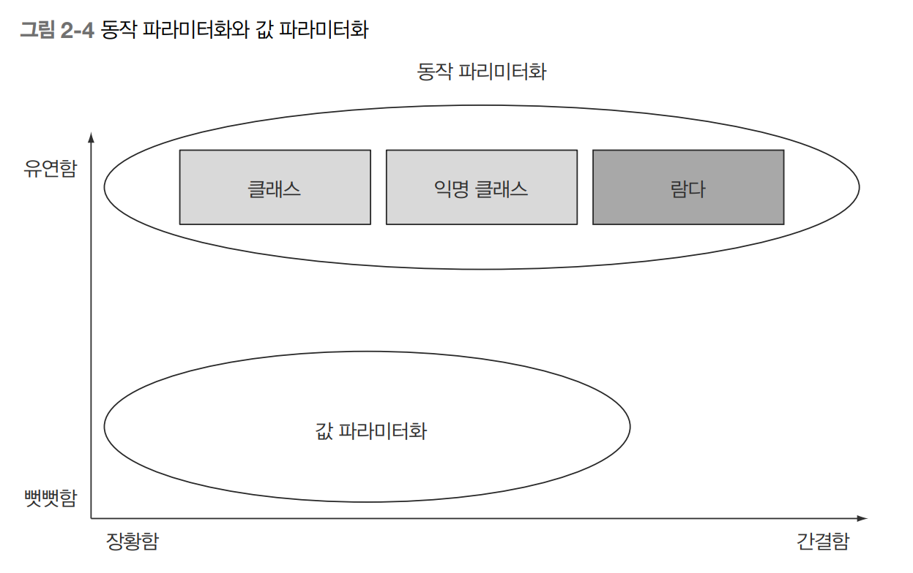

# CHAPTER 2 동작 파라미터화 코드 전달하기


- 우리가 어떤 상황에서 일을 하든 소비자 요구사항은 항상 바뀐다.
- 시시각각 변화하는 요구사항에 적절히 대응하기 위해서 새로 추가되는 기능을 쉽게 구현할 수 있어야 하며
장기적인 관점에서 유지보수가 쉬워야 한다.

#### 동작 파라미터화
- 동작 파라미터를 이용하면 자주 바뀌는 요구사항에 효과적으로 대응할 수 있다.
- 동작 파라미터화란 아직 어떻게 실행할 것인지 결정하지 않은 코드 블록을 의미한다.
- 이 코드 블록은 나중에 프로그램에서 호출한다. 즉, 코드 블록의 실행은 나중으로 미뤄진다.  
- 결과적으로 코드 블록에 따라 메서드의 동작이 파라미터화된다.

## 2.1 변화하는 요구사항에 대응하기
- 기존의 농장 재고목록 애플리케이션에 리스트에서 녹색 사과만 필터링하는 기능을 추가한다고 가정

### 2.1.1 첫번째 시도 : 녹색 사과 필터링
- 사과 색을 정의하는 Color num 존재
```java
enum Color { RED, GREEN }
```
- 첫 번째 시도 결과 코드
```java
    public static List<Apple> filterGreenApples(List<Apple> inventory) {
        List<Apple> result = new ArrayList<>();     // 사과 누적 리스트
        for (Apple apple : inventory) {
            if (GREEN.equals(apple.getColor())) {   // 녹색 사과만 선택
                result.add(apple);
            }
        }
        return result;
    }
```
- 그런데 갑자기 농부가 변심하여 녹색 사과 말고 빨간 사과도 필터링하고 싶어졌다.
- 크게 고민하지 않는다면 메서드를 복사해서 if문의 조건만 변경할 수 있다.
- 하지만, 더 다양한 색이 추가가 된다면...?
- 이런 상황에서는 다음과 같은 규칙이 있다.

> 거의 비슷한 코드가 반복 존재한다면 그 코드를 추상화한다.


### 2.1.2 두번째 시도 : 색을 파라미터화
- 색을 파라미터화할 수 있도록 메서드에 파라미터를 추가하면 변화하는 요구사항에 좀 더 유연하게 대응하는 코드를 만들 수 있다.
```java
    public static List<Apple> filterApplesByColor(List<Apple> inventory, Color color) {
        List<Apple> result = new ArrayList<>();
        for (Apple apple : inventory) {
            if (apple.getColor().equals(color)) {
                result.add(apple);
            }
        }
        return result;
    }
```
- 다음처럼 구현한 메서드를 호출할 수 있다.
```java
        List<Apple> greenApples = filterApplesByColor(inventory, GREEN);
        List<Apple> redApples = filterApplesByColor(inventory, RED);
```
- 그런데 갑자기, 농부가 '색 이외에도 가벼운 사과와 무거운 사과로 구분할 수 있다면 좋겠네요. 보통 무게가 150그램 이상인 사과가 무거운 사과입니다.'
라고 요구한다.
- 색과 마찬가지로 무게의 기준도 얼마든지 바뀔 수 있다는 사실을 눈치챌 수 있다.
- 다양한 무게에 대응할 수 있도록 무게 정보 파라미터도 추가한다.
```java
    public static List<Apple> filterApplesByWeight(List<Apple> inventory, int weight) {
        List<Apple> result = new ArrayList<>();
        for (Apple apple : inventory) {
            if (apple.getWeight() > weight) {
                result.add(apple);
            }
        }
        return result;
    }
```
- 위 코드도 좋은 해결책이라 할 수 있으나 구현 코드를 자세히 보면,
- 목록을 검색하고, 각 사과에 필터링 조건을 적용하는 부분의 코드가 색 필터링 코드와 대부분 중복된다.
- 이는 소프트웨어 공학의 DRY (같은 것을 반복하지 말 것) 원칙을 어기는 것이다.

### 2.1.3 세번째 시도 : 가능한 모든 속성으로 필터링
- 색이나 무게 중 어떤 것을 기준으로 필터링할지 가리키는 플래그를 추가할 수 있다.
- 하지만 이 방법은 실전에서 절대절대 사용하면 안된다.
- 그 이유는 잠시뒤..

```java
    public static List<Apple> filterApples(List<Apple> inventory, Color color, int weight, boolean flag) {
        List<Apple> result = new ArrayList<>();
        for (Apple apple : inventory) {
            if ((flag && apple.getColor().equals(color)) || 
                    (!flag && apple.getWeight() > weight)) {
                result.add(apple);
            }
        }
        return result;
    }
```
- 위는 만유레도 불구하고 모든 속성을 메서드 파라미터로 추가한 모습이다.
- 색이나 무게를 선택하는 방법이 마음에 들지 않는다.

```java
List<Apple> greenApples = filterApples(inventory, GREEN, 0, true);
List<Apple> heavyApples = filterApples(inventory, null, 150, false);
```
- 위의 방법으로 메서드를 사용할 수 있다. 정말 마음에 들지 않는다.
- 형편없는 코드.
- 대체 true와 false는 뭘 의미하는 걸까?
- 앞으로 요구사항이 바뀐다면 유연하게 대응하기도 어렵다.
- 사과의 크기, 모양, 출하지 등으로 필터링을 하고 싶다면..?
- 심지어 녹색 사과 중에 무거운 사과를 필터링 하려면..?
- 결국 여러 중복된 필터 메서드를 만들거나 모든 것을 처리하는 거대한 하나의 필터 메서드를 구현해야 한다.
- filterApples에 어떤 기준으로 사과를 필터링할 것인지 효과적으로 전달할 수 있다면 좋을 것 같다.


## 2.2 동작 파라미터화
- 2.1절에서 파라미터를 추가하는 방법이 아닌 변화하는 요구사항에 좀 더 유연하게 대응할 수 있는 방법이 절실하다는 것을 확인했다.
- 사과의 어떤 속성에 기초해서 불리언값을 반환 (예를 들어 사과가 녹색인가? 150그램 이상인가?) 하는 방법이 있다.
- 참 또는 거짓을 반환하는 함수를 프레디케이트라고 한다.
- 선택 조건을 결정하는 인터페이스를 정의하자.

```java
public interface ApplePredicate {
    boolean test (Apple apple);
}
```
- 다음 예제처럼 다양한 선택 조건을 대표하는 여러 버전의 ApplePredicate를 정의할 수 있다.
```java
public class AppleHeavyWeightPredicate implements ApplePredicate{
    public boolean test(Apple apple) {  // 무거운 사과만 선택
        return apple.getWeight() > 150;
    }
}
public class AppleGreenColorPredicate implements ApplePredicate{
    public boolean test(Apple apple) {  // 녹색 사과만 선택
        return GREEN.equals(apple.getColor());
    }
}
```

- 위 조건에 따라 filter 메서드가 다르게 동작할 것이라고 예상할 수 있다.
- 이를 전략 디자인 패턴이라고 부른다
- 전략 디자인 패턴은 각 알고리즘을 캡슐화하는 알고리즘 패밀리를 정의해둔 다음에
- 런타임에 알고리즘을 선택하는 기법이다.
- 해당 예제에서는 ApplePredicate가 알고리즘 패밀리고
- AppleHeavyWeightPredicate와 AppleGreenColorPredicate가 전략이다.

> 그런데 ApplePredicate는 어떻게 다양한 동작을 수행할 수 있을까?
- filterApples에서 ApplePredicate 객체를 받아 애플의 조건을 검사하도록 메서드를 고쳐야 한다.
- 이렇게 동작 파라미터화, 즉 메서드가 다양한 동작(또는 전략)을 받아서 내부적으로 다양한 동작을 수행할 수 있다.

### 2.2.1 네번째 시도 : 추상적 조건으로 필터링
```java
    public static List<Apple> filterApples(List<Apple> inventory, ApplePredicate p) {
        List<Apple> result = new ArrayList<>();
        for (Apple apple : inventory) {
            if (p.test(apple)) {    // 프레디케이트 객체로 사과 검사 조건을 캡슐화했다.
                result.add(apple);
            }
        }
        return result;
    }
```
- filterApples 메서드가 ApplePredicate 객체를 인수로 받도록 고쳤다.
- 이렇게 하면 filterApples 메서드 내부에서 컬렉션을 반복하는 로직과
- 컬렉션의 각 요소에 적용할 동작(해당 예제에서는 프레디케이트)을 분리할 수 있다는 점에서
- 소프트웨너 엔지니어링적으로 큰 이득을 얻는다.

#### 코드/동작 전달하기
- 이제 필요한 대로 다양한 ApplePredicate를 만들어서 filterApples 메서드로 전달할 수 있다.
- 예를 들어 농부가 150그램이 넘는 빨간 사과를 검색해달라고 부탁하면?
    - 우리는 ApplePredicate를 적절하게 구현하는 클래스만 만들면 된다.
```java
public class AppleRedAndHeavyPredicate implements ApplePredicate {
    public boolean test(Apple apple) {
        return RED.equals(apple.getColor()) && apple.getWeight() > 150;
    }
}

List<Apple> redAndHeavyApples = filterApples(inventory, new AppleRedAndHeavyPredicate());
```
- 우리가 전달할 ApplePredicate 객체에 의해 filterApples 메서드의 동작이 결정됐다.
- 우리는 filterApples 메서드의 동작을 파라미터화한 것이다.

- 위 예제에서 가장 중요한 구현은 test 메서드다
- filterApples 메서드의 새로운 동작을 정의하는 것이 test 메서드
- 안타깝게도 메서드는 객체만 인수로 받으므로 test 메서드를 ApplePredicate 객체로 감싸서 전달해야 한다.
- test 메서드를 구현하는 객체를 이용해서 불리언 표현식 등을 전달할 수 있으므로 이는 '코드를 전달' 할 수 있는 것이나 다름없다.
- 2.3 절에서는 람다를 이용해서 여러 개의 ApplePredicate 클래스를 정의하지 않고도 "red".equals(apple.getColor() && apple.getWeight() > 150) 같은
표현식을 filterApples 메서드로 전달하는 방법을 설명한다.
  

### 한개의 파라미터, 다양한 동작
- 동작 파라미터의 강점
  - 컬렉션 탐색 로직과 각 항목에 적용할 동작을 분리할 수 있다는 것


## 2.3 복잡한 과정 간소화
- filterApples 메서드로 새로운 동작을 전달하기 위해서는
  - ApplePredicate 인터페이스를 구현하는 여러 클래스를 정의한 다음
  - 인스턴스화 해야 한다.
- 상당히 번거로운 작업이며 시간 낭비다.
```java
// 무거운 사과 선택
public class AppleHeavyWeightPredicate implements ApplePredicate{
    public boolean test(Apple apple) {
        return apple.getWeight() > 150;
    }
}

// 녹색 사과 선택
public class AppleGreenColorPredicate implements ApplePredicate{
  public boolean test(Apple apple) {
    return GREEN.equals(apple.getColor());
  }
}

public class FilteringApples {
  public static void main(String[] args) {
    List<Apple> inventory = Arrays.asList(new Apple(80, GREEN),
            new Apple(155, GREEN),
            new Apple(120, RED));
    List<Apple> heavyApples =
            filterApples(inventory, new AppleHeavyWeightPredicate()); // 155그램의 사과 한 개를 포함한다.
    List<Apple> greenApples =
            filterApples(inventory, new AppleGreenColorPredicate());  // 녹색 사과 두 개를 포함한다.
  }
  public static List<Apple> filterApples(List<Apple> inventory, ApplePredicate p) {
    List<Apple> result = new ArrayList<>();
    for (Apple apple : inventory) {
      if (p.test(apple)) {
        result.add(apple);
      }
    }
    return result;
  }
}
```
- 로직과 관련 없는 코드가 많이 추가되었다.
- 자바는 클래스 선언과 인스턴스화를 동시에 수행할 수 있도록 익명 클래스라는 기법을 제공한다.
- 익명 클래스를 이용하면 코드의 양을 줄일 수 있다.
- 하지만 익명 클래스가 모든 것을 해결하는 것은 아니다.
  - 람다 표현식으로 더 가독성 있는 코드를 구현할 수 있다. (2.3.3절)
  
### 2.3.1 익명 클래스
- 익명 클래스는 자바의 지역 클래스 (블록 내부에 선언된 클래스)와 비슷한 개념이다.
- 익명 클래스는 말 그대로 이름이 없는 클래스다.
- 익명 클래스를 이용하면 클래스 선언과 인스턴스화를 동시에 할 수 있다.
- 즉석에서 필요한 구현을 만들어서 사용할 수 있다.

### 2.3.2 다섯 번째 시도 : 익명 클래스 사용
- 다음은 익명 클래스를 이용해서 ApplePredicate를 구현하는 객체를 만드는 방법으로 필터링 예제를 다시 구현한 코드다.
```java
        // 다섯 번째 시도
        List<Apple> redApples = filterApples(inventory, new ApplePredicate() {
            public boolean test(Apple apple) {
                return RED.equals(apple.getColor());
            }
        });
```
- filterApples 메서드의 동작을 직접 파라미터화했다.
- 익명 클래스도 아직 부족한 점이 있다.
- 여전히 많은 공간을 차지한다.
- 코드의 장황함은 나쁜 특성이다.
- 장황한 코드는 구현하고 유지보수하는 데 시간이 오래걸릴 뿐 아니라 읽는 즐거움을 빼앗는다.
- 한눈에 이해할 수 있는 코드가 좋은 코드

> 코드 조각을 전달하는 과정에서 결국은 객체를 만들고 명시적으로 새로운 동작을 정의하는 메서드를 구현해야 한다는 점은 변하지 않는다.

### 2.3.3 여섯 번째 시도 : 람다 표현식 사용
- 자바 8의 람다 표현식을 이용해서 위 예제 코드를 다음처럼 간단하게 재구현할 수 있다.
```java
        // 여섯 번째 시도 : 드디어 람다
        List<Apple> result = filterApples(inventory, (Apple apple) -> RED.equals(apple.getColor()));
```
- 이전 코드보다 훨씬 간단해졌다!

  

### 2.3.4 일곱 번째 시도 : 리스트 형식으로 추상화
```java
  public interface Predicate<T> {
      boolean test(T t);
  }
  
  // 형식 파라미터 T 등장
  public static <T> List<T> filter(List<T> list, Predicate<T> p) {
    List<T> result = new ArrayList<>();
    for (T e : list) {
      if (p.test(e)) {
        result.add(e);
      }
    }
    return result;
  }
```
- 이제 바나나, 오렌지, 정수, 문자열 등의 리스트에 필터 메서드를 사용할 수 있다.

```java
        // 일곱 번째 시도 : 리스트 형식으로 추상화
        List<Apple> redApples2 =
                filter(inventory, (Apple apple) -> RED.equals(apple.getColor()));

        List<Integer> numbers = Arrays.asList(1, 2, 3, 4, 5, 6, 7, 8, 9, 10);
        List<Integer> evenNumbers =
                filter(numbers, (Integer i) -> i % 2 == 0);
```
- 이렇게 해서 유연성과 간결함이라는 두 마리 토끼를 모두 잡을 수 있었다.