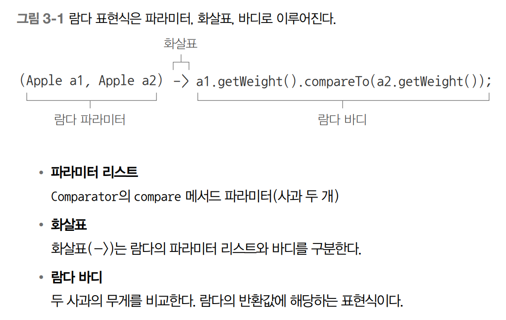
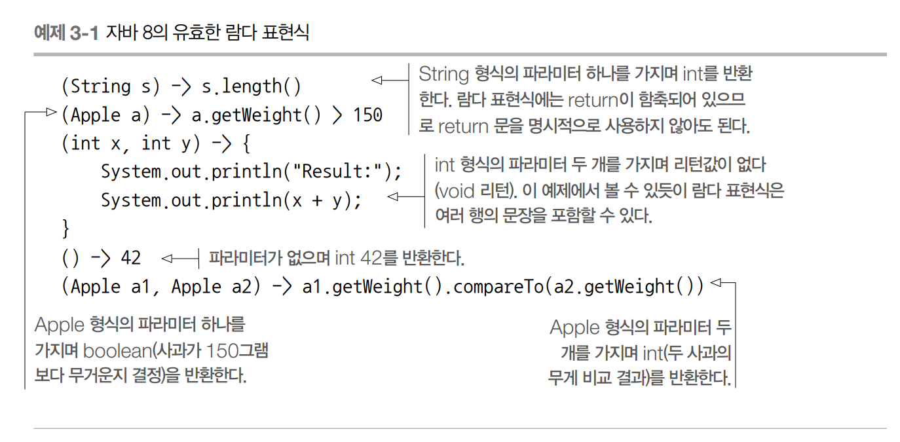
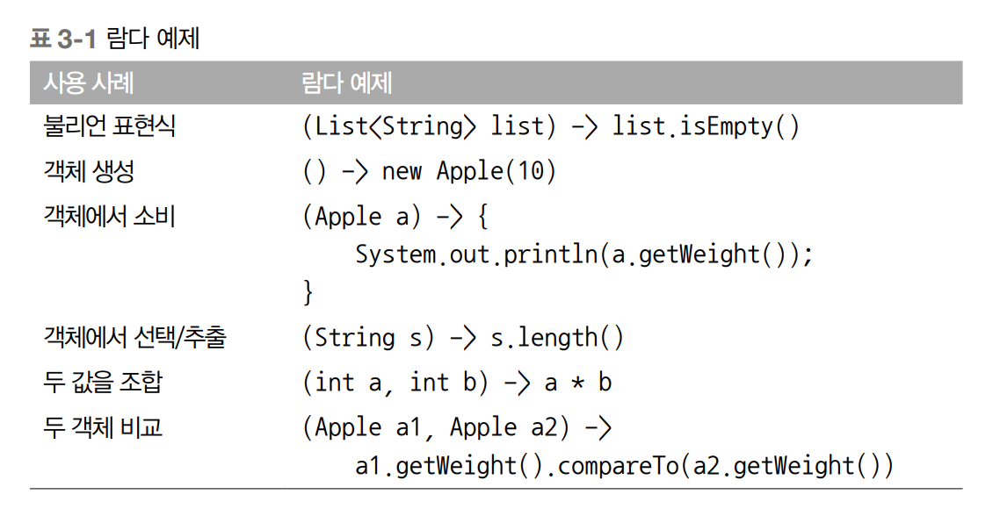
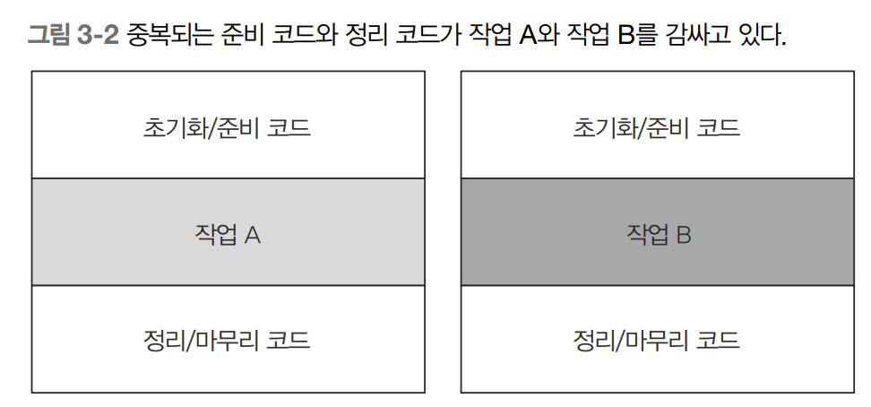
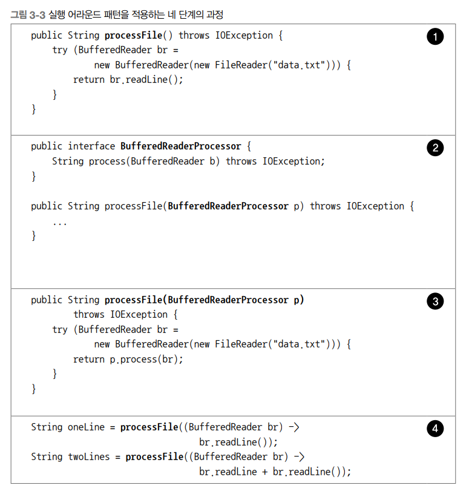
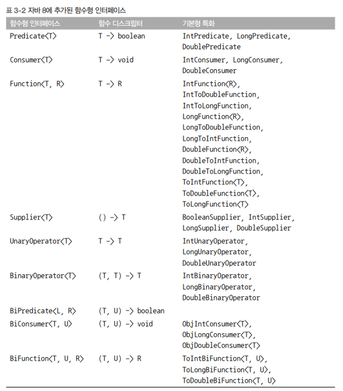
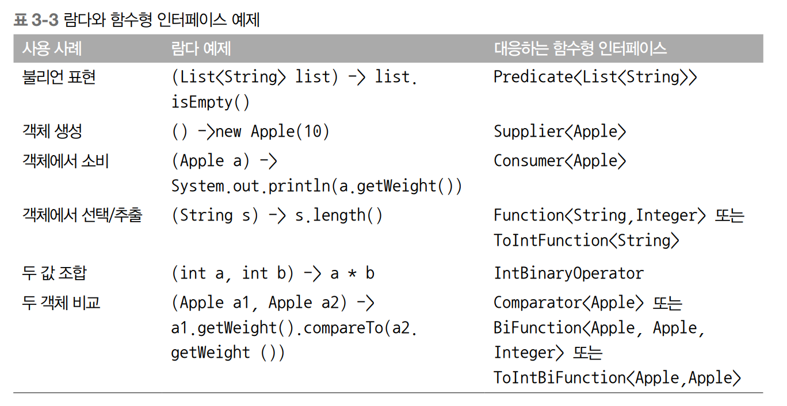

# CHAPTER 3 람다 표현식
- 3장에서는 더 깔끔한 코드로 동작을 구현하고 전달하는 자바 8의 새로운 기능인 람다 표현식을 설명한다.
- 람다 표현식은 익명 클래스처럼 이름이 없는 함수면서 메서드를 인수로 전달할 수 있으므로 일단은 람다 표현식이 익명 클래스와 비슷하다고 생각하자.

## 3.1 람다란 무엇인가?
- 람다 표현식은 메서드로 전달할 수 있는 익명 함수를 단순화한 것이라고 할 수 있다.
- 람다 표현식에는 이름은 없지만, 파라미터 리스트, 바디, 반환 형식, 발생할 수 있는 예외 리스트는 가질 수 있다.

#### 람다의 특징
- 익명
    - 보통의 메서드와 달리 이름이 없으므로 익명이라고 표현.
    - 구현해야 할 코드에 대한 걱정거리가 줄어든다.
- 함수
    - 람다는 메서드처럼 특정 클래스에 종속되지 않으므로 함수라고 부른다.
    - 하지만 메서드처럼 파라미터 리스트, 바디, 반환 형식, 가능한 예외 리스트를 포함한다.
- 전달
    - 람다 표현식을 메서드 인수로 전달하거나 변수로 저장할 수 있다.
- 간결성
    - 익명 클래스처럼 많은 자질구레한 코드를 구현할 필요가 없다.

> 람다 표현식이 왜 중요할까?
- 람다를 이용해서 간결한 방식으로 코드를 전달할 수 있다.
- 동작 파라미터를 이용할 때 익명 클래스 등 판에 박힌 코드를 구현할 필요가 없다.
- 람다 표현식을 이용하면 2장에서 살펴본 동작 파라미터 형식의 코드를 더 쉽게 구현할 수 있다.
- 결과적으로 코드가 간결하고 유연해진다.

#### 커스텀 Comparator 객체를 구현하는 예시
- 기존코드
```java
        Comparator<Apple> byWeight = new Comparator<Apple>() {
            public int compare(Apple a1, Apple a2) {
                return a1.getWeight().compareTo(a2.getWeight());
            }
        };
```
- 람다
```java
        Comparator<Apple> byWeight2 = (Apple a1, Apple a2) -> a1.getWeight().compareTo(a2.getWeight());
```
- 코드가 훨씬 간단해졌다.
- 중요한 것은 사과 두 개의 무게를 비교하는 데 필요한 코드를 전달할 수 있다는 점.
- 람다 표현식을 이용하면 compare 메서드의 바디를 직접 전달하는 것처럼 코드를 전달할 수 있다.

#### 람다의 구성


#### 자바 8에서 지원하는 다섯 가지 람다 표현식 예제

- 자바 설계자는 이미 C#이나 스칼라 같은 비슷한 기능을 가진 다른 언어와 비슷한 문법을 자바에 적용하기로 했다.
- 다음은 표현식 스타일 람다라고 알려진 람다의 기본 문법이다.
```java
(parameters) -> expression
```
- 또는 다음처럼 표현할 수 있다. (블록 스타일)
```java
(parameters) -> { statements; }
```

#### 람다 예제와 사용 사례


## 3.2 어디에, 어떻게 람다를 사용할까?
- 2장에서 구현했던 필터 메서드에도 람다를 활용할 수 있었다.
```java
List<Apple> greenApples2 = filter(inventory, (Apple apple) -> GREEN.equals(apple.getColor()));
```
> 그래서 정확히 어디에서 람다를 사용할 수 있다는 건가?
- 함수형 인터페이스라는 문맥에서 람다 표현식을 사용할 수 있다.
- 위 예제에서는 함수형 인터페이스 Predicate<T>를 기대하는 filter 메서드의 두 번째 인수로 람다 표현식을 전달했다.

### 3.2.1 함수형 인터페이스
- 2장에서 만든 Predicate<T> 인터페이스로 필터 메서드를 파라미터화 할 수 있었다.
- 바로 Predicate<T>가 함수형 인터페이스다.
- Predicate<T>는 오직 하나의 추상 메서드만 지정하기 때문이다.
```java
public interface Predicate<T> {
    boolean test(T t);
}
```
- 간단히 말해 함수형 인터페이스는 정확히 하나의 추상 메서드를 지정하는 인터페이스다.
- 지금까지 살펴본 자바 API의 함수형 인터페이스로 Comparator, Runnable 등이 있다.
```java
// java.util.Comparator
public interface Comparator<T> {
    int compare(T o1, T o2);
}

// java.lang.Runnable
public interface Runnable {
    void run();
}

// java.awt.event.ActionListener
public interface ActionListener extends EventListener {
    void actionPerformed(ActionEvent e);
}

// java.util.concurrent.Callable
public interface Callable<V> {
    V call() throws Exception;
}

// java.security.PrivilegedAction
public interface PrivilegedAction<T> {
    T run();
}
```
> 인터페이스는 디폴트 메서드 (인터페이스를 구현하지 않은 클래스를 고려해서 기본 구현을 제공하는 바디를 포함하는 메서드)를 포함할 수 있다.
> 많은 디폴트 메서드가 있더라도 추상 메서드가 오직 하나면 함수형 인터페이스다.

#### 퀴즈) 다음 인터페이스 중 함수형 인터페이스는?
```java
public interface Addr {
    int add(int a, int b);
}

public interface SmartAddr extends Addr {
    int add(double a, double b);
}

public interface Nothing {
    
}
```
- 정답 : Addr만 함수형 인터페이스
- SmartAddr는 두 추상 add 메서드 (하나는 Addr에서 상속받음)을 포함하므로 함수형 인터페이스가 아님
- Nothing은 추상 메서드가 없으므로 함수형 인터페이스가 아님

> 함수형 인터페이스로 뭘 할 수 있을까?
- 람다 표현식으로 함수형 인터페이스의 추상 메서드 구현을 직접 전달할 수 있으므로
  - 전체 표현식을 함수형 인터페이스의 인스턴스로 취급할 수 있다.
  - (기술적으로 따지면 함수형 인터페이스를 구현한 클래스의 인스턴스)
- 함수형 인터페이스보다는 덜 깔끔하지만 익명 내부 클래스로도 같은 기능을 구현할 수 있다.

> Runnable 예제
```java
        Runnable r1 = () -> System.out.println("Hello World 1");    // 람다 사용

        Runnable r2 = new Runnable() {          // 익명 클래스 사용
            public void run() {
                System.out.println("Hello World 2");
            }
        };
        
        public static void process(Runnable r) {
            r.run();
        }

        process(r1);    // 'Hello World 1' 출력
        process(r2);    // 'Hello World 2' 출력
        process(() -> System.out.println("Hello World 3")); // 직접 전달된 람다 표현식으로 'Hello World 3' 출력
```

### 3.2.2 함수 디스크립터
- 함수형 인터페이스의 추상 메서드 시그니처는 람다 표현식의 시그니처를 가리킨다.
- 람다 표현식의 시그니처를 서술하는 메서드를 함수 디스크립터라고 부른다.
- 예를 들어 Runnable 인터페이스의 유일한 추상 메서드 run은 인수와 반환값이 없으므로 (void 반환)
- Runnable 인터페이스는 인수와 반환값이 없는 시그니처로 생각할 수 있다.

> 람다와 함수형 인터페이스를 가리키는 특별한 표기법
- () -> void
  = 파라미터 리스트가 없으며 void를 반환하는 함수
  - Runnable이 이에 해당
- (Apple apple) -> int
  - 두 개의 Apple을 인수로 받아 int를 반환하는 함수

> 람다 표현식의 형식을 어떻게 검사할까?
- 3.5절 '형식 검사, 형식 추론, 제약' 에서 컴파일러가 람다 표현식의 유효성을 확인하는 방법 설명
- 일단은 람다 표현식은 변수에 할당하거나 함수형 인스턴스를 인수로 받는 메서드로 전달할 수 있으며
- 함수형 인터페이스의 추상 메서드와 같은 시그니처를 갖는다는 사실을 기억하는 것으로 충분
- 예를 들어 process 메서드에 직접 람다 표현식을 전달했다.
```java
    public static void process(Runnable r) {
        r.run();
    }

    process(() -> System.out.println("This is awesome!!"));
```
- 위 코드를 실행하면 'This is awesome!!'이 출력된다.
- () -> System.out.println("This is awesome!!")은 인수가 없으며 void를 반환하는 람다 표현식이다.
- 이는 Runnable 인터페이스 run 메서드 시그니처와 같다.

> 왜 함수형 인터페이스를 인수로 받는 메서드에만 람다 표현식을 사용할 수 있을까?
- 언어 설계자들은 자바에 함수 형식 (람다 표현식을 표현하는 데 사용한 시그니처와 같은 특별한 표기법.) 을 추가하는 방법도
대안으로 고려했다.
- 하지만 언어 설계자들은 언어를 더 복잡하게 만들지 않는 현재 방법을 선택했다.
- 또한 대부분의 자바 프로그래머가 하나의 추상 메서드를 갖는 인터페이스 (예를 들면 이벤트 처리 인터페이스)에 이미 익숙하다는 점도 고려했다.

## 3.3 람다 활용 : 실행 어라운드 표현
- 람다와 동작 파라미터로 유연하고 간결한 코드를 구현하는 데 도움을 주는 실용적인 예제를 살펴보자.
- 자원 처리 (예를 들면 데이터베이스의 파일 처리)에 사용하는 순환 패턴
  - 자원을 열고, 처리한 다음, 자원을 닫는 순서로 이루어진다.
  - 설정과 정리 과정은 대부분 비슷하다.
  - 즉, 실제 자원을 처리하는 코드를 설정과 정리 두 과정이 둘러싸는 형태를 갖는다.

```java
public String processFile() throws IOException {
    try (BufferedReader br =
            new BufferedReader(new FileReader("data.txt"))) {
        return br.readLine();   // 실제 필요한 작업을 하는 행이다.
    }
}
```
- 자바 7에 새로 추가된 try-with-resources 구문은 자원을 명시적으로 닫을 필요가 없으므로
간결한 코드를 구현하는 데 도움을 준다.
  
#### 실행 어라운드 패턴  



### 3.3.1 1단계 : 동작 파라미터화를 기억하라
- 현재 코드는 파일에서 한 번에 한 줄만 읽을 수 있다.
- 한 번에 두 줄을 읽거나 가장 자주 사용되는 단어를 반환하려면 어떻게 해야 할까?
- 기존의 설정, 정리 과정은 재사용하고 procesFile 메서드만 다른 동작을 수행하도록 명령할 수 있다면 좋을 것이다.
- processFile의 동작을 파라미터화하는 것이다.
- processFile 메서드가 BufferedReader를 이용해서 다른 동작을 수행할 수 있도록 processFile 메서드로 동작을 전달해야 한다.
- 람다를 이용해서 동작을 전달할 수 있다.
- processFile 메서드가 한 번에 두 행을 일게 하려면 코드를 어떻게 고쳐야 할까?
- 우선 BufferedReader에서 두 행을 출력하는 코드다.
```java
String result = processFile((BufferedReader br) -> br.readLine() + br.readLine());
```

### 3.3.2 2단계 : 함수형 인터페이스를 이용해서 동작 전달
- 함수형 인터페이스 자리에 람다를 사용할 수 있다.
- 따라서 BufferedReader -> String과 IOException을 던질 수 있는 시그니처와 일치하는 함수형 인터페이스를 만들어야 한다.
- 이 인터페이스를 BufferedReaderProcessor라고 정의하자.
```java
@FunctionalInterface
public interface BufferedReaderProcessor {
    String process(BufferedReader b) throws IOException;
}
```
- 정의한 인터페이스를 processFile 메서드의 인수로 전달할 수 있다.
```java
    public static String processFile(BufferedReaderProcessor p) throws IOException {
        ...
    }
```

### 3.3.3 3단계: 동작 실행
- 이제 BufferedReaderProcessor에 정의된 process 메서드의 시그니처 (BufferedReader -> String)과
일치하는 람다를 전달할 수 있다.
- 람다의 코드가 processFile 내부에서 어떻게 실행되는지 기억하고 있는가?
- 람다 표현식으로 함수형 인터페이스의 추상 메서드 구현을 직접 전달할 수 있으며
- 전달된 코드는 함수형 인터페이스의 인스턴스로 전달된 코드와 같은 방식으로 처리한다.
- 따라서 processFile 바디 내에서 BufferedReaderProcessor 객체의 process를 호출할 수 있다.
```java
    public String processFile(BufferedReaderProcessor p) throws IOException {
        try (BufferedReader br =
                new BufferedReader(new FileReader("data.txt"))) {
            return p.process(br);   // BufferedReader 객체 처리
        }
    }
```

### 3.3.4 4단계 : 람다 전달
- 이제 람다를 이용해서 다양한 동작을 processFile 메서드로 전달할 수 있다.
```java
        // 한 행을 처리하는 코드
        String oneLine = processFile((BufferedReader br) -> br.readLine());

        // 두 행을 처리하는 코드
        String twoLines = processFile((BufferedReader br) -> br.readLine() + br.readLine());
```

- 해당 그림은 processFile 메서드를 더 유연하게 만드는 과정을 보여준다.
- 지금까지 함수형 인터페이스를 이용해서 람다를 전달하는 방법을 확인했다.
- 이때 인터페이스도 정의했다.
- 다음 절에서는 다양한 람다를 전달하는 데 재활용할 수 있도록 자바 8에 추가된 새로운 인터페이스를 살펴본다.


## 3.4 함수형 인터페이스 사용
- 3.2.1절 '함수형 인터페이스'에서 살펴본 것처럼 함수형 인터페이스는 오직 하나의 추상 메서드를 지정한다.
- 함수형 인터페이스의 추상 메서드는 람다 표현식의 시그니처를 묘사한다.
- 함수형 인터페이스의 추상 메서드 시그니처를 '함수 디스크립터' 라고 한다.
- 다양한 람다 표현식을 사용하려면 공통의 함수 디스크립터를 기술하는 함수형 인터페이스 집합이 필요하다.
- 3.2절에서 살펴본 것처럼 이미 자바 API는 Comparable, Runnable, Callable 등의 다양한 함수형 인터페이스를 포함하고 있다.
- 자바 8 라이브러리 설계자들은 java.util.function 패키지로 여러 가지 새로운 함수형 인터페이스를 제공한다.
- 이 절에서는 Predicate, Consumer, Function 인터페이스를 설명한다.

### 3.4.1 Predicate
- java.util.function.Predicate<T> 인터페이스는 test라는 추상 메서드를 정의하며,
- test는 제네릭 형식 T의 객체를 인수로 받아 불리언을 반환한다.
- 우리가 만들었던 인터페이스와 같은 형태인데 따로 정의할 필요 없이 바로 사용할 수 있다는 점이 특징이다.
- T 형식의 객체를 사용하는 불리언 표현식이 필요한 상황에서 Predicate 인터페이스를 사용할 수 있다.
- 다음 예제처럼 String 객체를 인수로 받는 람다를 정의할 수 있다.
```java
  @FuncionalInterface
  public interface Predicate<T> {
      boolean test(T t);
  }

  public static <T> List<T> filter(List<T> list, Predicate<T> p) {
    List<T> result = new ArrayList<>();
    for (T t : list) {
      if (p.test(t)) {
        result.add(t);
      }
    }
    return result;
  }

  public static void main(String[] args) {
    List<String> listOfString = new ArrayList<>();
    listOfString.add("");
    listOfString.add("a");
    listOfString.add("b");
    listOfString.add("c");
    listOfString.add("d");
    listOfString.add("");

    Predicate<String> nonEmptyStringPredicate = (String s) -> !s.isEmpty();
    List<String> nonEmpty = filter(listOfString, nonEmptyStringPredicate);

    for (String str : nonEmpty) {
      System.out.println(str);
    }
  }
  
  // 결과
  > Task :PredicateEx.main()
  a
  b
  c
  d
```
- Predicate 인터페이스의 자바독 명세를 보면 and나 or 같은 메서드도 있음을 알 수 있다.
- 자세한 내용은 3.8절 '람다 표현식을 조합할 수 있는 유용한 메서드'에서 살펴볼 것이다.

### 3.4.2 Consumer
- java.util.function.Consumer<T> 인터페이스는 제네릭 형식 T 객체를 받아서 void를 반환하는 accept라는 추상 메서드를 정의한다.
- T 형식의 객체를 인수로 받아서 어떤 동작을 수행하고 싶을 때 Consumer 인터페이스를 사용할 수 있다.
- 예를 들어 Integer 리스트를 인수로 받아서 각 항목에 어떤 동작을 수행하는 forEach 메서드를 정의할 때 Consumer를 활용할 수 있다.
- 다음은 forEach와 람다를 이용해서 리스트의 모든 항목을 출력하는 예제다.

```java
  @FunctionalInterface
  public interface Consumer<T> {
    void accept(T t);
  }

  public static <T> void forEach(List<T> list, Consumer<T> c) {
    for (T t : list) {
      c.accept(t);
    }
  }
  
  public static void main(String[] args) {
    forEach(Arrays.asList(1, 2, 3, 4, 5),
            (Integer i) -> System.out.println(i)
    );  // Consumer의 accept 메서드를 구현하는 람다
  }


```

### 3.4.3 Function
- java.util.function.Function<T, R> 인터페이스는 제네릭 형식 T를 인수로 받아서
- 제네릭 형식 R 객체를 반환하는 추상 메서드 apply를 정의한다.
- 입력을 출력으로 매핑하는 람다를 정의할 때 Function 인터페이스를 활용할 수 있다.
- (예를 들면 사과의 무게 정보를 추출하거나 문자열을 길이와 매핑)
- 다음은 String 리스트를 인수로 받아 각 String의 길이를 포함하는 Integer 리스트로 변환하는 map 메서드를 정의하는 예제다.
```java
  @FunctionalInterface
  public interface Function<T, R> {
    R apply(T t);
  }

  public static  <T, R> List<R> map(List<T> list, Function<T, R> f) {
    List<R> result = new ArrayList<>();
    for (T t : list) {
      result.add(f.apply(t));
    }
    return result;
  }

  public static void main(String[] args) {
    // [7, 2, 6]
    List<Integer> l = map(
            Arrays.asList("lamdas", "in", "action"),
            (String s) -> s.length()
    );  // Function의 apply 메서드를 구현하는 람다
  }
```

#### 기본형 특화
- 지금까지 세 개의 제네릭 함수형 인터페이스 Predicate<T>, Consumer<T>, Function<T, R>을 살펴봤다.
- 하지만 특화된 형식의 함수형 인터페이스도 있다.
- 자바의 모든 형식은 참조형 (예를 들면 Byte, Integer, Object, List) 아니면
- 기본형 (예를 들면 int, double, byte, char)에 해당한다.
- 하지만 제네릭 파라미터 (예를 들면 Consumer<T>의 T)에는 참조형만 사용할 수 있다.
- 제네릭의 내부 구현 때문에 어쩔 수 없는 일이다.

> 자바에서는 기본형은 참조형으로 변환하는 기능을 제공한다.
- 이 기능을 박싱(boxing)이라고 한다.
- 참조형을 기본형으로 반환하는 반대 동작은 언박싱(unboxing)이라고 한다.
- 또한 프로그래머가 편리하게 코드를 구현할 수 있도록 박싱과 언박싱이 자동으로 이루어지는 오토박싱(autoboxing)이라는 기능도 제공한다.
- 예를 들어 다음은 유효한 코드다. (int가 Integer로 박싱됨).
```java
        // 오토박싱
        List<Integer> list = new ArrayList<>();
        for (int i = 300; i < 400; i++) {
            list.add(i);
        }
```
- 하지만 이런 변환 과정은 비용이 소모된다.
- 박싱한 값은 기본형은 감싸는 래퍼며 힙에 저장된다.
- 따라서 박싱한 값은 메모리를 더 소비하며 기본형을 가져올 때도 메모리를 탐색하는 과정이 필요하다.
- 자바 8에서는 기본형을 입출력으로 사용하는 상황에서 오토박싱 동작을 피할 수 있도록 특별한 버전의 함수형 인터페이스를 제공한다.
- 예를 들어 아래 예제에서 IntPredicate는 1000이라는 값을 박싱하지 않지만, Predicate<Integer>는 1000이라는 값을 Integer 객체로 박싱한다.
```java
    @FunctionalInterface
    public interface IntPredicate {
        boolean test(int t);
    }

    // 오토박싱 동작을 피할 수 있도록 특별한 버전의 함수형 인터페이스 제공
    IntPredicate evenNumbers = (int i) -> i % 2 == 0;
    evenNumbers.test(1000);     // 참 (박싱 없음)

    Predicate<Integer> oddNumbers = (Integer i) -> i % 2 != 0;
    oddNumbers.test(1000);      // 거짓 (박싱)
```
- 일반적으로 특정 형식을 입력으로 받는 함수형 인터페이스의 이름 앞에는 DoublePredicate, IntConsumer, LongBinaryOperator, IntFunction처럼 형식명이 붙는다.
- Function 인터페이스는 ToIntFunction<T>, IntToDoubleFunction 등의 다양한 출력 형식 파라미터를 제공한다.
#### 자바 API에서 제공하는 대표적인 함수형 인터페이스와 함수 디스크립터

- 해당 표는 자바에서 제공하는 함수형 인터페이스 중 일부에 불과하다는 사실을 기억하자.
- 필요하다면 우리가 직접 함수형 인터페이스를 만들 수 있다.
- (T, U) -> R 같은 표기법으로 함수 디스크립터를 설명할 수 있음을 기억하자.
- 표에서 왼쪽 코드는 인수 형식을 가리킨다.
- 예제의 표기법은 제네릭 형식 T와 U를 인수로 받으며 R을 반환하는 함수다.

#### 람다와 함수형 인터페이스 예제


#### 예외, 람다, 함수형 인터페이스의 관계
- 함수형 인터페이스는 확인된 예외를 던지는 동작을 허용하지 않는다.
- 즉, 예외를 던지는 람다 표현식을 만들려면 확인된 예외를 선언하는 함수형 인터페이스를 직접 정의하거나
- 람다를 try/catch 블록으로 감싸야 한다.
- 예를 들어 3.3절에서 등장했던 IOException을 명시적으로 선언하는 함수형 인터페이스 BufferedReaderProcessor를 살펴보자
```java
@FunctionalInterface
public interface BufferedReaderProcessor {
    String process(BufferedReader b) throws IOException;
}
BufferedReaderProcessor p = (BufferedReader br) -> br.readLine();
```
- 그러나 우리는 Function<T, R> 형식의 함수형 인터페이스를 기대하는 API를 사용하고 있으며
- 직접 함수형 인터페이스를 만들기 어려운 상황이다.
- 이런 상황에서는 다음 예제처럼 명시적으로 확인된 예외를 잡을 수 있다.
```java
        // 예외를 던지는 람다 표현식 만들기
        Function<BufferedReader, String> f = (BufferedReader b) -> {
            try {
                return b.readLine();
            }
            catch (IOException e) {
                throw new RuntimeException(e);
            }
        };
```
- 지금까지 람다를 만드는 방법과 람다를 사용하는 방법을 살펴봤다.
- 이번에는 컴파일러가 람다의 형식을 어떻게 확인하는지,
- 피해야 할 사항은 무엇인지 
  - (예를 들면 람다 표현식에서 바디 안에 있는 지역 변수를 참조하지 않아야 한다든가 void 호환 람다는 멀리해야 한다)
- 등 더 깊이 있는 내용을 살펴본다.
