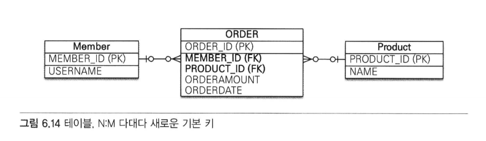

## 목차
- [06. 다양한 연관관계 매핑](#6-다양한-연관관계-매핑)
  - 6.1 [다대일](#61-다대일)
    - 6.1.1 [다대일 단방향](#611-다대일-단방향)
    - 6.1.2 [다대일 양방향](#612-다대일-양방향)
  - 6.2 [일대다](#62-일대다)
    - 6.2.1 [일대다 단방향](#621-일대다-단방향)
    - 6.2.2 [일대다 양방향](#622-일대다-양방향)
  - 6.3 [일대일](#63-일대일)
    - 6.3.1 [주 테이블에 외래 키](#631-주-테이블에-외래-키)
    - 6.3.2 [대상 테이블에 외래 키](#632-대상-테이블에-외래-키)
  - 6.4 [다대다](#64-다대다)
    - 6.4.1 [다대다: 단방향](#641-다대다-단방향)
    - 6.4.2 [다대다: 양방향](#642-다대다-양방향)
    - 6.4.3 [다대다: 매핑의 한계와 극복, 연결 엔티티 사용](#643-다대다-매핑의-한계와-극복,-연결-엔티티-사용)
    - 6.4.4 [다대다: 새로운 기본 키 사용](#644-다대다-새로운-기본-키-사용)
    - 6.4.5 [다대다 연관관계 정리](#645-다대다-연관관계-정리)


# 06. 다양한 연관관계 매핑
## 6.1 다대일
- 다대일 관계의 반대 방향 > 일대다
- 일대다 관계의 반대 방향 > 다대일
- 일(1), 다(N) 관계의 외래 키 > 항상 다(N)
### 6.1.1 다대일 단방향
```java
Member
    @ManyToOne
    @JoinColumn(name="TEAM_ID")
    private Team team;  //팀의 참조를 보관
        
Team
    @Id
    @Column(name = "TEAM_ID")
    private String id;
    
    private String name;
```    
- Member 객체엔 Member.team으로 팀 엔티티를 참조할 수 있다.
- Team 에서는 Member 객체를 참조할 수 없다.
- 이것이 다대일 단방향 연관관계이다.


### 6.1.2 다대일 양방향
```java
Member
    @ManyToOne
    @JoinColumn(name="TEAM_ID")
    private Team team;  //팀의 참조를 보관
    
    public void setTeam(Team team) {
        this.team = team;
        
        if(!team.getMembers().contains(this)) {
            team.getMembers().add(this);
        }
    }

Team    
    @Id
    @Column(name = "TEAM_ID")
    private String id;

    private String name;

    @OneToMany (mappedBy = "team")
    private List<Member2> members = new ArrayList<Member2>();
    
    public void addMember (Member2 member) {
        this.members.add(member);
        if (member.getTeam() != this) {
            member.setTeam(this);
        }
    }
```
- 양방향은 외래 키가 있는 쪽이 연관관계의 주인이다.
    - 일대다, 다대일 연관관계는 항상 다(N)에 외래 키가 있음.
    - 여기선 Member가 외래 키를 가지고 있으므로 Member.team이 연관관계 주인
    - JPA의 외래키 관리 -> 연관관계의 주인만이 가능
        - 그럼 왜 Team에도 연관관계를?
            - Team.members는 조회를 위한 JPQL이나 객체 그래프를 탐색할 때 사용하기 위함

- 양방향 연관관계는 항상 서로를 참조해야 한다.
    - 어느 한 쪽만 참조하면 양방향 연관관계가 성립하지 않음.
    - 항상 서로 참조하기 위해선 연관관계 편의 메소드를 작성하는 것이 좋음.
        - ex) Member의 setTeam(), Team의 addMember()
    - 이때 무한루프에 빠지지 않도록 주의해야 함.


## 6.2 일대다
- 다대일 관계의 반대 방향.
- 일대다 관계는 엔티티를 하나 이상 참조할 수 있으므로 자바 컬렉션을 사용함.
### 6.2.1 일대다 단방향
- "하나의 팀은 여러 회원을 참조할 수 있다."
- 팀은 회원들은 참조하지만, 반대로 회원은 팀을 참조하지 않으면 둘의 관계는 단방향임.
- 엔티티의 Team.members로 회원 테이블의 TEAM_ID 외래 키를 관리함.
- 왜냐하면 일대다 관계에서 외래 키는 항상 다쪽 테이블에 있기 때문
- 하지만 다 쪽인 Member 엔티티에는 외래 키를 매핑할 수 있는 참조 필드가 없음.
- 대신 반대쪽인 Team 엔티티에만 참조 필드인 members가 있다.
- 따라서 반대편 테이블의 외래 키를 관리하는 특이한 모습이 나타남

### 🚩 일대다 단방향 매핑보다는 다대일 양방향 매핑을 사용하자


### 6.2.2 일대다 양방향
- 존재하지 않음.
- 사실 일대다 양방향과 다대일 양방향은 똑같은 말이다..
- 여기서는 왼쪽을 연관관계의 주인으로 가정해서 분류한 것.
- 일대다 단방향 매핑 반대편에 다대일 단방향 매핑을 읽기 전용으로 추가한 것.
## 6.3 일대일
- 일대일 관계는 양쪽이 서로 하나의 관계만 가진다.
    - ex) 회원은 하나의 사물함만 사용 / 사물함도 하나의 회원에 의해서만 사용됨


- 일대일 관계의 특징
    - 일대일 관계는 그 반대도 일대일 관계다.
    - 테이블 관계에서 일대다, 다대일은 항상 다(N)쪽이 외래 키를 가짐.
    - 반면, 일대일은 두 테이블 모두 외래키를 가짐

### 6.3.1 주 테이블에 외래 키
- 일대일 관계를 구성할 때 주 테이블에 외래 키가 있는 것을 선호함.
- JPA도 주 테이블에 외래 키가 있으면 좀 더 편리하게 매핑이 가능함.

### 단방향
```java
@Entity
public class User {
    
    @Id @GeneratedValue
    @Column (name = "USER_ID")
    private Long id;
    
    private String username;
    
    @OneToOne
    @JoinColumn(name = "LOCKER_ID")
    private Locker locker;
}

@Entity
public class Locker {
    
    @Id @GeneratedValue
    @Column(name = "LOCKER_ID")
    private Long id;
    
    private String name;
}
```
- 일대일 관계이므로 객체 매핑에 @OneToOne 사용
- 다대일 단방향과 거의 비슷

### 양방향
```java
@Entity
public class User {

    @Id @GeneratedValue
    @Column (name = "USER_ID")
    private Long id;

    private String username;

    @OneToOne
    @JoinColumn(name = "LOCKER_ID")
    private Locker locker;
}

@Entity
public class Locker {

    @Id @GeneratedValue
    @Column(name = "LOCKER_ID")
    private Long id;

    private String name;
    
    @OneToOne(mappedBy = "locker")
    private User user;
}
```
- 양방향이므로 연관관계의 주인을 정해야 함.
- User 테이블이 외래 키를 가지고 있으므로 Uesr.locker가 연관관계의 주인
- 반대 매핑인 사물함의 Locker.user는 mappedBy를 선언하여 연관관계의 주인이 아니라고 설정함

### 6.3.2 대상 테이블에 외래 키
### 단방향
- 일대일 관계 중 대상 테이블에 외래 키가 있는 단방향 관계는 JPA에서 지원하지 않는다.

### 양방향
```java
@Entity
public class User {

    @Id @GeneratedValue
    @Column (name = "USER_ID")
    private Long id;

    private String username;

    @OneToOne (mappedBy = "user")
    private Locker locker;
}

@Entity
public class Locker {

    @Id @GeneratedValue
    @Column(name = "LOCKER_ID")
    private Long id;

    private String name;

    @OneToOne
    @JoinColumn(name = "USER_ID")
    private User user;
}
```
- 일대일 매핑에서 대상 테이블에 외래 키를 두고 있으면 양방향으로 매핑한다.
- 주 엔티티인 User 엔티티 대신 대상 엔티티인 Locker를 연관관계의 주인으로 만들었다.

## 6.4 다대다
- 관계형 데이터베이스는 정규화된 테이블 2개로 다대다 관계를 표현할 수 없다.
- 그래서 보통, 일대다, 다대일 관계로 풀어내는 연결 테이블을 사용함.


- but, 객체는 테이블과 다르게 객체 2개로 다대다 관계를 만들 수 있다.
- ex)
    - 회원 객체는 컬렉션을 사용하여 상품들을 조회하면 되고
    - 상품들도 컬렉션을 사용해서 회원들을 참조하면 된다.


### 6.4.1 다대다: 단방향
```java
@Entity
public class Member {

    @Id @GeneratedValue
    @Column (name = "MEMBER_ID")
    private Long id;

    private String username;
    
    @ManyToMany
    @JoinTable(name = "MEMBER_PRODUCT",
               joinColumns = @JoinColumn(name = "MEMBER_ID"),
               inverseJoinColumns = @JoinColumn(name = "PRODUCT_ID"))
    private List<Product> products = new ArrayList<Product>();
}

@Entity
public class Product {
    
    @Id @Column (name = "PRODUCT_ID")
    private String id;
    
    private String name;
}
```
- 회원 엔티티와 상품 엔티티를 @ManyToMany로 매핑함.
- ❗ 중요
    - @ManyToMany와 @JoinTable을 사용해서 연결 테이블을 바로 매핑한 것이다.
    - 따라서 회원과 상품을 연결하는 회원_상품 엔티티 없이 매핑을 완료할 수 있다.

### @JoinTable의 속성
- @JoinTable.name
    - 연결 테이블을 지정한다. 여기서는 MEMBER_PRODUCT 테이블을 선택했다.

- @JoinTable.joinColumns
    - 현재 방향인 회원과 매핑할 조인 컬럼 정보를 지정한다.
    - MEMBER_ID로 지정.

- @JoinTable.inverseJoinColumns
    - 반대 방향인 상품과 매핑할 조인 컬럼 정보 지정
    - PRODUCT_ID로 지정.


MEMBER_PRODUCT 테이블은 다대다 관계를 일대다, 다대일 관계로 풀어내기 위해 필요한 연결 테이블일 뿐이다.
@ManyToMany로 매핑한 덕분에 다대다 관계를 사용할 때는 이 연결 테이블을 신경 쓰지 않아도 된다.
### 6.4.2 다대다: 양방향
```java
@Entity
public class Product {

    @Id
    private String id;

    @ManyToMany(mappedBy = "products")  //역방향 추가
    private List<Member> members;
}
```
- 다대다 매핑이므로 역방향도 @ManyToMany를 사용함.
- 양쪽 중 원하는 곳에 mappedBy로 연관관계 주인을 지정한다.


- 양방향 연관관계는 연관관계 편의 메소드를 추가해서 관리하는 것이 편리함.
- 회원 엔티티에 연관관계 편의 메소드를 추가하자
```java
public void addProduct(Product product) {
        ...
        product.add(product);
        product.getMembers().add(this);
    }
```

### 6.4.3 다대다: 매핑의 한계와 극복, 연결 엔티티 사용
- @ManyToMany를 사용하면 연결 테이블을 자동으로 처리해주므로 도메인 모델이 단순해지고 편해짐.
- but, 실무에서 사용하기에는 한계가 있다.
    - 회원이 상품을 주문하는 상황에서 연결 테이블에 단순히 주문한 회원 아이디와 상품 아이디만 남고
      끝나지 않는다. 보통 주문 수량, 주문 날짜가 더 필요하게 됨.


- 그림과 같이 수량과 날짜가 추가되었다.
- 이렇게 되면 더는 @ManyToMany를 쓸 수 없다.


- 결국 연결 테이블을 매핑하는 연결 엔티티를 만들고 이곳에 추가한 컬럼들을 매핑해야 한다.
- 또한 엔티티 간의 관계도 테이블 관계처럼 다대다에서 일대다, 다대일 관계로 풀어야 함.


- 회원상품 엔티티를 추가하고 주문수량, 주문날짜 컬럼 추가한다.

```java
@Entity
public class Member {

    @Id
    @Column(name = "MEMBER_ID")
    private Long id;

    //역방향
    @OneToMany(mappedBy = "member")
    private List<MemberProduct> memberProducts;
    
    ...

} 
```

- 회원과 회원상품을 양방향 관계로 만들었다.
- 회원상품 엔티티 쪽이 외래 키를 가지고 있으므로 MemberProduct가 연관관계 주인임.
- 회원은 mappedBy 사용

```java
@Entity
public class Product {

    @Id @Column(name = "PRODUCT_ID")
    private String id;

    private String name;
    ...
}
```
- 상품 엔티티에서 회원상품 엔티티로 객체 그래프 탐색 기능이 필요하지 않다고 판단해서 연관관계를 만들지 않음.

```java
@Entity
@IdClass(MemberProductId.class)
public class MemberProduct {
    
    @Id
    @ManyToOne
    @JoinColumn(name = "MEMBER_ID")
    private Member member;  //MemberProductId.member와 연결
    
    @Id
    @ManyToOne
    @JoinColumn (name = "PRODUCT_ID")
    private Product product;    //MemberProductId.product와 연결
    
    private int orderAmount;
}

public class MemberProductId implements Serializable {
    
    private String member;  //MemberProduct.member와 연결
    private String product; //MemberProduct.product와 연결
    
    //hashCode and equals
    
    @Override
    public boolean equals(Object o) {...}
    
    @Override
    public int hashCode() {...}
}
```

- 회원상품 엔티티를 보면 기본 키를 매핑하는 @Id와
  외래 키를 매핑하는 @JoinColumn을 동시에 사용해서
  기본 키 + 외래 키를 한번에 매핑했다.

- 그리고 @IdClass를 사용하여 복합 기본 키를 매핑했다.

### 복합 기본 키
- 회원상품 엔티티는 기본 키가 MEMBER_ID와 PRODUCT_ID로 이루어진 복합 기본키다.
- JPA에서 복합 키를 사용하려면 별도의 식별자 클래스를 만들어야 함.
- 그리고 엔티티에 @IdClass를 사용해서 식별자 클래스를 지정하면 됨.
- 여기서는 MemberProductId 클래스를 복합 키를 위한 식별자 클래스로 사용한다.

#### 복합 기본키를 위한 식별자 클래스의 특징
- 복합 키는 별도의 식별자 클래스로 만들어야 한다.
- Serializble을 구현해야 한다.
- equals와 hashCode 메소드를 구현해야 함
- 기본 생성자가 있어야 함
- 식별자 클래스는 public이어야 함
- @IdClass를 사용하는 방법 외에 @EmbeddedId를 사용하는 방법도 있음

### 식별 관계
- 회원상품은 회원과 상품의 기본 키를 받아 자신의 기본 키로 사용한다.
- 이렇게 부모 테이블의 기본 키를 받아서 자신의 기본 키 + 외래 키로 사용하는 것을 데이터베이스 용어로 식별관계라고 한다.
- 종합 : 회원상품 - 회원의 기본 키 받아 자신의 기본 키로 사용 and 회원과의 관계를 위한 외래 키로 사용.
    - 상품의 기본 키도 받아서 자신의 기본 키로 사용 and 상품과의 관계를 위한 외래 키로 사용
    - MemberProductId 식별자 클래스로 두 기본 키를 묶어 복합 기본 키로 사용한다.

### 6.4.4 다대다: 새로운 기본 키 사용
- 데이터베이스에서 자동으로 생성해주는 대리 키를 Long 값으로 사용하는 것이 추천됨
    - 장점 : 간편, 영구적, 비즈니스에 의존적이지 않음, ORM 매핑 시에 복합 키를 만들지 않아도 됨.


- 이번에는 연결 테이블에 새로운 기본 키를 사용해본다.
- 회원상품 보다는 주문이라는 이름이 더 어울린다.



```java
@Entity
public class Order {
    
    @Id @GeneratedValue
    @Column(name = "ORDER_ID")
    private Long id;
    
    @ManyToOne
    @JoinColumn(name = "MEMBER_ID")
    private Member member;
    
    @ManyToOne
    @JoinColumn(name = "PRODUCT_ID")
    private Product product;
    
    private int orderAmount;
    
    ...
}
```
- 대리 키를 사용함으로써 복합 키를 사용하는 것보다 매핑이 단순하고 이해하기 쉬움.

```java
@Entity
public class Member {

    @Id
    @Column(name = "MEMBER_ID")
    private Long id;

    @OneToMany(mappedBy = "member")
    private List<Order> orders = new ArrayList<Order>();

    ...
}

@Entity
public class Product {

    @Id @Column(name = "PRODUCT_ID")
    private String id;
    private String name;

    ...
}
```
- 회원 엔티티와 상품 엔티티는 변경사항이 없다.

### 6.4.5 다대다 연관관계 정리
- 다대다 관계를 일대다 관계로 풀어내기 위해 연결 테이블을 만들 때 식별자를 어떻게 구성할지 선택해야 함
    - 식별 관계: 받아온 식별자를 기본 키 + 외래 키로 사용한다.
    - 비식별 관계: 받아온 식별자를 외래 키로만 사용하고 새로운 식별자를 추가한다.
  