## 목차
- [07. 고급매핑](#07-고급매핑)
    - 7.1 [상속 관계 매핑](#71-상속-관계-매핑)
        - 7.1.1 [조인 전략](#711-조인-전략)
        - 7.1.2 [단일 테이블 전략](#712-단일-테이블-전략)
        - 7.1.3 [구현 클래스마다 테이블 전략](#713-구현-클래스마다-테이블-전략)
    - 7.2 [@MappedSuperclass](#72-mappedsuperclass)
    - 7.3 [복합 키와 식별 관계 매핑](#73-복합-키와-식별-관계-매핑)
        - 7.3.1 [식별 관계 vs 비식별 관계](#731-식별-관계-vs-비식별-관계)
        - 7.3.2 [비식별 관계 - 복합 키를 사용하는 비식별 관계](#732-비식별-관계---복합-키를-사용하는-비식별-관계)
        - 7.3.3 [식별 관계 - 복합 키를 사용하는 식별 관계](#733-식별-관계---복합-키를-사용하는-식별-관계)
        - 7.3.4 [비식별 관계로 구현](#734-비식별-관계로-구현)
        - 7.3.5 [일대일 식별 관계](#735-일대일-식별-관계)
        - 7.3.6 [식별, 비식별 관계의 장단점](#736-식별,-비식별-관계의-장단점)
    - 7.4 [조인 테이블](#74-조인-테이블)
        - 7.4.1 [일대일 조인 테이블](#741-일대일-조인-테이블)
        - 7.4.2 [일대다 조인 테이블](#742-일대다-조인-테이블)
        - 7.4.3 [다대일 조인 테이블](#743-다대일-조인-테이블)
    - 7.5 [엔티티 하나에 여러 테이블 매핑](#75-엔티티-하나에-여러-테이블-매핑)


# 07. 고급매핑
## 7.1 상속 관계 매핑
- 관계형 데이터베이스에는 상속이라는 개념이 없다.
    - 슈퍼타입 서브타입 관계라는 모델링 기법이 상속 개념과 가장 유사하다.

- ORM에서 이야기하는 상속 관계 매핑
    - 객체의 상속 구조와 데이터베이스의 슈퍼타입 서브타입 관계를 매핑하는 것

- 슈퍼타입 서브타입 논리 모델을 실제 물리 모델인 테이블로 구현하는 3가지 방법
    - 각각의 테이블로 변환 (조인 전략)
    - 통합 테이블로 변환 (단일 테이블 전략)
    - 서브타입 테이블로 변환 (구현 클래스마다 테이블 전략)


### 7.1.1 조인 전략
- 엔티티 각각을 모두 테이블로 만들고 자식 테이블이 부모 테이블의 기본 키를 받아서
  기본 키 + 외래키로 사용하는 전략

- 조회할 때 조인을 자주 사용
- 주의 ) 객체는 타입으로 구분할 수 있지만 테이블은 타입의 개념이 없음
    - 따라서 타입을 구분하는 컬럼을 추가해야 한다. (DTYPE 구분 컬럼)

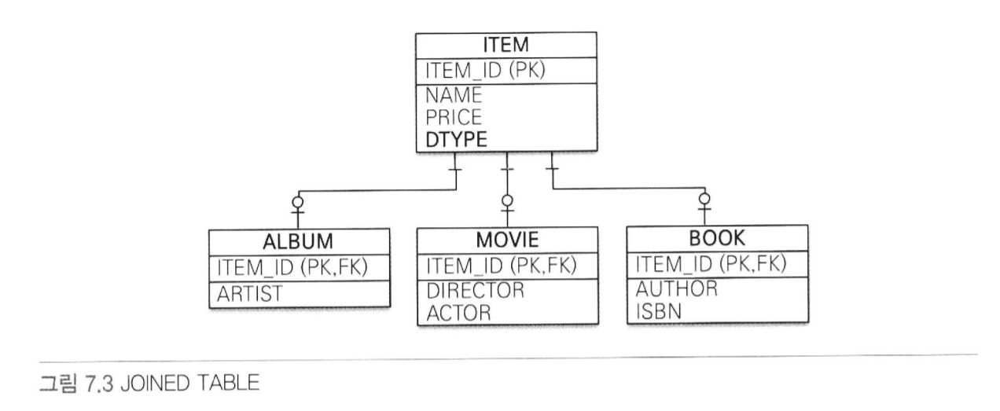

- 조인 전략을 사용한 예제 코드
```java
    @Entity
    @Inheritance(strategy = InheritanceType.JOINED)
    @DiscriminatorColumn(name = "DTYPE")
    public abstract class Item {

        @Id @GeneratedValue
        @Column (name = "ITEM_ID")
        private Long id;

        private String name;    //이름
        private int price;      //가격
    }

    @Entity
    @DiscriminatorValue("A")
    public class Album extends Item {
        private String artist;
    }

    @Entity
    @DiscriminatorValue("A")
    public class Movie extends Item {
        private String director;    //감독
        private String actor;       //배우
    }
```
- @Inheritanc(strategy = InheritanceType.JOINED)
    - 상속 매핑은 부모 클래스에 @Inheritance를 사용해야 함.
    - 매핑 전략을 지정해야 함 - 조인전략 => InheritanceType.JOINED

- @DiscriminatorColumn(name = "DTYPE")
    - 부모 클래스에 구분 컬럼 지정
    - 기본값이 DTYPE. 컬럼 이름이 DTYPE이면 name 속성 생략가능

- @DiscriminatorValue("M")
    - 엔티티를 저장할 때 구분 컬럼(DTYPE)에 입력할 값 지정

- 기본값으로 자식 테이블은 부모 테이블의 ID 컬럼명을 그대로 사용함
- 기본 키 컬럼명을 변경하고 싶으면 @PrimaryKeyJoinColumn 사용
```java
    @Entity
    @DiscriminatorValue("B")
    @PrimaryKeyJoinColumn(name = "BOOK_ID") //ID 재정의
    public class Book extends Item {
        private String author;   //작가
        private String isbn;     //ISBN
    }
```

### 조인 전략 정리
#### 장점 👍
- 테이블 정규화
- 외래 키 참조 무결성 제약조건 활용가능
- 저장공간의 효율적 사용

#### 단점 👎
- 조회시 다량의 조인에 따른 성능 저하
- 조회 쿼리 복잡
- 데이터를 등록할 INSERT SQL 두번 실행

#### 특징
- JPA 표준 명세는 구분 컬럼을 사용하도록 하지만, 하이버네이트를 포함한 몇몇 구현체는
  구분컬럼 없이도 동작한다.

#### 관련 어노테이션
- @PrimaryKeyJoinColumn, @DiscriminatorColumn, @DiscriminatorValue

### 7.1.2 단일 테이블 전략
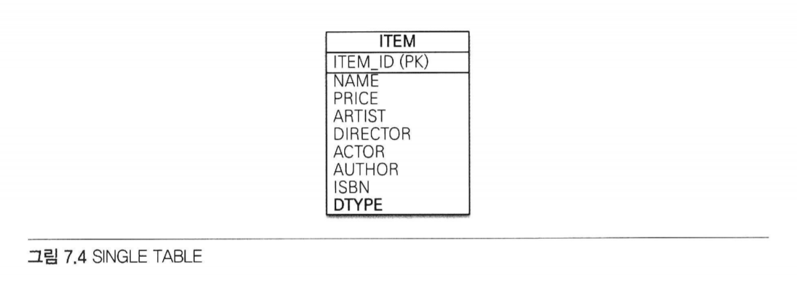

- 테이블을 하나만 사용하는 전략
- 구분 컬럼(DTYPE)으로 어떤 자식 데이터가 저장되었는지 구분함.
- 조회 시 조인이 필요없기 때문에 일반적으로 가장 빠름

#### 주의점
- 자식 엔티티가 매핑한 컬럼은 모두 null을 허용해야 한다.

```java
    @Entity
    @Inheritance(strategy = InheritanceType.SINGLE_TABLE)
    @DiscriminatorColumn(name = "DTYPE")
    public abstract class Item {

        @Id @GeneratedValue
        @Column (name = "ITEM_ID")
        private Long id;

        private String name;    //이름
        private int price;      //가격
    }

    @Entity
    @DiscriminatorValue("A")
    public class Album extends Item {    }

    @Entity
    @DiscriminatorValue("A")
    public class Movie extends Item {    }

    @Entity
    @DiscriminatorValue("B")
    public class Book extends Item {    }
```
#### 장점 👍
- 조인이 필요없기 때문에 일반적으로 조회 성능이 빠름
- 조회 쿼리가 단순함

#### 단점 👎
- 자식 엔티티가 매핑한 컬럼은 모두 null을 허용해야 함
- 단일 테이블에 모든 것을 저장하기에 테이블이 커질 수 있음
- 조회 성능이 느려질 수 있음

#### 특징
- 구분 컬럼 사용이 필수
    - @DiscriminatorColumn 설정 필수

- @DiscriminatorColumn 미설정시 기본으로 엔티티 이름을 사용함 (예: Movie, Album, Book)

### 7.1.3 구현 클래스마다 테이블 전략

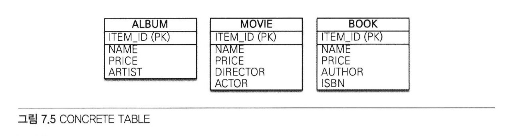

```java
    @Entity
    @Inheritance(strategy = InheritanceType.TABLE_PER_CLASS)
    public abstract class Item {

        @Id @GeneratedValue
        @Column (name = "ITEM_ID")
        private Long id;

        private String name;    //이름
        private int price;      //가격
    }

    @Entity
    @DiscriminatorValue("A")
    public class Album extends Item {    }

    @Entity
    @DiscriminatorValue("A")
    public class Movie extends Item {    }

    @Entity
    @DiscriminatorValue("B")
    public class Book extends Item {    }
```
#### 장점 👍
- 서브 타입을 구분해서 처리할 때 효과적이다
- not null 제약조건을 사용할 수 있음

#### 단점 👎
- 여러 자식 테이블을 함께 조회할 때 성능이 느림(SQL에 UNION사용해야함)
- 자식 테이블을 통합해서 쿼리하기가 어려움

#### 특징
- 구분 컬럼을 사용하지 않는다
- 데이터베이스 설계자와 ORM 전문가 둘 다 추천하지 않는 전략임.
- 조인이나 단일 테이블 전략을 고려해야함.

## 7.2 @MappedSuperclass
- 지금까지 학습한 상속 관계 매핑은 부모 클래스와 자식 클래스를 모두 데이터베이스 테이블과 매핑했다.
- 부모 클래스는 테이블과 매핑하지 않고 부모 클래스를 상속 받는 자식 클래스에게 매핑 정보만 제공하고 싶으면 사용한다.
- @MappedSuperclass는 추상 클래스와 비슷.
    - @Entity는 실제 테이블과 매핑
    - @MappedSuperclass는 실제 테이블과 매핑되지 않음

- 단순히 매핑 정보를 상속할 목적으로만 사용됨


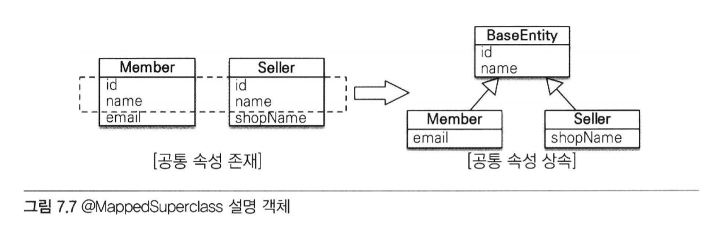

- 회원(Member)와 판매자(Seller)는 서로 관계가 없는 테이블과 엔티티다
- 테이블은 그대로 두고 객체 모델의 id, name 두 공통 속성을 부모 클래스로 모으고 객체 상속 관계로 만들어보자

```java
    @MappedSuperclass
    public abstract class BaseEntity {
        
        @Id
        @GeneratedValue
        private Long id;
        
        private String name;
    }
    
    @Entity
    public class Member extends BaseEntity {
        
        //ID 상속
        //NAME 상속
        private String email;
    }
    
    @Entity
    public class Seller extends BaseEntity {
        
        //ID 상속
        //Name 상속
        private String shopName;
    }
```
- BaseEntity
    - 객체들이 주로 사용하는 매핑 정보 정의
    - 테이블과 매핑할 필요 없음
    - 자식 엔티티에게 공통으로 사용되는 매핑 정보만 제공하면 됨
    - @MappedSuperclass 사용

- 자식 엔티티(Member, Seller)
    - 상속을 통해 BaseEntity 매핑 정보를 물려받음


- 부모로부터 물려받은 매핑 정보 재정의 하는법
- @AttributeOverride, @AttributeOverrides
```java
    @Entity
    @AttributeOverride(name = "id", column = @Column(name = "MEMBER_ID"))
    public class Member extends BaseEntity {}
```

- 연관관계 재정의 하는법
- @AssociationOverrides, @AssociationOverride

#### 특징
- 테이블과 매핑되지 않고 자식 클래스에 엔티티 매핑 정보를 상속하기 위해 사용
- @MappedSuperclass로 지정한 클래스는 엔티티가 아니므로 em.find(), JPQL에서 사용 불가
- 이 클래스를 직접 생성해서 사용할 일은 거의 없으므로 추상 클래스로 만드는 것을 권장

## 7.3 복합 키와 식별 관계 매핑
- 복합 키를 매핑하는 방법과 식별 관계, 비식별 관계를 매핑하는 방법

### 7.3.1 식별 관계 vs 비식별 관계
- 외래 키가 기본 키에 포함되는지 여부에 따라 식별 관계와 비식별 관계로 구분
#### 식별 관계
- 부모 테이블의 기본 키를 내려받아서 자식 테이블의 기본 키 + 외래 키로 사용하는 관계
- 외래 키가 기본 키에 포함 O

#### 비식별 관계
- 부모 테이블의 기본키를 받아서 자식 테이블의 외래 키로만 사용하는 관계
- 외래 키가 기본 키에 포함 X
#### 비식별 관계의 분류
- 필수적 비식별 관계
    - 외래 키에 null을 허용하지 않음
    - 연관관계 필수적
- 선택적 비식별 관계
    - 외래 키에 null을 허용
    - 연관관계 선택적


#### 📌 데이터베이스 테이블 설계시 식별 관계나 비식별 관계 중 하나를 선택해야 한다.
- 최근에는 비식별 관계를 주로 사용하고 꼭 필요한 곳에만 식별 관계를 사용하는 추세
- JPA는 식별 관계, 비식별 관계 모두 지우너함

#### 식별 관계와 비식별 관계의 매핑방법
### 7.3.2 비식별 관계 - 복합 키를 사용하는 비식별 관계
- 기본 키를 구성하는 컬럼이 하나면 다음처럼 단순하게 매핑하면 된다.
```java
@Entity
public class Hello {
  @Id
  private String id;
}
```

- 둘 이상의 컬럼으로 구성된 복합 키는 다음과 같이 매핑하면 될 것 같지만
- 매핑 오류가 발생한다.
- JPA에서 식별자를 둘 이상 사용하기 위해서는 별도의 식별자 클래스를 만들어야 한다.
```java
@Entity
public class Hello {
  @Id
  private String id1;
  @Id
  private String id2; //실행 시점에 매핑 예외 발생
}
```

- JPA는 영속성 컨텍스트에 엔티티 보관 시 엔티티의 식별자를 키로 사용함
- 그리고 식별자를 구분하기 위해 equals와 hashCode를 사용해서 동등성 비교를 한다.
- 그런데 식별자 필드가 하나일 때는 자바의 기본 타입을 사용하기 때문에 문제가 없지만
- 식별자 필드가 2개 이상이면 별도의 식별자 클래스를 만들고 그 곳에
- equals와 hashCode를 구현해야 한다.


- JPA는 복합 키를 지원하기 위해 @IdClass, @EmbeddedId 2가지 방법을 제공함
- @IdClass - 관계형 데이터베이스에 가까움
- @EnbeddedId - 객체지향에 가까움

### IdClass
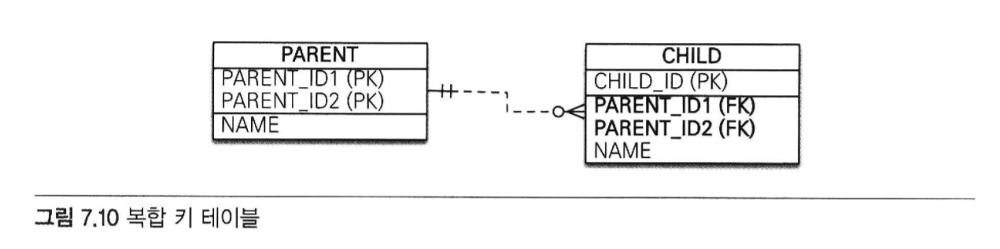

- 복합 키 테이블은 비식별 관계
- PARENT는 복합 기본 키
- 여기서 이야기하는 부모(PARENT) 자식(CHILD) 객체의 상속과는 무관함
    - 테이블의 키를 내려받은 것을 강조하기 위해 이름지음

```java
    @Entity
    @IdClass(ParentId.class)
    public class Parent {
        
        @Id
        @Column(name = "PARENT_ID1")
        private String id1;     //ParentId.id1과 연결
        
        @Id
        @Column(name = "PARENT_ID2")
        private String id2;     //ParentId.id2와 연결
        
        private String name;
    }
```
- 각각의 기본 키 컬럼을 @Id로 매핑함
- @IdClass를 사용해서 ParentId 클래스를 식별자 클래스로 지정함

```java
    public class ParentId implements Serializable {

        private String id1;     //Parent.id1 매핑
        private String id2;     //Parent.id2 매핑

        public ParentId() {

        }

        public ParentId(String id1, String id2) {
            this.id1 = id1;
            this.id2 = id2;
        }

        @Override
        public boolean equals(Object o) {...}

        @Override
        public int hashCode() {...}
    }
```

- @IdClass를 사용할 때 만족해야 하는 조건
    - 식별자 클래스의 속성명과 엔티티에서 사용하는 식별자의 속성명이 같아야 함
        - 예제의 Parent.id1과 ParentId.id1, 그리고 Parent.id2와 ParentId.id2가 같다.
    - Serializable 인터페이스를 구현해야 함
    - equals, hashCode를 구현해야 함
    - 기본 생성자가 있어야 함
    - 식별자 클래스는 public이어야 함


- 복합 키를 사용하는 엔티티 저장하기
```java
Parent parent = new Parent();
parnet.setId1("myId1");  //식별자
parnet.setId2("myId2");  //식별자
parnet.setName("parentName");
em.persist(parent);
```
- 저장 코드에는 식별자 클래스인 ParentId가 보이지 않는다
- em.persist()를 호출하면 영속성 컨텍스트에 엔티티를 등록하기 직전에 내부에서
  Perent.id1, Parent.id2 값을 사용하여 식별자 클래스인 ParentId를 생성하고 영속성 컨텍스트의 키로 사용한다

- 복합 키로 조회하기
```java
ParentId parentId = new ParentId("myId1", "myId2");
Parent parent = em.find(Parent.class, parentId);
```
- 조회 코드에서 식별자 클래스인 ParentId를 사용하여 엔티티를 조회한다

```java
    @Entity
    public class Child {
        
        @Id
        private String id;
        
        @ManyToOne
        @JoinColumns({
                @JoinColumn(name = "PARENT_ID1",
                    referencedColumnName = "PARENT_ID1"),
                @JoinColumn(name = "PARENT_ID2",
                    referencedColumnName = "PARENT_ID2")
        })
        private Parent parent;
    }
```
- 부모 테이블의 기본 키 컬럼이 복합키이므로 자식 테이블의 외래 키도 복합 키다.
- 따라서 외래 키 매핑 시 여러 컬럼을 매핑해야 하므로 @JoinColumns 어노테이션을 사용하고
    - 각각의 외래 키 컬럼을 @JoinColumn으로 매핑한다.

- 예제처럼 @JoinColumn의 name과 referencedColumnName 속성의 값이 같으면 referencedColumnName 생략가능

### @EmbeddedId
- 객체지향적인 방법

```java
    @Entity
    public class Parent {
        
        @EmbeddedId
        private ParentId id;
        
        private String name;
    }
    
    @Embeddable
    public class ParentId implements Serializable {
        
        @Column(name = "PARENT_ID1")
        private String id1;
        
        @Column(name = "PARENT_ID2")
        private String id2;
        
        //equals and hashCode 구현
    }
```

- @IdClass와는 다르게 @EmbeddedId를 적용한 식별자 클래스는 식별자 클래스에 기본 키를 직접 매핑함


- @EmbeddedId를 적용한 식별자 클래스의 조건
    - @Embeddable 어노테이션을 붙여주어야 함
    - Serializable 인터페이스를 구현해야 함
    - equals, hashCode를 구현해야 함
    - 기본 생성자가 있어야 함
    - 식별자 클래스는 public이어야 함

- @EmbeddedId 엔티티 저장
```java
Parent parent = new Parent();
ParentId parentId = new ParentId("myId1", "myId2");
parent.setId(parentId);
parent.setName("parentName")
em.persist(parent);
```
- parentId를 직접 생성하여 사용한다

- @EmbeddedId 엔티티 조회
```java
ParentId parentId = new ParentId("myId1", "myId2");
Parent parent = em.find(Parent.class, parentId);
```
- 조회 코드도 식별자 클래스 parentId를 직접 사용한다.

### @IdClass vs @EmbeddedId
- @EmbeddedId가 @IdClass와 비교하여 더 객체지향적이고 중복도 없어 좋아보이긴한다.
- 하지만 특정 상황에 JPQL이 조금 더 길어질 수 있다.
```java
em.createQuery("select p.id.id1, p.id.id2 from Parent p"); //@EmbeddedId
em.createQuery("select p.id1, p.id2 from Parent p");       //@IdClass
```

### 7.3.3 식별 관계 - 복합 키를 사용하는 식별 관계
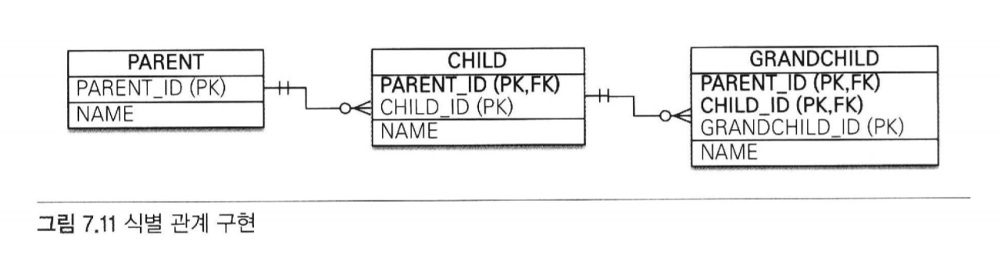

- 부모, 자식, 손자까지 계속 기본 키를 전달하는 식별 관계다.
- 식별 관계에서 자식 테이블은 부모 테이블의 기본 키를 포함하여 복합 키를 구성해야 하므로
  @IdClass나 @EmbeddedId를 사용해서 식별자를 매핑해야 한다.

### @IdClass와 식별 관계
```java
    //부모
    @Entity
    public class Parent {

        @Id @Column(name = "PARENT_ID")
        private String id;
        private String name;
    }
    
    //자식
    @Entity
    public class Child {
        
        @Id
        @ManyToOne
        @JoinColumn(name = "PARENT_ID")
        public Parent parent;
        
        @Id @Column(name = "CHILD_ID")
        private String childId;
        
        private String name;
    }
    
    //자식 ID
    public class ChildId implements Serializable {
        
        private String parent;  //Child.parent 매핑
        private String childId; //Child.childId 매핑
        
        //equals, hashCode
        ...
    }
    
    //손자
    @Entity
    @IdClass(GrandChildId.class)
    public class GrandChild {
     
        @Id
        @ManyToOne
        @JoinColumns({
                @JoinColumn(name = "PARENT_ID"),
                @JoinColumn(name = "CHILD_ID")
        })
        private Child child;

        @Id
        @Column(name = "GRANDCHILD_ID")
        private String id;

        private String name;
    }
    
    //손자 ID
    public class GrandChildId implements Serializable {
        
        private ChildId child;  //GrandChild.child 매핑
        private String id;      //GrandChild.id 매핑
        
        //equals, hashCode
        ...
    }
```
- 식별 관계는 기본 키와 외래 키를 같이 매핑해야 함.
- 식별자 매핑인 @Id와 연관관계 매핑인 @ManyToOne을 같이 하용하면 됨.
- Child 엔티티의 parent 필드를 보면 @Id로 기본 키를 매핑하면서
  @ManyToOne과 @JoinColumn으로 외래 키를 같이 매핑한다.


### @EmbeddedId와 식별 관계
```java
    //부모
    @Entity
    public class Parent {

        @Id @Column(name = "PARENT_ID")
        private String id;
        
        private String name;
        ...
    }

    //자식
    @Entity
    public class Child {

        @MapsId("parentId") //ChildId.parentId 매핑
        @ManyToOne
        @JoinColumn(name = "PARENT_ID")
        public Parent parent;

        @EmbeddedId
        private ChildId childId;

        private String name;
    }
    
    //자식 ID
    @Embeddable
    public class ChildId implements Serializable {
        
        private String parentId;    //@MapId("parentId")로 매핑
        
        @Column(name = "CHILD_ID")
        private String id;
        
        //equals, hashCode
        ...
    }

    //손자
    @Entity
    @IdClass(GrandChildId.class)
    public class GrandChild {

        @MapsId("childId")  //GrandChildId.childId 매핑
        @ManyToOne
        @JoinColumns({
                @JoinColumn(name = "PARENT_ID"),
                @JoinColumn(name = "CHILD_ID")
        })
        private Child child;
        
        @EmbeddedId
        private GrandChildId id;

        private String name;
    }

    //손자 ID
    @Embeddable
    public class GrandChildId implements Serializable {

        private ChildId child;  //GrandChild.child 매핑
        
        @Column(name = "GRANDCHILD_ID")
        private String id;      //GrandChild.id 매핑

        //equals, hashCode
        ...
    }
```
- @EmbeddedId는 식별 관계로 사용할 연관관계의 속성에 @MapsId를 사용하면 됨
- @IdClass와 다른 점 - @Id 대신 @MapsId를 사용한 점.
- @MapsId는 외래키와 매핑한 연관관계를 기본 키에도 매핑하겠다는 뜻.
- @MapsId의 속성 값은 @EmbeddedId를 사용한 식별자 클래스의 기본 키 필드를 지정하면 됨.
- 여기서는 ChildId의 parentId 필드를 선택함

### 7.3.4 비식별 관계로 구현
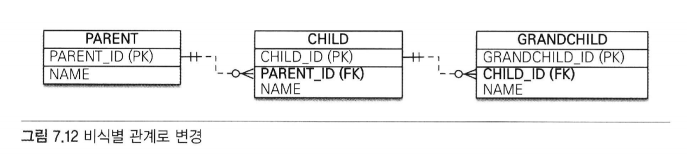

- 방금 식별 관계 테이블의 예를 위 그림과 같이 비식별 관계로 변경해보자

```java
    //부모
    @Entity
    public class Parent {

        @Id @GeneratedValue 
        @Column(name = "PARENT_ID")
        private String id;
        private String name;
        ...
    }

    //자식
    @Entity
    public class Child {

        @Id @GeneratedValue
        @Column(name = "CHILD_ID")
        private Long id;
        
        @ManyToOne
        @JoinColumn(name = "PARENT_ID")
        private Parent parent;
        
        private String name;
    }

    //손자
    @Entity
    public class GrandChild {
        
        @Id @GeneratedValue
        @Column(name = "GRANDCHILD_ID")
        private Long id;
        private String name;

        @ManyToOne
        @JoinColumn(name = "CHILD_ID")
        private Child child;

    }
```
- 식별 관계의 복합 키를 사용한 코드와 비교하면 매핑도 쉽고 코드도 단순함
- 복합 키가 없으므로 복합 키 클래스르 만들지 않아도 된다

### 7.3.5 일대일 식별 관계


- 일대일 식별 관계는 자식 테이블의 기본 키 값으로 부모 테이블의 기본 키 값만 사용함
- 부모 테이블의 기본 키가 복합 키가 아니면 자식 테이블의 기본 키는 복합 키로 구성하지 않아도 됨
```java
    //부모
    @Entity
    public class Board {
        
        @Id @GeneratedValue
        @Column(name = "BOARD_ID")
        private Long id;
        
        private String title;
        
        @OneToOne(mappedBy = "board")
        private BoardDetail boardDetail;
    }
    
    //자식
    @Entity
    public class BoardDetail {
        
        @Id
        private Long boardId;
        
        @MapsId //BoardDetail.boardID 매핑
        @OneToOne
        @JoinColumn(name = "BOARD_ID")
        private Board board;
        
        private String content;
    }
```
- BoardDetail처럼 식별자가 단순히 컬럼 하나면 @MapId를 사용하고
  속성 값은 비워두면 된다.

- 이때 @MapsId는 @Id를 사용해서 식별자로 지정한 BoardDetail.boardId와 매핑된다.

- 일대일 식별 관계를 사용하는 코드
```java
public void save() {
    Board board = new Board();
    board.setTitle("제목");
    em.persist(board);
    
    BoardDetail boardDetail = new BoardDetail();
    boardDetail.setContent("내용");
    boardDetail.setBoard(board);
    em.persist(boardDetail);
}
```

### 7.3.6 식별, 비식별 관계의 장단점
- 데이터베이스 설계 관점에서 보면 다음과 같은 이유로 식별 관계보다는 👉 비식별 관계를 선호함
    - 식별 관계는 부모 테이블의 기본 키를 자식 테이블로 전파하면서 자식 테이블의 기본 키 컬럼이 점점 늘어난다.
        - 예를 들어 부모 테이블은 기본 키 컬럼이 하나였지만 자식 테이블은 기본 키 컬럼이 2개, 손자 테이블은 기본 키 컬럼이 3개로 늘어남.
        - 결국 조인할 때 SQL이 복잡해지고 기본 키 인덱스가 불필요하게 커질 수 있음
    - 식별 관계는 2개 이상의 컬럼을 합해서 복합 기본 키를 만들어야 하는 경우가 많음
    - 식별 관계를 사용할 때 기본 키로 비즈니스 의미가 있는 자연 키 컬럼을 조합하는 경우가 많음
        - 반면, 비식별 관계의 기본 키는 비즈니스와 전혀 관계없는 대리 키를 주로 사용함.
        - 비즈니스 요구사항은 시간이 지남에 따라 언젠가는 변한다.
        - 식별 관계의 자연 키 컬럼들이 손자까지 전파되면 변경하기가 힘듦.
    - 식별 관계는 부모 테이블의 기본 키를 자식 테이블의 기본 키로 사용하므로 비식별 관계보다 테이블 구조가 유연하지 못함


- 객체 관계 매핑의 관점에서 보면 다음과 같은 이유로 👉 비식별 관계를 선호함
    - 일대일 관계를 제외하고 식별 관계는 2개 이상의 컬럼을 묶은 복합 기본 키를 사용함
        - JPA에서 복합 키는 별도의 복합 키 클래스를 만들어서 사용해야 함
        - 이렇게 되면 컬럼이 하나인 기본 키를 매핑하는 것보다 많은 노력이 필요함
    - 비식별 관계의 기본 키는 주로 대리 키를 사용하는데 JPA는 @GenerateValeu처럼 대리 키를 생성하기 위한 편리한 방법을 제공함


- 식별 관계가 가지는 장점
    - 기본 키 인덱스를 활용하기 좋음
    - 상위 데이터들의 기본 키 컬럼을 자식, 손자 테이블들이 가지고 있기 때문에
      특정상황에 조인 없이 하위 테이블만으로 검색을 완료할 수 있음


### 📌 정리
- ORM 신규 프로젝트 진행시 추천하는 방법은
    - 될 수 있으면 비식별 관계를 사용하고 기본 키는 Long 타입의 대리 키를 사용하는 것
        - 대리키는 비즈니스와 아무 관련지 없음.
        - 따라서 비즈니스가 변경되어도 유연한 대처가 가능하다는 장점이 있음
        - JPA는 @GenerateValue를 통해 간편하게 대리 키를 생성할 수 있음
        - 그리고 식별자 컬럼이 하나이기 때문에 쉽게 매핑이 가능함.
    - 선택적 비식별 관계보자는 필수적 비식별 관계를 사용하는 것이 좋음
        - 선택적인 비식별 관계는 NULL을 허용하기 때문에 조인할 때에 외부 조인을 사용해야 함
        - 반면, 필수적 관계는 NOT NULL로 항상 관계가 있다는 것을 보장하므로 내부 조인만 사용해도 됨


## 7.4 조인 테이블
- 데이터베이스 테이블의 연관관계를 설계하는 방법
    - 조인 컬럼 사용(외래 키)
    - 조인 테이블 사용(테이블 사용)

### 조인 컬럼 사용
- 테이블 간에 관계는 주로 조인 컬럼이라 부르는 외래 키 컬럼을 사용해서 관리한다.

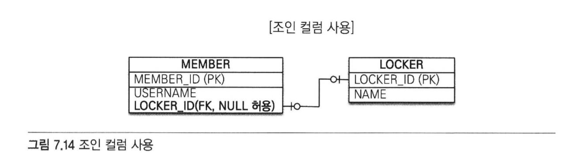
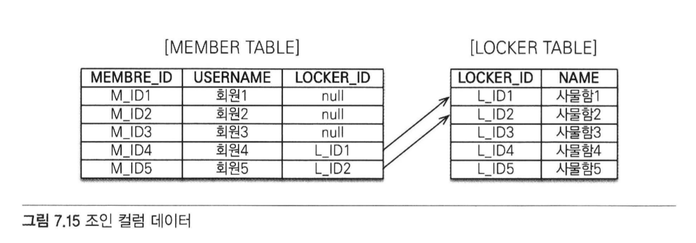
- 회원과 사물함이 있는데 각각 테이블에 데이터를 등록했다가 회원이 원할 때 사물함을 선택할 수 있다고 가정
    - 회원이 사물함을 사용하기 전까지는 아직 둘 사이에 관계가 없기 때문에 MEMBER 테이블의 LOCKER_ID 외래 키에 null을 입력해두어야 함.
    - 💡 이렇게 외래 키에 null을 허용하는 관계를 선택적 비식별 관계라 함.
    - 회원과 사물함을 조인할 때 외부 조인(OUTER JOIN)을 사용해야 함.
        - 실수로 내부 조인을 사용하면 사물함과 관계가 없는 회원은 조회되지 않음.
        - 회원과 사물함이 아주 가끔 관계를 맺는다면 외래 키 값 대부분이 null로 저장되는 단점이 있다.

### 조인 테이블 사용

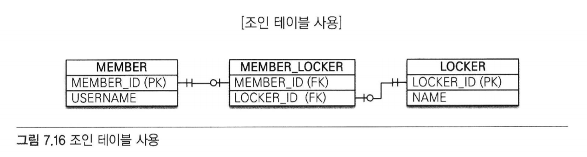
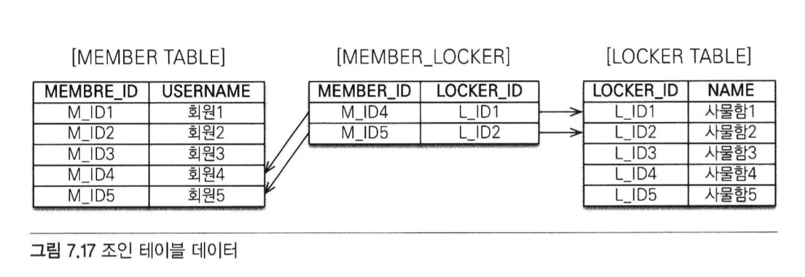

- 조인 테이블이라는 별도의 테이블을 사용해서 연관관계를 관리함.
- 조인 컬럼을 사용하는 방법은 단순히 외래 키 컬럼만 추가해서 연관관계를 맺지만
- 조인 테이블을 사용하는 방법은 연관 관계를 관리하는 조인 테이블을 추가하고 여기서 두 테이블의
  외래 키를 사지고 연관관계를 관리함.
    - 따라서 MEMBER와 LOCKER에는 연관관계를 관리하기 위한 외래 키 컬럼이 없음.

- 조인 테이블의 가장 큰 단점
    - 테이블을 하나 추가해야 한다는 점
        - 관리해야 하는 테이블이 늘어나고 두 테이블을 조인하려면 MEMBER_LOCKER 테이블까지 추가로 조인해야 함.

- 👉 따라서 기본은 조인 컬럼을 사용하고 필요하다고 판단되면 조인 테이블을 사용하자!

### 7.4.1 일대일 조인 테이블
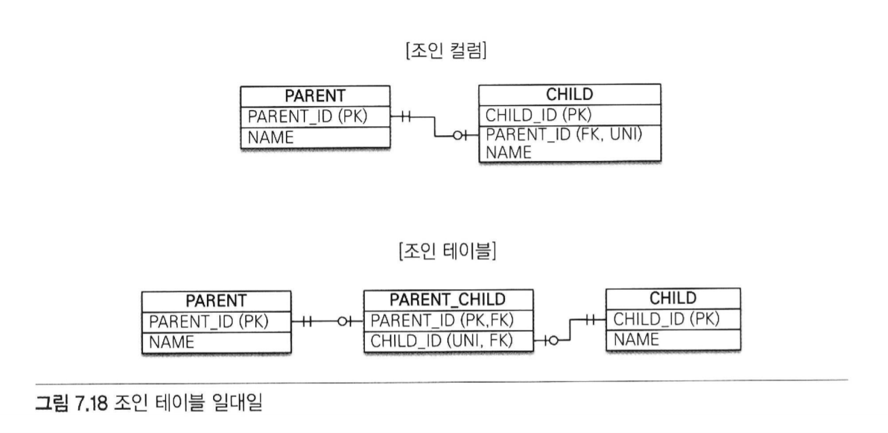
- 일대일 관계를 만들려면 조인 테이블의 외래 키 컬럼 각각에 총 2개의 유니크 제약조건을 걸어야 함.
    - (PERENT_ID는 기본 키이므로 유니크 제약조건이 걸려 있다.)

```java
//부모
    @Entity
    public class Parent {
        
        @Id @GeneratedValue
        @Column(name = "PARENT_ID")
        private Long id;
        private String name;
        
        @OneToOne
        @JoinTable(name = "PARENT_CHILD",
                joinColumns = @JoinColumn(name = "PARENT_ID"),
                inverseJoinColumns = @JoinColumn(name = "CHILD_ID"))   
        private Child child;
    }
    
    //자식
    @Entity
    public class Child {
        
        @Id @GeneratedValue
        @Column(name = "CHILD_ID")
        private Long id;
        private String name;
    }
```
- 부모 엔티티를 보면 @JoinColumn 대신에 @JoinTable을 사용했다.
- @JoinTable의 속성
    - name : 매핑할 조인 테이블 이름
    - joinColumns : 현재 엔티티를 참조하는 외래 키
    - inverseJoinColumns : 반대방향 엔티티를 참조하는 외래 키


- 양방향으로 매핑하려면 다음 코드를 추가하면 됨
```java
public class Child {
    ...
    @OneToOne(mappedBy="child")
    private Parent parent;
}
```

### 7.4.2 일대다 조인 테이블
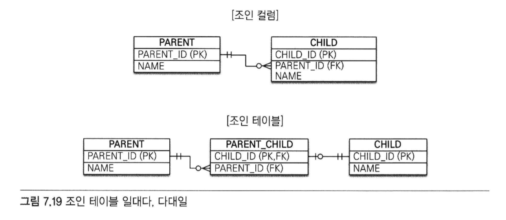

- 일대다 관계를 만들려면 조인 테이블의 컬럼 중 다(N)와 관련된 컬럼인 CHILD_ID에 유니크 제약을 걸어야 함
    - (CHILD_ID는 기본 키이므로 유니크 제약조건이 걸려 있음)

```java
    //부모
    @Entity
    public class Parent {
        
        @Id @GeneratedValue
        @Column(name = "PARENT_ID")
        private Long id;
        private String name;
        
        @OneToMany
        @JoinTable(name = "PARENT_CHILD",
                joinColumns = @JoinColumn(name = "PARENT_ID"),
                inverseJoinColumns = @JoinColumn(name = "CHILD_ID"))
        private List<Child> child = new ArrayList<Child>();
    }
    
    //자식
    @Entity
    public class Child {
        
        @Id @GeneratedValue
        @Column(name = "CHILD_ID")
        private Long id;
        private String name;
    }
```
### 7.4.3 다대일 조인 테이블
- 다대다 관계를 만들려면 조인 테이블의 두 컬럼을 합해서 하나의 복합 유니크 제약조건을 걸어야 함
    - (PARENT_ID, CHILD_ID는 복합 기본 키이므로 유니크 제약조건이 걸려있음)

```java
    //부모
    @Entity
    public class Parent {
        
        @Id @GeneratedValue
        @Column(name = "PARENT_ID")
        private Long id;
        private String name;
        
        @OneToMany(mappedBy = "parent")
        private List<Child> child = new ArrayList<Child>();
    }
    
    //자식
    @Entity
    public class Child {
        
        @Id @GeneratedValue
        @Column(name = "CHILD_ID")
        private Long id;
        private String name;
        
        @ManyToOne(optional = false)
        @JoinTable(name = "PARENT_CHILD",
                joinColumns = @JoinColumn(name = "CHILD_ID"),
                inverseJoinColumns = @JoinColumn(name = "PARENT_ID"))
        private Parent parent;
    }
```
- 참고) 조인 테이블에 컬럼을 추가하면 @JoinTable 전략을 사용할 수 없음
    - 새로운 엔티티를 만들어서 조인 테이블과 매핑해야 한다.


## 7.5 엔티티 하나에 여러 테이블 매핑
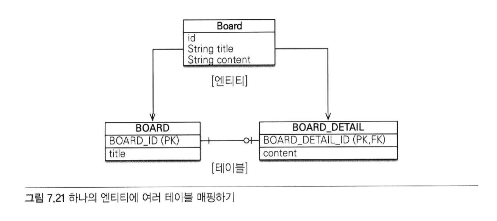

- @SecondaryTable을 사용하면 한 엔티티에 여러 테이블을 매핑할 수 있다.
```java
    @Entity
    @Table(name = "BOARD")
    @SecondaryTable(name = "BOARD_DETAIL",
        pkJoinColumns = @PrimaryKeyJoinColumn(name = "BOARD_DETAIL_ID"))
    public class Board {

        @Id @GeneratedValue
        @Column(name = "BOARD_ID")
        private Long id;

        private String title;

        @Column(table = "BOARD_DETAIL")
        private String content;
    }
```
- Board 엔티티는 @Table을 사용해서 BOARD 테이블과 매핑함
- 그리고 @SecondaryTable을 사용해서 BOARD_DETAIL 테이블을 추가로 매핑함


- @SecondaryTable 속성
    - @SecondaryTable.name
        - 매핑할 다른 테이블의 이름.
        - 예제에서는 테이블명을 BOARD_DETAIL로 지정했다.
    - @SecondaryTable.pkJoinColumns
        - 매핑할 다른 테이블의 기본 키 컬럼 속성
        - 예제에서는 기본 키 컬럼명을 BOARD_DETAIL_ID로 지정했다.
    - content 필드는 @Column(table = "BOARD_DETAIL")을 사용해서 BOARD_DETAIL 테이블의 컬럼에 매핑함.


- @SecondaryTables
    - 더 많은 테이블을 매핑할때 사용

```java
@SecondaryTables({
    @SecondaryTable(name="BOARD_DETAIL"),
    @SecondaryTable(name="BOARD_FILE")
        
})
```

- 참고) @SecondaryTable을 사용해서 두 테이블을 하나의 엔티티에 매핑하는 방법보다는 테이블당 엔티티를 각각 만들어 일대일 매핑하는 것을 권장함.
- 위 방법은 항상 두 테이블을 조회하므로 최적화하기 어려움.
- 반면에 일대일 매핑은 원하는 부분만 조회할 수 있고 필요하면 둘을 함께 조회하면 된다.
