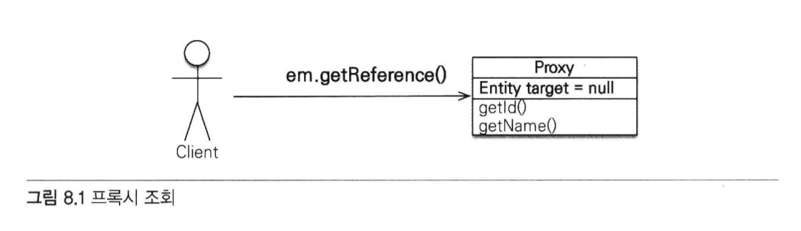
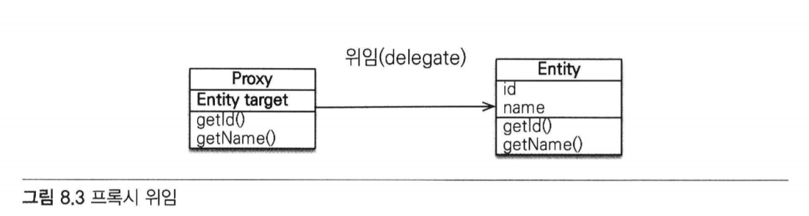
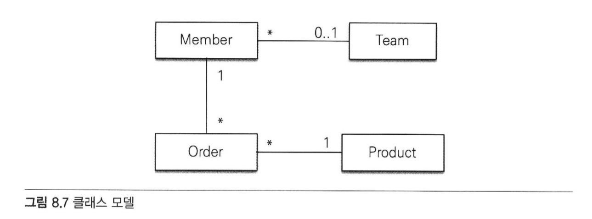
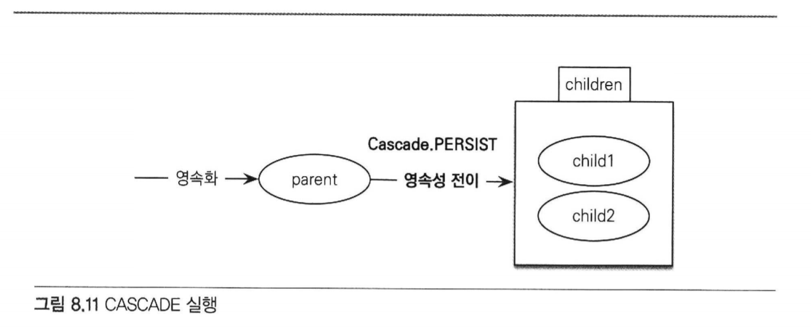

## 목차
- [08 프록시와 연관관계 관리](#08-프록시와-연관관계-관리)
    - 8.1 [프록시](#81-프록시)
        - 8.1.1 [프록시 기초](#811-프록시-기초)
        - 8.1.2 [프록시와 식별자](#812-프록시와-식별자)
        - 8.1.3 [프록시 확인](#813-프록시-확인)
    - 8.2 [즉시 로딩과 지연 로딩](#82-즉시-로딩과-지연-로딩)
        - 8.2.1 [즉시 로딩(EAGER LOADING)](#821-즉시-로딩eager-loading)
        - 8.2.2 [지연 로딩](#822-지연-로딩)
        - 8.2.3 [즉시 로딩, 지연 로딩 정리](#823-즉시-로딩,-지연-로딩-정리)
    - 8.3 [지연 로딩 활용](#83-지연-로딩-활용)
        - 8.3.1 [프록시와 컬렉션 래퍼](#831-프록시와-컬렉션-래퍼)
        - 8.3.2 [JPA 기본 페치 전략](#832-JPA-기본-페치-전략)
        - 8.3.3 [컬렉션에 FetchType.EAGER 사용 시 주의점](833-컬렉션에-fetchtypeeager-사용-시-주의점)
    - 8.4 [영속성 전이: CASCADE](#84-영속성-전이-cascade)
        - 8.4.1 [영속성 전이: 저장](#841-영속성-전이-저장)
        - 8.4.2 [영속성 전이: 삭제](#842-영속성-전이-삭제)
        - 8.4.3 [CASECADE의 종류](#843-CASECADE의-종류)
    - 8.5 [고아 객체](#85-고아-객체)
    - 8.6 [영속성 전이 + 고아 객체, 생명주기](#86-영속성-전이--고아-객체-생명주기)
    - 8.7 [정리](#87-정리)


# 08. 프록시와 연관관계 관리
- 프록시와 즉시로딩, 지연로딩
    - 객체 -> 객체 그래프로 연관된 객체 탐색
    - but, 객체는 데이터베이스에 저장되어 있기 때문에 탐색이 자유롭지 못함
        - JPA 구현체들은 이 문제를 해결하기 위해 프록시라는 기술을 사용함
    - 프록시를 사용하면?
        - 연관된 객체를 처음부터 데이터베이스에서 조회하는 것이 아닌,
        - 실제 사용하는 시점에 데이터베이스에서 조회할 수 있음
    - but, 자주 함께 사용하는 객체들은 조인을 사용해서 함께 조회하는 것이 효과적
        - JPA는 즉시 로딩과 지연 로딩이라는 방법으로 둘을 모두 지원함.

- 영속성 전이와 고아 객체
    - 영속성 전이
        - 연관된 객체를 함께 저장하거나 함께 삭제할 수 있음
    - 고아 객체 제거

## 8.1 프록시
- 지연로딩
    - 엔티티가 실제 사용될 때까지 데이터베이스 조회를 지연하는 방법

#### 회원과 팀 정보를 출력하는 비즈니스 로직
```java
public void printUserAndTeam(String memberId) {
    Member member = em.find(Member.class, memberId);
    Team team = member.getTeam();
    System.out.println("회원이름: "+member.getUsername());
    System.out.println("소속팀: "+team.getName());
}
```

#### 회원 정보만 출력하는 비즈니스 로직
```java
public String printUser(String memberId) {
    Member member = em.find(Member.class, memberId);
    System.out.println("회원 이름: "+member.getUsername());
}
```

- 첫번째 로직은 memberId로 회원 엔티티를 찾아서 회원은 물론이고,
  회원과 연관된 팀의 이름도 출력함.

- 반면, 두번째 로직은 회원 엔티티만 출력하고 회원과 관련된 팀 엔티티는 사용하지 않음
    - 회원 엔티티만 사용하기 때문에 em.find()로 회원 엔티티를 조회할 때
      회원과 연관된 팀 엔티티까지 데이터베이스에서 함께 조회해 두는 것은 효율적이지 않다.

- 이런 문제점을 해결하기 위해 등장한 것이 '지연로딩'
    - team.getName()처럼 팀 엔티티의 값을 실제 사용하는 시점에 데이터베이스에서
      팀 엔티티에 필요한 데이터를 조회하는 것.

- 지연 로딩 기능을 하기 위해서는 실제 엔티티 객체 대신 데이터베이스 조회를 지연할 수 있는 가짜 객체가 필요하다
    - 이것이 '프록시' 객체라 함.

### 8.1.1 프록시 기초
- JPA에서 식별자로 엔티티 하나를 조회할 때는 EntityManager.find()를 사용함
    - 이 메소드는 영속성 컨텍스트에 엔티티가 없으면 데이터베이스를 조회한다.
    - 이와같이 엔티티를 직접 조회하면 조회한 엔티티의 사용유무에 상관없이 데이터베이스를 조회하게 됨.

- 엔티티를 실제 사용하는 시점까지 데이터베이스 조회를 미루고 싶다면?
    - EntityManager.getReference() 메소드를 사용하면 된다.



- 해당 메소드를 호출할 때 JPA는 데이터베이스를 조회하지 않고 실제 엔티티 객체도 생성하지 않음.
- 대신 데이터베이스 접근을 위임한 프록시 객체를 반환한다.

### 프록시 특징
- 프록시 클래스는 실제 클래스를 상속 받아서 만들어지므로 실제 클래스와 겉 모양이 같음.
- 따라서 사용하는 입장에서는 이것이 진짜 객체인지, 프록시 객체인지 구분하지 않고 사용하면 됨.



- 사진처럼 실제 객체에 대한 참조(target)을 보관함.
- 프록시 객체의 메소드를 호출하면 프록시 객체는 실제 객체의 메소드를 호출함

### 프록시 객체의 초기화
- member.getName()과 같이 실제 사용될 떄 데이터베이스를 조회해서 실제 엔티티 객체를 생성하는 것.

#### 프록시 초기화 예제
```java
//MemberProxy 반환
Member member = em.getReference(Member.class, "id1");
member.getName(); //1. getName()
```

#### 프록시 클래스 예상 코드
```java
class MemberProxy extends Member {
    
    Member target = null; //실제 엔티티 참조
    
  public String getName() {
      if (target == null) {
          
          //2. 초기화 요청
          //3. DB 조회
          //4. 실제 엔티티 생성 및 참조 보관
          this.target = ...;
      }
      
      //5. target.getName();
      return target.getName();
  }
}
```


1. 프록시 객체에 member.getName()을 호출해서 실제 데이터를 조회
2. 프록시 객체는 실제 엔티티가 생성되어 있지 않으면 영속성 컨텍스트에 실제 엔티티 생성을 요청함 => 초기화
3. 영속성 컨텍스트는 데이터베이스를 조회해서 실제 엔티티 객체 생성
4. 프록시 객체는 생성된 실제 엔티티 객체의 참조를 Member target 멤버변수에 보관함
5. 프록시 객체는 실제 엔티티 객체의 getName()을 호출해서 결과를 반환함

#### 프록시 특징
- 프록시 객체는 처음 사용할 때 한 번만 초기화됨
- 프록시 객체를 초기화한다고 프록시 객체가 실제 엔티티로 바뀌는 것은 아님
    - 프록시 객체가 초기화되면, 프록시 객체를 통해 실제 엔티티에 접근할 수 있음

- 프록시 객체는 원본 엔티티를 상속받은 객체이므로 타입 체크 시에 주의해서 사용
- 영속성 컨텍스트에 찾는 엔티티가 이미 있으면 데이터베이스를 조회할 필요가 없다.
    - 따라서 em.getReference()를 호출해도 프록시가 아닌 실제 엔티티를 반환함

- 초기화는 영속성 컨텍스트의 도움을 받아야 가능함.
    - 따라서 영속성 컨텍스트의 도움을 받을 수 없는 준영속 상태의 프록시를 초기화하면 문제가 발생함.
    - 하이버네이트는 org.hibernate.LazyIntializationException 예외 발생

### 8.1.2 프록시와 식별자
- 엔티티를 프록시로 조회 -> 식별자(PK)값을 파라미터로 전달 -> 프록시 객체 : 식별자 값 보관
```java
Team team = em.getReference(Team.class, "team1") //식별자 보관
team.getId(); //초기화되지 않음
```
- 프록시 객체는 식별자 값을 가지고 있으므로 식별자 값을 조회하는 team.getId()를 호출해도
  프록시를 초기화하지 않음.
    - 단 엔티티 접근 방식을 프로퍼티로 설정한 경우에만 초기화하지 않음
        - @Access(AccessType.PROPERTY)
    - 엔티티 접근방식을 필드로 설정하면 JPA는 getId()메소드가 id만 조회하는 메소드인지,
      다른 필드까지 활용해서 어떤 일을 하는 메소드인지 알지 못하므로 프록시 객체를 초기화함
        - @Access(AccessType.FIELD)


- 프록시는 연관관계를 설정할 때 유용하게 사용할 수 있음
```java
Member member = em.find(Member.class, "member1");
Team team = em.getReference(Team.class, "team1") //SQL은 실행하지 않음
member.setTeam(team);
```
- 연관관계를 설정할 떄는 식별자 값만 사용함
    - 프록시를 사용하면 데이터베이스 접근 횟수를 줄일 수 있음.
    - 참고로 연관관계를 설정할 때는 엔티티 접근 방식을 필드로 설정해도 프록시를 초기화하지 않음.

### 8.1.3 프록시 확인
- JPA가 제공하는 PersistenceUnitUtil.isLoaded(Object entity) 메소드
    - 아직 초기화되지 않은 프록시 인스턴스 => false
    - 이미 초기화되었거나 프록시 인스턴스가 아니면 => true 반환

- 조회한 엔티티가 진짜 엔티티인지 프록시로 조회한 것인지 확인하려면?
    - 클래스명을 직접 출력해보면 됨.

```java
System.out.println("memberProxy = " + member.getclass().getName());
//결과: memberProxy = jpabook.domain.Member_$$_javassist_0
```

- ...javassist... -> 프록시인 것을 확인할 수 있음

## 8.2 즉시 로딩과 지연 로딩
- 프록시 객체는 주로 연관된 엔티티를 지연 로딩할 때 사용함.
- member1이 team1에 소속해 있다고 가정
```java
Member member = em.find(Member.class, "member1");
Team team = member.getTeam(); //객체 그래프 탐색
System.out.println(team.getName()); //팀 엔티티 사용
```

- 회원 엔티티 조회 시 연관된 팀 엔티티도 함께 데이터베이스에서 조회??
- 회원 엔티티 조회 시 회원 엔티티만 조회해 두고 팀 엔티티는 실제 사용하는 시점에 조회??

#### 조회 시점 선택 방법
- 즉시 로딩
    - 엔티티를 조회할 때 연관된 엔티티도 함께 조회함
    - 예) em.find(Member.class, "member1")를 호출할 때 회원 엔티티와 연관된 팀 엔티티도 함께 조회
    - 설정 방법: @ManyToOne(fetch = FetchType.EAGER)

- 지연 로딩
    - 연관된 엔티티를 실제 사용할 떄 조회
    - 예) member.getTeam().getName() 처럼 조회한 팀 엔티티를 실제 사용하는 시점에 JPA가 SQL을 호출하여 팀 엔티티 조회
    - 설정 방법: @ManyToOne(fetch = FetchType.LAZY)

### 8.2.1 즉시 로딩(EAGER LOADING)
- @ManyToOne의 fetch 속성을 FetchType.EAGER로 지정
```java
@Entity
public class Member {
  ...
  @ManyToOne(fetch = FetchType.EAGER)
  @JoinColumn(name = "TEAM_ID")
  private Team team;
  ...
}
```
- 회원을 조회하는 순간 팀도 함께 조회
    - 회원과 팀 두 테이블을 조회해야 하므로 쿼리를 2번 실행할 것 같지만?
        - 대부분 JPA 구현체는 즉시 로딩을 최적화하기 위해 가능하면 조인 쿼리를 사용함

```h2
SELECT 
    M.MEMBER_ID AS MEMBER_ID,
    M.TEAM_ID AS TEAM_ID,
    M.USERNAME AS USERNAME,
    T.TEAM_ID AS TEAM_ID,
    T.NAME AS NAME
FROM
    MEMBER M LEFT OUTER JOIN TEAM T 
        ON M.TEAM_ID=T.TEAM_ID
WHERE
    M.MEMBER_ID='member1'
```
- 쿼리 한 번으로 조회한 것을 알 수 있음
- 이후 member.getTeam()을 호출하면 이미 로딩된 팀1 엔티티를 반환한다.

### NULL 제약조건과 JPA 조인 전략
- 왜 SQL에서 내부조인(INNER JOIN)이 아닌 외부 조인(LEFT OUTER JOIN)을 사용했을까?
    - 현재 회원 테이블에 TEAM_ID 외래 키는 NULL을 허용하고 있음
        - 따라서 팀에 소속되지 않은 회원이 있을 가능성이 있다.
        - 팀에 소속하지 않은 회원과 팀을 내부 조인하면 팀은 물론, 회원 데이터도 조회할 수 없음

- JPA는 이러한 상황을 고려하여 외부 조인을 사용함
- 📌 하지만 외부 조인보다 내부 조인이 성능과 최적화에서 더 유리함


- 내부 조인을 하기 위해선?
    - 외래 키에 NOT NULL 제약 조건 설정하면 값이 있는 것을 보장.
    - 따라서 이땐 내부 조인만 사용해도 됨
    - JPA에게도 이런 사실을 알려야 함
        - @JoinColumn에 nullable = false을 설정
            - 이 외래 키는 NULL 값을 허용하지 않음

```java
    @Entity
    public class Member {
        ...
        @ManyToOne(fetch = FetchType.EAGER)
        @JoinColumn(name = "TEAM_ID", nullable = false)
        private Team team;
        ...
    }
```

#### nullable 설정에 따른 조인 전략
- @JoinColumn(nullable = true): NULL 허용(기본값), 외부 조인 사용
- @JoinColumn(nullable = false): NULL 허용하지 않음, 내부 조인 사용


- @ManyToOne.optional = false : 내부 조인 사용
```java
    @Entity
    public class Member {
        ...
        @ManyToOne(fetch = FetchType.EAGER, optional = false)
        @JoinColumn(name = "TEAM_ID")
        private Team team;
        ...
    }
```


### 8.2.2 지연 로딩
- 지연 로딩(LAZY LOADING)을 사용하려면 @ManyToOne의 fetch 속성을 FetchType.LAZY로 지정
#### 지연 로딩 설정
```java
    @Entity
    public class Member {
        @ManyToOne(fetch = FetchType.LAZY)
        @JoinColumn(name = "TEAM_ID")
        private Team team;
    }
```
#### 지연 로딩 실행 코드
```java
Member member = em.find(Member.class, "member1");
Team team = member.getTeam();   //객체 그래프 탐색
team.getName(); //팀 객체 실제 사용
```
- 회원과 팀을 지연 로딩으로 설정함
- em.find(Member.class, "member1")을 호출하면 회원만 조회하고 팀은 조회하지 않음
- team 멤버변수에 프록시 객체를 넣어둠.
- 프록시 객체는 실제 사용될 때까지 데이터 로딩을 미룬다.
- 실제 데이터가 필요한 순간이 되어서야 데이터베이스를 조회해서 프록시 객체를 초기화함.

```h2
SELECT * FROM MEMEBR
WHERE MEMBER_ID = 'member1'
```
- ㄴ em.find(Member.class, "member1") 호출 시 실행되는 SQL

```h2
SELECT * FROM TEAM
WHERE TEAM_ID = 'team1'
```
- ㄴ team.getName() 호출로 프록시 객체가 초기화되면서 실행되는 SQL
> 조회 대상이 영속성 컨텍스트에 이미 있으면 프록시 객체를 사용할 이유가 없음
> 따라서 프록시가 아닌 실제 객체를 사용한다.

### 8.2.3 즉시 로딩, 지연 로딩 정리
- 처음부터 연관된 엔티티를 모두 영속성 컨텍스트에 올려두는 것은 현실적이지 않음
- 필요할 때마다 SQL을 실행해서 연관된 엔티티를 지연 로딩하는 것도 최적화 관점에서 보면 꼭 좋은 것만은 아님


- 예를 들어 대부분의 애플리케이션 로직에서 회원과 팀 엔티티를 같이 사용한다면?
    - SQL 조인을 사용하여 회원과 팀 엔티티를 한번에 조회하는 것이 더 효율적


### 정리
- 지연 로딩(LAZY)
    - 연관된 엔티티를 프록시로 조회
    - 프록시를 실제 사용할 때 초기화하면서 데이터베이스 조회

- 즉시 로딩(EAGER)
    - 연관된 엔티티를 즉시 조회
    - 하이버네이트는 가능하면 SQL 조인을 사용해서 한 번에 조회함


## 8.3 지연 로딩 활용
- 사내 주문 관리 시스템 개발 예시



- 회원은 팀 하나에만 소속할 수 있다. (N:1)
- 회원은 여러 주문내역을 가진다. (1:N)
- 주문내역은 상품정보를 가진다. (N:1)

#### 애플리케이션 로직 분석
- Member와 연관된 Team은 자주 함께 사용되었다.
    - 즉시 로딩

- Member와 연관된 Order는 가끔 사용되었다.
    - 지연 로딩

- Order와 연관된 Product는 자주 함께 사용되었다.
    - 즉시 로딩

### 8.3.1 프록시와 컬렉션 래퍼
- 하이버네이트는 엔티티를 영속 상태로 만들 때 엔티티에 컬렉션이 있으면
    - 컬렉션 추적, 관리의 목적으로 원본 컬렉션을 하이버네이트가 제공하는 내장 컬렉션으로 변경함.

> 이 과정을 컬렉션 래퍼라 한다.

- 엔티티를 지연 로딩하면 프록시 객체를 사용해서 지연 로딩을 수행.
    - 주문 내역 같은 컬렉션은 래퍼가 지연 로딩을 처리해줌.
    - 컬렉션 래퍼도 컬렉션에 대한 프록시 역할.

- 참고) member.getOrders()를 호출해도 컬렉션은 초기화 안됨
    - member.getOrder().get(0)처럼 컬렉션에서 실제 데이터를 조회할 때 데이터베이스를 조회해서 초기화함.


### 8.3.2 JPA 기본 페치 전략
- fetch 속성의 기본 설정값
    - @ManyToOne, @OneToOne
        - 즉시 로딩(FetchType.EAGER)
    - @OneToMany, @ManyToMany
        - 지연 로딩(FetchType.LAZY)

- JPA의 기본 페치 전략은 연관된 엔티티가 하나면 즉시 로딩,
- 컬렉션이면 지연 로딩을 사용함
    - 컬렉션을 로딩하는 것은 비용이 많이 들고 잘못하면 너무 많은 데이터를 로딩할 수 있기 떄문


- 추천하는 방법 > 모든 연관관계에 지연 로딩을 사용하는 것
    - 그리고 애플리케이션 개발이 어느 정도 완료단계에 왔을 때 실제 사용하는 상황을 보고
    - 꼭 필요한 곳에만 즉시 로딩을 사용하도록 최적화하면 됨.

### 8.3.3 컬렉션에 FetchType.EAGER 사용 시 주의점
- 컬렉션을 하나 이상 즉시 로딩하는 것은 권장하지 않는다.
- 컬렉션 즉시 로딩은 항상 외부 조인을 사용한다.

#### FetchType.EAGER 설정과 조인 전략 정리
- @ManyToOne, @OneToOne
    - (optional = false): 내부 조인
    - (optional = true): 외부 조인

- @OneToMany, @ManyToMany
    - (optional = false): 외부 조인
    - (optional = true): 외부 조인

## 8.4 영속성 전이: CASCADE
- 특정 엔티티를 영속 상태로 만들 때 연관된 엔티티도 함께 영속 상태로 만들고 싶을때 사용
- 부모 엔티티를 저장할 때 자식 엔티티도 함께 저장

### 8.4.1 영속성 전이: 저장
```java
    @Entity
    public class Parent {
        ...
        @OneToMany(mappedBy = "parent", cascade = CascadeType.PERSIST)
        private List<Child> children = new ArrayList<Child>();
        ...
    }
```
- 부모를 영속화할 때 연관된 자식들도 함께 영속화하라고 cascade = CasecadeType.PERSIST 옵션을 설정함

#### CASCADE 옵션 적용 전
```java
//부모 저장
Parent parent = new Parent();
em.persist(parent);

//1번 자식 저장
Child child1 = new Child();
child1.setParent(parent); //자식 -> 부모 연관관계 설정
parent.getChildren().add(child1);   //부모 -> 자식
em.persist(child1);

//2번 자식 저장
Child child2 = new Child();
child2.setParent(parent); //자식 -> 부모 연관관계 설정
parent.getChildren().add(child2); //부모 -> 자식
em.persist(child2);
```

### CASECADE 옵선 적용
```java
Child child1 = new Child();
Child child2 = new Child();

Parent parent = new Parent();
child1.setParent(parent);   //연관관계 추가
child2.setParent(parent);   //연관관계 추가
parent.getChildren().add(chidl1);
parent.getCHildren().add(child2);

//부모 저장, 연관된 자식들 저장
em.persist(parent);
```

- 부모만 영속화하면 CasecadeType.PERSIST로 설정한 자식 엔티티까지 함께 영속화해서 저장함
- 영속성 전이는 연관관계를 매핑하는 것과는 아무 관련이 없음
    - 단지 엔티티를 영속화할 때 연관된 엔티티도 같이 영속화하는 편리함을 제공하는 것 뿐.
    - 그래서 예제코드를 보면 양방향 연관관계를 추가한 다음 영속 상태로 만든 것을 확인할 수 있다.


### 8.4.2 영속성 전이: 삭제

- CasecadeType.REMOVE로 설정하고 다음 코드처럼 부모 엔티티만 삭제하면 연관된 자식 엔티티도 함께 삭제됨.

```java
Parent findParent = em.find(Parent.class, 1L);
em.remove(findParent);
```
- 코드 실행 시 DELETE SQL을 child 수 만큼 실행.
- 부모는 물론 연관된 자식도 모두 삭제
- 삭제 순서는 자식이 먼저 삭제되고 부모 삭제
- 영속성 전이 미설정시?
    - 외래 키 제약조건으로 인해 데이터베이스에서 외래키 무결성 예외가 발생함

### 8.4.3 CASECADE의 종류
```java
public enum CascadeType {
    ALL,     //모두 적용
    PERSIST, //영속
    MERGE,   //병합
    REMOVE,  //삭제
    REFRESH, //REFRESH
    DETACH   //DETACH
}
```
- 여러 속성을 같이 사용할 수 있다
```java
casecade = {CascadeType.PERSIST, CasecadeType.REMOVE}
```
- 참고) 두 속성은 em.persist(), em.remove()를 실행할 때 바로 전이가 발생하지 않고
  플러시를 호출할 때 전이가 발생한다.

## 8.5 고아 객체
> 부모 엔티티와 연관관계가 끊어진 자식 엔티티를 자동으로 삭제하는 기능
- 부모 엔티티의 컬렉션에서 자식 엔티티의 참조만 제거하면 자식 엔티티가 자동으로 삭제되도록 해보자

```java
    @Entity
    public class Parent {
        
        @Id @GeneratedValue
        private Long id;
        
        @OneToMany(mappedBy = "parent", orphanRemoval = true)
        private List<Child> children = new ArrayList<Child>();
        ...
    }
```
- 이제 컬렉션에서 제거한 엔티티는 자동으로 삭제됨
```java
Parent parent1 = em.find(Parent.class, id);
parent1.getChildren().remove(0); //자식 엔티티를 컬렉션에서 제거
```
- 사용 코드를 보면 컬렉션에서 첫 번째 자식을 제거함
- 해당 옵션으로 인해 컬렉션에서 엔티티를 제거하면 데이터베이스의 데이터도 삭제됨.
- 고아 객체 제거 기능은 영속성 컨텍스트를 플러시할 때 적용됨
    - 플러시 시점에 DELETE SQL이 실행된다.


- 모든 자식 엔티티를 제거하려면?
```java
parent1.getChildren().clear();
```
- 고아 객체 제거는 참조가 제거된 엔티티는 다른 곳에서 참조하지 않는 고아 객체로 보고 삭제하는 기능
- 이 기능은 참조하는 곳이 하나일 때만 사용해야 함.
- 특정 엔티티가 개인 소유하는 엔티티에만 이 기능을 적용
    - @OneToMany


## 8.6 영속성 전이 + 고아 객체, 생명주기
- CasecadeType.ALL + orphanRemoval = true를 동시에 사용하면?
    - 일반적으로 엔티티는 EntityManager.persist()를 통해 영속화,
    - EntityManager.remove()를 통해 제거.
        - 엔티티 스스로 생명주기를 관리한다는 의미

- 두 옵션을 모두 활성화하면 부모 엔티티를 통해 자식의 생명주기를 관리할 수 있음

### 자식 저장 시 부모에 등록만 하면 된다. (CASCADE)
```java
Parent parent = em.find(Parent.class, parentId);
parent.addChild(child1);
```

### 자식 삭제 시 부모에서 제거하면 된다. (orphanRemoval)
```java
Parent parent = em.find(Parent.class, parentId);
parent.getChildren().remove(removeObject);
```


## 8.7 정리
- JPA 구현체들은 객체 그래프를 마음껏 탐색할 수 있도록 지원하는데 이때 프록시 기술을 사용함
- 객체를 조회할 때 연관된 객체를 즉시 로딩하는 방법을 즉시 로딩,
    - 연관된 객체를 지연해서 로딩하는 방법을 지연 로딩이라 함.

- 객체를 저장하거나 삭제할 때 연관된 객체도 함께 저장하거나 삭제할 수 있음
    - 영속성 전이

- 부모 엔티티와 연관관계가 끊어진 자식 엔티티를 자동으로 삭제하려면?
    - 고아 객체 제거 기능 사용
