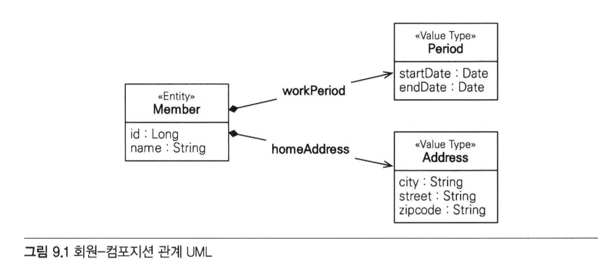
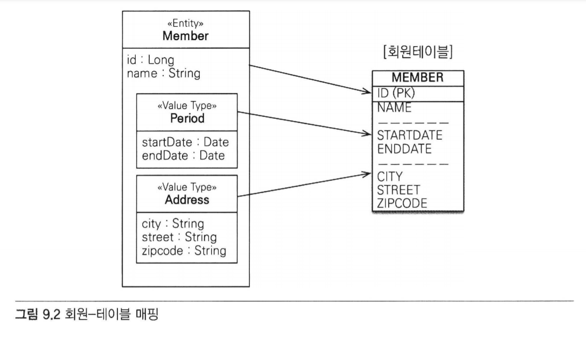
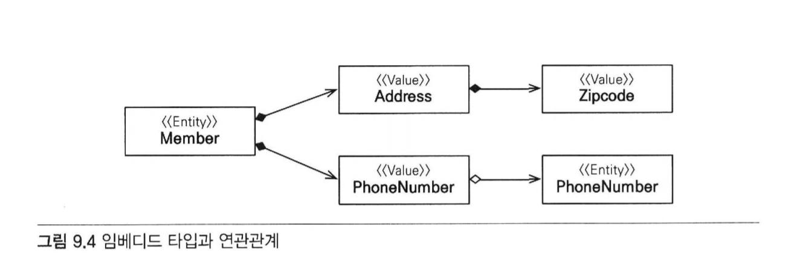
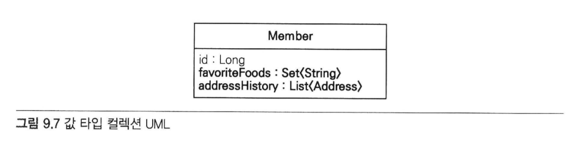
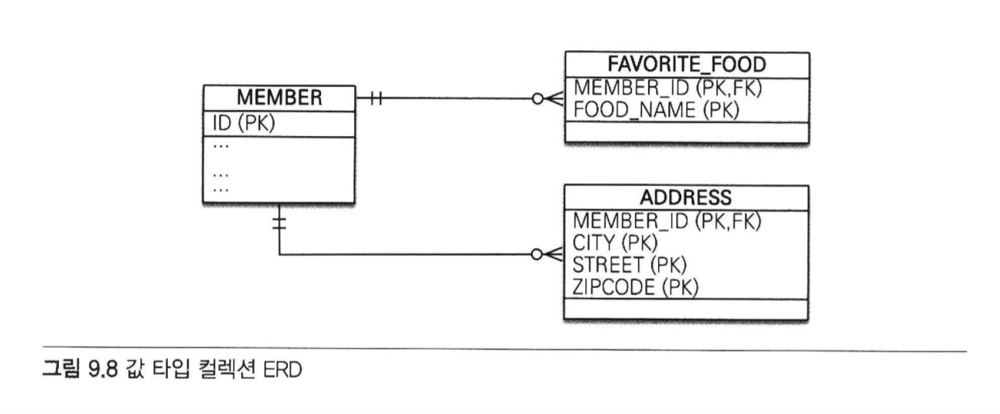

## 목차

- [09 값 타입](#09-값-타입)
    - 9.1 [기본값 타입](#91-기본값-타입9)
    - 9.2 [임베디드 타입(복합 값 타입)](#92-임베디드-타입복합-값-타입)
        - 9.2.1 [임베디드 타입과 테이블 매핑](#921-임베디드-타입과-테이블-매핑)
        - 9.2.2 [임베디드 타입과 연관관계](#922-임베디드-타입과-연관관계)
        - 9.2.3 [@AttributeOverride: 속성 재정의](#923-attributeoverride-속성-재정의)
        - 9.2.4 [임베디드 타입과 null](#923-attributeoverride-속성-재정의)
    - 9.3 [값 타입과 불변 객체](#93-값-타입과-불변-객체)
        - 9.3.1 [값 타입 공유 참조](#931-값-타입-공유-참조)
        - 9.3.2 [값 타입 복사](#932-값-타입-복사)
        - 9.3.3 [불변 객체](#933-불변-객체)
    - 9.4 [값 타입의 비교](#94-값-타입의-비교)
    - 9.5 [값 타입 컬렉션](#95-값-타입-컬렉션)
        - 9.5.1 [값 타입 컬렉션 사용](#951-값-타입-컬렉션-사용)
        - 9.5.2 [값 타입 컬렉션의 제약사항](#952-값-타입-컬렉션의-제약사항)
    - 9.6 [정리](#96-정리)

# 09. 값 타입
- JPA의 데이터 타입
    - 엔티티 타입
        - @Entity
        - 식별자로 추적 가능
    - 값 타입
        - int, Integer, String
        - 추적 불가
        - 값 타입의 종류
            - 기본 값 타입
                - 자바 기본 타입 (예: int, double)
                - 래퍼 클래스 (예: Integer)
                - String
            - 임베디드 타입 (복합 값 타입)
                - JPA에서 사용자가 직접 정의한 값 타입
            - 컬렉션 값 타입
                - 하나의 값 이상의 값 타입을 저장할 때 사용

## 9.1 기본값 타입
- String, int...
- Member 엔티티에서 Member 엔티티는 id라는 식별자 값과 생명주기가 있음
    - 값 타입인 name, age 같은 속성은 식별자 값도 없고, 생명주기도 엔티티에 의존함.
    - 따라서 회원 엔티티 인스턴스를 제거하면 name, age값도 제거됨.

- 값 타입은 공유하면 안된다.
    - 다른 회원 엔티티의 이름을 변경한다고 해서 나의 이름까지 변경되는 것은 일어날 수 없는일.

## 9.2 임베디드 타입(복합 값 타입)
- 새로운 값 타입을 직접 정의해서 사용하는 것
- 직접 정의한 임베디드 타입도 int, String처럼 값 타입.

```java
    @Entity
    public class Member {
        
        @Id @GeneratedValue
        private Long id;
        private String name;
        
        //근무 기간
        @Temporal(TemporalType.DATE) java.util.Date startDate;
        @Temporal(TemporalType.DATE) java.util.Date endDate;
        
        //집 주소 표현
        private String city;
        private String street;
        private String zipcode;
        //...
    }
```
- 위 코드는 평범한 회원 엔티티
    - 이 엔티티를 설명하라면?
        - 회원 엔티티는 이름, 근무 시작일, 근무 종료일, 주소 도시, 주소 번지, 주소 우편번호를 가진다.

- 위와 같은 설명은 단순히 정보를 풀어둔 것. 그리고 근무 시작일과 우편번호는 서로 아무 관련이 없음.
- 다음과 같이 설명하는 것이 더 명확함
> 회원 엔티티는 이름, 근무 기간, 집 주소를 가진다.

- 회원이 상세한 데이터를 그대로 가지고 있는 것은 객체지향적이지 않으며 응집력만 떨어뜨림
- 대신, 근무 기간, 주소 같은 타입이 있다면?
    - 코드가 더 명확해질 것이다.

```java
    @Entity
    public class Member {

        @Id @GeneratedValue
        private Long id;
        private String name;

        @Embedded Period workPeriod;    //근무 기간
        @Embedded Address homeAddress;  //집 주소
        
        //...
    }
    
    @Embeddable
    public class Period {
        
        @Temporal(TemporalType.DATE) java.util.Date startDate;
        @Temporal(TemporalType.DATE) java.util.Date endDate;
        
        public boolean isWork(Date date) {
            //.. 값 타입을 위한 메소드를 정의할 수 있다.
        }
    }
    
    @Embeddable
    public class Address {
        
        @Column(name = "city")  //매핑할 컬럼 정의 가능
        private String city;
        private String street;
        private String zipcode;
    }
```



- 회원 엔티티가 더욱 의미 있고 응집력 있게 변한 것을 알 수 있다.
- Period
    - startDate, endDate를 합해서 Period(기간) 클래스를 만들었다.

- Address
    - city, street, zipcode를 합해서 Address(주소) 클래스를 만들었다.

- 새로 정의한 값 타입들은 재사용할 수 있고 응집도도 아주 높음.
- Period.isWork()처럼 해당 값 타입만 사용하는 의미 있는 메소드도 만들 수 있음.

#### 임베디드 타입을 사용하기 위해 필요한 어노테이션
- @Embeddable : 값 타입을 정의하는 곳에 표시
- @Embedded : 값 타입을 사용하는 곳에 표시

- 임베디드 타입은 기본 생성자가 필수다.
- 임베디드 타입을 포함한 모든 값 타입은 엔티티의 생명주기에 의존함
    - 따라서 엔티티와 임베디드 타입의 관계를 UML로 표현하면
        - '컴포지션 관계'


### 9.2.1 임베디드 타입과 테이블 매핑

- 임베디드 타입은 엔티티의 값일 뿐임
- 따라서 값이 속한 엔티티의 테이블에 매핑함.
- 예제에서 임베디드 타입을 사용하기 전과 후에 매핑하는 테이블은 같음
- 임베디드 타입으로 인해 객체와 테이블을 아주 세밀하게 매핑하는 것이 가능함.
- 잘 설계한 ORM 애플리케이션은 매핑한 테이블의 수보다 클래스의 수가 더 많음.
- ORM을 사용하지 않고 개발하면 테이블 컬럼과 객체 필드를 대부분 1:1로 매핑함

### 9.2.2 임베디드 타입과 연관관계
- 임베디드 타입은 값 타입을 포함하거나 엔티티를 참조할 수 있다.



```java
    @Entity
    public class Member {

        @Id @GeneratedValue
        private Long id;
        private String name;

        @Embedded Address address;          //임베디드 타입 포함
        @Embedded PhoneNumber phoneNumber;  //임베디드 타입 포함

        //...
    }

    @Embeddable
    public class Address {

        private String street;
        private String city;
        private String state;
        @Embedded Zipcode zipcode;  //임베디드 타입 포함
    }
    
    @Embeddable
    public class Zipcode {
        String zip;
        String plusFour;
    }
    
    @Embeddable
    public class PhoneNumber {
        String areaCode;
        String localNumber;
        @ManyToOne PhoneServiceProvider provider;  // 엔티티 참조
    }
    
    @Entity
    public class PhoneServiceProvider {
        @Id String name;
    }
```
- 값 타입인 Address가 값 타입인 zipcode를 포함하고, 값 타입인
  PhoneNumber가 엔티티 타입인 PhoneServiceProvider를 참조함.

### 9.2.3 @AttributeOverride: 속성 재정의
- 임베디드 타입에 정의한 매핑정보를 재정의하기 위해 사용
- 회원에게 주소가 하나 더 필요하면?
```java
    @Entity
    public class Member {

        @Id @GeneratedValue
        private Long id;
        private String name;

        @Embedded Address homeAddress;
        @Embedded Address companyAddress;

        //...
    }
```
- 집 주소에 회사 주소를 하나 더 추가함
- 문제는? 테이블에 매핑하는 컬럼명이 중복된다는 점..
- 아래 예제와 같이 @AttributeOverrides를 사용하여 매핑정보를 재정의한다.
```java
@Entity
@NoArgsConstructor
@Getter
public class Member {

    @Id @GeneratedValue
    private Long id;
    private String name;

    @Embedded
    Address homeAddress;

    @Embedded
    @AttributeOverrides({
            @AttributeOverride(name = "city", column = @Column(name = "COMPANY_CITY")),
            @AttributeOverride(name = "street", column = @Column(name = "COMPANY_STREET")),
            @AttributeOverride(name = "zipcode", column = @Column(name = "COMPANY_ZIPCODE"))
    })
    Address companyAddress;
}
```
- 생성된 테이블
```h2
CREATE TABLE MEMBER {
    COMPANY_CITY varchar(255),
    COMPANY_STREET varchar(255),
    COMPANY_ZIPCODE varchar(255),
    city varchar(255),
    street varchar(255),
    zipcode varchar(255),
    ...
}
```
- @AttributeOverride를 사용하면 엔티티 코드가 지저분해짐.
- 다행히 한 엔티티에 같은 임베디드 타입을 중복해서 사용하는 일은 많지 않음.
- 참고) @AttributeOverride는 엔티티에 설정해야 한다. 임베디드 타입이 임베디드 타입을 가지고 있어도 엔티티에 설정해야 한다.

### 9.2.4 임베디드 타입과 null
- 임베디드 타입이 null이면 매핑한 컬럼 값은 모두 null이 된다.
```java
member.setAddress(null); //null 입력
em.persist(member);
```
- 회원 테이블의 주소와 관련된 CITY, STREET, ZIPCODE 컬럼 값은 모두 null이 된다.

## 9.3 값 타입과 불변 객체
- 값 타입은 복잡한 객체 세상을 조금이라도 단순화하려고 만든 개념임.
- 값 타입은 단순하고 안전하게 다룰 수 있어야 함

### 9.3.1 값 타입 공유 참조
- 임베디드 타입 같은 값 타입을 여러 엔티티에 공유하면 위험함
```java
member1.setHomeAddress(new Address("oldCity"));
Address address = member1.getHomeAddress();

address.setCity("NewCity"); //회원1의 address 값을 공유해서 사용
member2.setHomeAddress(address);
```

- 회원2에 새로운 주소를 할당하기 위해 회원1의 주소를 그대로 참조함
    - 회원2의 주소만 "NewCity"로 변경되는 것이 아니라 회원1의 주소도 "NewCity"로 변경됨
    - why?
        - 회원1과 회원2가 같은 address 인스턴스를 참조하기 때문
        - 영속성 컨텍스트는 회원1과 회원2 둘 다 city 속성이 변경된 것으로 판단함
        - 따라서 회원1, 회원2 각각 UPDATE SQL을 실행함

- 부작용
    - 뭔가를 수정했는데 전혀 예상치 못한 곳에서 문제가 발생하는 것
    - 부작용을 막기 위해선 값을 복사해서 사용하면 안됨


### 9.3.2 값 타입 복사
- 값 타입의 실제 인스턴스인 값을 공유하는 것은 위험함
- 대신 값을 복사해서 사용해야 함

```java
member1.setHomeAddress(new Address("oldCity"));
Address address = member1.getHomeAddress();

//회원1의 address 값을 복사해서 새로운 newAddress 값을 생성
Address newAddress = address.clone();

newAddress.setCity("NewCity");
member.setHomeAddress(newAddress);
```
- 회원2에 새로운 주소를 할당하기 위해 clone() 메소드를 만들었다.
- 이 메소드는 자신을 복사해서 반환하도록 구현함
    - 이렇게 되면 영속성 컨텍스트는 회원2의 주소만 변경된 것으로 판단

- 임베디드 타입처럼 직접 정의한 값 타입은 객체 타입이라는 것. (기본타입X)
    - 자바의 기본 타입
```java
int a = 10;
int b = a; //기본 타입은 항상 값을 복사한다.
b =  4;
```
- 이 코드의 최종 결과 -> a = 10, b = 4

    - 객체 타입
```java
Address a = new Address("Old");
Address b = a; //객체 타입은 항상 참조 값을 전달한다.
b.setCity("New");
```
- 부작용 발생 -> a.city값도 New로 변경
- 복사하지 않고 원본의 참조 값을 직접 넘기는 것을 막을 방법이 없음.
- 객체의 공유 참조는 피할 수 없다.
    - 근본적인 해결책 -> 객체의 값을 수정하지 못하도록
        - ex) Address 객체의 setCity() 같은 수정자 메소드를 모두 제거.
        - 공유 참조를 해도 값을 변경하지 못하기 때문에 부작용의 발생을 막을 수 있음.

### 9.3.3 불변 객체
- 객체를 불변하게 만들면 값을 수정할 수 없으므로 부작용을 원천 차단할 수 있다.
- 따라서 값 타입은 될 수 있으면 불변 객체로 설계해야 한다.
- 불변 객체의 값은 조회할 수 있지만 수정할 수 없다.
- 불변 객체를 구현하는 방법
    - 생성자로만 값을 설정하고 수정자를 만들지 않는다.
    
## 9.4 값 타입의 비교
```java
int a = 10;
int b = 10;

Address a = new Address("서울시", "종로구", "1번지");
Address b = new Address("서울시", "종로구", "1번지");
```
- int a의 숫자 10과 int b의 숫자 10은 같다고 표현함
- Address a와 Address b는 같다고 표현함


- 자바가 제공하는 객체 비교 2가지
    - 동일성(identity) 비교: 인스턴스 참조 값을 비교, == 사용
    - 동등성(Equivalence) 비교: 인스턴스 값을 비교, equals() 사용

- Address 값 타입을 a == b로 동일성 비교하면 둘은 서로 다른 인스턴스 이므로 결과는 거짓.
- 기대하는 결과는 아님.
- 값 타입은 비록 인스턴스가 달라도 그 안에 값이 같으면 같은 것으로 봐야함
    - 따라서 값 타입을 비교할 때는 a.equals(b)를 사용해서 동등성 비교를 해야함
    - 물론 Address의 equals() 메소드를 재정의해야 한다.
    - 값 타입의 equals() 메소드를 재정의할 때는 보통 모든 필드의 값을 비교하도록 구현한다.

- 참고) 자바에서 equals()를 재정의하면 hashCode()도 재정의하는 것이 안전함
- 그렇지 않으면 해시를 사용하는 컬렉션이 정상 동작하지 않음

## 9.5 값 타입 컬렉션
- 값 타입을 하나 이상 저장하려면 컬렉션에 보관하고 @ElementCollection, @CollectionTable 어노테이션을 사용.

```java
@Entity
@NoArgsConstructor
@Getter
public class Member {

    @Id @GeneratedValue
    private Long id;
    
    @Embedded
    private Address homeAddress;
    
    @ElementCollection
    @CollectionTable(name = "FAVORITE_FOODS",
        joinColumns = @JoinColumn(name = "MEMBER_ID"))
    @Column(name = "FOOD_NAME")
    private Set<String> favoriteFoods = new HashSet<String>();
    
    @ElementCollection
    @CollectionTable(name = "ADDRESS", joinColumns 
            = @JoinColumn(name = "MEMBER_ID"))
    private List<Address> addressHistory = new ArrayList<Address>();
    
    //...

}

@Embeddable
public class Address {

    @Column
    private String city;
    private String street;
    private String zipcode;
}

```




- favoriteFoods는 기본값 타입인 String을 컬렉션으로 가짐
    - 이것을 데이터베이스 테이블로 매핑해야 하는데 관계형 데이터베이스의 테이블은 컬럼안에 컬렉션을 포함할 수 없음.
    - 따라서 그림처럼 별도의 테이블을 추가하고
    - @CollectionTable을 사용하여 추가한 테이블을 매핑해야 함
    - 그리고 favoriteFoods 처럼 값으로 사용되는 컬럼이 하나면
        - @Column을 사용하여 컬럼명을 지정할 수 있음

- addressHistory는 임베디드 타입은 Address를 컬렉션으로 가짐
- 이것도 마찬가지로 별도의 테이블을 사용
    - 그리고 테이블 매핑정보는 @AttributeOverride를 사용하여 재정의할 수 있음

### 9.5.1 값 타입 컬렉션 사용
```java
Member member = new Member();

//임베디드 값 타입
member.setHomeAddress(new Address("통영", "해수욕장", "660-123"));

//기본값 타입 컬렉션
member.getFavoriteFoods().add("짬뽕");
member.getFavoriteFoods().add("짜장");
member.getFavoriteFoods().add("탕수육");

//임베디드 값 타입 컬렉션
member.getAddressHistory().add(new Address("서울", "강남", "123-123"));
member.getAddressHistory().add(new Address("서울", "강북", "123-123"));

em.persist(member);
```
- 코드를 보면 마지막에 member 엔티티만 영속화함
- JPA는 이때 member 엔티티의 값 타입도 함께 저장함.


### 실제 데이터베이스에 실행되는 INSERT SQL
- member: INSERT SQL 1번
- member.homeAddress: 컬렉션이 아닌 임베디드 값 타입이므로 회원테이블을 저장하는 SQL에 포함
- member.favoriteFoods: INSERT SQL 3번
- member.addressHistory: INSERT SQL 2번


- 따라서 em.persist(member) 한 번 호출로 6번의 INSERT SQL을 실행함.
- 값 타입 컬렉션은 영속성 전이(Cascade) + 고아 객체 제거 기능을 필수로 가진다고 볼 수 있음

- 값 타입 컬렉션도 조회할 때 페치 전략을 선택할 수 있는데 LAZY가 기본임.
```java
@ElementCollection(fetch = FetchType.LAZY)
```

- 지연 로딩으로 모두 설정했다고 가정하고 실행했을 때
```java
//SQL: SELECT ID, CITY, STREET, ZIPCODE FROM MEMBER WHERE ID = 1
Member member = em.find(Member.class, 1L); //1. member

//2. member.homeAddress
Address homeAddress = member.getHomeAddress();

//3. member.favoriteFoods
Set<String> favoriteFoods = member.getFavoriteFoods(); //LAZY

//SQL: SELECT MEMBER_ID, FOOD_NAME FROM FAVORITE_FOODS
//WHERE MEMBER_ID = 1
for (String favoriteFood : favoriteFoods) {
    System.out.println("favoriteFood = " + favoriteFood);
}

//4. member.addressHistory
List<Address> addressHistory = member.getAddressHistory(); //LAZY

//SQL: SELECT MEMBER_ID, CITY, STREET, ZIPCODE FROM ADDRESS
//WHERE MEMBER_ID = 1
addressHistory.get(0);
```
- 데이터베이스에 호출하는 SELECT SQL은 다음과 같음
1. member: 회원만 조회함. 이때 임베디드 값 타입인 homeAddress도 함께 조회
2. member.homeAddress: 1번에서 회원을 조회할 때 같이 조회해 둠
3. member.favoriteFoods: LAZY로 설정해서 실제 컬렉션을 사용할 때 호출
4. member.addressHistory: LAZY로 설정해서 실제 컬렉션을 사용할 때 호출

- 값 타입 컬렉션을 수정하면?

```java
Member member = em.find(Member.class, 1L);
        
//1. 임베디드 값 타입 수정
member.setHomeAddress(new Address("새로운도시", "신도시1", "123123"));
        
//2. 기본값 타입 컬렉션 수정
Set<String> favoriteFoods = member.getFavoriteFoods();
favoriteFoods.remove("탕수육");
favoriteFoods.add("치킨");
        
//3. 임베디드 값 타입 컬렉션 수정
List<Address> addressHistory = member.getAddressHistory();
addressHistory.remove(new Address("서울", "기존 주소", "123-123"));
addressHistory.add(new Address("새로운 도시", "새로운 주소", "123-456"));
```

1. 임베디드 값 타입 수정: homeAddress 임베디드 값 타입은 MEMBER 테이블과 매핑했으므로 MEMBER 테이블만 UPDATE함
- Member 엔티티를 수정하는 것과 같음

2. 기본값 타입 컬렉션 수정: 탕수육을 치킨으로 변경하려면 탕수육을 제거하고 치킨을 추가해야 함.
- 자바의 String 타입은 수정할 수 없음

3. 임베디드 값 타입 컬렉션 수정: 값 타입은 불변해야 함. 따라서 컬렉션에서 기존 주소를 삭제하고 새로운 주소를 등록함
- 참고로 equals, hashCode를 구현해야 함

### 9.5.2 값 타입 컬렉션의 제약사항
- 엔티티는 식별자가 있으므로 엔티티의 값을 변경해도 식별자로 데이터베이스에 저장된 원본 데이터를 쉽게 찾아 변경이 가능함.
- 반면, 값 타입은 식별자라는 개념이 없고 단순한 값들의 모임임 따라서 값을 변경해버리면 데이터베이스에 저장된 원본 데이터를 찾기가 어려움
- 이러한 문제로 JPA 구현체들은 값 타입 컬렉션에 변경 사항이 발생하면?
    - 값 타입 컬렉션이 매핑된 테이블의 연관된 모든 데이터를 삭제하고
    - 현재 값 타입 컬렉션 객체에 있는 모든 값을 데이터베이스에 다시 저장함

- 예를 들어 식별자가 100번인 회원이 관리하는 주소 값 타입 컬렉션을 변경하면
  테이블에서 회원 100번과 관련된 모든 주소 데이터를 삭제하고 현재 값 타입 컬렉션에 있는 값을 다시 저장함.

- 따라서 실무에서는 값 타입 컬렉션이 매핑된 테이블에 데이터가 많으면 값 타입 컬렉션 대신
    - '일대다 관계'를 고려해야 한다.

- 추가로 값 타입 컬렉션을 매핑하는 테이블은 모든 컬럼을 묶어서 기본 키를 구성해야 함
- 따라서 컬럼에 null을 입력할 수 없고 같은 값을 중복해서 저장할 수 없다.

### 값 타입 컬렉션을 사용하는 대신 새로운 엔티티를 만들어 일대다 관계로 설정
### 여기에 추가로 영속성 전이 + 고아 객체 제거 기능을 적용하면 값 타입 컬렉션처럼 사용할 수 있음


## 9.6 정리
- 엔티티 타입의 특징
    - 식별자(@Id)가 있다.
        - 엔티티 타입은 식별자가 있고 식별자로 구별할 수 있음
    - 생명 주기가 있다.
        - 생성하고 영속화하고 소멸하는 생명 주기가 있음
        - em.persist(entity)로 영속화함
        - em.remove(entity)로 제거함
    - 공유할 수 있다.
        - 참조 값을 공유할 수 있음. 이것을 공유 참조라 함
        - 예를 들어 회원 엔티티가 있다면 다른 엔티티에서 얼마든지 회원 엔티티를 참조할 수 있다.

- 값 타입의 특징
    - 식별자가 없다.
    - 생명 주기를 엔티티에 의존한다.
        - 스스로 생명주기를 가지고 있지 않음. 엔티티 제거 -> 같이 제거 됨
    - 공유하지 않는 것이 안전하다.
        - 값을 복사해서 사용해야 한다.
        - 오직 하나의 주인만이 관리해야 함
        - 불변 객체로 만드는 것이 안전

- 값 타입은 정말 값 타입이라 판단될 때만 사용하자.
- 엔티티와 값 타입을 혼동해서 엔티티를 값 타입으로 만들면 안됨.
- 식별자가 필요하고 지속해서 값을 추적하고 구분하고 변경해야 한다면?
    - 그것은 값 타입이 아닌 엔티티임.
