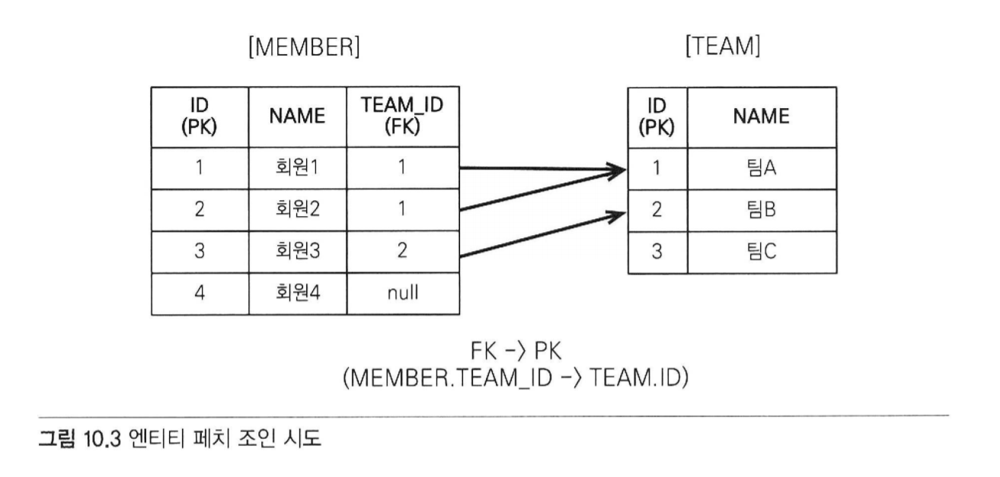
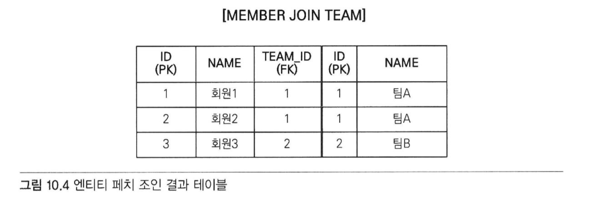
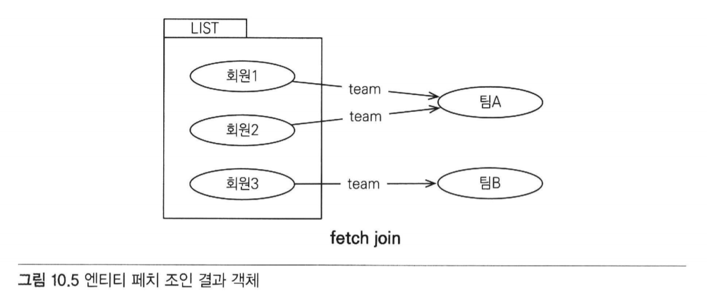
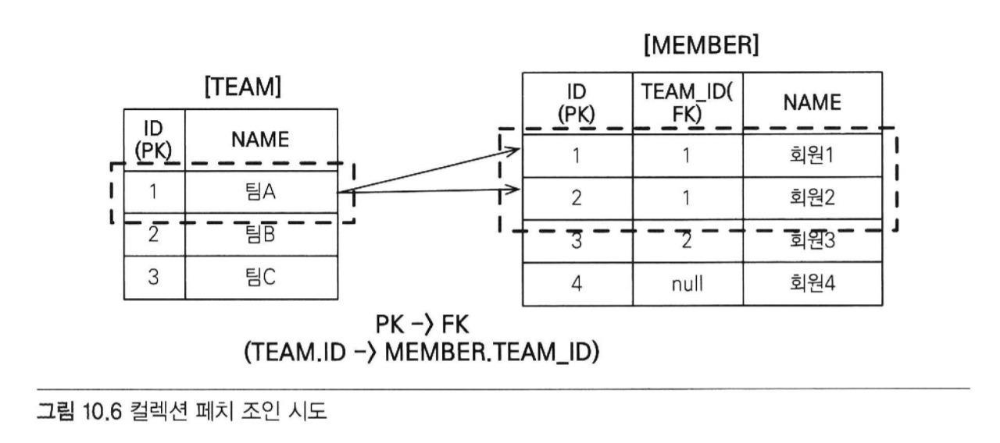
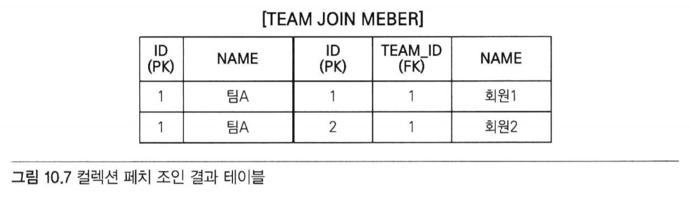
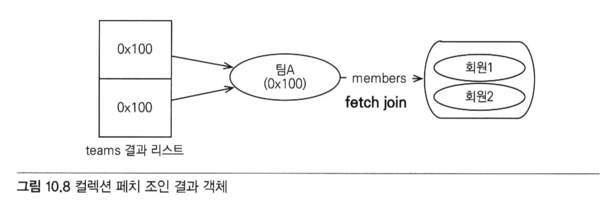
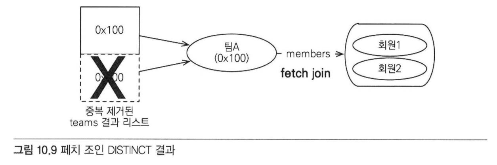

# 10 객체지향 쿼리 언어
- JPA는 복잡한 검색 조건을 사용해서 엔티티 객체를 조회할 수 있는 다양한 쿼리 기술을 지원함.
- JPQL은 가장 중요한 객체지향 쿼리 언어이다.

## 10.1 객체지향 쿼리 소개
- em.find() 메소드를 사용하면 식별자로 엔티티 하나를 조회할 수 있음
    - 이렇게 조회한 엔티티에 객체 그래프 탐색을 사용하면 -> 연관된 엔티티들을 찾을 수 있다.

- 식별자로 조회 EntityManager.find()
- 객체 그래프 탐색 a.getB(), getC()

- but, 이 기능만으로 애플리케이션을 개발하기는 어려움
    - 예를 들어 나이가 30살인 회원을 모두 검색하고 싶다면?
        - 모든 회원 엔티티를 메모리에 올려두고
        - 애플리케이션에서 30살 이상인 회원을 검색하는 것은 현실성 없음
        - 결국 -> 데이터는 데이터베이스에 있으므로 SLQ로 필요한 내용을 최대한 걸러서 조회해야 함.
    - ORM을 사용하면?
        - 데이터베이스 테이블이 아닌 엔티티 객체를 대상으로 개발.
        - 검색또한 테이블이 아닌 엔티티 객체를 대상으로 하는 방법이 필요.

- JPQL의 특징
    - 테이블이 아닌 객체를 대상으로 검색하는 객체지향 쿼리
    - SLQ을 추상화해서 특정 데이터베이스 SQL에 의존하지 않음

- SQL -> 데이터베이스 테이블을 대상으로 하는 데이터 중심의 쿼리
- JPQL -> 엔티티 객체를 대상으로 하는 객체지향 쿼리
- JPQL을 사용하면 JPA는 이 JPQL을 분석 한 다음 -> 적절한 SQL을 만들어 조회함.
    - 조회한 결과로 엔티티 갤체를 생성해서 반환.

- JPQL = "객체지향 SQL"

#### JPA가 공식 지원하는 기능
- JPQL(Java Persistence Query Language)
- Criteria 쿼리 : JPQL을 편하게 작성하도록 도와주는 API, 빌더 클래스 모음
- 네이티브 SLQ : JPA에서 JPQL 대신 직접 SQL을 사용할 수 있다.

#### JPQ가 공식 지원하는 기능은 아니지만 알아둘 가치가 있는 것들
- QueryDSL : Criteria 쿼리처럼 JPQL을 편하게 작성하도록 도와주는 빌더 클래스 모음. 비표준 오픈소스 프레임워크
- JDBC 직접 사용, MyBatis 같은 SQL 매퍼 프레임워크 사용

### 10.1.1 JPQL 소개
- JPQL은 엔티티 객체를 조회하는 객체지향 쿼리.
- 문법은 SQL과 비슷하고 ANSI 표준 SQL이 제공하는 기능을 유사하게 지원함.
- JPQL은 SQL을 추상화해서 특정 데이터베이스에 의존하지 않음
- 데이터베이스 방언만 변경하면 JPQL을 수정하지 않아도 자연스럽게 데이터베이스를 변경할 수 있음.
### JPQL은 SQL보다 간결하다!

- 회원 엔티티를 대상으로 JPQL을 사용하는 간단한 예제
```java
@Entity(name = "Member")    //name 속성의 기본값은 클래스 명
public class Memebr {
    
    @Column(name = "name")
    private String username;
    //...
}
```
- JPQL 사용
```java
//쿼리 생성
String jpql = "select m from Member as m where m.username = 'kim'";
List<Member> resultList = em.createQuery(jpql, Member.class).getResultList();
```
- 예제 코드는 회원이름이 kim인 엔티티를 조회함
- JPQL에서 Member는 엔티티 이름이다.
- m.username은 테이블 컬럼명이 아닌, 엔티티 객체의 필드명이다.
- em.createQuery() 메소드에 실행할 JPQL과 반환할 엔티티의 클래스 타입인 Member.class를 넘겨주고
  getResultList() 메소드를 실행하면 JPA는 JPQL을 SQL로 변환하여 데이터베이스를 조회함.

- 그리고 조회한 결과로 Member 엔티티를 생성하여 반환함

- 실행한 JPQL
```h2
select m 
from Member as m 
where m.username = 'kim'
```
- 실제 실행된 SQL
```h2
select
    member.id as id,
    member.age as age,
    member.team_id as team,
    member.name as name
from 
    Member member
where
    member.name='kim'
```

### 10.1.2 Criteria 쿼리 소개
- Criteria는 JPQL을 생성하는 빌더 클래스
- Criteria의 장점
    - 문자가 아닌 query.select(m).where(...)처럼 프로그래밍 코드로 JPQL을 작성할 수 있다는 점

- 문자로 작성한 JPQL보다 코드로 작성한 Criteria의 장점
- 컴파일 시점에 오류를 발견할 수 있음
- IDE를 사용하면 코드 자동완성을 지원함
- 동적 쿼리를 작성하기 편함

- 방금 본 JPQL을 Criteria로 작성하면?
```h2
select m from Member as m where m.username = 'kim'
```

- Criteria 쿼리
```h2
//Criteria 사용 준비
CriteriaBuilder cb = em.getCriteriaBuilder();
CriteriaQuery<Member> query = cb.createQuery(Member.class);

//루트 클래스(조회를 시작할 클래스)
Root<Member> m = query.from(Member.class);

//쿼리 생성
CriteriaQuery<Member> cq =
    query.select(m).where(cb.equal(m.get("username"), "kim"));
List<Member> resultList = em.createQuery(cq).getResultList();    
```
- 쿼리를 문자가 아닌 코드로 작성한 것을 확인할 수 있음.
- 아쉬운 점 -> m.get("username") -> 필드 명을 문자로 작성
    - 이 부분도 문자가 아닌 코드로 작성하고 싶다면?
        - 메타 모델을 사용!

- 메타 모델 API?
    - 자바가 제공하는 어노테이션 프로세서 기능을 사용하면 어노테이션을 분석해서 클래스를 생성할 수 있음
    - JPA는 이 기능을 사용해서 Member 엔티티 클래스로부터 Member_라는 Criteria 전용 클래스를 생성
        - 이것을 메타 모델이라 함

```java
//메타 모델 사용 전 -> 사용 후
m.get("username") -> m.get(Member_.username)
```

### 10.1.3 QueryDSL 소개
- QueryDSL도 Criteria처럼 JPQL 빌더 역할을 함
- QUeryDSL의 장점
    - 코드 기반이면서 단순하고 사용하기 쉬움
    - 작성한 코드도 JPQL과 비슷하여 한눈에 들어옴

- QueryDSL로 작성한 코드
```java
//준비
JPAQuery query = new JPAQuery(em);
QMember member = QMember.member;

//쿼리, 결과조회
List<Member> members =
    query.from(member)
    .where(member.username.eq("kim"))
    .list(member);
```

- QueryDSL도 어노테이션 프로세서를 사용해서 쿼리 전용 클래스를 만들어야 함
- QMember는 Member 엔티티 클래스를 기반으로 생성한 QueryDSL 쿼리 전용 클래스

### 10.1.4 네이티브 SQL 소개
- JPA가 제공하는 SQL을 직접 사용할 수 있는 기능
- JPQL을 사용해도 가끔은 특정 데이터베이스에 의존하는 기능을 사용해야 할 때가 있음
    - 예) 오라클 데이터베이스만 사용하는 CONNECT BY 기능
    - 특정 데이터베이스에서만 동작하는 SQL 힌트...

- 네이티브 SQL의 단점 -> 특정 데이터베이스에 의존하는 SQL을 작성해야 한다는 것.
- 데이터베이스를 변경하면 네이티브 SQL도 수정해야 함
- 네이티브 SQL

```java
String sql = "SELECT ID, AGE, TEAM_ID, NAME FROM MEMBER WHERE NAME = 'kim'";
List<Member> resultList = 
    em.createNativeQuery(sql, Member.class).getResultList();
```
- 네이티브 SQL은 em.createNativeQuery()를 사용하면 됨
- 실행하면 직접 작성한 SQL을 데이터베이스에 전달함

## 10.2 JPQL
- JPQL의 특징
    - JPQL은 객체지향 쿼리 언어 ->
        - 테이블을 대상으로 쿼리 X 엔티티 객체를 대상
    - JPQL은 SQL을 추상화 -> 특정 데이터베이스 SQL에 의존하지 않음
    - JPQL은 결국 SQL로 변환

### 10.2.1 기본 문법과 쿼리 API
#### SELECT 문
```java
SELECT m FROM Member AS m where m.username = 'hello'
```
- 대소문자 구분
    - 엔티티와 속성은 대소문자 구분 O
        - Member, username
    - SELECT, FROM, AS -> JPQL 키워드는 대소문자 구분 X

- 엔티티 이름
    - JPQL의 Member는 클래스 명 X 엔티티 명임
    - 엔티티 명 지정 -> @Entity(name="XXX")
    - 미지정 시 -> 클래스 명을 기본값으로

- 별칭은 필수
    - Member AS m
        - JPQL은 별칭을 필수로 사용
        - AS 생략 가능

```java
SELECT username FROM Member m // 잘못된 표현 m.username으로 고쳐야함
```

#### TypeQuery, Query
- 작성한 JPQL을 실행하기 위한 쿼리 객체
- TypeQuery
    - 반환할 타입을 명확하게 지정할 수 있을 때
```java
TypedQuery<Member> query = 
        em.createQuery("SELECT m FROM Member m", Member.class);

List<Member> resultList = query.getResultList();
for(Member member : resultList) {
    System.out.println("Member = "+ member);
}
```
- em.createQuery()의 두 번째 파라미터에 반환할 타입을 지정
    - 조회 대상이 Member 엔티티이므로 조회 대상 타입이 명확함


- Query
    - 반환 타입을 명확하게 지정할 수 없을 때
```java
Query query = em.createQuery("SELECT m.username, m.age from Member m");
List resultList = query.getResultList();
        
for(Object o : resultList) {
    Object[] result = (Object[]) o; //결과가 둘 이상이면 Object[] 반환
    System.out.println("username = " + result[0]);
    System.out.println("age = " + result[1]);
}
```
- 조회 대상이 명확하지 않음 - Query 객체 사용
    - username : String 타입
    - age : Integer 타입

#### 결과 조회
- query.getResultList() : 결과를 예제로 반환함.
    - 결과가 없으면 빈 컬렉션 반환

- query.getSingleResult() : 결과가 정확히 하나일 때 사용
    - 결과가 없으면 javax.persistence.NoResultException 예외 발생
    - 결과가 1개보다 많으면 javax.persistence.NonUniqueResultException 예외 발생

- getStringResult()는 결과가 정확히 1개가 아니면 예외가 발생한다는 점에 주의
```java
Member member = query.getSingleResult();
```

### 10.2.2 파라미터 바인딩
- JDBC : 위치 기준 파라미터 바인딩만 지원
- JPQL : 이름 기준 파라미터 바인딩도 지원

#### 이름 기준 파라미터
- 파라미터를 이름으로 구분하는 방법
- 이름 기준 파라미터는 앞에 :를 사용함
```java
String usernameParam = "User1";
        
TypedQuery<Member> query = 
        em.createQuery("SELECT m FROM member m where m.username = :username", Member.class);
        
query.setParameter("username", usernameParam);
List<Member> resultList = query.getResultList();

```
- :username이라는 이름 기준 파라미터 정의
- query.setParameter() 에서 username이라는 이름으로 파라미터를 바인딩
- 참고) JPQL API는 대부분 메소드 체인 방식으로 설계 - 연속해서 작성가능
#### 위치 기준 파라미터
```java
List<Member> resultList = em.createQuery("SELECT m FROM Member m where m.username = ?1", Member.class)
        .setParameter(1, usernameParam)
        .getResultList();
```
- 위치 기준 파라미터를 사용하려면 '?' 다음에 위치 값을 주면 됨
    - 위치 값은 1부터 시작

- 위치 기준 파라미터 방식보다는 이름 기준 파라미터 바인딩 방식을 사용하는 것이 더 명확함

### 10.2.3 프로젝션
- SELECT 절에 조회할 대상을 지정하는 것을 프로젝션이라 한다.
    - (SELECT (프로젝션 대상) FROM)으로 대상을 선택
- 프로젝션 대상
    - 엔티티
    - 엠비디드 타입
    - 스칼라 타입 (숫자, 문자 등 기본 데이터 타입)

🔽 엔티티 프로젝션
```java
SELECT m FROM Member m          //회원
SELECT m.team FROM Member m     //팀
```
- 컬럼을 하나하나 나열해서 조회해야 하는 SQL과 차이가 있음
- 이렇게 조회한 엔티티는 영속성 컨텍스트에서 관리됨


🔽 임베디드 타입 프로젝션
```java
String query = "SELECT a FROM Address a";
```
- 잘못된 쿼리
- 임베디드 타입은 조회의 시작점이 될 수 없음
- 위 코드는 Address(Order의 객체타입)를 조회의 시작점으로 사용함

```java
String query = "SELECT o.address FROM Order o";
List<Address> address = em.createQuery(query, Address.class)
                            .getResultList();
```
- Order 엔티티가 시작점.
- 엔티티를 통해 임베디드 타입을 조회할 수 있음

👉 실행된 SQL
```h2
select
    order.city,
    order.street,
    order.zipcode
from
    Orders order
```
- 임베디드 타입은 엔티티 타입이 아닌 값 타입.
- 이렇게 조회한 임베디드 타입은 영속성 컨텍스트에서 관리되지 않는다.

🔽 스칼라 타입 프로젝션
```java
List<String> username = 
        em.createQuery("SELECT m.username FROM Member m", String.class)
        .getResultList();
```
- 👆 전체 회원의 이름 조회
- 숫자, 문자, 날짜와 같은 기본 데이터 타입들을 스칼라 타입이라 함

```java
SELECT DISTINCT username FROM Member m
```
- 중복 데이터 제거시 DISTINCT 사용

```java
Double orderAmountAvg =
        em.createQuery("SELECT AVG(o.orderAmount) FROM Order o", Double.class)
        .getSingleResult();
```
- 위와 같은 통계 쿼리도 주로 스칼라 타입으로 조회

🔽 여러 값 조회
- 꼭 필요한 데이터들만 선택해서 조회해야 할 때 사용
- 프로젝션에 여러 값을 선택하면 TypeQuery를 사용할 수 없고 Query 사용

```java
Query query = em.createQuery("SELECT m.username, m.age FROM Member m");
List resultList = query.getResultList();

Iterator iterator = resultList.iterator();
while (iterator.hasNext()) {
    Object[] row = (Object[]) iterator.next();
    String username = (String) row[0];
    Integer age = (Integer) row[1];
}
```
- 제네릭에 Object[] 사용 시 코드 간결해짐
```java
List<Object[]> resultList = 
        em.createQuery("SELECT m.username, m.age FROM Member m")
        .getResultList();

for (Object[] row : resultList){
    String username = (String) row[0];
    Integer age = (Integer) row[1];
}
```
- 엔티티 타입도 여러 값을 함께 조회할 수 있음
```java
List<Object[]> resultList = 
        em.createQuery("SELECT o.member, o.product, o.orderAmount From Order o")
        .getResultList();
        
for(Object[] row : resultList) {
    Member member = (Member) row[0];    //엔티티
    Product product = (Product) row[1]; //엔티티
    int orderAmount = (Integer) row[2]; //스칼라
}
```
- 물론 이때도 조회한 엔티티는 영속성 컨텍스트에서 관리함

🔽 NEW 명령어
```java
List<Object[]> resultList = em.createQuery("SELECT m.username, m.age FROM Member m").getResultList();
        
//객체 변환 작업
List<UserDTO> userDTOs = new ArrayList<UserDTO>();
for (Object[] row : resultList) {
    UserDTO userDTO = new UserDTO((String)row[0], (Integer)row[1]);
    userDTOs.add(userDTO);
}
return userDTOs;
```
```java
public class UserDTO {
    
    private String username;
    private int age;
    
    public UserDTO(String username, int age) {
        this.username = username;
        this.age = age;
    }
    
    //...
}
```
- username, age 두 필드를 프로젝션해서 타입을 지정할 수 없다면 TypeQuery를 사용할 수 없음.
- 따라서 TypeQuery 사용 불가
    - Object[] 반환받음
- 실제 애플리케이션 개발시 Object[] 직접 사용 X
    - UserDTO처럼 의미 있는 객체로 변환 후 사용

- 위와 같은 객체 변환 작업은 불편 -> NEW 명령어 사용하기
```java
TypedQuery<UserDTO> query = 
    em.createQuery("SELECT new com.hasun.study.domain.member.UserDTO(m.username, m.age)
    FROM Member m", UserDTO.class);
        
List<UserDTO> resultList = query.getResultList();
```
- SELECT 다음에 NEW 명령어를 사용하면 반환받을 클래스를 지정할 수 있다.
    - 이 클래스의 생성자에 JPQL 조회 결과를 넘겨줄 수 있음
- NEW 명령어를 사용한 클래스로 TypeQuery 사용할 수 있음

❗ 주의
1. 패키지 명을 포함한 전체 클래스 명을 입력
2. 순서와 타입이 일치하는 생성자 필요

### 10.2.4 페이징 API
- 페이징을 처리하는 SQL 문법이 데이터베이스마다 다른 문제를 JPQL을 사용하여 해결할 수 있음
- JPA는 페이징을 다음 두 API로 추상화했음
    - setFirstReulst(int startPostition): 조회 시작 위치 (0부터 시작)
    - setMaxResults(int maxResult): 조회할 데이터 수

```java
TypedQuery<Member> query = 
        em.createQuery("SELECT m FROM Member m ORDER BY m.username DESC", 
        Member.class);
        
query.setFirstResult(10);
query.setMaxResults(20);
query.getResultList();
```
- 10번 부터 시작해서 총 20건의 데이터 조회
    - 11~30번 데이터 조회

### 10.2.5 집합과 정렬
p367 ~ 369 참고

### 10.2.6 JPQL 조인
#### 내부 조인
- 내부 조인은 INNER JOIN을 사용함 (INNER 생략가능)
```java
String teamName = "팀A";
String query = "SELECT m FROM Member m INNER JOIN m.team t " +
                "WHERE t.name = :teamName";
        
List<Member> members = em.createQuery(query, Member.class)
      .setParameter("teamName", teamName)
      .getResultList();
```
- 생성된 내부 조인 SQL
```h2
SELECT
    M.ID AS ID,
    M.AGE AS AGE,
    M.TEAM_ID AS TEAM_ID,
    M.NAME AS NAME
FROM
    MEMBER M INNER JOIN TEAM T ON M.TEAM_ID=T.ID
WHERE
    T.NAME=?
```
- JPQL 조인의 가장 큰 특징 -> 연관 필드를 사용한다는 것
- 위 코드에서 m.team이 연관 필드
    - 연관 필드는 다른 엔티티와 연관관계를 가지기 위해 사용하는 필드를 말함

- FROM Member m - 회원을 선택하고 m 이라는 별칭을 줌
- Member m JOIN m.team t - 회원이 가지고 있는 연관 필드로 팀과 조인함. 조인한 팀에는 t라는 별칭을 줌
- 참고) JPQL 조인을 아래와 같이 SQL 조인처럼 사용하면 문법 오류 발생
    - JPQL은 JOIN 명령어 다음에 조인할 객체의 연관 필드를 사용함
```java
FROM Member m JOIN Team t   //잘못된 JPQL 조인, 오류!
```

- 조인 결과 활용
```jpaql
SELECT m.username, t.name
FROM Member m JOIN m.team t
WHERE t.name = '팀A'
ORDER BY m.age DESC
```
- 쿼리는 '팀A'소속인 회원을 나이 내림차순으로 정렬 -> 회원명과 팀명을 조회함
- 만약 조인한 두 개의 엔티티를 조회하려며 다음과 같이 JPQL을 작성

```jpaql
SELECT m, t
FROM Member m JOIN m.team t
```

- 서로 다른 타입의 두 엔티티를 조회했으므로 TypeQuery를 사용할 수 없음
- 따라서 다음처럼 조회해야 함

```java
String query = "SELECT m, t FROM Member m JOIN m.team t";
List<Object[]> result = em.createQuery(query).getResultList();

for(Object[] row : result) {
    Member member = (Member) row[0];
    Team team = (Team) row[1];
}
```

#### 외부 조인
```jpaql
SELECT m
FROM Member m LEFT [OUTER] JOIN m.team t
```
- 외부 조인은 기능상 SQL의 외부 조인과 같음
- OUTER는 생략 가능해서 보통 LEFT JOIN으로 사용함

#### 컬렉션 조인
- 일대다 관계나 다대다 관계처럼 컬렉션을 사용하는 곳에 조인하는 것
- [회원 -> 팀]으로의 조인은 다대일 조인이면서 단일 값 연관 필드(m.team)를 사용
- [팀 -> 회원]은 반대로 일대다 조인이면서 컬렉션 값 연관 필드(m.members)를 사용

```jpaql
SELECT t, m FROM Team t LEFT JOIN t.members m
```
- 여기서 t LEFT JOIN t.members는 팀과 팀이 보유한 회원목록을 컬렉션 값 연관 필드로 외부 조인했다.

#### 세타 조인
- WHERE 절을 사용해서 세타 조인을 할 수 있음
- 참고로 세타 조인은 내부 조인만 지원함.
- 세타 조인을 사용하면 전혀 관계없는 엔티티도 조인할 수 있음

```jpaql
//회원 이름이 팀 이름과 똑같은 사람 수를 구하는 예
//JPQL
select count (m) from Member m, Team t
where m.username = t.name

//SQL
SELECT COUNT(M.ID)
FROM
    MEMBER M CROSS JOIN TEAM T
WHERE
    M.USERNAME=T.NAME    
```

#### JOIN ON 절(JPA 2.1)
- ON 절을 사용하면 조인 대상을 필터링하고 조인할 수 있음
- 참고로 내부 조인의 ON 절은 WHERE 절을 사용할 떄와 결과가 같으므로 보통 ON 절은 외부 조인에서만 사용함

```jpaql
//JPQL
select m, t from Member m
left join m.team t on t.name = 'A'

//SQL
SELECT m.*, t.* FROM Member m
LEFT JOIN Team t ON m.TEAM_ID=t.id and t.name='A'
```
- 모든 회원을 조회하면서 회원과 연관된 팀도 조회, 이때 팀은 이름이 'A'인 팀만 조회


### 10.2.7 페치 조인
- 페치 조인은 SQL에서 이야기하는 조인의 종류 X
- JPQL에서 성능 최적화를 위해 제공하는 기능
- 연관된 엔티티나 컬렉션을 한 번에 같이 조회하는 기능
- join fetch 명령어로 사용
```jpaql
페치 조인 ::= [ LEFT [OUTER] | INNER ] JOIN FETCH 조인경로
```

#### 엔티티 페치 조인
- 페치 조인을 사용해서 회원 엔티티를 조회하면서 연관된 팀 엔티티도 함께 조회하는 JPQL
```jpaql
select m
from Member m join fetch m.team
```
- 이렇게 하면 연관된 엔티티나 컬렉션을 함께 조회함
- 여기선 회원(m)과 팀(m.team)을 함께 조회
- 페치 조인은 별칭을 사용할 수 없다.

- 실행된 SQL
```h2
SELECT
    M.*, T.*
FROM MEMBER T
INNER JOIN TEAM T ON M.TEAM_ID=T.ID
```






- 엔티티 페치 조인 JPQL에서 select m으로 회원 엔티티만 선택했는데
  실행된 SQL에서는 SELECT M.* T.*로 회원과 연관된 팀도 함께 조회함.

- 그림 10.5 에서는 회원과 팀 객체가 객체 그래프를 유지하면서 조회된 것을 확인할 수 있음.
```java
String jpql = "select m from Member m join fetch m.team";
        
List<Member> members = em.createQuery(jpql, Member.class).getResultList();
        
for (Member member : members) {
    //페치 조인으로 회원과 팀을 함께 조회해서 지연 로딩 발생 안함
    System.out.println("username = "+member.getUsername()+", " +
}
```
- 출력 결과
```java
username = 회원1, teamname = 팀A
username = 회원2, teamname = 팀A
username = 회원3, teamname = 팀B
```

#### 컬렉션 페치 조인
- 일대다 관계인 컬렉션을 페치 조인해보자
```jpaql
select t
from Team t join fetch t.members
where t.name = '팀A'
```
- 팀(t)을 조회하면서 페치 조인을 사용해서 연관된 회원 컬렉션(t.members)도 함께 조회함
```h2
SELECT T.*, M.*
FROM TEAM T 
INNER JOIN MEMBER M ON T.ID=M.TEAM_ID
WHERE T.NAME = '팀A'
```




- 컬렉션을 페치 조인한 JPQL에서 select t로 팀만 선택했는데 예제의 실행된 SQL을 보면
  T.*. M.*로 팀과 연관된 회원도 함께 조회한 것을 확인할 수 있음.

- 또 그림 10.6의 TEAM 테이블에서 '팀A'는 하나지만 MEMBER테이블과 조인하면서
  결과가 증가하여 그림 10.7의 조인 결과 테이블을 보면 같은 '팀A'가 2건 조회되었음

- 따라서 그림 10.8의 컬렉션 패치 조인 결과 객체에서 teams 결과 예제를 보면 주소가 0x100으로 같은 '팀A'를 2건 가지게 됨
```java
String jpql = "select t from Team t join fetch t.members where t.name = '팀A'";
List<Team> teams = em.createQuery(jpql, Team.class).getResultList();
        
for (Team team : teams) {

System.out.println("teamname = "+team.getName() + ", team = "+team);
            
    for (Member member : team.getMember()) {
                    
    //페치 조인으로 팀과 회원을 함께 조회해서 지연 로딩 발생 안 함
    System.out.println("->username = "+member.getUsername()+", member = "+member);
    }
}
```

- 출력 결과
```java
teamname = 팀A, team = Team@0x100
->username = 회원1, member = Member@0x200
->username = 회원2, member = Member@0x300
teamname = 팀A, team = Team@0x100
->username = 회원1, member = Member@0x200
->username = 회원2, member = Member@0x300
```
- 출력 결과를 보면 같은 '팀A'가 2건 조회된 것을 확인할 수 있다.

#### 페치 조인과 DISTINCT
- DISTINCT는 중복된 결과를 제거하는 명령
- JPQL의 DISTINCT 명령어는 SQL에 DISTINCT를 추가하는 것은 물론이고 애플리케이션에서 한 번 더 중복을 제거함
```jpaql
select distinct t 
from Team t join fetch t.members
where t.name = '팀A'
```
- 먼저 DISTINCT를 사용하면 SQL에 SELECT DISTINCT가 추가됨
- 하지만 지금은 각 로우의 데이터가 다르므로 SQL의 DISTINCT는 효과가 없음
- 다음으로 애플리케이션에서 distinct 명령어를 보고 중복된 데이터를 걸러냄
- select distinct t의 의미는 팀 엔티티의 중복을 제거하라는 것.
- 따라서 중복인 팀A는 하나만 조회된다.




#### 페치 조인의 특징과 한계
- 페치 조인을 사용하면 SQL 한 번으로 연관된 엔티티들을 함께 조회할 수 있어서 SQL 호출 횟수를 줄여 성능을 최적화할 수 있음
- 다음처럼 엔티티에 직접 적용하는 로딩 전략은 애플리케이션 전체에 영향을 미치므로 글로벌 로딩 전략이라 부름
- 페치 조인은 글로벌 로딩 전략보다 우선함
- 예를 들어 글로벌 로딩 전략을 지연 로딩으로 설정해도 JPQL에서 페치 조인을 사용하면 페치 조인을 적용해서 함께 조회함
```java
@OneToMany(fetch = FetchType.LAZY)  //글로벌 로딩 전략
```

- 최적화를 위해 글로벌 로딩 전략을 즉시 로딩으로 설정하면 애플리케이션 전체에서 항상 즉시 로딩이 일어남.
- 일부는 빠를 수는 있지만 전체로 보면 사용하지 않는 엔티티를 자주 로딩하므로
  성능에 악영향을 미칠 수 있음
    - 따라서 글로벌 로딩 전략은 될 수 있으면 지연 로딩을 사용
    - 최적화가 필요하면 페치 조인을 적용하는 것이 효과적

- 또한 페치 조인을 사용하면 연관된 엔티티를 쿼리 시점에 조회하므로
  지연 로딩이 발생하지 않음
    - 따라서 준영속 상태에서도 객체 그래프를 탐색할 수 있음

#### 페치 조인의 한계
- 페치 조인 대상에는 별칭을 줄 수 없다
- 둘 이상의 컬렉션을 페치할 수 없다
- 컬렉션을 페치 조인하면 페이징 API를 사용할 수 없다

- 여러 테이블을 조인해서 엔티티가 가진 모양이 아닌 전혀 다른 결과를 내야 한다면?
    - 억지로 페치 조인을 사용하기보다는 여러 테이블에서 필요한 필드들만 조회해서 DTO로 반환하는 것이 더 효과적임.