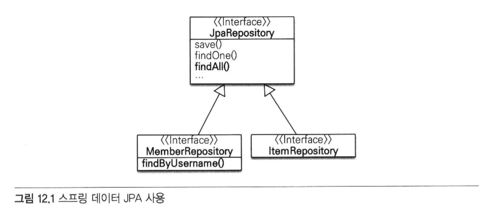
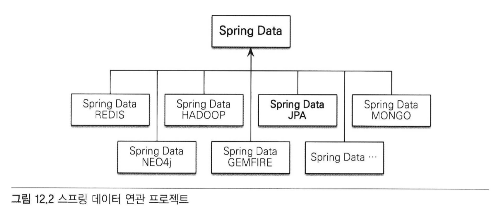

# 12 스프링 데이터 JPA
대부분의 데이터 접근 계층은 일명 CRUD로 부르는 유사한 등록, 수정, 삭제, 조회 코드를 반복해서 개발함.
JPA를 사용해서 데이터 접근 계층을 개발할 때도 이 같은 문제가 발생함.
이런 문제를 해결하려면 제네릭과 상속을 적절히 사용해서 공통 부분을 처리하는 부모 클래스를 만들면 된다. 하지만 이 방법은 공통 기능을 구현한 부모 클래스에 너무 종속되고 구현 클래스 상속이 가지는 단점에 노출된다.

## 12.1 스프링 데이터 JPA 소개
스프링 데이터 JPA는 스프링 프레임워크에서 JPA를 편리하게 사용할 수 있도록 지원하는 프로젝트다.
- CRUD를 처리하기 위한 공통 인터페이스 제공
- 실행 시점에 스프링 데이터 JPA가 구현 객체를 동적으로 생성해서 주입
- 데이터 접근 계층을 개발할 때 구현 클래스 없이 인터페이스만 작성해도 개발을 완료할 수 있다.

- CRUD를 처리하기 위한 공통 메소드
    - 스프링 데이터 JPA가 제공하는 org.springframework.data.jpa.repository.JpaRepository 인터페이스
    
```java
public interface MemberRepository extends JpaRepository<Member, Long> {
    Member findByUsername(String username);
}

public interface ItemRepository extends JpaRepository<Item, Long> {
    
}
```

스프링 데이터 JPA 클래스 다이어그램


- 일반적인 CRUD 메소드는 JpaRepository 인터페이스가 공통으로 제공하므로 문제가 없다
- MemberRepository.findByUsername(...)처럼 직접 작성한 공통으로 처리할 수 없는 메소드는?
    - 스프링 데이터 JPA는 메소드 이름을 분석해서 다음 JPQL을 실행한다.
```jpaql
select m from Member m where username =:username
```

### 12.1.1 스프링 데이터 프로젝트
- 스프링 데이터 JPA는 스프링 데이터 프로젝트의 하위 프로젝트 중 하나
- 스프링 데이터 프로젝트는 JPA, 몽고DB, NEO4J, REDIS, HADOOP, GEMFIRE 같은 다양한 데이터 저장소에 대한 접근을 추상화해서
개발자 편의를 제공하고 지루하게 반복하는 데이터 접근 코드를 줄여준다.
  


여기서 스프링 데이터 JPA 프로젝트는 JPA에 특화된 기능을 제공함