# 자바 ORM 표준 JPA 프로그래밍
# 01. JPA 소개
## 1.1 SQL을 직접 다룰 때 발생하는 문제점
- 진정한 의미의 계층 분할이 어렵다
- 엔티티를 신뢰할 수 없다.
- SQL에 의존적인 개발을 피하기 어렵다.
- 테이블의 필드에 변경이 있다면 DAO의 CRUD 코드와 SQL 대부분을 변경해야 하는 문제 발생
## 1.2 패러다임의 불일치
객체와 관계형 데이터베이스는 지향하는 목적이 서로 다르므로 둘의 기능과 표현 방법이 다르다. 이것을 객체와 관계형 데이터베이스의 패러다임 불일치 문제라고 한다. <br>
이러한 패러다임 불일치를 극복하기위해 개발자는 너무 많은 시간과 코드를 소비하고 객체 모델링은 힘을 잃고 점점 데이터 중심의 모델로 변해간다.
## 1.3 JPA란 무엇인가?
JPA (Java Persistence API)
-  자바 ORM 기술에 대한 API 표준 명세다.
- 지루하고 반복적인 CRUD SQL을 알아서 처리해준다.
- 객체 모델링과 관계형 데이터 사이의 차이점을 해결해준다.
## 1.4 JPA를 사용하는 이유
- 생산성
    - JPA를 사용하면 자바 컬렉션에 객체를 저장하듯이 JPA에게 저장할 객체를 전달하면 된다.
    - 데이터베이스 설계 중심의 패러다임을 객체 중심으로 역전시킬 수 있다.
- 유지보수
    - SQL에 의존적인 개발시 엔티티에 필드를 하나만 추가해도 관련된 등록, 수정, 조회 SQL과 결과를 매핑하기 위한 JDBC API 코드를 모두 변경해야 한다.
    - JPA를 사용하면 이런 과정을 대신 처리해주기 때문에 필드의 변경 시 수정해야 할 코드가 줄어든다.
    - 객체지향 언어가 가진 장점들을 활용해서 유연하고 유지보수하기 좋은 도메인 모델을 편리하게 설계할 수 있다.
- 패러다임의 불일치 해결
    - JPA는 상속, 연관관계, 객체 그래프 탐색, 비교하기와 같은 패러다임의 불일치 문제를 해결해준다.
- 성능
    - JPA는 애플리케이션과 데이터베이스 사이에서 다양한 성능 최적화 기회를 제공한다.
- 데이터 접근 추상화와 벤더 독립성
    - JPA는 애플리케이션과 데이터베이스 사이에 추상화된 데이터 접근 계층을 제공해서 애플리케이션이 특정 데이터베이스 기술에 종속되지 않도록 한다.
  
# 03. 영속성 관리
## 3.1 영속성 컨텍스트(persistence context)
- 엔티티를 영구 저장하는 환경
```java
em.persist(member);
```
- persist() 메소드는 엔티티 매니저를 사용해서 회원 엔티티를 영속성 컨텍스트에 저장한다.

## 3.2 엔티티 생명주기
- 비영속 (new/transient) : 영속성 컨텍스트와 전혀 관계가 없는 상태
  - 엔티티 객체를 생성한 상태이며 em.persist() 호출 전 상태이다.
  - 영속성 컨텍스트나 데이터베이스와는 전혀 관련이 없다.
  ```java
  //객체를 생성한 상태 (비영속)
  Member member = new Member();
  member.setId("member1);
  member.setUsername("회원1);
  ```
- 영속 (managed) : 영속성 컨텍스트에 저장된 상태
  - 엔티티 매니저를 통해서 엔티티를 영속성 컨텍스트에 저장한 상태.
  - 영속 상태라는 것은 영속성 컨텍스트에 의해 관리된다는 뜻이다.
  ```java
  //객체를 저장한 상태(영속)
  em.persist(member);
  ```
- 준영속 (detached) : 영속성 컨텍스트에 저장되었다가 분리된 상태
  - 영속성 컨텍스트가 관리하던 영속 상태의 엔티티를 영속성 컨텍스트가 관리하지 않은 상태
  - em.detach(), em.close(), em.clear()를 호출하면 준영속 상태가 된다.
  ```java
  //회원 엔티티를 영속성 컨텍스트에서 분리, 준영속 상태
  em.detach(member);
  ```
- 삭제 (removed) : 삭제된 상태
  - 엔티티를 영속성 컨텍스트와 데이터베이스에서 삭제한다.
  ```java
  //객체를 삭제한 상태(삭제)
  em.remove(member);
  ```

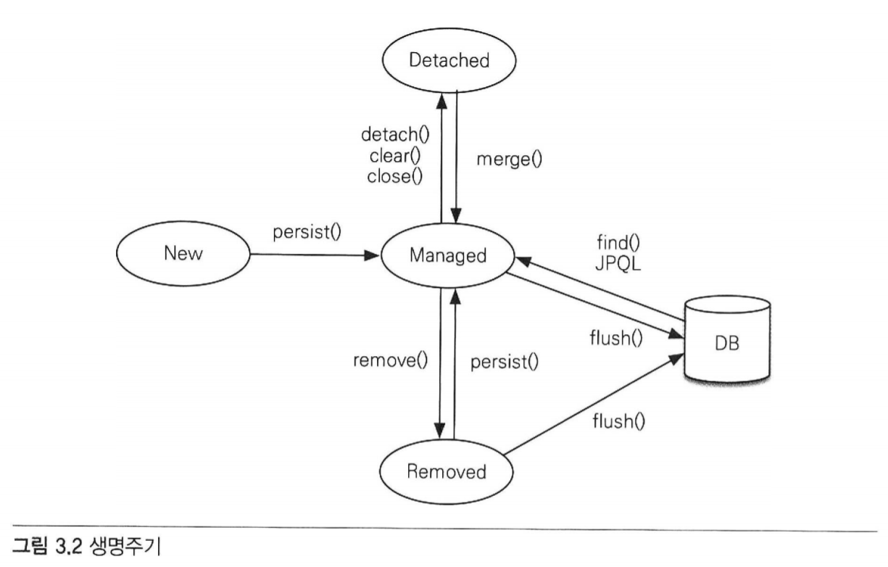

## 3.3 영속성 컨텍스트의 특징
- 영속성 컨텍스트와 식별자 값
  - 영속성 컨텍스트는 엔티티를 식별자 값(@Id)로 구분한다.
  - 따라서 영속 상태는 식별자 값이 반드시 있어야 한다.
  - 식별자 값이 없으면 예외가 발생한다.
  
- 영속성 컨텍스트와 데이터베이스 저장
  - 영속성 컨텍스트에 엔티티를 저장하면 트랜잭션을 커밋하는 순간 이 엔티티를 데이터베이스에 반영한다.
  - 이것을 플러시(flush)라고 한다.
  
- 영속성 컨텍스트가 엔티티를 관리하면 생기는 장점
  - 1차 캐시
  - 동일성 보장
  - 트랜잭션을 지원하는 쓰기 지연
  - 변경 감지
  - 지연 로딩
  
### 3.3.1 엔티티 조회
- 영속 상태의 엔티티는 영속성 컨텍스트가 내부에 가지고 있는 1차 캐시에 저장된다.
- 영속성 컨텍스트 내부에 존재하는 Map = (키 : @Id로 매핑한 식별자, 값 : 엔티티 인스턴스)

```java
//엔티티를 생성한 상태(비영속)
Member member = new Member();
member.setId("member1");
member.setUsername("회원1);
```
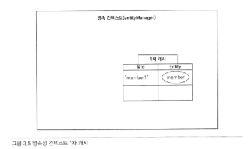

### 1차 캐시에서 조회
```java
//엔티티 조회
Member member = em.finc(Member.class, "member1");
```
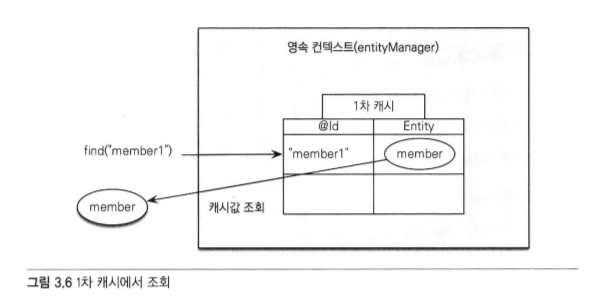
- 먼저 1차 캐시에서 엔티티를 찾는다 - 찾는 엔티티가 없다면?
- 데이터베이스에서 조회

### 데이터베이스에서 조회
- 1차 캐시에서 찾지 못하면 데이터베이스에서 조회해서 엔티티를 생성
- 그 후 1차 캐시에 저장하고 
- 영속 상태의 엔티티를 반환한다.

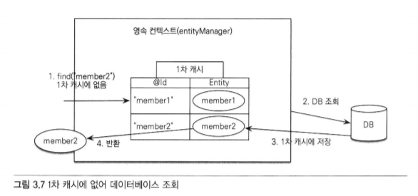

### ✔ member1, member2가 1차 캐시에 저장되었다.
- 다시 해당 엔티티를 조회하면 1차 캐시에서 바로 불러오기 때문에 성능상 이점을 누릴 수 있다.

### 영속 엔티티의 동일성 보장
```java
Member a = em.find(Member.class, "member1");
Member b = em.find(Member.class, "member1");

System.out.println(a == b);
// true
```
- member1은 영속상태이기 때문에 영속성 컨텍스트는 같은 엔티티 인스턴스를 반환하다.
- 영속성 컨텍스트는 성능상 이점과 엔티티의 동일성을 보장한다.

### 3.3.2 엔티티 등록
> 트랜잭션을 지원하는 쓰기 지연(transactional write-behind)
- 엔티티 매니저는 트랜잭션을 커밋하기 직전까지 데이터베이스에 엔티티를 저장하지 않고
내부 쿼리 저장소에 INSERT SQL을 모아두고
- 트랜잭션을 커밋하면 모아둔 쿼리를 데이터베이스에 보내는데 이것을
  트랜잭션을 지원하는 쓰기 지연이라고 한다.
  
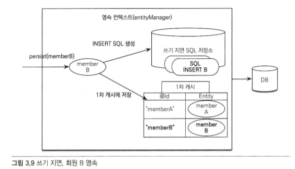
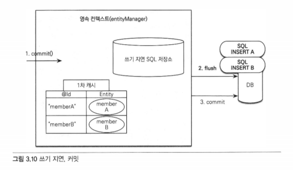

- 트랜잭션을 지원하는 쓰기 지연은 모아둔 쿼리를 한번에 전달하기 때문에 성능을 최적화할 수 있다.

### 3.3.3 엔티티 수정
> 변경 감지
- JPA로 엔티티를 수정할 때는 엔티티를 조회한 후 데이터만 변경하면 된다.
- update() 같은 메소드를 실행할 필요가 없다.
- 엔티티의 변경사항을 데이터베이스에 자동으로 반영하는 기능인 변경 감지 덕분이다.
### 변경 감지의 순서
1. 트랜잭션을 커밋한다.
2. 엔티티 매니저 내부에서 플러시(flush()) 호출
3. 엔티티와 스냅샷을 비교하여 변경된 엔티티를 찾는다.
4. 변경된 엔티티가 있다면 수정 쿼리를 생성하여 쓰기 지연 SQL 저장소로 보낸다.
5. 쓰기 지연 저장소의 SQL을 데이터베이스에 보낸다.
6. 데이터베이스 트랜잭션을 커밋한다.
- 변경 감지는 영속성 컨텍스트가 관리하는 영속 상태의 엔티티에만 적용된다.
### JPA의 기본 전략은 엔티티의 모든 필드를 업데이트한다.
#### 장점 👍
- 모든 필드를 사용하면 수정 쿼리가 항상 같다.
  - 애플리케이션 로딩 시점에 수정 쿼리를 미리 생성해두고 재사용할 수 있음
  
- 데이터베이스에 동일한 쿼리를 보내면 데이터베이스는 한 번 파싱된 쿼리를 재사용할 수 있다.

#### 단점 👎
- 데이터베이스에 보내는 데이터 전송량이 증가한다.

### 하이버네이트 확장 기능
- 필드가 많거나 저장되는 내용이 너무 클 때 사용한다.
```java
@Entity
@org.hibernate.annotations.DynamicUpdate
@Table(name = "Member")
public class Member { }
```
참고) 
- @DynamicInsert  
  - 데이터 저장시 데이터가 존재하는 필드만으로 INSERT SQL을 동적으로 생성한다.
  
### 3.3.4 엔티티 삭제
```java
Member memberA = em.find(Member.class, "memberA); //엔티티 조회
em.remove(memberA); //엔티티 삭제
```
- 엔티티 조회 후 삭제한다.

## 3.4 플러시
플러시는 영속성 컨텍스트의 변경 내용을 데이터베이스에 반영한다.
1. 변경 감지가 동작하여 영속성 컨텍스트안에 있는 모든 엔티티를 스냅샷(처음 저장된 값)과 비교한다.
2. 수정된 값이 있다면 수정 쿼리를 만들어 쓰기 지연 SQL 저장소에 등록한다.
3. 쓰기 지연 SQL 저장소의 쿼리를 데이터베이스에 전송한다.

영속성 컨텍스트를 플러시하는 방법
1. 직접 호출
   - em.flush() 메소드를 직접 호출한다.
   - 테스트나 다른 프레임워크와 JPA를 함께 사용할 때를 제외하곤 거의 사용하지 않음
2. 트랜잭션 커밋 시 플러시 자동 호출
   - 데이터베이스에 변경 내용을 SQL 전달없이 트랜잭션만 커밋하게 되면 반영되지 않는다.
   - 따라서 커밋전 플러시 호출이 필수적이다.
   - JPA는 커밋할 때 자동으로 플러시를 호출한다.
3. JPQL 쿼리 실행 시 플러시 자동 호출
   - JPQL이나 Creteria 같은 객체지향 쿼리를 호출할 때 자동으로 호출된다.
  
### 3.4.1 플러시 모드 옵션
- FlushModeType.AUTO : 커밋이나 쿼리를 실행할 때 플러시(기본값)
- FlushModeType.COMMIT : 커밋할 때만 플러시

## 3.5 준영속
- 영속 상태의 엔티티를 준영속 상태로 만드는 방법
1. em.detach(entity) : 특정 엔티티만 준영속 상태로 전환한다.
2. em.clear() : 영속성 컨텍스트를 완전히 초기화한다.
3. em.close() : 영속성 컨텍스트를 종료한다.
- 영속 상태의 엔티티는 주로 영속성 컨텍스트가 종료되면서 준영속 상태가 됨.
- 개발자가 직접 준영속 상태로 만드는 일은 드물다.

### 3.5.1 준영속 상태의 특징
- 거의 비영속 상태에 가깝다.
  - 영속성 컨텍스트가 관리하지 않기 때문에 영속성 컨텍스트가 제공하는 어떠한 기능도 동작하지 않는다.
- 식별자 값을 가지고 있다.
  - 비영속 상태는 식별자 값이 없을 수도 있지만 준영속 상태는 영속 상태 였기 때문에
  - 반드시 식별자 값을 가지고 있다.
- 지연 로딩을 할 수 없다.
  - 지연 로딩은 실제 객체 대신 프록시 객체를 로딩해두고 해당 객체를 실제 사용할 때 영속성 컨텍스트를 통해 데이터를 불러오는 방법이다.
  - 준영속 상태는 영속성 컨텍스트가 관리하지 않기 때문에 지연 로딩 시 문제가 발생한다.
  
### 3.5.2 병합: merge()
- 준영속 상태의 엔티티를 다시 영속 상태로 변경하기 위한 방법
```java
Member mergeMember = em.merge(member);
```
1. merge()를 실행한다.
2. 파라미터로 넘어도 준영속 엔티티 식별자 값으로 1차 캐시에서 엔티티를 조회한다. 
   - 1차 캐시에 엔티티가 없으면 조회 후 1차 캐시에 저장한다.
3. 조회한 영속 엔티티에 값을 채워 넣는다.
4. mergeMember를 반환한다.
- 병합은 준영속, 비영속을 신경 쓰지 않는다.
- 병합은 조회할 수 있으면 불러서 조회하고
- 조회할 수 없으면 새로 생성해서 병합한다.
- 따라서 save or update 기능을 수행한다.

# 04. 엔티티 매핑

## 4.1 @Entity
- JPA를 사용해서 테이블과 매핑할 클래스는 @Entity 어노테이션을 필수로 붙여야 한다.

### @Entity 속성
|속성|기능|기본값|
|:---:|:---:|:---:|
|name|JPA에서 사용할 엔티티 이름을 지정한다. 
보통 기본값인 클래스 이름을 사용함. 
만약 다른 패키지에 이름이 같은 엔티티 클래스가 있다면 
이름을 지정해서 충돌하지 않도록 해야 한다.|클래스 이름 (예: Member)|

### @Entity 적용 시 주의사항
- 기본 생성자는 필수
- final 클래스, enum, interface, inner 클래스에서는 사용할 수 없다.
- 저장할 필드에 final을 사용하면 안 된다.

## 4.2 @Table
- @Table은 엔티티와 매핑할 테이블을 지정한다.
- 생량하면 매핑한 엔티티 이름을 테이블 이름으로 사용한다.

### @Table 속성
|속성|기능|기본값|
|---|---|---|
|name|매핑할 테이블 이름|엔티티 이름을 사용한다.|
|catalog|catalog 기능이 있는 데이터베이스에서 catalog를 매핑한다.|
|schema|schema 기능이 있는 데이터베이스에서 schema를 매핑한다.|
|uniqueConstraints(DDL)|DDL 생성 시에 유니크 제약조건을 만든다. 2개 이상의 복합 유니크 제약조건도 만들 수 있다. 참고로 이 기능은 스키마 자동 생성 기능을 사용해서 DDL을 만들 때만 사용된다.|

## 4.3 다양한 매핑 사용
- 회원 관리 프로그램에 다음 요구사항이 추가되었다.
  - 회원은 일반회원과 관리자로 구분해야 한다.
  - 회원 가입일과 수정일이 있어야 한다.
  - 회원을 설명할 수 있는 필드가 있어야 한다. 이 필드는 길이 제한이 없다.

Member
```java
import lombok.Getter;
import lombok.NoArgsConstructor;

import javax.persistence.*;
import java.util.Date;

@Entity
@NoArgsConstructor
@Getter
@Table(name = "MEMBER")
public class Member {

    @Id
    @Column(name = "ID")
    private Long id;

    @Column(name = "NAME")
    private String username;

    private Integer age;

    // ==추가==
    @Enumerated(EnumType.STRING)
    private RoleType roleType;

    @Temporal(TemporalType.TIMESTAMP)
    private Date createdDate;

    @Temporal(TemporalType.TIMESTAMP)
    private Date lastModifiedDate;

    @Lob
    private String description;
}
```
RoleType
```java
public enum RoleType {
    AMDIN, USER
}
```
- roleType
  - 자바의 enum을 사용해서 회원의 타입을 구분했다.
  - 일반 회원은 USER, 관리자는 ADMIN
  - 자바의 enum을 사용하려면 @Enumerated 어노테이션으로 매핑해야 한다.
  
- createdDate, lastModifiedDate
  - 자바의 날짜 타입은 @Temporal을 사용해서 매핑한다.
  
- description
  - 회원을 설명하는 필드는 길이 제한이 없다.
  - 따라서 데이터베이스의 VARCHAR 타입 대신에 CLOB 타입으로 저장해야 한다.
  - @Lob을 사용하면 CLOB, BLOB 타입을 매핑할 수 있다.
  
## 4.4 데이터베이스 스키마 자동 생성
- 클래스의 매핑 정보를 보면 어떤 테이븡에 어떤 컬럼을 사용하는지 알 수 있다.
- JPA는 이 매핑 정보와 데이터베이스 방언을 사용해서 데이터베이스 스키마를 생성한다.
  

- 생성전 application.properties에 아래 코드를 추가한다.
- 콘솔에 실행되는 테이블 생성 DDL을 출력할 수 있다.
```properties
spring.jpa.show-sql=true
```

```h2
Hibernate:
    drop table if exists member

Hibernate::
  create table member (
      id bigint not null, 
      age integer, 
      created_date datetime, 
      description longtext, 
      last_modified_date datetime, 
      role_type varchar(255), 
      name varchar(10) not null, 
      primary key (id)
  ) engine=InnoDB
```
- 실행된 결과에서 기존 테이블을 삭제하고 다시 생성한 것을 볼 수 있다.
- roleType은 VARCHAR 타입, createDate, lastModifiedDate 는 TIMESTAMP 타입, description은 LONGTEXT 타입으로 생성

## 4.5 DDL 생성 기능
- 회원 이름은 필수로 입력되어야 하고, 10자를 초과하면 안 된다는 제약조건이 추가되었다면?
```java
@Column(name = "NAME", nullable = false, length = 10)
private String username;
```
- @Column 매핑정보의 nullable 속성 값을 false로 지정하면 자동 생성되는 DDL에 not null 제약조건을 추가할 수 있다.
- length 속성 값을 사용하면 자동 생성되는 DDL에 문자의 크기를 지정할 수 있다.


### @Table의 uniqueConstraints 속성
```java
@Entity
@NoArgsConstructor
@Getter
@Table(name = "MEMBER", uniqueConstraints = {@UniqueConstraint(
        name = "NAME_AGE_UNIGQUE",
        columnNames = {"NAME", "AGE"}
)})
public class Member {
}
```
```h2
alter table member add constraint NAME_AGE_UNIGQUE unique (name, age)
```
- 유니크 제약조건이 추가되었다.
- 이러한 @Column의 length와 nullable 속성들은 단지 DDL을 자동 생성할 때만 사용되고 JPA의 실행 로직에는 영향을 주지 않는다.
- 스키마 자동 생성 기능을 사용하지 않고 직접 DDL을 만든다면 사용할 이유가 없음.
- but, 이 기능을 사용하면 애플리케이션 개발자가 엔티티만 보고도 손쉽게 제약조건을 파악할 수 있다.

## 4.6 기본 키 매핑
- 직접 할당: 기본 키를 애플리케이션에서 직접 할당한다.
- 자동 생성: 대리 키 사용 방식
  - IDENTITY: 키본 키 생성을 데이터베이스에 위임한다.
  - SEQUENCE: 데이터베이스 시퀀스를 사용해서 기본 키를 할당한다.
  - TABLE: 키 생성 테이블을 사용한다.
  
### 4.6.1 기본 키 직접 할당 전략
```java
@Id
@Column(name = "ID")
private Long id;
```
#### @Id 적용 가능 자바 타입
- 자바 기본형
- 자바 래퍼형
- String
- java.util.Date
- java.sql.Date
- java.math.BigDecimal
- java.math.BigInteger

### 4.6.2 IDENTITY 전략
```java
@Id
@Column(name = "ID")
@GeneratedValue(strategy = GenerationType.IDENTITY)
private Long id;
```
- 엔티티가 영속 상태가 되려면 식별자가 반드시 필요하다.
- IDENTITY 식별자 생성 전략은 엔티티 데이터베이스에 저장해야 식별자를 구할 수 있다.
- 따라서 em.persist()를 호출하는 즉시 INSERT SQL이 데이버테이스에 전달된다.
- 이 전략은 트랜잭션을 지원하는 쓰기 지연이 동작하지 않는다.

### 4.6.3 AUTO 전략
```java
@Id
@Column(name = "ID")
@GeneratedValue(strategy = GenerationType.AUTO)
private Long id;
```
- GenerationType.AUTO는 선택한 데이터베이스 방언에 따라 자동 생성 전략 중 하나를 선택한다.

#### 권장하는 식별자 선택 전략
데이터베이스 기본 키는 다음 3가지 조건을 모두 만족해야 한다.
1. null값은 허용하지 않는다.
2. 유일해야 한다.
3. 변해선 안 된다.

테이블의 기본 키를 선택하는 전략
- 자연 키
  - 비즈니스에 의미가 있는 키
  - ex) 주민등록번호, 이메일, 전화번호
  
- 대리 키
  - 비즈니스와 관련 없는 임의로 만들어진 키, 대체 키라고도 불림
  - ex) auto_increment, 키생성 테이블 사용
  
#### ❗ 자연 키보다는 대리 키를 권장한다.
- 자연 키인 전화번호를 기본 키로 선택한다면, 그 번호가 유일할 수는 있지만
- 전화번호가 없을수도 있고 전화번호가 변경될 수도 있다.
#### ❗ 비즈니스 환경은 언젠가 변한다.
#### ❗ JPA는 모든 엔티티에 일관된 방식으로 대리 키 사용을 권장한다.

🔗 [@Entity 엔티티 필드와 컬럼 매핑용 어노테이션 정리](https://steel-blue.tistory.com/55)

# 05 연관관계 매핑 기초
- 🚩 목표 : 객체의 참조와 테이블의 외래 키를 매핑하는 것
- 연관관계 매핑을 이해하기 위한 핵심 키워드
  - 방향 | 객체관계에만 존재. 테이블 관계는 항상 양방향이다.
    - 단방향 : 회원 -> 팀 OR 팀 -> 회원
    - 양방향 : 회원 -> 팀 AND 팀 -> 회원
  - 다중성
    - 다대일 (N:1)
    - 일대다 (1:N)
    - 일대일 (1:1)
    - 다대다 (N:N)
  - 연관관계의 주인
    - 객체를 양방향 연관관계로 만들면 연관관계의 주인을 정해야 한다.
  
## 5.1 단방향 연관관계

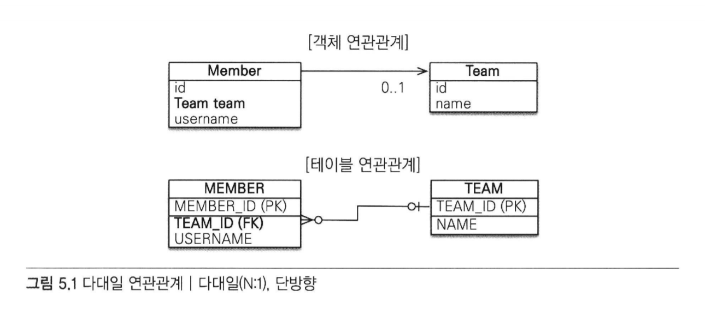

- 회원과 팀의 관계로 알아보는 다대일 단방향 관계
  - 회원과 팀이 있다.
  - 회원은 하나의 팀에만 소속될 수 있다.
  - 회원과 팀은 다대일 관계다.
  
- 객체 연관관계
  - 회원 객체는 Member.team 필드로 팀 객체와 연관관계를 맺는다.
  - 회원 객체와 팀 객체는 단방향 관계다.
    - 회원은 Member.team 필드를 통해 팀을 알 수 있다.
      - member -> team 조회 : member.getTeam()
    - 팀은 회원을 알 수 없다.
      - team -> member 접근하는 필드 없음
  
- 테이블 연관관계
  - 회원 테이블은 TEAM_ID 외래 키로 팀 테이블과 연관관계를 맺는다.
  - 회원 테이블과 팀 테이블은 양방향 관계
    - 회원 테이블의 TEAM_ID 외래 키를 통해 회원과 팀을 조인할 수 있다.
    - 팀과 회원도 조인할 수 있다.
  
- 객체 연관관계와 테이블 연관관계의 가장 큰 차이
  - 참조를 통한 연관관계는 언제나 단방향이다.
  - 양방향으로 만들고 싶다면? 반대쪽에도 필드를 추가하여(연관관계) 참조를 보관해야 함.
  - 양반향 관계라기보다는 서로 다른 단방향 관계 2개..
  
- 객체 연관관계 vs 테이블 연관관계 정리
  - 객체는 참조(주소)로 연관관계를 맺음
  - 테이블은 외래 키로 연관관계 맺음
  - 참조를 사용하는 객체의 연관관계는 단방향
    - A -> B (a,b)
  - 외래 키를 사용하는 테이블의 연관관계는 양방향
    - A JOIN b 가 가능하면 반대로 B JOIN A 도 가능
  - 객체를 양방향으로 참조하려면 단방향 연관관계를 2개 만들어야 한다.
    - A -> B (a,b)
    - B -> A (b,a)
  
### 5.1.1 객체 관계 매핑
```java
@Entity
@Getter
@NoArgsConstructor
public class Member2 {
    
    @Id
    @Column(name = "MEMBER_ID")
    private String id;
    
    private String username;

    @ManyToOne
    @JoinColumn(name="TEAM_ID")
    private Team team;  //팀의 참조를 보관

    public Member2(String id, String username) {
        this.id = id;
        this.username = username;
    }

    public void setTeam(Team team) {
        this.team = team;
    }
}

@Entity
@NoArgsConstructor
@Getter
public class Team {

  @Id
  @Column(name = "TEAM_ID")
  private String id;

  private String name;

  public Team(String id, String name) {
    this.id = id;
    this.name = name;
  }
}
```
- 객체 연관관계: 회원 객체의 Member.team 필드 사용
- 테이블 연관관계: 회원 테이블의 MEMBER.TEAM_ID 외래 키 컬럼을 사용
```java
    @ManyToOne
    @JoinColumn(name="TEAM_ID")
    private Team team;
```
- @ManyToOne
  - 다대일(N:1) 관계라는 매핑 정보이다.
  - 회원과 팀은 다대일 관계이다.
  - 연관관계를 매핑 시 다중성을 나타내는 어노테이션 필수
  
- @JoinColumn(name="TEAM_ID")
  - 조인 컬럼은 외래 키를 매핑할 때 사용.
  - 생략 가능
  - name 속성에는 매핑할 외래 키 이름을 지정한다.
  - 회원과 팀 테이블은 TEAM_ID 외래 키로 연관관계를 맺으므로 이 값을 지정하면 된다.
  
🔗 [연관관계 매핑 어노테이션 정리](https://steel-blue.tistory.com/56)

## 5.2 양방향 연관관계
- 팀에서 회원으로 접근하는 관계를 추가해보자.

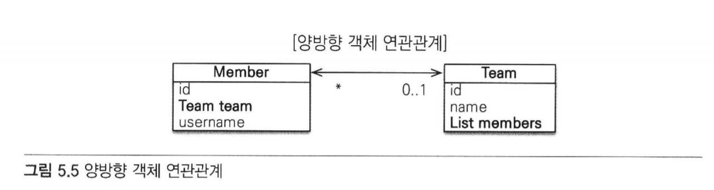
  
- 회원과 팀은 다대일 관계
- 팀에서 회원은 일대다 관계
  - 일대다 관계는 여러 건과 연관관계를 맺을 수 있으므로 컬렉션을 사용해야 한다.
    - Team.members를 List 컬렉션으로 추가했다.
  
- 회원 -> 팀 (Member.team)
- 팀 > 회원 (Team.members)
- 💡 JPA는 List를 포함해서 Collection, Set, Map 같은 다양한 컬렉션을 지원한다. (14.1절)

```java
public class Team {

    @Id
    @Column(name = "TEAM_ID")
    private String id;

    private String name;
    
    //추가
    @OneToMany (mappedBy = "team")
    private List<Member2> members = new ArrayList<Member2>();

    public Team(String id, String name) {
        this.id = id;
        this.name = name;
    }
}
```
- Team클래스에 OneToMany 추가
- 팀과 회원은 일대다 관계다.
- 따라서 팀 엔티티에 컬렉션인 List를 추가 했다.
- 또, 일대다 관계를 매핑하기 위해 @OneToMany 매핑 정보를 사용했다.
- mappedBy 속성은 양방향 매핑일 때 사용하는데 반대쪽 매핑의 필드 이름을 값으로 주면 된다.
- 반대쪽 매핑이 Member.team이므로 team을 값으로 주었다.

### 5.2.1 일대다 컬렉션 조회
```java
Team team = em.find(Team.class, "team1");
List<Member2> members = team.getMembers();
```

## 5.3 연관관계의 주인
### mappedBy 속성이 필요한 이유

- 객체에는 양방향 연관관계라는 것은 없다.
- 서로 다른 단방향 연관관계 2개를 애플리케이션 로직으로 잘 묶어서 양방향인 것처럼 보이게 할 뿐.


- 객체 연관관계
  - 회원 -> 팀 연관관계 1개(단방향)
  - 팀 -> 회원 연관관계 1개(단방향)
  
- 테이블 연관관계
  - 회원 <-> 팀의 연관관계 1개(양방향)
  
- 테이블은 외래 키 하나로 두 테이블의 연관관계를 관리한다.
- 엔티티를 단방향으로 매핑하면 참조를 하나만 사용하므로,
  - 이 참조로 외래 키를 관리하면 된다.
  
- but, 엔티티를 양방향으로 매핑하면
  - 회원 -> 팀 , 팀 -> 회원 두곳에서 서로를 참조한다.
  - 따라서 객체의 연관관계를 관리하는 포인트는 2곳으로 늘어난다.
  

- 엔티티를 양방향 연관관계로 설정하면 객체의 참조는 둘인데 외래 키는 하나다.
- 따라서 둘 사이에 차이가 발생한다.

- 이러한 차이로 인해 JPA에서는 두 객체 연관관계 중 하나를 정해, 테이블의 외래키를 관리해야 하는데
이것을 연관관계의 주인이라 한다.
  
### 5.3.1 양방향 매핑의 규칙: 연관관계의 주인
- 양방향 연관관계 매핑 시 지켜야 할 규칙
  - 두 연관관계 중 하나를 연관관계의 주인으로 정해야 함.
  
- 연관관계의 주인만이 데이터베이스 연관관계와 매핑되고 
외래 키를 등록할 수 있다. 
  
- 반면에 주인이 아닌 쪽은 읽기만 할 수 있다.
- 어떤 연관관계를 주인으로 정할지는 mappedBy 속성을 사용하면 된다.

- 주인은 mappedBy 속성을 사용하지 않는다.
- 주인이 아니면 mappedBy 속성을 사용해서 속성의 값으로 연관관계의 주인을 지정해야 한다.


- 회원 -> 팀 (Member.team) 방향
```java
class Member {
  @ManyToOne
  @JoinColumn (name="TEAM_ID")
  private Team team;
  ...
}
```

- 팀 -> 회원 (Team.members) 방향
```java
class Team {
  @OneToMany
  private List<Member2> members = new ArrayList<Member>();
}
```
- 연관관계의 주인을 정한다는 것은 외래 키 관리자를 선택하는 것이다.
- 여기서는 회원 테이블에 있는 TEAM_ID 외래 키를 관리할(등록, 수정, 삭제..) 관리자를 선택해야 한다.


- 회원 엔티티에 있는 Member.team을 주인으로 선택하면?
  - 자기 테이블에 있는 외래 키를 관리하면 됨.
  
- 팀 엔티티에 있는 Team.members를 주인으로 선택하면?
  - 물리적으로 전혀 다른 테이블의 외래 키를 관리해야 한다
    - why? Team.members가 있는 Team 엔티티는 TEAM 테이블에 매핑되어 있는데
  관리해야할 외래 키는 MEMBER 테이블에 있기 때문
      

### 5.3.2 연관관계의 주인은 외래 키가 있는 곳
- 연관관계의 주인은 테이블에 외래 키가 있는 곳으로 정해야 한다.
- 여기서는 회원 테이블이 외래 키를 가지고 있으므로 Member.team이 주인이 된다.


- 주인이 아닌 Team.members에는 mappedBy="team" 속성을 사용해서 주인이 아님을 설정한다.
- 그리고 mappedBy 속성의 값으로는 연관관계의 주인인 team을 주면 된다.
- 여기서 mappedBy의 값으로 사용된 team은 연관관계의 주인인 Member 엔티티의 team 필드를 말함.


## 5.4 양방향 연관관계 저장
- 양방향 연관관계는 연관관계의 주인이 외래 키를 관리함.
- 따라서 주인이 아닌 방향은 값을 설정하지 않아도 데이터베이스에 외래 키 값이 정상 입력된다.

```java
team1.getMembers().add(member1); // 무시됨
```
- Team.members는 연관관계의 주인이 아니기 때문에 
주인이 아닌 곳에 입력된 값은 외래 키에 영향을 주지 않는다.
  
```java
member1.setTeam(team1); // 연관관계 설정(연관관계의 주인)
```
- Member.team은 연관관계의 주인이기 때문에 엔티티 매니저는 이곳에 입력된 값을 사용해서 외래 키를 관리한다.


## 5.5 양방향 연관관계의 주의점
### 5.5.1 순수한 객체까지 고려한 양방향 연관관계
- 객체 관점에서 양쪽 방향에 모두 값을 입력해주는 것이 가장 안전하다.
### 5.5.2 연관관계 편의 메소드
- 양방향 연관관계는 결국 양쪽 다 신경 써야 한다.
- Member 클래스의 setTeam() 메소드를 수정하여 코드를 리팩토링한다.
```java
public void setTeam(Team team) {
        this.team = team;
        team.getMembers().add(this);
    }
```
- 이렇게 한 번에 양방향 관계를 설정하는 메소드를 연관관계 편의 메소드라 한다.

### 5.5.3 연관관계 편의 메소드 작성 시 주의사항
```java
member1.setTeam(teamA);
member1.setTeam(teamB);
Member findMember = teamA.getMember();
```
- 이 시나리오를 그림으로 분석.
- 먼저 member1.setTeam(teamA)를 호출한 직후

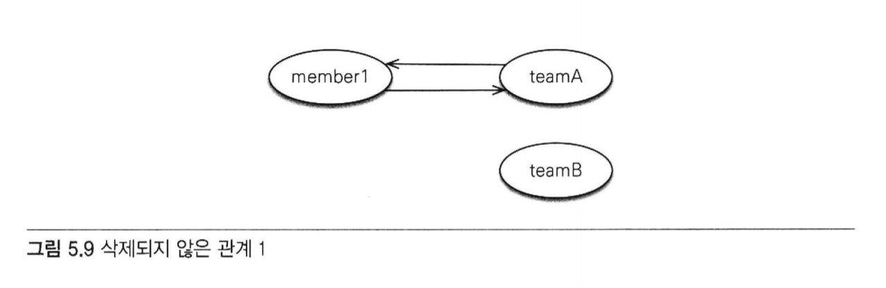

- member1.setTeam(teamB); 호출 직후

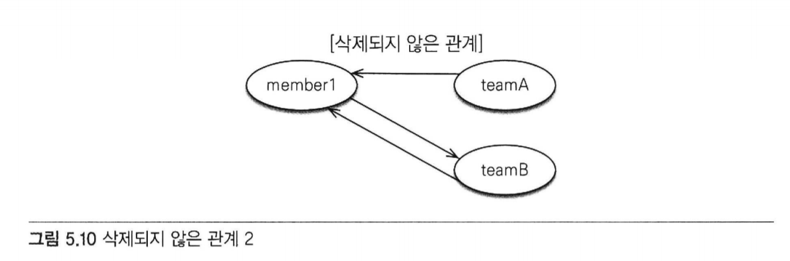

### 문제점
- teamB로 변경할 때 teamA -> member1 관계를 제거하지 않았다.
- 연관관계를 변경할 때는 기존 팀이 있으면 기존 팀과 회원의 연관관계를 삭제하는 코드를 추가해야 한다.
```java
    public void setTeam(Team team) {
        // 기존 팀과 관계를 제거
        if(this.team != null) {
            this.team.getMembers().remove(this);
        }
        this.team = team;
        team.getMembers().add(this);
    }
```


### 📌 정리
- 단방향 매핑만으로 테이블과 객체의 연관관계 매핑은 이미 완료되었다.
- 단방향을 양방향으로 만들면 반대방향으로 객체 그래프 탐색 기능이 추가된다.
- 양방향 연관관계를 매핑하려면 객체에서 양쪽 방향을 모두 관리해야 한다.


# 06 다양한 연관관계 매핑
## 6.1 다대일
- 다대일 관계의 반대 방향 > 일대다
- 일대다 관계의 반대 방향 > 다대일
- 일(1), 다(N) 관계의 외래 키 > 항상 다(N) 
### 6.1.1 다대일 단방향
```java
Member
    @ManyToOne
    @JoinColumn(name="TEAM_ID")
    private Team team;  //팀의 참조를 보관
        
Team
    @Id
    @Column(name = "TEAM_ID")
    private String id;
    
    private String name;
```    
- Member 객체엔 Member.team으로 팀 엔티티를 참조할 수 있다.
- Team 에서는 Member 객체를 참조할 수 없다.
- 이것이 다대일 단방향 연관관계이다.
    
    
### 6.1.2 다대일 양방향
```java
Member
    @ManyToOne
    @JoinColumn(name="TEAM_ID")
    private Team team;  //팀의 참조를 보관
    
    public void setTeam(Team team) {
        this.team = team;
        
        if(!team.getMembers().contains(this)) {
            team.getMembers().add(this);
        }
    }

Team    
    @Id
    @Column(name = "TEAM_ID")
    private String id;

    private String name;

    @OneToMany (mappedBy = "team")
    private List<Member2> members = new ArrayList<Member2>();
    
    public void addMember (Member2 member) {
        this.members.add(member);
        if (member.getTeam() != this) {
            member.setTeam(this);
        }
    }
```
- 양방향은 외래 키가 있는 쪽이 연관관계의 주인이다.
  - 일대다, 다대일 연관관계는 항상 다(N)에 외래 키가 있음.
  - 여기선 Member가 외래 키를 가지고 있으므로 Member.team이 연관관계 주인
  - JPA의 외래키 관리 -> 연관관계의 주인만이 가능
    - 그럼 왜 Team에도 연관관계를?
      - Team.members는 조회를 위한 JPQL이나 객체 그래프를 탐색할 때 사용하기 위함
  
- 양방향 연관관계는 항상 서로를 참조해야 한다.
  - 어느 한 쪽만 참조하면 양방향 연관관계가 성립하지 않음.
  - 항상 서로 참조하기 위해선 연관관계 편의 메소드를 작성하는 것이 좋음.
    - ex) Member의 setTeam(), Team의 addMember()
  - 이때 무한루프에 빠지지 않도록 주의해야 함.
  
    
## 6.2 일대다
- 다대일 관계의 반대 방향.
- 일대다 관계는 엔티티를 하나 이상 참조할 수 있으므로 자바 컬렉션을 사용함.
### 6.2.1 일대다 단방향
- "하나의 팀은 여러 회원을 참조할 수 있다."
- 팀은 회원들은 참조하지만, 반대로 회원은 팀을 참조하지 않으면 둘의 관계는 단방향임.
- 엔티티의 Team.members로 회원 테이블의 TEAM_ID 외래 키를 관리함.
- 왜냐하면 일대다 관계에서 외래 키는 항상 다쪽 테이블에 있기 때문
- 하지만 다 쪽인 Member 엔티티에는 외래 키를 매핑할 수 있는 참조 필드가 없음.
- 대신 반대쪽인 Team 엔티티에만 참조 필드인 members가 있다.
- 따라서 반대편 테이블의 외래 키를 관리하는 특이한 모습이 나타남

### 🚩 일대다 단방향 매핑보다는 다대일 양방향 매핑을 사용하자


### 6.2.2 일대다 양방향
- 존재하지 않음.
- 사실 일대다 양방향과 다대일 양방향은 똑같은 말이다..
- 여기서는 왼쪽을 연관관계의 주인으로 가정해서 분류한 것.
- 일대다 단방향 매핑 반대편에 다대일 단방향 매핑을 읽기 적용으로 추가한 것.
## 6.3 일대일
- 일대일 관계는 양쪽이 서로 하나의 관계만 가진다.
  - ex) 회원은 하나의 사물함만 사용 / 사물함도 하나의 회원에 의해서만 사용됨
  

- 일대일 관계의 특징
  - 일대일 관계는 그 반대도 일대일 관계다.
  - 테이블 관계에서 일대다, 다대일은 항상 다(N)쪽이 외래 키를 가짐.
  - 반면, 일대일은 두 테이블 모두 외래키를 가짐
  
### 6.3.1 주 테이블에 외래 키
- 일대일 관계를 구성할 때 주 테이블에 외래 키가 있는 것을 선호함.
- JPA도 주 테이블에 외래 키가 있으면 좀 더 편리하게 매핑이 가능함.

### 단방향
```java
@Entity
public class User {
    
    @Id @GeneratedValue
    @Column (name = "USER_ID")
    private Long id;
    
    private String username;
    
    @OneToOne
    @JoinColumn(name = "LOCKER_ID")
    private Locker locker;
}

@Entity
public class Locker {
    
    @Id @GeneratedValue
    @Column(name = "LOCKER_ID")
    private Long id;
    
    private String name;
}
```
- 일대일 관계이므로 객체 매핑에 @OneToOne 사용
- 다대일 단방향과 거의 비슷

### 양방향
```java
@Entity
public class User {

    @Id @GeneratedValue
    @Column (name = "USER_ID")
    private Long id;

    private String username;

    @OneToOne
    @JoinColumn(name = "LOCKER_ID")
    private Locker locker;
}

@Entity
public class Locker {

    @Id @GeneratedValue
    @Column(name = "LOCKER_ID")
    private Long id;

    private String name;
    
    @OneToOne(mappedBy = "locker")
    private User user;
}
```
- 양방향이므로 연관관계의 주인을 정해야 함.
- User 테이블이 외래 키를 가지고 있으므로 Uesr.locker가 연관관계의 주인
- 반대 매핑인 사물함의 Locker.user는 mappedBy를 선언하여 연관관계의 주인이 아니라고 설정함

### 6.3.2 대상 테이블에 외래 키
### 단방향
- 일대일 관계 중 대상 테이블에 외래 키가 있는 단방향 관계는 JPA에서 지원하지 않는다.

### 양방향
```java
@Entity
public class User {

    @Id @GeneratedValue
    @Column (name = "USER_ID")
    private Long id;

    private String username;

    @OneToOne (mappedBy = "user")
    private Locker locker;
}

@Entity
public class Locker {

    @Id @GeneratedValue
    @Column(name = "LOCKER_ID")
    private Long id;

    private String name;

    @OneToOne
    @JoinColumn(name = "USER_ID")
    private User user;
}
```
- 일대일 매핑에서 대상 테이블에 외래 키를 두고 있으면 양방향으로 매핑한다.
- 주 엔티티인 User 엔티티 대신 대상 엔티티인 Locker를 연관관계의 주인으로 만들었다.

## 6.4 다대다
- 관계형 데이터베이스는 정규화된 테이블 2개로 다대다 관계를 표현할 수 없다.
- 그래서 보통, 일대다, 다대일 관계로 풀어내는 연결 테이블을 사용함.

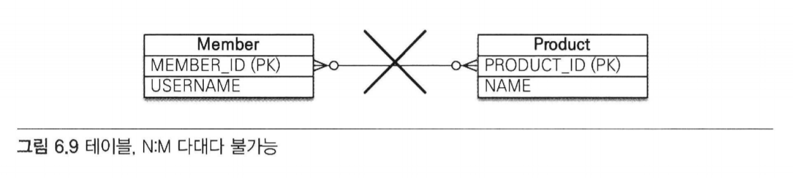
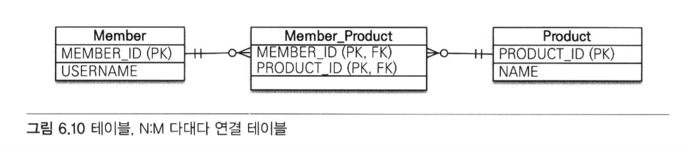

- but, 객체는 테이블과 다르게 객체 2개로 다대다 관계를 만들 수 있다.
- ex)
  - 회원 객체는 컬렉션을 사용하여 상품들을 조회하면 되고
  - 상품들도 컬렉션을 사용해서 회원들을 참조하면 된다.
  

### 6.4.1 다대다: 단방향
```java
@Entity
public class Member {

    @Id @GeneratedValue
    @Column (name = "MEMBER_ID")
    private Long id;

    private String username;
    
    @ManyToMany
    @JoinTable(name = "MEMBER_PRODUCT",
               joinColumns = @JoinColumn(name = "MEMBER_ID"),
               inverseJoinColumns = @JoinColumn(name = "PRODUCT_ID"))
    private List<Product> products = new ArrayList<Product>();
}

@Entity
public class Product {
    
    @Id @Column (name = "PRODUCT_ID")
    private String id;
    
    private String name;
}
```
- 회원 엔티티와 상품 엔티티를 @ManyToMany로 매핑함.
- ❗ 중요
  - @ManyToMany와 @JoinTable을 사용해서 연결 테이블을 바로 매핑한 것이다.
  - 따라서 회원과 상품을 연결하는 회원_상품 엔티티 없이 매핑을 완료할 수 있다.
  
### @JoinTable의 속성
- @JoinTable.name
  - 연결 테이블을 지정한다. 여기서는 MEMBER_PRODUCT 테이블을 선택했다.
  
- @JoinTable.joinColumns
  - 현재 방향인 회원과 매핑할 조인 컬럼 정보를 지정한다.
  - MEMBER_ID로 지정.
  
- @JoinTable.inverseJoinColumns
  - 반대 방향인 상품과 매핑할 조인 컬럼 정보 지정
  - PRODUCT_ID로 지정.
  

MEMBER_PRODUCT 테이블은 다대다 관계를 일대다, 다대일 관계로 풀어내기 위해 필요한 연결 테이블일 뿐이다.
@ManyToMany로 매핑한 덕분에 다대다 관계를 사용할 때는 이 연결 테이블을 신경 쓰지 않아도 된다.
### 6.4.2 다대다: 양방향
```java
@Entity
public class Product {

    @Id
    private String id;

    @ManyToMany(mappedBy = "products")  //역방향 추가
    private List<Member> members;
}
```
- 다대다 매핑이므로 역방향도 @ManyToMany를 사용함.
- 양쪽 중 원하는 곳에 mappedBy로 연관관계 주인을 지정한다.


- 양방향 연관관계는 연관관계 편의 메소드를 추가해서 관리하는 것이 편리함.
- 회원 엔티티에 연관관계 편의 메소드를 추가하자
```java
public void addProduct(Product product) {
        ...
        product.add(product);
        product.getMembers().add(this);
    }
```

### 6.4.3 다대다: 매핑의 한계와 극복, 연결 엔티티 사용
- @ManyToMany를 사용하면 연결 테이블을 자동으로 처리해주므로 도메인 모델이 단순해지고 편해짐.
- but, 실무에서 사용하기에는 한계가 있다.
  - 회원이 상품을 주문하는 상황에서 연결 테이블에 단순히 주문한 회원 아이디와 상품 아이디만 남고
  끝나지 않는다. 보통 주문 수량, 주문 날짜가 더 필요하게 됨.
    
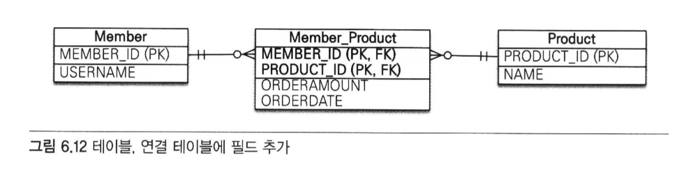

- 그림과 같이 수량과 날짜가 추가되었다.
- 이렇게 되면 더는 @ManyToMany를 쓸 수 없다.


- 결국 연결 테이블을 매핑하는 연결 엔티티를 만들고 이곳에 추가한 컬럼들을 매핑해야 한다.
- 또한 엔티티 간의 관계도 테이블 관계처럼 다대다에서 일대다, 다대일 관계로 풀어야 함.

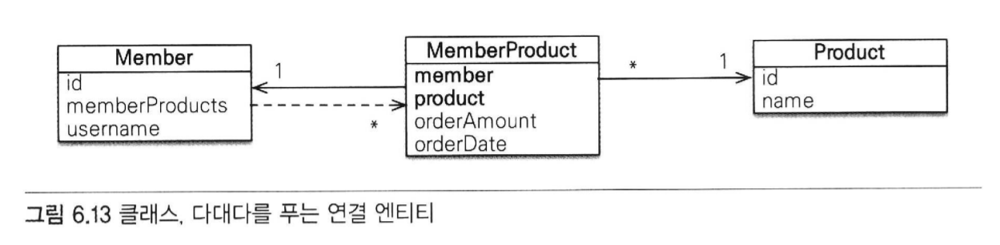

- 회원상품 엔티티를 추가하고 주문수량, 주문날짜 컬럼 추가한다.

```java
@Entity
public class Member {

    @Id
    @Column(name = "MEMBER_ID")
    private Long id;

    //역방향
    @OneToMany(mappedBy = "member")
    private List<MemberProduct> memberProducts;
    
    ...

} 
```

- 회원과 회원상품을 양방향 관계로 만들었다.
- 회원상품 엔티티 쪽이 외래 키를 가지고 있으므로 MemberProduct가 연관관계 주인임.
- 회원은 mappedBy 사용

```java
@Entity
public class Product {

    @Id @Column(name = "PRODUCT_ID")
    private String id;

    private String name;
    ...
}
```
- 상품 엔티티에서 회원상품 엔티티로 객체 그래프 탐색 기능이 필요하지 않다고 판단해서 연관관계를 만들지 않음.

```java
@Entity
@IdClass(MemberProductId.class)
public class MemberProduct {
    
    @Id
    @ManyToOne
    @JoinColumn(name = "MEMBER_ID")
    private Member member;  //MemberProductId.member와 연결
    
    @Id
    @ManyToOne
    @JoinColumn (name = "PRODUCT_ID")
    private Product product;    //MemberProductId.product와 연결
    
    private int orderAmount;
}

public class MemberProductId implements Serializable {
    
    private String member;  //MemberProduct.member와 연결
    private String product; //MemberProduct.product와 연결
    
    //hashCode and equals
    
    @Override
    public boolean equals(Object o) {...}
    
    @Override
    public int hashCode() {...}
}
```

- 회원상품 엔티티를 보면 기본 키를 매핑하는 @Id와
외래 키를 매핑하는 @JoinColumn을 동시에 사용해서
  기본 키 + 외래 키를 한번에 매핑했다.
  
- 그리고 @IdClass를 사용하여 복합 기본 키를 매핑했다.

### 복합 기본 키
- 회원상품 엔티티는 기본 키가 MEMBER_ID와 PRODUCT_ID로 이루어진 복합 기본키다.
- JPA에서 복합 키를 사용하려면 별도의 식별자 클래스를 만들어야 함.
- 그리고 엔티티에 @IdClass를 사용해서 식별자 클래스를 지정하면 됨.
- 여기서는 MemberProductId 클래스를 복합 키를 위한 식별자 클래스로 사용한다.

#### 복합 기본키를 위한 식별자 클래스의 특징
- 복합 키는 별도의 식별자 클래스로 만들어야 한다.
- Serializble을 구현해야 한다.
- equals와 hashCode 메소드를 구현해야 함
- 기본 생성자가 있어야 함
- 식별자 클래스는 public이어야 함
- @IdClass를 사용하는 방법 외에 @EmbeddedId를 사용하는 방법도 있음

### 식별 관계
- 회원상품은 회원과 상품의 기본 키를 받아 자신의 기본 키로 사용한다.
- 이렇게 부모 테이블의 기본 키를 받아서 자신의 기본 키 + 외래 키로 사용하는 것을 데이터베이스 용어로 식별관계라고 한다.
- 종합 : 회원상품 - 회원의 기본 키 받아 자신의 기본 키로 사용 and 회원과의 관계를 위한 외래 키로 사용.
  - 상품의 기본 키도 받아서 자신의 기본 키로 사용 and 상품과의 관계를 위한 외래 키로 사용
  - MemberProductId 식별자 클래스로 두 기본 키를 묶어 복합 기본 키로 사용한다.

### 6.4.4 다대다: 새로운 기본 키 사용
- 데이터베이스에서 자동으로 생성해주는 대리 키를 Long 값으로 사용하는 것이 추천됨
  - 장점 : 간편, 영구적, 비즈니스에 의존적이지 않음, ORM 매핑 시에 복합 키를 만들지 않아도 됨.
  

- 이번에는 연결 테이블에 새로운 기본 키를 사용해본다.
- 회원상품 보다는 주문이라는 이름이 더 어울린다.

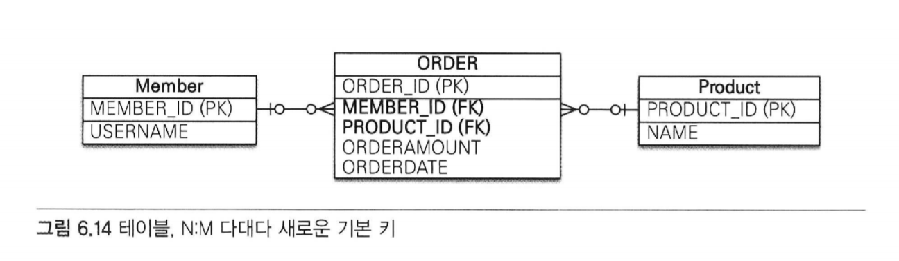

```java
@Entity
public class Order {
    
    @Id @GeneratedValue
    @Column(name = "ORDER_ID")
    private Long id;
    
    @ManyToOne
    @JoinColumn(name = "MEMBER_ID")
    private Member member;
    
    @ManyToOne
    @JoinColumn(name = "PRODUCT_ID")
    private Product product;
    
    private int orderAmount;
    
    ...
}
```
- 대리 키를 사용함으로써 복합 키를 사용하는 것보다 매핑이 단순하고 이해하기 쉬움.

```java
@Entity
public class Member {

    @Id
    @Column(name = "MEMBER_ID")
    private Long id;

    @OneToMany(mappedBy = "member")
    private List<Order> orders = new ArrayList<Order>();

    ...
}

@Entity
public class Product {

    @Id @Column(name = "PRODUCT_ID")
    private String id;
    private String name;

    ...
}
```
- 회원 엔티티와 상품 엔티티는 변경사항이 없다.

### 6.4.5 다대다 연관관계 정리
- 다대다 관계를 일대다 관계로 풀어내기 위해 연결 테이블을 만들 때 식별자를 어떻게 구성할지 선택해야 함
  - 식별 관계: 받아온 식별자를 기본 키 + 외래 키로 사용한다.
  - 비식별 관계: 받아온 식별자를 외래 키로만 사용하고 새로운 식별자를 추가한다.
  
