# 자바 ORM 표준 JPA 프로그래밍

# 목차
- [01. JPA 소개](#01.-JPA-소개)
  - 1.1 [SQL을 직접 다룰 때 발생하는 문제점](#1.1-SQL을-직접-다룰-때-발생하는-문제점)
  - 1.2 [패러다임의 불일치](#1.2-패러다임의-불일치)
  - 1.3 [JPA란 무엇인가?](#1.3-JPA란-무엇인가?)
  - 1.4 [JPA를 사용하는 이유](#1.4-JPA를-사용하는-이유)

- [03. 영속성 관리](#03.-영속성-관리)
  - 3.1 [영속성 컨텍스트(persistence context)]()
  - 3.2 [엔티티 생명주기]()
  - 3.3 [영속성 컨텍스트의 특징]()
    - 3.3.1 [엔티티 조회]()
    - 3.3.2 [엔티티 등록]()
    - 3.3.3 [엔티티 수정]()
    - 3.3.4 [엔티티 삭제]()
  - 3.4 [플러시]()
    - 3.4.1 [플러시 모드 옵션]()
  - 3.5 [준영속]()
    - 3.5.1 [준영속 상태의 특징]()
    - 3.5.2 [병합: merge()]()

- [04. 엔티티 매핑]()
  - 4.1 [@Entity]()
  - 4.2 [@Table]()
  - 4.3 [다양한 매핑 사용]()
  - 4.4 [데이터베이스 스키마 자동 생성]()
  - 4.5 [DDL 생성 기능]()
  - 4.6 [기본 키 매핑]]()
    - 4.6.1 [기본 키 직접 할당 전략]()
    - 4.6.2 [IDENTITY 전략]()
    - 4.6.3 [AUTO 전략]()

- [05. 연관관계 매핑 기초]()
  - 5.1 [단방향 연관관계]()
    - 5.1.1 [객체 관계 매핑]()
  - 5.2 [양방향 연관관계]()
    - 5.2.1 [일대다 컬렉션 조회]()
  - 5.3 [연관관계의 주인]()
    - 5.3.1 [양방향 매핑의 규칙: 연관관계의 주인]()
    - 5.3.2 [연관관계의 주인은 외래 키가 있는 곳]()
  - 5.4 [양방향 연관관계 저장]()
  - 5.5 [양방향 연관관계의 주의점]()
    - 5.5.1 [순수한 객체까지 고려한 양방향 연관관계]()
    - 5.5.2 [연관관계 편의 메소드]()
    - 5.5.3 [연관관계 편의 메소드 작성 시 주의사항]()

- [06. 다양한 연관관계 매핑]()
  - 6.1 [다대일]()
    - 6.1.1 [다대일 단방향]()
    - 6.1.2 [다대일 양방향]()
  - 6.2 [일대다]()
    - 6.2.1 [일대다 단방향]()
    - 6.2.2 [일대다 양방향]()
  - 6.3 [일대일]()
    - 6.3.1 [주 테이블에 외래 키]()
    - 6.3.2 [대상 테이블에 외래 키]()
  - 6.4 [다대다]()
    - 6.4.1 [다대다: 단방향]()
    - 6.4.2 [다대다: 양방향]()
    - 6.4.3 [다대다: 매핑의 한계와 극복, 연결 엔티티 사용]()
    - 6.4.4 [다대다: 새로운 기본 키 사용]()
    - 6.4.5 [다대다 연관관계 정리]()

- [07. 고급매핑]()
  - 7.1 [상속 관계 매핑]()
    - 7.1.1 [조인 전략]()
    - 7.1.2 [단일 테이블 전략]()
    - 7.1.3 [구현 클래스마다 테이블 전략]()
  - 7.2 [@MappedSuperclass]()
  - 7.3 [복합 키와 식별 관계 매핑]()
    - 7.3.1 [식별 관계 vs 비식별 관계]()
    - 7.3.2 [비식별 관계 - 복합 키를 사용하는 비식별 관계]()
    - 7.3.3 [식별 관계 - 복합 키를 사용하는 식별 관계]()
    - 7.3.4 [비식별 관계로 구현]()
    - 7.3.5 [일대일 식별 관계]()
    - 7.3.6 [식별, 비식별 관계의 장단점]()
  - 7.4 [조인 테이블]()
    - 7.4.1 [일대일 조인 테이블]()
    - 7.4.2 [일대다 조인 테이블]()
    - 7.4.3 [다대일 조인 테이블]()
  - 7.5 [엔티티 하나에 여러 테이블 매핑]()

- [08 프록시와 연관관계 관리]()
  - 8.1 [프록시]()
    - 8.1.1 [프록시 기초]()
    - 8.1.2 [프록시와 식별자]()
    - 8.1.3 [프록시 확인]()
  - 8.2 [즉시 로딩과 지연 로딩]()
    - 8.2.1 [즉시 로딩(EAGER LOADING)]()
    - 8.2.2 [지연 로딩]()
    - 8.2.3 [즉시 로딩, 지연 로딩 정리]()
  - 8.3 [지연 로딩 활용]()
    - 8.3.1 [프록시와 컬렉션 래퍼]()
    - 8.3.2 [JPA 기본 페치 전략]()
    - 8.3.3 [컬렉션에 FetchType.EAGER 사용 시 주의점]()
    - 8.4.1 [영속성 전이: 저장]()
    - 8.4.2 [영속성 전이: 삭제]()
    - 8.4.3 [CASECADE의 종류]()
  - 8.4 [영속성 전이: CASCADE]()
  - 8.5 [고아 객체]()
  - 8.6 [영속성 전이 + 고아 객체, 생명주기]()
  - 8.7 [정리]()

# 01. JPA 소개
## 1.1 SQL을 직접 다룰 때 발생하는 문제점
- 진정한 의미의 계층 분할이 어렵다
- 엔티티를 신뢰할 수 없다.
- SQL에 의존적인 개발을 피하기 어렵다.
- 테이블의 필드에 변경이 있다면 DAO의 CRUD 코드와 SQL 대부분을 변경해야 하는 문제 발생
## 1.2 패러다임의 불일치
객체와 관계형 데이터베이스는 지향하는 목적이 서로 다르므로 둘의 기능과 표현 방법이 다르다. 이것을 객체와 관계형 데이터베이스의 패러다임 불일치 문제라고 한다. <br>
이러한 패러다임 불일치를 극복하기위해 개발자는 너무 많은 시간과 코드를 소비하고 객체 모델링은 힘을 잃고 점점 데이터 중심의 모델로 변해간다.
## 1.3 JPA란 무엇인가?
JPA (Java Persistence API)
-  자바 ORM 기술에 대한 API 표준 명세다.
- 지루하고 반복적인 CRUD SQL을 알아서 처리해준다.
- 객체 모델링과 관계형 데이터 사이의 차이점을 해결해준다.
## 1.4 JPA를 사용하는 이유
- 생산성
    - JPA를 사용하면 자바 컬렉션에 객체를 저장하듯이 JPA에게 저장할 객체를 전달하면 된다.
    - 데이터베이스 설계 중심의 패러다임을 객체 중심으로 역전시킬 수 있다.
- 유지보수
    - SQL에 의존적인 개발시 엔티티에 필드를 하나만 추가해도 관련된 등록, 수정, 조회 SQL과 결과를 매핑하기 위한 JDBC API 코드를 모두 변경해야 한다.
    - JPA를 사용하면 이런 과정을 대신 처리해주기 때문에 필드의 변경 시 수정해야 할 코드가 줄어든다.
    - 객체지향 언어가 가진 장점들을 활용해서 유연하고 유지보수하기 좋은 도메인 모델을 편리하게 설계할 수 있다.
- 패러다임의 불일치 해결
    - JPA는 상속, 연관관계, 객체 그래프 탐색, 비교하기와 같은 패러다임의 불일치 문제를 해결해준다.
- 성능
    - JPA는 애플리케이션과 데이터베이스 사이에서 다양한 성능 최적화 기회를 제공한다.
- 데이터 접근 추상화와 벤더 독립성
    - JPA는 애플리케이션과 데이터베이스 사이에 추상화된 데이터 접근 계층을 제공해서 애플리케이션이 특정 데이터베이스 기술에 종속되지 않도록 한다.
  
# 03. 영속성 관리
## 3.1 영속성 컨텍스트(persistence context)
- 엔티티를 영구 저장하는 환경
```java
em.persist(member);
```
- persist() 메소드는 엔티티 매니저를 사용해서 회원 엔티티를 영속성 컨텍스트에 저장한다.

## 3.2 엔티티 생명주기
- 비영속 (new/transient) : 영속성 컨텍스트와 전혀 관계가 없는 상태
  - 엔티티 객체를 생성한 상태이며 em.persist() 호출 전 상태이다.
  - 영속성 컨텍스트나 데이터베이스와는 전혀 관련이 없다.
  ```java
  //객체를 생성한 상태 (비영속)
  Member member = new Member();
  member.setId("member1);
  member.setUsername("회원1);
  ```
- 영속 (managed) : 영속성 컨텍스트에 저장된 상태
  - 엔티티 매니저를 통해서 엔티티를 영속성 컨텍스트에 저장한 상태.
  - 영속 상태라는 것은 영속성 컨텍스트에 의해 관리된다는 뜻이다.
  ```java
  //객체를 저장한 상태(영속)
  em.persist(member);
  ```
- 준영속 (detached) : 영속성 컨텍스트에 저장되었다가 분리된 상태
  - 영속성 컨텍스트가 관리하던 영속 상태의 엔티티를 영속성 컨텍스트가 관리하지 않은 상태
  - em.detach(), em.close(), em.clear()를 호출하면 준영속 상태가 된다.
  ```java
  //회원 엔티티를 영속성 컨텍스트에서 분리, 준영속 상태
  em.detach(member);
  ```
- 삭제 (removed) : 삭제된 상태
  - 엔티티를 영속성 컨텍스트와 데이터베이스에서 삭제한다.
  ```java
  //객체를 삭제한 상태(삭제)
  em.remove(member);
  ```


## 3.3 영속성 컨텍스트의 특징
- 영속성 컨텍스트와 식별자 값
  - 영속성 컨텍스트는 엔티티를 식별자 값(@Id)로 구분한다.
  - 따라서 영속 상태는 식별자 값이 반드시 있어야 한다.
  - 식별자 값이 없으면 예외가 발생한다.
  
- 영속성 컨텍스트와 데이터베이스 저장
  - 영속성 컨텍스트에 엔티티를 저장하면 트랜잭션을 커밋하는 순간 이 엔티티를 데이터베이스에 반영한다.
  - 이것을 플러시(flush)라고 한다.
  
- 영속성 컨텍스트가 엔티티를 관리하면 생기는 장점
  - 1차 캐시
  - 동일성 보장
  - 트랜잭션을 지원하는 쓰기 지연
  - 변경 감지
  - 지연 로딩
  
### 3.3.1 엔티티 조회
- 영속 상태의 엔티티는 영속성 컨텍스트가 내부에 가지고 있는 1차 캐시에 저장된다.
- 영속성 컨텍스트 내부에 존재하는 Map = (키 : @Id로 매핑한 식별자, 값 : 엔티티 인스턴스)

```java
//엔티티를 생성한 상태(비영속)
Member member = new Member();
member.setId("member1");
member.setUsername("회원1);
```


### 1차 캐시에서 조회
```java
//엔티티 조회
Member member = em.finc(Member.class, "member1");
```

- 먼저 1차 캐시에서 엔티티를 찾는다 - 찾는 엔티티가 없다면?
- 데이터베이스에서 조회

### 데이터베이스에서 조회
- 1차 캐시에서 찾지 못하면 데이터베이스에서 조회해서 엔티티를 생성
- 그 후 1차 캐시에 저장하고 
- 영속 상태의 엔티티를 반환한다.


### ✔ member1, member2가 1차 캐시에 저장되었다.
- 다시 해당 엔티티를 조회하면 1차 캐시에서 바로 불러오기 때문에 성능상 이점을 누릴 수 있다.

### 영속 엔티티의 동일성 보장
```java
Member a = em.find(Member.class, "member1");
Member b = em.find(Member.class, "member1");

System.out.println(a == b);
// true
```
- member1은 영속상태이기 때문에 영속성 컨텍스트는 같은 엔티티 인스턴스를 반환하다.
- 영속성 컨텍스트는 성능상 이점과 엔티티의 동일성을 보장한다.

### 3.3.2 엔티티 등록
> 트랜잭션을 지원하는 쓰기 지연(transactional write-behind)
- 엔티티 매니저는 트랜잭션을 커밋하기 직전까지 데이터베이스에 엔티티를 저장하지 않고
내부 쿼리 저장소에 INSERT SQL을 모아두고
- 트랜잭션을 커밋하면 모아둔 쿼리를 데이터베이스에 보내는데 이것을
  트랜잭션을 지원하는 쓰기 지연이라고 한다.
  


- 트랜잭션을 지원하는 쓰기 지연은 모아둔 쿼리를 한번에 전달하기 때문에 성능을 최적화할 수 있다.

### 3.3.3 엔티티 수정
> 변경 감지
- JPA로 엔티티를 수정할 때는 엔티티를 조회한 후 데이터만 변경하면 된다.
- update() 같은 메소드를 실행할 필요가 없다.
- 엔티티의 변경사항을 데이터베이스에 자동으로 반영하는 기능인 변경 감지 덕분이다.
### 변경 감지의 순서
1. 트랜잭션을 커밋한다.
2. 엔티티 매니저 내부에서 플러시(flush()) 호출
3. 엔티티와 스냅샷을 비교하여 변경된 엔티티를 찾는다.
4. 변경된 엔티티가 있다면 수정 쿼리를 생성하여 쓰기 지연 SQL 저장소로 보낸다.
5. 쓰기 지연 저장소의 SQL을 데이터베이스에 보낸다.
6. 데이터베이스 트랜잭션을 커밋한다.
- 변경 감지는 영속성 컨텍스트가 관리하는 영속 상태의 엔티티에만 적용된다.
### JPA의 기본 전략은 엔티티의 모든 필드를 업데이트한다.
#### 장점 👍
- 모든 필드를 사용하면 수정 쿼리가 항상 같다.
  - 애플리케이션 로딩 시점에 수정 쿼리를 미리 생성해두고 재사용할 수 있음
  
- 데이터베이스에 동일한 쿼리를 보내면 데이터베이스는 한 번 파싱된 쿼리를 재사용할 수 있다.

#### 단점 👎
- 데이터베이스에 보내는 데이터 전송량이 증가한다.

### 하이버네이트 확장 기능
- 필드가 많거나 저장되는 내용이 너무 클 때 사용한다.
```java
@Entity
@org.hibernate.annotations.DynamicUpdate
@Table(name = "Member")
public class Member { }
```
참고) 
- @DynamicInsert  
  - 데이터 저장시 데이터가 존재하는 필드만으로 INSERT SQL을 동적으로 생성한다.
  
### 3.3.4 엔티티 삭제
```java
Member memberA = em.find(Member.class, "memberA); //엔티티 조회
em.remove(memberA); //엔티티 삭제
```
- 엔티티 조회 후 삭제한다.

## 3.4 플러시
플러시는 영속성 컨텍스트의 변경 내용을 데이터베이스에 반영한다.
1. 변경 감지가 동작하여 영속성 컨텍스트안에 있는 모든 엔티티를 스냅샷(처음 저장된 값)과 비교한다.
2. 수정된 값이 있다면 수정 쿼리를 만들어 쓰기 지연 SQL 저장소에 등록한다.
3. 쓰기 지연 SQL 저장소의 쿼리를 데이터베이스에 전송한다.

영속성 컨텍스트를 플러시하는 방법
1. 직접 호출
   - em.flush() 메소드를 직접 호출한다.
   - 테스트나 다른 프레임워크와 JPA를 함께 사용할 때를 제외하곤 거의 사용하지 않음
2. 트랜잭션 커밋 시 플러시 자동 호출
   - 데이터베이스에 변경 내용을 SQL 전달없이 트랜잭션만 커밋하게 되면 반영되지 않는다.
   - 따라서 커밋전 플러시 호출이 필수적이다.
   - JPA는 커밋할 때 자동으로 플러시를 호출한다.
3. JPQL 쿼리 실행 시 플러시 자동 호출
   - JPQL이나 Creteria 같은 객체지향 쿼리를 호출할 때 자동으로 호출된다.
  
### 3.4.1 플러시 모드 옵션
- FlushModeType.AUTO : 커밋이나 쿼리를 실행할 때 플러시(기본값)
- FlushModeType.COMMIT : 커밋할 때만 플러시

## 3.5 준영속
- 영속 상태의 엔티티를 준영속 상태로 만드는 방법
1. em.detach(entity) : 특정 엔티티만 준영속 상태로 전환한다.
2. em.clear() : 영속성 컨텍스트를 완전히 초기화한다.
3. em.close() : 영속성 컨텍스트를 종료한다.
- 영속 상태의 엔티티는 주로 영속성 컨텍스트가 종료되면서 준영속 상태가 됨.
- 개발자가 직접 준영속 상태로 만드는 일은 드물다.

### 3.5.1 준영속 상태의 특징
- 거의 비영속 상태에 가깝다.
  - 영속성 컨텍스트가 관리하지 않기 때문에 영속성 컨텍스트가 제공하는 어떠한 기능도 동작하지 않는다.
- 식별자 값을 가지고 있다.
  - 비영속 상태는 식별자 값이 없을 수도 있지만 준영속 상태는 영속 상태 였기 때문에
  - 반드시 식별자 값을 가지고 있다.
- 지연 로딩을 할 수 없다.
  - 지연 로딩은 실제 객체 대신 프록시 객체를 로딩해두고 해당 객체를 실제 사용할 때 영속성 컨텍스트를 통해 데이터를 불러오는 방법이다.
  - 준영속 상태는 영속성 컨텍스트가 관리하지 않기 때문에 지연 로딩 시 문제가 발생한다.
  
### 3.5.2 병합: merge()
- 준영속 상태의 엔티티를 다시 영속 상태로 변경하기 위한 방법
```java
Member mergeMember = em.merge(member);
```
1. merge()를 실행한다.
2. 파라미터로 넘어도 준영속 엔티티 식별자 값으로 1차 캐시에서 엔티티를 조회한다. 
   - 1차 캐시에 엔티티가 없으면 조회 후 1차 캐시에 저장한다.
3. 조회한 영속 엔티티에 값을 채워 넣는다.
4. mergeMember를 반환한다.
- 병합은 준영속, 비영속을 신경 쓰지 않는다.
- 병합은 조회할 수 있으면 불러서 조회하고
- 조회할 수 없으면 새로 생성해서 병합한다.
- 따라서 save or update 기능을 수행한다.

# 04. 엔티티 매핑

## 4.1 @Entity
- JPA를 사용해서 테이블과 매핑할 클래스는 @Entity 어노테이션을 필수로 붙여야 한다.

### @Entity 속성
|속성|기능|기본값|
|:---:|:---:|:---:|
|name|JPA에서 사용할 엔티티 이름을 지정한다. 보통 기본값인 클래스 이름을 사용함. 만약 다른 패키지에 이름이 같은 엔티티 클래스가 있다면 이름을 지정해서 충돌하지 않도록 해야 한다.|클래스 이름 (예: Member)|

### @Entity 적용 시 주의사항
- 기본 생성자는 필수
- final 클래스, enum, interface, inner 클래스에서는 사용할 수 없다.
- 저장할 필드에 final을 사용하면 안 된다.

## 4.2 @Table
- @Table은 엔티티와 매핑할 테이블을 지정한다.
- 생략하면 매핑한 엔티티 이름을 테이블 이름으로 사용한다.

### @Table 속성
|속성|기능|기본값|
|---|---|---|
|name|매핑할 테이블 이름|엔티티 이름을 사용한다.|
|catalog|catalog 기능이 있는 데이터베이스에서 catalog를 매핑한다.|
|schema|schema 기능이 있는 데이터베이스에서 schema를 매핑한다.|
|uniqueConstraints(DDL)|DDL 생성 시에 유니크 제약조건을 만든다. 2개 이상의 복합 유니크 제약조건도 만들 수 있다. 참고로 이 기능은 스키마 자동 생성 기능을 사용해서 DDL을 만들 때만 사용된다.|

## 4.3 다양한 매핑 사용
- 회원 관리 프로그램에 다음 요구사항이 추가되었다.
  - 회원은 일반회원과 관리자로 구분해야 한다.
  - 회원 가입일과 수정일이 있어야 한다.
  - 회원을 설명할 수 있는 필드가 있어야 한다. 이 필드는 길이 제한이 없다.

Member
```java
import lombok.Getter;
import lombok.NoArgsConstructor;

import javax.persistence.*;
import java.util.Date;

@Entity
@NoArgsConstructor
@Getter
@Table(name = "MEMBER")
public class Member {

    @Id
    @Column(name = "ID")
    private Long id;

    @Column(name = "NAME")
    private String username;

    private Integer age;

    // ==추가==
    @Enumerated(EnumType.STRING)
    private RoleType roleType;

    @Temporal(TemporalType.TIMESTAMP)
    private Date createdDate;

    @Temporal(TemporalType.TIMESTAMP)
    private Date lastModifiedDate;

    @Lob
    private String description;
}
```
RoleType
```java
public enum RoleType {
    AMDIN, USER
}
```
- roleType
  - 자바의 enum을 사용해서 회원의 타입을 구분했다.
  - 일반 회원은 USER, 관리자는 ADMIN
  - 자바의 enum을 사용하려면 @Enumerated 어노테이션으로 매핑해야 한다.
  
- createdDate, lastModifiedDate
  - 자바의 날짜 타입은 @Temporal을 사용해서 매핑한다.
  
- description
  - 회원을 설명하는 필드는 길이 제한이 없다.
  - 따라서 데이터베이스의 VARCHAR 타입 대신에 CLOB 타입으로 저장해야 한다.
  - @Lob을 사용하면 CLOB, BLOB 타입을 매핑할 수 있다.
  
## 4.4 데이터베이스 스키마 자동 생성
- 클래스의 매핑 정보를 보면 어떤 테이블에 어떤 컬럼을 사용하는지 알 수 있다.
- JPA는 이 매핑 정보와 데이터베이스 방언을 사용해서 데이터베이스 스키마를 생성한다.
  

- 생성전 application.properties에 아래 코드를 추가한다.
- 콘솔에 실행되는 테이블 생성 DDL을 출력할 수 있다.
```properties
spring.jpa.show-sql=true
```

```h2
Hibernate:
    drop table if exists member

Hibernate::
  create table member (
      id bigint not null, 
      age integer, 
      created_date datetime, 
      description longtext, 
      last_modified_date datetime, 
      role_type varchar(255), 
      name varchar(10) not null, 
      primary key (id)
  ) engine=InnoDB
```
- 실행된 결과에서 기존 테이블을 삭제하고 다시 생성한 것을 볼 수 있다.
- roleType은 VARCHAR 타입, createDate, lastModifiedDate 는 TIMESTAMP 타입, description은 LONGTEXT 타입으로 생성

## 4.5 DDL 생성 기능
- 회원 이름은 필수로 입력되어야 하고, 10자를 초과하면 안 된다는 제약조건이 추가되었다면?
```java
@Column(name = "NAME", nullable = false, length = 10)
private String username;
```
- @Column 매핑정보의 nullable 속성 값을 false로 지정하면 자동 생성되는 DDL에 not null 제약조건을 추가할 수 있다.
- length 속성 값을 사용하면 자동 생성되는 DDL에 문자의 크기를 지정할 수 있다.


### @Table의 uniqueConstraints 속성
```java
@Entity
@NoArgsConstructor
@Getter
@Table(name = "MEMBER", uniqueConstraints = {@UniqueConstraint(
        name = "NAME_AGE_UNIGQUE",
        columnNames = {"NAME", "AGE"}
)})
public class Member {
}
```
```h2
alter table member add constraint NAME_AGE_UNIGQUE unique (name, age)
```
- 유니크 제약조건이 추가되었다.
- 이러한 @Column의 length와 nullable 속성들은 단지 DDL을 자동 생성할 때만 사용되고 JPA의 실행 로직에는 영향을 주지 않는다.
- 스키마 자동 생성 기능을 사용하지 않고 직접 DDL을 만든다면 사용할 이유가 없음.
- but, 이 기능을 사용하면 애플리케이션 개발자가 엔티티만 보고도 손쉽게 제약조건을 파악할 수 있다.

## 4.6 기본 키 매핑
- 직접 할당: 기본 키를 애플리케이션에서 직접 할당한다.
- 자동 생성: 대리 키 사용 방식
  - IDENTITY: 키본 키 생성을 데이터베이스에 위임한다.
  - SEQUENCE: 데이터베이스 시퀀스를 사용해서 기본 키를 할당한다.
  - TABLE: 키 생성 테이블을 사용한다.
  
### 4.6.1 기본 키 직접 할당 전략
```java
@Id
@Column(name = "ID")
private Long id;
```
#### @Id 적용 가능 자바 타입
- 자바 기본형
- 자바 래퍼형
- String
- java.util.Date
- java.sql.Date
- java.math.BigDecimal
- java.math.BigInteger

### 4.6.2 IDENTITY 전략
```java
@Id
@Column(name = "ID")
@GeneratedValue(strategy = GenerationType.IDENTITY)
private Long id;
```
- 엔티티가 영속 상태가 되려면 식별자가 반드시 필요하다.
- IDENTITY 식별자 생성 전략은 엔티티 데이터베이스에 저장해야 식별자를 구할 수 있다.
- 따라서 em.persist()를 호출하는 즉시 INSERT SQL이 데이터베이스에 전달된다.
- 이 전략은 트랜잭션을 지원하는 쓰기 지연이 동작하지 않는다.

### 4.6.3 AUTO 전략
```java
@Id
@Column(name = "ID")
@GeneratedValue(strategy = GenerationType.AUTO)
private Long id;
```
- GenerationType.AUTO는 선택한 데이터베이스 방언에 따라 자동 생성 전략 중 하나를 선택한다.

#### 권장하는 식별자 선택 전략
데이터베이스 기본 키는 다음 3가지 조건을 모두 만족해야 한다.
1. null값은 허용하지 않는다.
2. 유일해야 한다.
3. 변해선 안 된다.

테이블의 기본 키를 선택하는 전략
- 자연 키
  - 비즈니스에 의미가 있는 키
  - ex) 주민등록번호, 이메일, 전화번호
  
- 대리 키
  - 비즈니스와 관련 없는 임의로 만들어진 키, 대체 키라고도 불림
  - ex) auto_increment, 키생성 테이블 사용
  
#### ❗ 자연 키보다는 대리 키를 권장한다.
- 자연 키인 전화번호를 기본 키로 선택한다면, 그 번호가 유일할 수는 있지만
- 전화번호가 없을수도 있고 전화번호가 변경될 수도 있다.
#### ❗ 비즈니스 환경은 언젠가 변한다.
#### ❗ JPA는 모든 엔티티에 일관된 방식으로 대리 키 사용을 권장한다.

🔗 [@Entity 엔티티 필드와 컬럼 매핑용 어노테이션 정리](https://steel-blue.tistory.com/55)

# 05. 연관관계 매핑 기초
- 🚩 목표 : 객체의 참조와 테이블의 외래 키를 매핑하는 것
- 연관관계 매핑을 이해하기 위한 핵심 키워드
  - 방향 | 객체관계에만 존재. 테이블 관계는 항상 양방향이다.
    - 단방향 : 회원 -> 팀 OR 팀 -> 회원
    - 양방향 : 회원 -> 팀 AND 팀 -> 회원
  - 다중성
    - 다대일 (N:1)
    - 일대다 (1:N)
    - 일대일 (1:1)
    - 다대다 (N:N)
  - 연관관계의 주인
    - 객체를 양방향 연관관계로 만들면 연관관계의 주인을 정해야 한다.
  
## 5.1 단방향 연관관계


- 회원과 팀의 관계로 알아보는 다대일 단방향 관계
  - 회원과 팀이 있다.
  - 회원은 하나의 팀에만 소속될 수 있다.
  - 회원과 팀은 다대일 관계다.
  
- 객체 연관관계
  - 회원 객체는 Member.team 필드로 팀 객체와 연관관계를 맺는다.
  - 회원 객체와 팀 객체는 단방향 관계다.
    - 회원은 Member.team 필드를 통해 팀을 알 수 있다.
      - member -> team 조회 : member.getTeam()
    - 팀은 회원을 알 수 없다.
      - team -> member 접근하는 필드 없음
  
- 테이블 연관관계
  - 회원 테이블은 TEAM_ID 외래 키로 팀 테이블과 연관관계를 맺는다.
  - 회원 테이블과 팀 테이블은 양방향 관계
    - 회원 테이블의 TEAM_ID 외래 키를 통해 회원과 팀을 조인할 수 있다.
    - 팀과 회원도 조인할 수 있다.
  
- 객체 연관관계와 테이블 연관관계의 가장 큰 차이
  - 참조를 통한 연관관계는 언제나 단방향이다.
  - 양방향으로 만들고 싶다면? 반대쪽에도 필드를 추가하여(연관관계) 참조를 보관해야 함.
  - 양반향 관계라기보다는 서로 다른 단방향 관계 2개..
  
- 객체 연관관계 vs 테이블 연관관계 정리
  - 객체는 참조(주소)로 연관관계를 맺음
  - 테이블은 외래 키로 연관관계 맺음
  - 참조를 사용하는 객체의 연관관계는 단방향
    - A -> B (a,b)
  - 외래 키를 사용하는 테이블의 연관관계는 양방향
    - A JOIN B 가 가능하면 반대로 B JOIN A 도 가능
  - 객체를 양방향으로 참조하려면 단방향 연관관계를 2개 만들어야 한다.
    - A -> B (a,b)
    - B -> A (b,a)
  
### 5.1.1 객체 관계 매핑
```java
@Entity
@Getter
@NoArgsConstructor
public class Member2 {
    
    @Id
    @Column(name = "MEMBER_ID")
    private String id;
    
    private String username;

    @ManyToOne
    @JoinColumn(name="TEAM_ID")
    private Team team;  //팀의 참조를 보관

    public Member2(String id, String username) {
        this.id = id;
        this.username = username;
    }

    public void setTeam(Team team) {
        this.team = team;
    }
}

@Entity
@NoArgsConstructor
@Getter
public class Team {

  @Id
  @Column(name = "TEAM_ID")
  private String id;

  private String name;

  public Team(String id, String name) {
    this.id = id;
    this.name = name;
  }
}
```
- 객체 연관관계: 회원 객체의 Member.team 필드 사용
- 테이블 연관관계: 회원 테이블의 MEMBER.TEAM_ID 외래 키 컬럼을 사용
```java
    @ManyToOne
    @JoinColumn(name="TEAM_ID")
    private Team team;
```
- @ManyToOne
  - 다대일(N:1) 관계라는 매핑 정보이다.
  - 회원과 팀은 다대일 관계이다.
  - 연관관계를 매핑 시 다중성을 나타내는 어노테이션 필수
  
- @JoinColumn(name="TEAM_ID")
  - 조인 컬럼은 외래 키를 매핑할 때 사용.
  - 생략 가능
  - name 속성에는 매핑할 외래 키 이름을 지정한다.
  - 회원과 팀 테이블은 TEAM_ID 외래 키로 연관관계를 맺으므로 이 값을 지정하면 된다.
  
🔗 [연관관계 매핑 어노테이션 정리](https://steel-blue.tistory.com/56)

## 5.2 양방향 연관관계
- 팀에서 회원으로 접근하는 관계를 추가해보자.


  
- 회원과 팀은 다대일 관계
- 팀에서 회원은 일대다 관계
  - 일대다 관계는 여러 건과 연관관계를 맺을 수 있으므로 컬렉션을 사용해야 한다.
    - Team.members를 List 컬렉션으로 추가했다.
  
- 회원 -> 팀 (Member.team)
- 팀 > 회원 (Team.members)
- 💡 JPA는 List를 포함해서 Collection, Set, Map 같은 다양한 컬렉션을 지원한다. (14.1절)

```java
public class Team {

    @Id
    @Column(name = "TEAM_ID")
    private String id;

    private String name;
    
    //추가
    @OneToMany (mappedBy = "team")
    private List<Member2> members = new ArrayList<Member2>();

    public Team(String id, String name) {
        this.id = id;
        this.name = name;
    }
}
```
- Team클래스에 OneToMany 추가
- 팀과 회원은 일대다 관계다.
- 따라서 팀 엔티티에 컬렉션인 List를 추가 했다.
- 또, 일대다 관계를 매핑하기 위해 @OneToMany 매핑 정보를 사용했다.
- mappedBy 속성은 양방향 매핑일 때 사용하는데 반대쪽 매핑의 필드 이름을 값으로 주면 된다.
- 반대쪽 매핑이 Member.team이므로 team을 값으로 주었다.

### 5.2.1 일대다 컬렉션 조회
```java
Team team = em.find(Team.class, "team1");
List<Member2> members = team.getMembers();
```

## 5.3 연관관계의 주인
### mappedBy 속성이 필요한 이유

- 객체에는 양방향 연관관계라는 것은 없다.
- 서로 다른 단방향 연관관계 2개를 애플리케이션 로직으로 잘 묶어서 양방향인 것처럼 보이게 할 뿐.


- 객체 연관관계
  - 회원 -> 팀 연관관계 1개(단방향)
  - 팀 -> 회원 연관관계 1개(단방향)
  
- 테이블 연관관계
  - 회원 <-> 팀의 연관관계 1개(양방향)
  
- 테이블은 외래 키 하나로 두 테이블의 연관관계를 관리한다.
- 엔티티를 단방향으로 매핑하면 참조를 하나만 사용하므로,
  - 이 참조로 외래 키를 관리하면 된다.
  
- but, 엔티티를 양방향으로 매핑하면
  - 회원 -> 팀 , 팀 -> 회원 두곳에서 서로를 참조한다.
  - 따라서 객체의 연관관계를 관리하는 포인트는 2곳으로 늘어난다.
  

- 엔티티를 양방향 연관관계로 설정하면 객체의 참조는 둘인데 외래 키는 하나다.
- 따라서 둘 사이에 차이가 발생한다.

- 이러한 차이로 인해 JPA에서는 두 객체 연관관계 중 하나를 정해, 테이블의 외래키를 관리해야 하는데
이것을 연관관계의 주인이라 한다.
  
### 5.3.1 양방향 매핑의 규칙: 연관관계의 주인
- 양방향 연관관계 매핑 시 지켜야 할 규칙
  - 두 연관관계 중 하나를 연관관계의 주인으로 정해야 함.
  
- 연관관계의 주인만이 데이터베이스 연관관계와 매핑되고 
외래 키를 등록할 수 있다. 
  
- 반면에 주인이 아닌 쪽은 읽기만 할 수 있다.
- 어떤 연관관계를 주인으로 정할지는 mappedBy 속성을 사용하면 된다.

- 주인은 mappedBy 속성을 사용하지 않는다.
- 주인이 아니면 mappedBy 속성을 사용해서 속성의 값으로 연관관계의 주인을 지정해야 한다.


- 회원 -> 팀 (Member.team) 방향
```java
class Member {
  @ManyToOne
  @JoinColumn (name="TEAM_ID")
  private Team team;
  ...
}
```

- 팀 -> 회원 (Team.members) 방향
```java
class Team {
  @OneToMany
  private List<Member2> members = new ArrayList<Member>();
}
```
- 연관관계의 주인을 정한다는 것은 외래 키 관리자를 선택하는 것이다.
- 여기서는 회원 테이블에 있는 TEAM_ID 외래 키를 관리할(등록, 수정, 삭제..) 관리자를 선택해야 한다.


- 회원 엔티티에 있는 Member.team을 주인으로 선택하면?
  - 자기 테이블에 있는 외래 키를 관리하면 됨.
  
- 팀 엔티티에 있는 Team.members를 주인으로 선택하면?
  - 물리적으로 전혀 다른 테이블의 외래 키를 관리해야 한다
    - why? Team.members가 있는 Team 엔티티는 TEAM 테이블에 매핑되어 있는데
  관리해야할 외래 키는 MEMBER 테이블에 있기 때문
      

### 5.3.2 연관관계의 주인은 외래 키가 있는 곳
- 연관관계의 주인은 테이블에 외래 키가 있는 곳으로 정해야 한다.
- 여기서는 회원 테이블이 외래 키를 가지고 있으므로 Member.team이 주인이 된다.


- 주인이 아닌 Team.members에는 mappedBy="team" 속성을 사용해서 주인이 아님을 설정한다.
- 그리고 mappedBy 속성의 값으로는 연관관계의 주인인 team을 주면 된다.
- 여기서 mappedBy의 값으로 사용된 team은 연관관계의 주인인 Member 엔티티의 team 필드를 말함.


## 5.4 양방향 연관관계 저장
- 양방향 연관관계는 연관관계의 주인이 외래 키를 관리함.
- 따라서 주인이 아닌 방향은 값을 설정하지 않아도 데이터베이스에 외래 키 값이 정상 입력된다.

```java
team1.getMembers().add(member1); // 무시됨
```
- Team.members는 연관관계의 주인이 아니기 때문에 
주인이 아닌 곳에 입력된 값은 외래 키에 영향을 주지 않는다.
  
```java
member1.setTeam(team1); // 연관관계 설정(연관관계의 주인)
```
- Member.team은 연관관계의 주인이기 때문에 엔티티 매니저는 이곳에 입력된 값을 사용해서 외래 키를 관리한다.


## 5.5 양방향 연관관계의 주의점
### 5.5.1 순수한 객체까지 고려한 양방향 연관관계
- 객체 관점에서 양쪽 방향에 모두 값을 입력해주는 것이 가장 안전하다.
### 5.5.2 연관관계 편의 메소드
- 양방향 연관관계는 결국 양쪽 다 신경 써야 한다.
- Member 클래스의 setTeam() 메소드를 수정하여 코드를 리팩토링한다.
```java
public void setTeam(Team team) {
        this.team = team;
        team.getMembers().add(this);
    }
```
- 이렇게 한 번에 양방향 관계를 설정하는 메소드를 연관관계 편의 메소드라 한다.

### 5.5.3 연관관계 편의 메소드 작성 시 주의사항
```java
member1.setTeam(teamA);
member1.setTeam(teamB);
Member findMember = teamA.getMember();
```
- 이 시나리오를 그림으로 분석.
- 먼저 member1.setTeam(teamA)를 호출한 직후


- member1.setTeam(teamB); 호출 직후


### 문제점
- teamB로 변경할 때 teamA -> member1 관계를 제거하지 않았다.
- 연관관계를 변경할 때는 기존 팀이 있으면 기존 팀과 회원의 연관관계를 삭제하는 코드를 추가해야 한다.
```java
    public void setTeam(Team team) {
        // 기존 팀과 관계를 제거
        if(this.team != null) {
            this.team.getMembers().remove(this);
        }
        this.team = team;
        team.getMembers().add(this);
    }
```


### 📌 정리
- 단방향 매핑만으로 테이블과 객체의 연관관계 매핑은 이미 완료되었다.
- 단방향을 양방향으로 만들면 반대방향으로 객체 그래프 탐색 기능이 추가된다.
- 양방향 연관관계를 매핑하려면 객체에서 양쪽 방향을 모두 관리해야 한다.


# 06. 다양한 연관관계 매핑
## 6.1 다대일
- 다대일 관계의 반대 방향 > 일대다
- 일대다 관계의 반대 방향 > 다대일
- 일(1), 다(N) 관계의 외래 키 > 항상 다(N) 
### 6.1.1 다대일 단방향
```java
Member
    @ManyToOne
    @JoinColumn(name="TEAM_ID")
    private Team team;  //팀의 참조를 보관
        
Team
    @Id
    @Column(name = "TEAM_ID")
    private String id;
    
    private String name;
```    
- Member 객체엔 Member.team으로 팀 엔티티를 참조할 수 있다.
- Team 에서는 Member 객체를 참조할 수 없다.
- 이것이 다대일 단방향 연관관계이다.
    
    
### 6.1.2 다대일 양방향
```java
Member
    @ManyToOne
    @JoinColumn(name="TEAM_ID")
    private Team team;  //팀의 참조를 보관
    
    public void setTeam(Team team) {
        this.team = team;
        
        if(!team.getMembers().contains(this)) {
            team.getMembers().add(this);
        }
    }

Team    
    @Id
    @Column(name = "TEAM_ID")
    private String id;

    private String name;

    @OneToMany (mappedBy = "team")
    private List<Member2> members = new ArrayList<Member2>();
    
    public void addMember (Member2 member) {
        this.members.add(member);
        if (member.getTeam() != this) {
            member.setTeam(this);
        }
    }
```
- 양방향은 외래 키가 있는 쪽이 연관관계의 주인이다.
  - 일대다, 다대일 연관관계는 항상 다(N)에 외래 키가 있음.
  - 여기선 Member가 외래 키를 가지고 있으므로 Member.team이 연관관계 주인
  - JPA의 외래키 관리 -> 연관관계의 주인만이 가능
    - 그럼 왜 Team에도 연관관계를?
      - Team.members는 조회를 위한 JPQL이나 객체 그래프를 탐색할 때 사용하기 위함
  
- 양방향 연관관계는 항상 서로를 참조해야 한다.
  - 어느 한 쪽만 참조하면 양방향 연관관계가 성립하지 않음.
  - 항상 서로 참조하기 위해선 연관관계 편의 메소드를 작성하는 것이 좋음.
    - ex) Member의 setTeam(), Team의 addMember()
  - 이때 무한루프에 빠지지 않도록 주의해야 함.
  
    
## 6.2 일대다
- 다대일 관계의 반대 방향.
- 일대다 관계는 엔티티를 하나 이상 참조할 수 있으므로 자바 컬렉션을 사용함.
### 6.2.1 일대다 단방향
- "하나의 팀은 여러 회원을 참조할 수 있다."
- 팀은 회원들은 참조하지만, 반대로 회원은 팀을 참조하지 않으면 둘의 관계는 단방향임.
- 엔티티의 Team.members로 회원 테이블의 TEAM_ID 외래 키를 관리함.
- 왜냐하면 일대다 관계에서 외래 키는 항상 다쪽 테이블에 있기 때문
- 하지만 다 쪽인 Member 엔티티에는 외래 키를 매핑할 수 있는 참조 필드가 없음.
- 대신 반대쪽인 Team 엔티티에만 참조 필드인 members가 있다.
- 따라서 반대편 테이블의 외래 키를 관리하는 특이한 모습이 나타남

### 🚩 일대다 단방향 매핑보다는 다대일 양방향 매핑을 사용하자


### 6.2.2 일대다 양방향
- 존재하지 않음.
- 사실 일대다 양방향과 다대일 양방향은 똑같은 말이다..
- 여기서는 왼쪽을 연관관계의 주인으로 가정해서 분류한 것.
- 일대다 단방향 매핑 반대편에 다대일 단방향 매핑을 읽기 전용으로 추가한 것.
## 6.3 일대일
- 일대일 관계는 양쪽이 서로 하나의 관계만 가진다.
  - ex) 회원은 하나의 사물함만 사용 / 사물함도 하나의 회원에 의해서만 사용됨
  

- 일대일 관계의 특징
  - 일대일 관계는 그 반대도 일대일 관계다.
  - 테이블 관계에서 일대다, 다대일은 항상 다(N)쪽이 외래 키를 가짐.
  - 반면, 일대일은 두 테이블 모두 외래키를 가짐
  
### 6.3.1 주 테이블에 외래 키
- 일대일 관계를 구성할 때 주 테이블에 외래 키가 있는 것을 선호함.
- JPA도 주 테이블에 외래 키가 있으면 좀 더 편리하게 매핑이 가능함.

### 단방향
```java
@Entity
public class User {
    
    @Id @GeneratedValue
    @Column (name = "USER_ID")
    private Long id;
    
    private String username;
    
    @OneToOne
    @JoinColumn(name = "LOCKER_ID")
    private Locker locker;
}

@Entity
public class Locker {
    
    @Id @GeneratedValue
    @Column(name = "LOCKER_ID")
    private Long id;
    
    private String name;
}
```
- 일대일 관계이므로 객체 매핑에 @OneToOne 사용
- 다대일 단방향과 거의 비슷

### 양방향
```java
@Entity
public class User {

    @Id @GeneratedValue
    @Column (name = "USER_ID")
    private Long id;

    private String username;

    @OneToOne
    @JoinColumn(name = "LOCKER_ID")
    private Locker locker;
}

@Entity
public class Locker {

    @Id @GeneratedValue
    @Column(name = "LOCKER_ID")
    private Long id;

    private String name;
    
    @OneToOne(mappedBy = "locker")
    private User user;
}
```
- 양방향이므로 연관관계의 주인을 정해야 함.
- User 테이블이 외래 키를 가지고 있으므로 Uesr.locker가 연관관계의 주인
- 반대 매핑인 사물함의 Locker.user는 mappedBy를 선언하여 연관관계의 주인이 아니라고 설정함

### 6.3.2 대상 테이블에 외래 키
### 단방향
- 일대일 관계 중 대상 테이블에 외래 키가 있는 단방향 관계는 JPA에서 지원하지 않는다.

### 양방향
```java
@Entity
public class User {

    @Id @GeneratedValue
    @Column (name = "USER_ID")
    private Long id;

    private String username;

    @OneToOne (mappedBy = "user")
    private Locker locker;
}

@Entity
public class Locker {

    @Id @GeneratedValue
    @Column(name = "LOCKER_ID")
    private Long id;

    private String name;

    @OneToOne
    @JoinColumn(name = "USER_ID")
    private User user;
}
```
- 일대일 매핑에서 대상 테이블에 외래 키를 두고 있으면 양방향으로 매핑한다.
- 주 엔티티인 User 엔티티 대신 대상 엔티티인 Locker를 연관관계의 주인으로 만들었다.

## 6.4 다대다
- 관계형 데이터베이스는 정규화된 테이블 2개로 다대다 관계를 표현할 수 없다.
- 그래서 보통, 일대다, 다대일 관계로 풀어내는 연결 테이블을 사용함.


- but, 객체는 테이블과 다르게 객체 2개로 다대다 관계를 만들 수 있다.
- ex)
  - 회원 객체는 컬렉션을 사용하여 상품들을 조회하면 되고
  - 상품들도 컬렉션을 사용해서 회원들을 참조하면 된다.
  

### 6.4.1 다대다: 단방향
```java
@Entity
public class Member {

    @Id @GeneratedValue
    @Column (name = "MEMBER_ID")
    private Long id;

    private String username;
    
    @ManyToMany
    @JoinTable(name = "MEMBER_PRODUCT",
               joinColumns = @JoinColumn(name = "MEMBER_ID"),
               inverseJoinColumns = @JoinColumn(name = "PRODUCT_ID"))
    private List<Product> products = new ArrayList<Product>();
}

@Entity
public class Product {
    
    @Id @Column (name = "PRODUCT_ID")
    private String id;
    
    private String name;
}
```
- 회원 엔티티와 상품 엔티티를 @ManyToMany로 매핑함.
- ❗ 중요
  - @ManyToMany와 @JoinTable을 사용해서 연결 테이블을 바로 매핑한 것이다.
  - 따라서 회원과 상품을 연결하는 회원_상품 엔티티 없이 매핑을 완료할 수 있다.
  
### @JoinTable의 속성
- @JoinTable.name
  - 연결 테이블을 지정한다. 여기서는 MEMBER_PRODUCT 테이블을 선택했다.
  
- @JoinTable.joinColumns
  - 현재 방향인 회원과 매핑할 조인 컬럼 정보를 지정한다.
  - MEMBER_ID로 지정.
  
- @JoinTable.inverseJoinColumns
  - 반대 방향인 상품과 매핑할 조인 컬럼 정보 지정
  - PRODUCT_ID로 지정.
  

MEMBER_PRODUCT 테이블은 다대다 관계를 일대다, 다대일 관계로 풀어내기 위해 필요한 연결 테이블일 뿐이다.
@ManyToMany로 매핑한 덕분에 다대다 관계를 사용할 때는 이 연결 테이블을 신경 쓰지 않아도 된다.
### 6.4.2 다대다: 양방향
```java
@Entity
public class Product {

    @Id
    private String id;

    @ManyToMany(mappedBy = "products")  //역방향 추가
    private List<Member> members;
}
```
- 다대다 매핑이므로 역방향도 @ManyToMany를 사용함.
- 양쪽 중 원하는 곳에 mappedBy로 연관관계 주인을 지정한다.


- 양방향 연관관계는 연관관계 편의 메소드를 추가해서 관리하는 것이 편리함.
- 회원 엔티티에 연관관계 편의 메소드를 추가하자
```java
public void addProduct(Product product) {
        ...
        product.add(product);
        product.getMembers().add(this);
    }
```

### 6.4.3 다대다: 매핑의 한계와 극복, 연결 엔티티 사용
- @ManyToMany를 사용하면 연결 테이블을 자동으로 처리해주므로 도메인 모델이 단순해지고 편해짐.
- but, 실무에서 사용하기에는 한계가 있다.
  - 회원이 상품을 주문하는 상황에서 연결 테이블에 단순히 주문한 회원 아이디와 상품 아이디만 남고
  끝나지 않는다. 보통 주문 수량, 주문 날짜가 더 필요하게 됨.
    


- 그림과 같이 수량과 날짜가 추가되었다.
- 이렇게 되면 더는 @ManyToMany를 쓸 수 없다.


- 결국 연결 테이블을 매핑하는 연결 엔티티를 만들고 이곳에 추가한 컬럼들을 매핑해야 한다.
- 또한 엔티티 간의 관계도 테이블 관계처럼 다대다에서 일대다, 다대일 관계로 풀어야 함.


- 회원상품 엔티티를 추가하고 주문수량, 주문날짜 컬럼 추가한다.

```java
@Entity
public class Member {

    @Id
    @Column(name = "MEMBER_ID")
    private Long id;

    //역방향
    @OneToMany(mappedBy = "member")
    private List<MemberProduct> memberProducts;
    
    ...

} 
```

- 회원과 회원상품을 양방향 관계로 만들었다.
- 회원상품 엔티티 쪽이 외래 키를 가지고 있으므로 MemberProduct가 연관관계 주인임.
- 회원은 mappedBy 사용

```java
@Entity
public class Product {

    @Id @Column(name = "PRODUCT_ID")
    private String id;

    private String name;
    ...
}
```
- 상품 엔티티에서 회원상품 엔티티로 객체 그래프 탐색 기능이 필요하지 않다고 판단해서 연관관계를 만들지 않음.

```java
@Entity
@IdClass(MemberProductId.class)
public class MemberProduct {
    
    @Id
    @ManyToOne
    @JoinColumn(name = "MEMBER_ID")
    private Member member;  //MemberProductId.member와 연결
    
    @Id
    @ManyToOne
    @JoinColumn (name = "PRODUCT_ID")
    private Product product;    //MemberProductId.product와 연결
    
    private int orderAmount;
}

public class MemberProductId implements Serializable {
    
    private String member;  //MemberProduct.member와 연결
    private String product; //MemberProduct.product와 연결
    
    //hashCode and equals
    
    @Override
    public boolean equals(Object o) {...}
    
    @Override
    public int hashCode() {...}
}
```

- 회원상품 엔티티를 보면 기본 키를 매핑하는 @Id와
외래 키를 매핑하는 @JoinColumn을 동시에 사용해서
  기본 키 + 외래 키를 한번에 매핑했다.
  
- 그리고 @IdClass를 사용하여 복합 기본 키를 매핑했다.

### 복합 기본 키
- 회원상품 엔티티는 기본 키가 MEMBER_ID와 PRODUCT_ID로 이루어진 복합 기본키다.
- JPA에서 복합 키를 사용하려면 별도의 식별자 클래스를 만들어야 함.
- 그리고 엔티티에 @IdClass를 사용해서 식별자 클래스를 지정하면 됨.
- 여기서는 MemberProductId 클래스를 복합 키를 위한 식별자 클래스로 사용한다.

#### 복합 기본키를 위한 식별자 클래스의 특징
- 복합 키는 별도의 식별자 클래스로 만들어야 한다.
- Serializble을 구현해야 한다.
- equals와 hashCode 메소드를 구현해야 함
- 기본 생성자가 있어야 함
- 식별자 클래스는 public이어야 함
- @IdClass를 사용하는 방법 외에 @EmbeddedId를 사용하는 방법도 있음

### 식별 관계
- 회원상품은 회원과 상품의 기본 키를 받아 자신의 기본 키로 사용한다.
- 이렇게 부모 테이블의 기본 키를 받아서 자신의 기본 키 + 외래 키로 사용하는 것을 데이터베이스 용어로 식별관계라고 한다.
- 종합 : 회원상품 - 회원의 기본 키 받아 자신의 기본 키로 사용 and 회원과의 관계를 위한 외래 키로 사용.
  - 상품의 기본 키도 받아서 자신의 기본 키로 사용 and 상품과의 관계를 위한 외래 키로 사용
  - MemberProductId 식별자 클래스로 두 기본 키를 묶어 복합 기본 키로 사용한다.

### 6.4.4 다대다: 새로운 기본 키 사용
- 데이터베이스에서 자동으로 생성해주는 대리 키를 Long 값으로 사용하는 것이 추천됨
  - 장점 : 간편, 영구적, 비즈니스에 의존적이지 않음, ORM 매핑 시에 복합 키를 만들지 않아도 됨.
  

- 이번에는 연결 테이블에 새로운 기본 키를 사용해본다.
- 회원상품 보다는 주문이라는 이름이 더 어울린다.


```java
@Entity
public class Order {
    
    @Id @GeneratedValue
    @Column(name = "ORDER_ID")
    private Long id;
    
    @ManyToOne
    @JoinColumn(name = "MEMBER_ID")
    private Member member;
    
    @ManyToOne
    @JoinColumn(name = "PRODUCT_ID")
    private Product product;
    
    private int orderAmount;
    
    ...
}
```
- 대리 키를 사용함으로써 복합 키를 사용하는 것보다 매핑이 단순하고 이해하기 쉬움.

```java
@Entity
public class Member {

    @Id
    @Column(name = "MEMBER_ID")
    private Long id;

    @OneToMany(mappedBy = "member")
    private List<Order> orders = new ArrayList<Order>();

    ...
}

@Entity
public class Product {

    @Id @Column(name = "PRODUCT_ID")
    private String id;
    private String name;

    ...
}
```
- 회원 엔티티와 상품 엔티티는 변경사항이 없다.

### 6.4.5 다대다 연관관계 정리
- 다대다 관계를 일대다 관계로 풀어내기 위해 연결 테이블을 만들 때 식별자를 어떻게 구성할지 선택해야 함
  - 식별 관계: 받아온 식별자를 기본 키 + 외래 키로 사용한다.
  - 비식별 관계: 받아온 식별자를 외래 키로만 사용하고 새로운 식별자를 추가한다.
  
# 07. 고급매핑
## 7.1 상속 관계 매핑
- 관계형 데이터베이스에는 상속이라는 개념이 없다.
  - 슈퍼타입 서브타입 관계라는 모델링 기법이 상속 개념과 가장 유사하다.
  
- ORM에서 이야기하는 상속 관계 매핑
  - 객체의 상속 구조와 데이터베이스의 슈퍼타입 서브타입 관계를 매핑하는 것
  
- 슈퍼타입 서브타입 논리 모델을 실제 물리 모델인 테이블로 구현하는 3가지 방법
  - 각각의 테이블로 변환 (조인 전략)
  - 통합 테이블로 변환 (단일 테이블 전략)
  - 서브타입 테이블로 변환 (구현 클래스마다 테이블 전략)
  

### 7.1.1 조인 전략
- 엔티티 각각을 모두 테이블로 만들고 자식 테이블이 부모 테이블의 기본 키를 받아서
기본 키 + 외래키로 사용하는 전략

- 조회할 때 조인을 자주 사용
- 주의 ) 객체는 타입으로 구분할 수 있지만 테이블은 타입의 개념이 없음
  - 따라서 타입을 구분하는 컬럼을 추가해야 한다. (DTYPE 구분 컬럼)
  
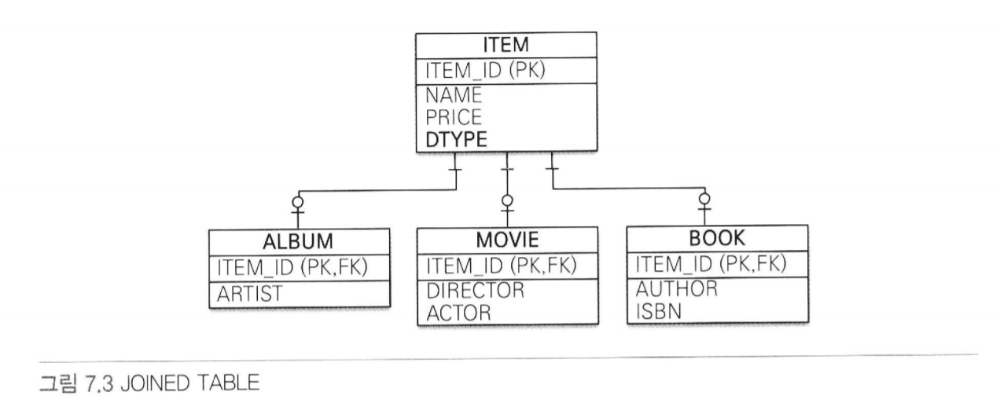

- 조인 전략을 사용한 예제 코드
```java
    @Entity
    @Inheritance(strategy = InheritanceType.JOINED)
    @DiscriminatorColumn(name = "DTYPE")
    public abstract class Item {

        @Id @GeneratedValue
        @Column (name = "ITEM_ID")
        private Long id;

        private String name;    //이름
        private int price;      //가격
    }

    @Entity
    @DiscriminatorValue("A")
    public class Album extends Item {
        private String artist;
    }

    @Entity
    @DiscriminatorValue("A")
    public class Movie extends Item {
        private String director;    //감독
        private String actor;       //배우
    }
```
- @Inheritanc(strategy = InheritanceType.JOINED)
  - 상속 매핑은 부모 클래스에 @Inheritance를 사용해야 함.
  - 매핑 전략을 지정해야 함 - 조인전략 => InheritanceType.JOINED
  
- @DiscriminatorColumn(name = "DTYPE")
  - 부모 클래스에 구분 컬럼 지정
  - 기본값이 DTYPE. 컬럼 이름이 DTYPE이면 name 속성 생략가능
  
- @DiscriminatorValue("M")
  - 엔티티를 저장할 때 구분 컬럼(DTYPE)에 입력할 값 지정
  
- 기본값으로 자식 테이블은 부모 테이블의 ID 컬럼명을 그대로 사용함
- 기본 키 컬럼명을 변경하고 싶으면 @PrimaryKeyJoinColumn 사용
```java
    @Entity
    @DiscriminatorValue("B")
    @PrimaryKeyJoinColumn(name = "BOOK_ID") //ID 재정의
    public class Book extends Item {
        private String author;   //작가
        private String isbn;     //ISBN
    }
```

### 조인 전략 정리
#### 장점 👍
- 테이블 정규화
- 외래 키 참조 무결성 제약조건 활용가능
- 저장공간의 효율적 사용

#### 단점 👎
- 조회시 다량의 조인에 따른 성능 저하
- 조회 쿼리 복잡
- 데이터를 등록할 INSERT SQL 두번 실행

#### 특징
- JPA 표준 명세는 구분 컬럼을 사용하도록 하지만, 하이버네이트를 포함한 몇몇 구현체는
구분컬럼 없이도 동작한다.
  
#### 관련 어노테이션
- @PrimaryKeyJoinColumn, @DiscriminatorColumn, @DiscriminatorValue

### 7.1.2 단일 테이블 전략


- 테이블을 하나만 사용하는 전략
- 구분 컬럼(DTYPE)으로 어떤 자식 데이터가 저장되었는지 구분함.
- 조회 시 조인이 필요없기 때문에 일반적으로 가장 빠름

#### 주의점
- 자식 엔티티가 매핑한 컬럼은 모두 null을 허용해야 한다.

```java
    @Entity
    @Inheritance(strategy = InheritanceType.SINGLE_TABLE)
    @DiscriminatorColumn(name = "DTYPE")
    public abstract class Item {

        @Id @GeneratedValue
        @Column (name = "ITEM_ID")
        private Long id;

        private String name;    //이름
        private int price;      //가격
    }

    @Entity
    @DiscriminatorValue("A")
    public class Album extends Item {    }

    @Entity
    @DiscriminatorValue("A")
    public class Movie extends Item {    }

    @Entity
    @DiscriminatorValue("B")
    public class Book extends Item {    }
```
#### 장점 👍
- 조인이 필요없기 때문에 일반적으로 조회 성능이 빠름
- 조회 쿼리가 단순함

#### 단점 👎
- 자식 엔티티가 매핑한 컬럼은 모두 null을 허용해야 함
- 단일 테이블에 모든 것을 저장하기에 테이블이 커질 수 있음
- 조회 성능이 느려질 수 있음

#### 특징
- 구분 컬럼 사용이 필수
  - @DiscriminatorColumn 설정 필수

- @DiscriminatorColumn 미설정시 기본으로 엔티티 이름을 사용함 (예: Movie, Album, Book)

### 7.1.3 구현 클래스마다 테이블 전략

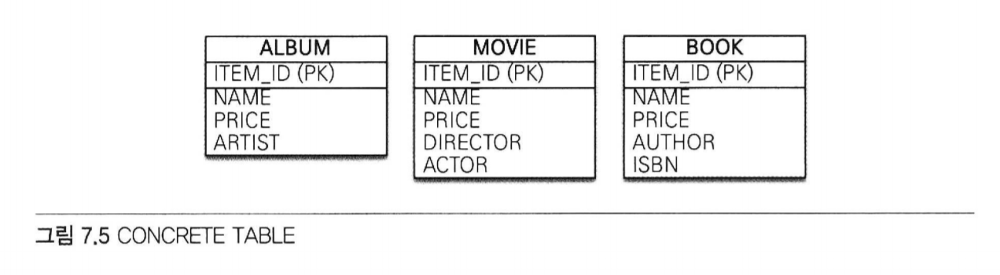

```java
    @Entity
    @Inheritance(strategy = InheritanceType.TABLE_PER_CLASS)
    public abstract class Item {

        @Id @GeneratedValue
        @Column (name = "ITEM_ID")
        private Long id;

        private String name;    //이름
        private int price;      //가격
    }

    @Entity
    @DiscriminatorValue("A")
    public class Album extends Item {    }

    @Entity
    @DiscriminatorValue("A")
    public class Movie extends Item {    }

    @Entity
    @DiscriminatorValue("B")
    public class Book extends Item {    }
```
#### 장점 👍
- 서브 타입을 구분해서 처리할 때 효과적이다
- not null 제약조건을 사용할 수 있음

#### 단점 👎
- 여러 자식 테이블을 함께 조회할 때 성능이 느림(SQL에 UNION사용해야함)
- 자식 테이블을 통합해서 쿼리하기가 어려움

#### 특징
- 구분 컬럼을 사용하지 않는다
- 데이터베이스 설계자와 ORM 전문가 둘 다 추천하지 않는 전략임.
- 조인이나 단일 테이블 전략을 고려해야함.

## 7.2 @MappedSuperclass
- 지금까지 학습한 상속 관계 매핑은 부모 클래스와 자식 클래스를 모두 데이터베이스 테이블과 매핑했다.
- 부모 클래스는 테이블과 매핑하지 않고 부모 클래스를 상속 받는 자식 클래스에게 매핑 정보만 제공하고 싶으면 사용한다.
- @MappedSuperclass는 추상 클래스와 비슷.
  - @Entity는 실제 테이블과 매핑
  - @MappedSuperclass는 실제 테이블과 매핑되지 않음
  
- 단순히 매핑 정보를 상속할 목적으로만 사용됨


- 회원(Member)와 판매자(Seller)는 서로 관계가 없는 테이블과 엔티티다
- 테이블은 그대로 두고 객체 모델의 id, name 두 공통 속성을 부모 클래스로 모으고 객체 상속 관계로 만들어보자

```java
    @MappedSuperclass
    public abstract class BaseEntity {
        
        @Id
        @GeneratedValue
        private Long id;
        
        private String name;
    }
    
    @Entity
    public class Member extends BaseEntity {
        
        //ID 상속
        //NAME 상속
        private String email;
    }
    
    @Entity
    public class Seller extends BaseEntity {
        
        //ID 상속
        //Name 상속
        private String shopName;
    }
```
- BaseEntity
  - 객체들이 주로 사용하는 매핑 정보 정의
  - 테이블과 매핑할 필요 없음
  - 자식 엔티티에게 공통으로 사용되는 매핑 정보만 제공하면 됨
  - @MappedSuperclass 사용
  
- 자식 엔티티(Member, Seller)
  - 상속을 통해 BaseEntity 매핑 정보를 물려받음
  

- 부모로부터 물려받은 매핑 정보 재정의 하는법
- @AttributeOverride, @AttributeOverrides
```java
    @Entity
    @AttributeOverride(name = "id", column = @Column(name = "MEMBER_ID"))
    public class Member extends BaseEntity {}
```

- 연관관계 재정의 하는법
- @AssociationOverrides, @AssociationOverride

#### 특징
- 테이블과 매핑되지 않고 자식 클래스에 엔티티 매핑 정보를 상속하기 위해 사용
- @MappedSuperclass로 지정한 클래스는 엔티티가 아니므로 em.find(), JPQL에서 사용 불가
- 이 클래스를 직접 생성해서 사용할 일은 거의 없으므로 추상 클래스로 만드는 것을 권장

## 7.3 복합 키와 식별 관계 매핑
- 복합 키를 매핑하는 방법과 식별 관계, 비식별 관계를 매핑하는 방법

### 7.3.1 식별 관계 vs 비식별 관계
- 외래 키가 기본 키에 포함되는지 여부에 따라 식별 관계와 비식별 관계로 구분
#### 식별 관계
- 부모 테이블의 기본 키를 내려받아서 자식 테이블의 기본 키 + 외래 키로 사용하는 관계
- 외래 키가 기본 키에 포함 O

#### 비식별 관계
- 부모 테이블의 기본키를 받아서 자식 테이블의 외래 키로만 사용하는 관계
- 외래 키가 기본 키에 포함 X
#### 비식별 관계의 분류
- 필수적 비식별 관계
  - 외래 키에 null을 허용하지 않음
  - 연관관계 필수적
- 선택적 비식별 관계
  - 외래 키에 null을 허용
  - 연관관계 선택적
  

#### 📌 데이터베이스 테이블 설계시 식별 관계나 비식별 관계 중 하나를 선택해야 한다.
- 최근에는 비식별 관계를 주로 사용하고 꼭 필요한 곳에만 식별 관계를 사용하는 추세
- JPA는 식별 관계, 비식별 관계 모두 지우너함

#### 식별 관계와 비식별 관계의 매핑방법
### 7.3.2 비식별 관계 - 복합 키를 사용하는 비식별 관계
- 기본 키를 구성하는 컬럼이 하나면 다음처럼 단순하게 매핑하면 된다.
```java
@Entity
public class Hello {
  @Id
  private String id;
}
```

- 둘 이상의 컬럼으로 구성된 복합 키는 다음과 같이 매핑하면 될 것 같지만
- 매핑 오류가 발생한다.
- JPA에서 식별자를 둘 이상 사용하기 위해서는 별도의 식별자 클래스를 만들어야 한다.
```java
@Entity
public class Hello {
  @Id
  private String id1;
  @Id
  private String id2; //실행 시점에 매핑 예외 발생
}
```

- JPA는 영속성 컨텍스트에 엔티티 보관 시 엔티티의 식별자를 키로 사용함
- 그리고 식별자를 구분하기 위해 equals와 hashCode를 사용해서 동등성 비교를 한다.
- 그런데 식별자 필드가 하나일 때는 자바의 기본 타입을 사용하기 때문에 문제가 없지만
- 식별자 필드가 2개 이상이면 별도의 식별자 클래스를 만들고 그 곳에
- equals와 hashCode를 구현해야 한다.


- JPA는 복합 키를 지원하기 위해 @IdClass, @EmbeddedId 2가지 방법을 제공함
- @IdClass - 관계형 데이터베이스에 가까움
- @EnbeddedId - 객체지향에 가까움

### IdClass


- 복합 키 테이블은 비식별 관계
- PARENT는 복합 기본 키
- 여기서 이야기하는 부모(PARENT) 자식(CHILD) 객체의 상속과는 무관함
  - 테이블의 키를 내려받은 것을 강조하기 위해 이름지음
  
```java
    @Entity
    @IdClass(ParentId.class)
    public class Parent {
        
        @Id
        @Column(name = "PARENT_ID1")
        private String id1;     //ParentId.id1과 연결
        
        @Id
        @Column(name = "PARENT_ID2")
        private String id2;     //ParentId.id2와 연결
        
        private String name;
    }
```
- 각각의 기본 키 컬럼을 @Id로 매핑함
- @IdClass를 사용해서 ParentId 클래스를 식별자 클래스로 지정함

```java
    public class ParentId implements Serializable {

        private String id1;     //Parent.id1 매핑
        private String id2;     //Parent.id2 매핑

        public ParentId() {

        }

        public ParentId(String id1, String id2) {
            this.id1 = id1;
            this.id2 = id2;
        }

        @Override
        public boolean equals(Object o) {...}

        @Override
        public int hashCode() {...}
    }
```

- @IdClass를 사용할 때 만족해야 하는 조건
  - 식별자 클래스의 속성명과 엔티티에서 사용하는 식별자의 속성명이 같아야 함
    - 예제의 Parent.id1과 ParentId.id1, 그리고 Parent.id2와 ParentId.id2가 같다.
  - Serializable 인터페이스를 구현해야 함
  - equals, hashCode를 구현해야 함
  - 기본 생성자가 있어야 함
  - 식별자 클래스는 public이어야 함
  

- 복합 키를 사용하는 엔티티 저장하기
```java
Parent parent = new Parent();
parnet.setId1("myId1");  //식별자
parnet.setId2("myId2");  //식별자
parnet.setName("parentName");
em.persist(parent);
```
- 저장 코드에는 식별자 클래스인 ParentId가 보이지 않는다
- em.persist()를 호출하면 영속성 컨텍스트에 엔티티를 등록하기 직전에 내부에서
Perent.id1, Parent.id2 값을 사용하여 식별자 클래스인 ParentId를 생성하고 영속성 컨텍스트의 키로 사용한다
  
- 복합 키로 조회하기
```java
ParentId parentId = new ParentId("myId1", "myId2");
Parent parent = em.find(Parent.class, parentId);
```
- 조회 코드에서 식별자 클래스인 ParentId를 사용하여 엔티티를 조회한다

```java
    @Entity
    public class Child {
        
        @Id
        private String id;
        
        @ManyToOne
        @JoinColumns({
                @JoinColumn(name = "PARENT_ID1",
                    referencedColumnName = "PARENT_ID1"),
                @JoinColumn(name = "PARENT_ID2",
                    referencedColumnName = "PARENT_ID2")
        })
        private Parent parent;
    }
```
- 부모 테이블의 기본 키 컬럼이 복합키이므로 자식 테이블의 외래 키도 복합 키다.
- 따라서 외래 키 매핑 시 여러 컬럼을 매핑해야 하므로 @JoinColumns 어노테이션을 사용하고
  - 각각의 외래 키 컬럼을 @JoinColumn으로 매핑한다.
  
- 예제처럼 @JoinColumn의 name과 referencedColumnName 속성의 값이 같으면 referencedColumnName 생략가능

### @EmbeddedId
- 객체지향적인 방법

```java
    @Entity
    public class Parent {
        
        @EmbeddedId
        private ParentId id;
        
        private String name;
    }
    
    @Embeddable
    public class ParentId implements Serializable {
        
        @Column(name = "PARENT_ID1")
        private String id1;
        
        @Column(name = "PARENT_ID2")
        private String id2;
        
        //equals and hashCode 구현
    }
```

- @IdClass와는 다르게 @EmbeddedId를 적용한 식별자 클래스는 식별자 클래스에 기본 키를 직접 매핑함


- @EmbeddedId를 적용한 식별자 클래스의 조건
  - @Embeddable 어노테이션을 붙여주어야 함
  - Serializable 인터페이스를 구현해야 함
  - equals, hashCode를 구현해야 함
  - 기본 생성자가 있어야 함
  - 식별자 클래스는 public이어야 함
  
- @EmbeddedId 엔티티 저장
```java
Parent parent = new Parent();
ParentId parentId = new ParentId("myId1", "myId2");
parent.setId(parentId);
parent.setName("parentName")
em.persist(parent);
```
- parentId를 직접 생성하여 사용한다

- @EmbeddedId 엔티티 조회
```java
ParentId parentId = new ParentId("myId1", "myId2");
Parent parent = em.find(Parent.class, parentId);
```
- 조회 코드도 식별자 클래스 parentId를 직접 사용한다.

### @IdClass vs @EmbeddedId
- @EmbeddedId가 @IdClass와 비교하여 더 객체지향적이고 중복도 없어 좋아보이긴한다.
- 하지만 특정 상황에 JPQL이 조금 더 길어질 수 있다.
```java
em.createQuery("select p.id.id1, p.id.id2 from Parent p"); //@EmbeddedId
em.createQuery("select p.id1, p.id2 from Parent p");       //@IdClass
```

### 7.3.3 식별 관계 - 복합 키를 사용하는 식별 관계
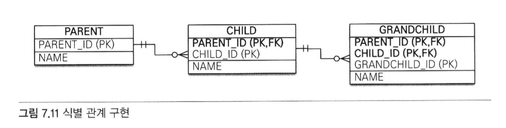

- 부모, 자식, 손자까지 계속 기본 키를 전달하는 식별 관계다.
- 식별 관계에서 자식 테이블은 부모 테이블의 기본 키를 포함하여 복합 키를 구성해야 하므로
@IdClass나 @EmbeddedId를 사용해서 식별자를 매핑해야 한다.
  
### @IdClass와 식별 관계
```java
    //부모
    @Entity
    public class Parent {

        @Id @Column(name = "PARENT_ID")
        private String id;
        private String name;
    }
    
    //자식
    @Entity
    public class Child {
        
        @Id
        @ManyToOne
        @JoinColumn(name = "PARENT_ID")
        public Parent parent;
        
        @Id @Column(name = "CHILD_ID")
        private String childId;
        
        private String name;
    }
    
    //자식 ID
    public class ChildId implements Serializable {
        
        private String parent;  //Child.parent 매핑
        private String childId; //Child.childId 매핑
        
        //equals, hashCode
        ...
    }
    
    //손자
    @Entity
    @IdClass(GrandChildId.class)
    public class GrandChild {
     
        @Id
        @ManyToOne
        @JoinColumns({
                @JoinColumn(name = "PARENT_ID"),
                @JoinColumn(name = "CHILD_ID")
        })
        private Child child;

        @Id
        @Column(name = "GRANDCHILD_ID")
        private String id;

        private String name;
    }
    
    //손자 ID
    public class GrandChildId implements Serializable {
        
        private ChildId child;  //GrandChild.child 매핑
        private String id;      //GrandChild.id 매핑
        
        //equals, hashCode
        ...
    }
```
- 식별 관계는 기본 키와 외래 키를 같이 매핑해야 함.
- 식별자 매핑인 @Id와 연관관계 매핑인 @ManyToOne을 같이 하용하면 됨.
- Child 엔티티의 parent 필드를 보면 @Id로 기본 키를 매핑하면서
@ManyToOne과 @JoinColumn으로 외래 키를 같이 매핑한다.
  

### @EmbeddedId와 식별 관계
```java
    //부모
    @Entity
    public class Parent {

        @Id @Column(name = "PARENT_ID")
        private String id;
        
        private String name;
        ...
    }

    //자식
    @Entity
    public class Child {

        @MapsId("parentId") //ChildId.parentId 매핑
        @ManyToOne
        @JoinColumn(name = "PARENT_ID")
        public Parent parent;

        @EmbeddedId
        private ChildId childId;

        private String name;
    }
    
    //자식 ID
    @Embeddable
    public class ChildId implements Serializable {
        
        private String parentId;    //@MapId("parentId")로 매핑
        
        @Column(name = "CHILD_ID")
        private String id;
        
        //equals, hashCode
        ...
    }

    //손자
    @Entity
    @IdClass(GrandChildId.class)
    public class GrandChild {

        @MapsId("childId")  //GrandChildId.childId 매핑
        @ManyToOne
        @JoinColumns({
                @JoinColumn(name = "PARENT_ID"),
                @JoinColumn(name = "CHILD_ID")
        })
        private Child child;
        
        @EmbeddedId
        private GrandChildId id;

        private String name;
    }

    //손자 ID
    @Embeddable
    public class GrandChildId implements Serializable {

        private ChildId child;  //GrandChild.child 매핑
        
        @Column(name = "GRANDCHILD_ID")
        private String id;      //GrandChild.id 매핑

        //equals, hashCode
        ...
    }
```
- @EmbeddedId는 식별 관계로 사용할 연관관계의 속성에 @MapsId를 사용하면 됨
- @IdClass와 다른 점 - @Id 대신 @MapsId를 사용한 점.
- @MapsId는 외래키와 매핑한 연관관계를 기본 키에도 매핑하겠다는 뜻.
- @MapsId의 속성 값은 @EmbeddedId를 사용한 식별자 클래스의 기본 키 필드를 지정하면 됨.
- 여기서는 ChildId의 parentId 필드를 선택함

### 7.3.4 비식별 관계로 구현
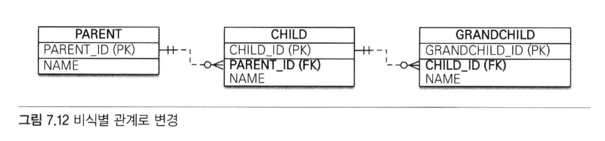

- 방금 식별 관계 테이블의 예를 위 그림과 같이 비식별 관계로 변경해보자

```java
    //부모
    @Entity
    public class Parent {

        @Id @GeneratedValue 
        @Column(name = "PARENT_ID")
        private String id;
        private String name;
        ...
    }

    //자식
    @Entity
    public class Child {

        @Id @GeneratedValue
        @Column(name = "CHILD_ID")
        private Long id;
        
        @ManyToOne
        @JoinColumn(name = "PARENT_ID")
        private Parent parent;
        
        private String name;
    }

    //손자
    @Entity
    public class GrandChild {
        
        @Id @GeneratedValue
        @Column(name = "GRANDCHILD_ID")
        private Long id;
        private String name;

        @ManyToOne
        @JoinColumn(name = "CHILD_ID")
        private Child child;

    }
```
- 식별 관계의 복합 키를 사용한 코드와 비교하면 매핑도 쉽고 코드도 단순함
- 복합 키가 없으므로 복합 키 클래스르 만들지 않아도 된다

### 7.3.5 일대일 식별 관계
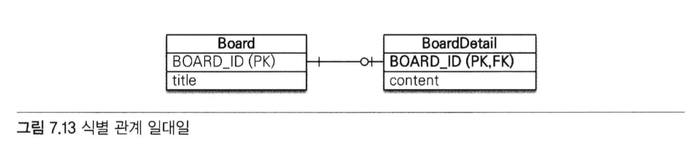

- 일대일 식별 관계는 자식 테이블의 기본 키 값으로 부모 테이블의 기본 키 값만 사용함
- 부모 테이블의 기본 키가 복합 키가 아니면 자식 테이블의 기본 키는 복합 키로 구성하지 않아도 됨
```java
    //부모
    @Entity
    public class Board {
        
        @Id @GeneratedValue
        @Column(name = "BOARD_ID")
        private Long id;
        
        private String title;
        
        @OneToOne(mappedBy = "board")
        private BoardDetail boardDetail;
    }
    
    //자식
    @Entity
    public class BoardDetail {
        
        @Id
        private Long boardId;
        
        @MapsId //BoardDetail.boardID 매핑
        @OneToOne
        @JoinColumn(name = "BOARD_ID")
        private Board board;
        
        private String content;
    }
```
- BoardDetail처럼 식별자가 단순히 컬럼 하나면 @MapId를 사용하고
속성 값은 비워두면 된다.
  
- 이때 @MapsId는 @Id를 사용해서 식별자로 지정한 BoardDetail.boardId와 매핑된다.

- 일대일 식별 관계를 사용하는 코드
```java
public void save() {
    Board board = new Board();
    board.setTitle("제목");
    em.persist(board);
    
    BoardDetail boardDetail = new BoardDetail();
    boardDetail.setContent("내용");
    boardDetail.setBoard(board);
    em.persist(boardDetail);
}
```

### 7.3.6 식별, 비식별 관계의 장단점
- 데이터베이스 설계 관점에서 보면 다음과 같은 이유로 식별 관계보다는 👉 비식별 관계를 선호함
  - 식별 관계는 부모 테이블의 기본 키를 자식 테이블로 전파하면서 자식 테이블의 기본 키 컬럼이 점점 늘어난다.
    - 예를 들어 부모 테이블은 기본 키 컬럼이 하나였지만 자식 테이블은 기본 키 컬럼이 2개, 손자 테이블은 기본 키 컬럼이 3개로 늘어남.
    - 결국 조인할 때 SQL이 복잡해지고 기본 키 인덱스가 불필요하게 커질 수 있음
  - 식별 관계는 2개 이상의 컬럼을 합해서 복합 기본 키를 만들어야 하는 경우가 많음
  - 식별 관계를 사용할 때 기본 키로 비즈니스 의미가 있는 자연 키 컬럼을 조합하는 경우가 많음
    - 반면, 비식별 관계의 기본 키는 비즈니스와 전혀 관계없는 대리 키를 주로 사용함.
    - 비즈니스 요구사항은 시간이 지남에 따라 언젠가는 변한다.
    - 식별 관계의 자연 키 컬럼들이 손자까지 전파되면 변경하기가 힘듦.
  - 식별 관계는 부모 테이블의 기본 키를 자식 테이블의 기본 키로 사용하므로 비식별 관계보다 테이블 구조가 유연하지 못함
  

- 객체 관계 매핑의 관점에서 보면 다음과 같은 이유로 👉 비식별 관계를 선호함
  - 일대일 관계를 제외하고 식별 관계는 2개 이상의 컬럼을 묶은 복합 기본 키를 사용함
    - JPA에서 복합 키는 별도의 복합 키 클래스를 만들어서 사용해야 함
    - 이렇게 되면 컬럼이 하나인 기본 키를 매핑하는 것보다 많은 노력이 필요함
  - 비식별 관계의 기본 키는 주로 대리 키를 사용하는데 JPA는 @GenerateValeu처럼 대리 키를 생성하기 위한 편리한 방법을 제공함
  

- 식별 관계가 가지는 장점
  - 기본 키 인덱스를 활용하기 좋음
  - 상위 데이터들의 기본 키 컬럼을 자식, 손자 테이블들이 가지고 있기 때문에
  특정상황에 조인 없이 하위 테이블만으로 검색을 완료할 수 있음


### 📌 정리
- ORM 신규 프로젝트 진행시 추천하는 방법은 
  - 될 수 있으면 비식별 관계를 사용하고 기본 키는 Long 타입의 대리 키를 사용하는 것
    - 대리키는 비즈니스와 아무 관련지 없음.
    - 따라서 비즈니스가 변경되어도 유연한 대처가 가능하다는 장점이 있음
    - JPA는 @GenerateValue를 통해 간편하게 대리 키를 생성할 수 있음
    - 그리고 식별자 컬럼이 하나이기 때문에 쉽게 매핑이 가능함.
  - 선택적 비식별 관계보자는 필수적 비식별 관계를 사용하는 것이 좋음
    - 선택적인 비식별 관계는 NULL을 허용하기 때문에 조인할 때에 외부 조인을 사용해야 함
    - 반면, 필수적 관계는 NOT NULL로 항상 관계가 있다는 것을 보장하므로 내부 조인만 사용해도 됨
  

## 7.4 조인 테이블
- 데이터베이스 테이블의 연관관계를 설계하는 방법
  - 조인 컬럼 사용(외래 키)
  - 조인 테이블 사용(테이블 사용)
  
### 조인 컬럼 사용
- 테이블 간에 관계는 주로 조인 컬럼이라 부르는 외래 키 컬럼을 사용해서 관리한다.

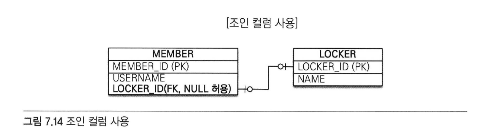
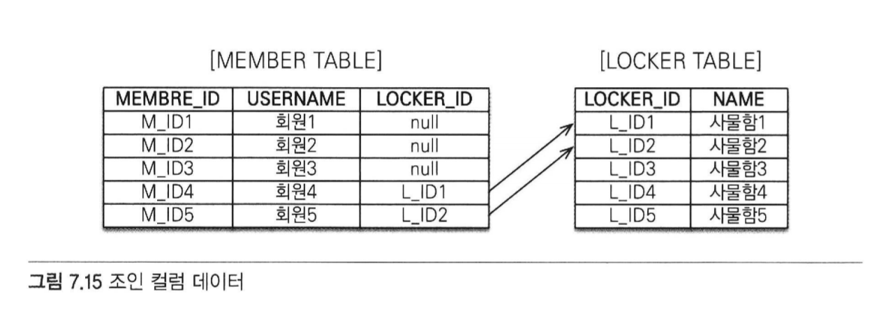
- 회원과 사물함이 있는데 각각 테이블에 데이터를 등록했다가 회원이 원할 때 사물함을 선택할 수 있다고 가정
  - 회원이 사물함을 사용하기 전까지는 아직 둘 사이에 관계가 없기 때문에 MEMBER 테이블의 LOCKER_ID 외래 키에 null을 입력해두어야 함.
  - 💡 이렇게 외래 키에 null을 허용하는 관계를 선택적 비식별 관계라 함.
  - 회원과 사물함을 조인할 때 외부 조인(OUTER JOIN)을 사용해야 함.
    - 실수로 내부 조인을 사용하면 사물함과 관계가 없는 회원은 조회되지 않음.
    - 회원과 사물함이 아주 가끔 관계를 맺는다면 외래 키 값 대부분이 null로 저장되는 단점이 있다.
  
### 조인 테이블 사용


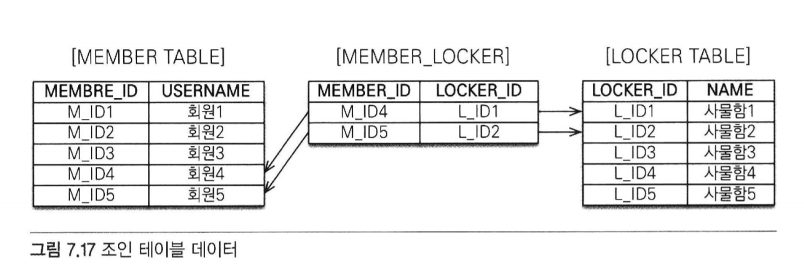

- 조인 테이블이라는 별도의 테이블을 사용해서 연관관계를 관리함.
- 조인 컬럼을 사용하는 방법은 단순히 외래 키 컬럼만 추가해서 연관관계를 맺지만
- 조인 테이블을 사용하는 방법은 연관 관계를 관리하는 조인 테이블을 추가하고 여기서 두 테이블의
외래 키를 사지고 연관관계를 관리함.
  - 따라서 MEMBER와 LOCKER에는 연관관계를 관리하기 위한 외래 키 컬럼이 없음.
  
- 조인 테이블의 가장 큰 단점
  - 테이블을 하나 추가해야 한다는 점
    - 관리해야 하는 테이블이 늘어나고 두 테이블을 조인하려면 MEMBER_LOCKER 테이블까지 추가로 조인해야 함.
  
- 👉 따라서 기본은 조인 컬럼을 사용하고 필요하다고 판단되면 조인 테이블을 사용하자!

### 7.4.1 일대일 조인 테이블

- 일대일 관계를 만들려면 조인 테이블의 외래 키 컬럼 각각에 총 2개의 유니크 제약조건을 걸어야 함.
  - (PERENT_ID는 기본 키이므로 유니크 제약조건이 걸려 있다.)
  
```java
//부모
    @Entity
    public class Parent {
        
        @Id @GeneratedValue
        @Column(name = "PARENT_ID")
        private Long id;
        private String name;
        
        @OneToOne
        @JoinTable(name = "PARENT_CHILD",
                joinColumns = @JoinColumn(name = "PARENT_ID"),
                inverseJoinColumns = @JoinColumn(name = "CHILD_ID"))   
        private Child child;
    }
    
    //자식
    @Entity
    public class Child {
        
        @Id @GeneratedValue
        @Column(name = "CHILD_ID")
        private Long id;
        private String name;
    }
```
- 부모 엔티티를 보면 @JoinColumn 대신에 @JoinTable을 사용했다.
- @JoinTable의 속성
  - name : 매핑할 조인 테이블 이름
  - joinColumns : guswo dpsxlxlfmf ckawhgksms dhlfo zl
  - inverseJoinColumns : 반대방향 엔티티를 참조하는 외래 키
  

- 양방향으로 매핑하려면 다음 코드를 추가하면 됨
```java
public class Child {
    ...
    @OneToOne(mappedBy="child")
    private Parent parent;
}
```

### 7.4.2 일대다 조인 테이블


- 일대다 관계를 만들려면 조인 테이블의 컬럼 중 다(N)와 관련된 컬럼인 CHILD_ID에 유니크 제약을 걸어야 함
  - (CHILD_ID는 기본 키이므로 유니크 제약조건이 걸려 있음)
  
```java
    //부모
    @Entity
    public class Parent {
        
        @Id @GeneratedValue
        @Column(name = "PARENT_ID")
        private Long id;
        private String name;
        
        @OneToMany
        @JoinTable(name = "PARENT_CHILD",
                joinColumns = @JoinColumn(name = "PARENT_ID"),
                inverseJoinColumns = @JoinColumn(name = "CHILD_ID"))
        private List<Child> child = new ArrayList<Child>();
    }
    
    //자식
    @Entity
    public class Child {
        
        @Id @GeneratedValue
        @Column(name = "CHILD_ID")
        private Long id;
        private String name;
    }
```
### 7.4.3 다대일 조인 테이블
- 다대다 관계를 만들려면 조인 테이블의 두 컬럼을 합해서 하나의 복합 유니크 제약조건을 걸어야 함
  - (PARENT_ID, CHILD_ID는 복합 기본 키이므로 유니크 제약조건이 걸려있음)
  
```java
    //부모
    @Entity
    public class Parent {
        
        @Id @GeneratedValue
        @Column(name = "PARENT_ID")
        private Long id;
        private String name;
        
        @OneToMany(mappedBy = "parent")
        private List<Child> child = new ArrayList<Child>();
    }
    
    //자식
    @Entity
    public class Child {
        
        @Id @GeneratedValue
        @Column(name = "CHILD_ID")
        private Long id;
        private String name;
        
        @ManyToOne(optional = false)
        @JoinTable(name = "PARENT_CHILD",
                joinColumns = @JoinColumn(name = "CHILD_ID"),
                inverseJoinColumns = @JoinColumn(name = "PARENT_ID"))
        private Parent parent;
    }
```
- 참고) 조인 테이블에 컬럼을 추가하면 @JoinTable 전략을 사용할 수 없음
  - 새로운 엔티티를 만들어서 조인 테이블과 매핑해야 한다.
  

## 7.5 엔티티 하나에 여러 테이블 매핑
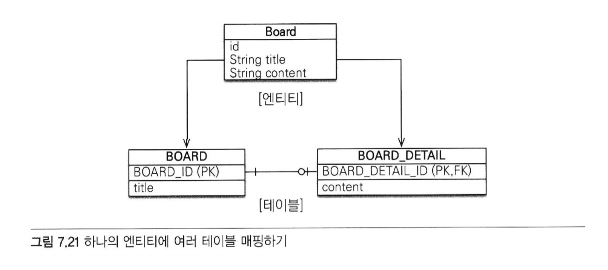

- @SecondaryTable을 사용하면 한 엔티티에 여러 테이블을 매핑할 수 있다.
```java
    @Entity
    @Table(name = "BOARD")
    @SecondaryTable(name = "BOARD_DETAIL",
        pkJoinColumns = @PrimaryKeyJoinColumn(name = "BOARD_DETAIL_ID"))
    public class Board {

        @Id @GeneratedValue
        @Column(name = "BOARD_ID")
        private Long id;

        private String title;

        @Column(table = "BOARD_DETAIL")
        private String content;
    }
```
- Board 엔티티는 @Table을 사용해서 BOARD 테이블과 매핑함
- 그리고 @SecondaryTable을 사용해서 BOARD_DETAIL 테이블을 추가로 매핑함


- @SecondaryTable 속성
  - @SecondaryTable.name
    - 매핑할 다른 테이블의 이름.
    - 예제에서는 테이블명을 BOARD_DETAIL로 지정했다.
  - @SecondaryTable.pkJoinColumns
    - 매핑할 다른 테이블의 기본 키 컬럼 속성
    - 예제에서는 기본 키 컬럼명을 BOARD_DETAIL_ID로 지정했다.
  - content 필드는 @Column(table = "BOARD_DETAIL")을 사용해서 BOARD_DETAIL 테이블의 컬럼에 매핑함.
  

- @SecondaryTables
  - 더 많은 테이블을 매핑할때 사용
  
```java
@SecondaryTables({
    @SecondaryTable(name="BOARD_DETAIL"),
    @SecondaryTable(name="BOARD_FILE")
        
})
```

- 참고) @SecondaryTable을 사용해서 두 테이블을 하나의 엔티티에 매핑하는 방법보다는 테이블당 엔티티를 각각 만들어 일대일 매핑하는 것을 권장함.
- 위 방법은 항상 두 테이블을 조회하므로 최적화하기 어려움.
- 반면에 일대일 매핑은 원하는 부분만 조회할 수 있고 필요하면 둘을 함께 조회하면 된다.

# 08. 프록시와 연관관계 관리
- 프록시와 즉시로딩, 지연로딩
  - 객체 -> 객체 그래프로 연관된 객체 탐색
  - but, 객체는 데이터베이스에 저장되어 있기 때문에 탐색이 자유롭지 못함
    - JPA 구현체들은 이 문제를 해결하기 위해 프록시라는 기술을 사용함
  - 프록시를 사용하면?
    - 연관된 객체를 처음부터 데이터베이스에서 조회하는 것이 아닌,
    - 실제 사용하는 시점에 데이터베이스에서 조회할 수 있음
  - but, 자주 함께 사용하는 객체들은 조인을 사용해서 함께 조회하는 것이 효과적
    - JPA는 즉시 로딩과 지연 로딩이라는 방법으로 둘을 모두 지원함.
  
- 영속성 전이와 고아 객체
  - 영속성 전이
    - 연관된 객체를 함께 저장하거나 함께 삭제할 수 있음
  - 고아 객체 제거
  
## 8.1 프록시
- 지연로딩
  - 엔티티가 실제 사용될 때까지 데이터베이스 조회를 지연하는 방법
  
#### 회원과 팀 정보를 출력하는 비즈니스 로직
```java
public void printUserAndTeam(String memberId) {
    Member member = em.find(Member.class, memberId);
    Team team = member.getTeam();
    System.out.println("회원이름: "+member.getUsername());
    System.out.println("소속팀: "+team.getName());
}
```
      
#### 회원 정보만 출력하는 비즈니스 로직
```java
public String printUser(String memberId) {
    Member member = em.find(Member.class, memberId);
    System.out.println("회원 이름: "+member.getUsername());
}
```

- 첫번째 로직은 memberId로 회원 엔티티를 찾아서 회원은 물론이고,
회원과 연관된 팀의 이름도 출력함.
  
- 반면, 두번째 로직은 회원 엔티티만 출력하고 회원과 관련된 팀 엔티티는 사용하지 않음
  - 회원 엔티티만 사용하기 때문에 em.find()로 회원 엔티티를 조회할 때
  회원과 연관된 팀 엔티티까지 데이터베이스에서 함께 조회해 두는 것은 효율적이지 않다.
    
- 이런 문제점을 해결하기 위해 등장한 것이 '지연로딩'
  - team.getName()처럼 팀 엔티티의 값을 실제 사용하는 시점에 데이터베이스에서
  팀 엔티티에 필요한 데이터를 조회하는 것.
    
- 지연 로딩 기능을 하기 위해서는 실제 엔티티 객체 대신 데이터베이스 조회를 지연할 수 있는 가짜 객체가 필요하다
  - 이것이 '프록시' 객체라 함.
  
### 8.1.1 프록시 기초
- JPA에서 식별자로 엔티티 하나를 조회할 때는 EntityManager.find()를 사용함
  - 이 메소드는 영속성 컨텍스트에 엔티티가 없으면 데이터베이스를 조회한다.
  - 이와같이 엔티티를 직접 조회하면 조회한 엔티티의 사용유무에 상관없이 데이터베이스를 조회하게 됨.
  
- 엔티티를 실제 사용하는 시점까지 데이터베이스 조회를 미루고 싶다면?
  - EntityManager.getReference() 메소드를 사용하면 된다.
  
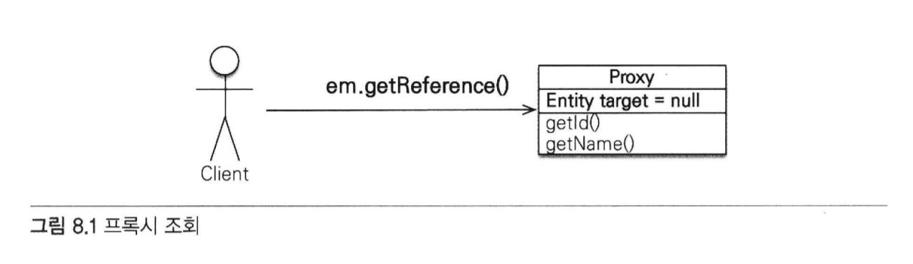

- 해당 메소드를 호출할 때 JPA는 데이터베이스를 조회하지 않고 실제 엔티티 객체도 생성하지 않음.
- 대신 데이터베이스 접근을 위임한 프록시 객체를 반환한다.

### 프록시 특징
- 프록시 클래스는 실제 클래스를 상속 받아서 만들어지므로 실제 클래스와 겉 모양이 같음.
- 따라서 사용하는 입장에서는 이것이 진짜 객체인지, 프록시 객체인지 구분하지 않고 사용하면 됨.


- 사진처럼 실제 객체에 대한 참조(target)을 보관함.
- 프록시 객체의 메소드를 호출하면 프록시 객체는 실제 객체의 메소드를 호출함

### 프록시 객체의 초기화
- member.getName()과 같이 실제 사용될 떄 데이터베이스를 조회해서 실제 엔티티 객체를 생성하는 것.

#### 프록시 초기화 예제
```java
//MemberProxy 반환
Member member = em.getReference(Member.class, "id1");
member.getName(); //1. getName()
```

#### 프록시 클래스 예상 코드
```java
class MemberProxy extends Member {
    
    Member target = null; //실제 엔티티 참조
    
  public String getName() {
      if (target == null) {
          
          //2. 초기화 요청
          //3. DB 조회
          //4. 실제 엔티티 생성 및 참조 보관
          this.target = ...;
      }
      
      //5. target.getName();
      return target.getName();
  }
}
```
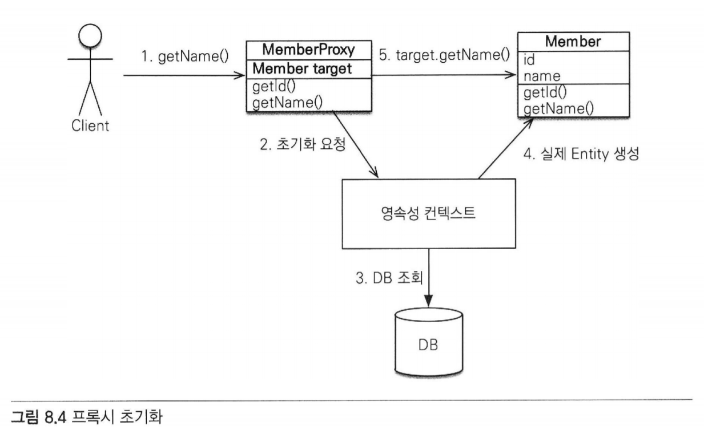

1. 프록시 객체에 member.getName()을 호출해서 실제 데이터를 조회
2. 프록시 객체는 실제 엔티티가 생성되어 있지 않으면 영속성 컨텍스트에 실제 엔티티 생성을 요청함 => 초기화
3. 영속성 컨텍스트는 데이터베이스를 조회해서 실제 엔티티 객체 생성
4. 프록시 객체는 생성된 실제 엔티티 객체의 참조를 Member target 멤버변수에 보관함
5. 프록시 객체는 실제 엔티티 객체의 getName()을 호출해서 결과를 반환함

#### 프록시 특징
- 프록시 객체는 처음 사용할 때 한 번만 초기화됨
- 프록시 객체를 초기화한다고 프록시 객체가 실제 엔티티로 바뀌는 것은 아님
  - 프록시 객체가 초기화되면, 프록시 객체를 통해 실제 엔티티에 접근할 수 있음
  
- 프록시 객체는 원본 엔티티를 상속받은 객체이므로 타입 체크 시에 주의해서 사용
- 영속성 컨텍스트에 찾는 엔티티가 이미 있으면 데이터베이스를 조회할 필요가 없다.
  - 따라서 em.getReference()를 호출해도 프록시가 아닌 실제 엔티티를 반환함
  
- 초기화는 영속성 컨텍스트의 도움을 받아야 가능함.
  - 따라서 영속성 컨텍스트의 도움을 받을 수 없는 준영속 상태의 프록시를 초기화하면 문제가 발생함.
  - 하이버네이트는 org.hibernate.LazyIntializationException 예외 발생

### 8.1.2 프록시와 식별자
- 엔티티를 프록시로 조회 -> 식별자(PK)값을 파라미터로 전달 -> 프록시 객체 : 식별자 값 보관
```java
Team team = em.getReference(Team.class, "team1") //식별자 보관
team.getId(); //초기화되지 않음
```
- 프록시 객체는 식별자 값을 가지고 있으므로 식별자 값을 조회하는 team.getId()를 호출해도
프록시를 초기화하지 않음.
  - 단 엔티티 접근 방식을 프로퍼티로 설정한 경우에만 초기화하지 않음
    - @Access(AccessType.PROPERTY)
  - 엔티티 접근방식을 필드로 설정하면 JPA는 getId()메소드가 id만 조회하는 메소드인지,
  다른 필드까지 활용해서 어떤 일을 하는 메소드인지 알지 못하므로 프록시 객체를 초기화함
    - @Access(AccessType.FIELD)
  

- 프록시는 연관관계를 설정할 때 유용하게 사용할 수 있음
```java
Member member = em.find(Member.class, "member1");
Team team = em.getReference(Team.class, "team1") //SQL은 실행하지 않음
member.setTeam(team);
```
- 연관관계를 설정할 떄는 식별자 값만 사용함
  - 프록시를 사용하면 데이터베이스 접근 횟수를 줄일 수 있음.
  - 참고로 연관관계를 설정할 때는 엔티티 접근 방식을 필드로 설정해도 프록시를 초기화하지 않음.
  
### 8.1.3 프록시 확인
- JPA가 제공하는 PersistenceUnitUtil.isLoaded(Object entity) 메소드
  - 아직 초기화되지 않은 프록시 인스턴스 => false
  - 이미 초기화되었거나 프록시 인스턴스가 아니면 => true 반환
  
- 조회한 엔티티가 진짜 엔티티인지 프록시로 조회한 것인지 확인하려면?
  - 클래스명을 직접 출력해보면 됨.
  
```java
System.out.println("memberProxy = " + member.getclass().getName());
//결과: memberProxy = jpabook.domain.Member_$$_javassist_0
```

- ...javassist... -> 프록시인 것을 확인할 수 있음

## 8.2 즉시 로딩과 지연 로딩
- 프록시 객체는 주로 연관된 엔티티를 지연 로딩할 때 사용함.
- member1이 team1에 소속해 있다고 가정
```java
Member member = em.find(Member.class, "member1");
Team team = member.getTeam(); //객체 그래프 탐색
System.out.println(team.getName()); //팀 엔티티 사용
```

- 회원 엔티티 조회 시 연관된 팀 엔티티도 함께 데이터베이스에서 조회??
- 회원 엔티티 조회 시 회원 엔티티만 조회해 두고 팀 엔티티는 실제 사용하는 시점에 조회??

#### 조회 시점 선택 방법
- 즉시 로딩
  - 엔티티를 조회할 때 연관된 엔티티도 함께 조회함
  - 예) em.find(Member.class, "member1")를 호출할 때 회원 엔티티와 연관된 팀 엔티티도 함께 조회
  - 설정 방법: @ManyToOne(fetch = FetchType.EAGER)
  
- 지연 로딩
  - 연관된 엔티티를 실제 사용할 떄 조회
  - 예) member.getTeam().getName() 처럼 조회한 팀 엔티티를 실제 사용하는 시점에 JPA가 SQL을 호출하여 팀 엔티티 조회
  - 설정 방법: @ManyToOne(fetch = FetchType.LAZY)
  
### 8.2.1 즉시 로딩(EAGER LOADING)
- @ManyToOne의 fetch 속성을 FetchType.EAGER로 지정
```java
@Entity
public class Member {
  ...
  @ManyToOne(fetch = FetchType.EAGER)
  @JoinColumn(name = "TEAM_ID")
  private Team team;
  ...
}
```
- 회원을 조회하는 순간 팀도 함께 조회
  - 회원과 팀 두 테이블을 조회해야 하므로 쿼리를 2번 실행할 것 같지만?
    - 대부분 JPA 구현체는 즉시 로딩을 최적화하기 위해 가능하면 조인 쿼리를 사용함
  
```h2
SELECT 
    M.MEMBER_ID AS MEMBER_ID,
    M.TEAM_ID AS TEAM_ID,
    M.USERNAME AS USERNAME,
    T.TEAM_ID AS TEAM_ID,
    T.NAME AS NAME
FROM
    MEMBER M LEFT OUTER JOIN TEAM T 
        ON M.TEAM_ID=T.TEAM_ID
WHERE
    M.MEMBER_ID='member1'
```
- 쿼리 한 번으로 조회한 것을 알 수 있음
- 이후 member.getTeam()을 호출하면 이미 로딩된 팀1 엔티티를 반환한다.

### NULL 제약조건과 JPA 조인 전략
- 왜 SQL에서 내부조인(INNER JOIN)이 아닌 외부 조인(LEFT OUTER JOIN)을 사용했을까?
  - 현재 회원 테이블에 TEAM_ID 외래 키는 NULL을 허용하고 있음
    - 따라서 팀에 소속되지 않은 회원이 있을 가능성이 있다.
    - 팀에 소속하지 않은 회원과 팀을 내부 조인하면 팀은 물론, 회원 데이터도 조회할 수 없음
  
- JPA는 이러한 상황을 고려하여 외부 조인을 사용함
- 📌 하지만 외부 조인보다 내부 조인이 성능과 최적화에서 더 유리함


- 내부 조인을 하기 위해선?
  - 외래 키에 NOT NULL 제약 조건 설정하면 값이 있는 것을 보장.
  - 따라서 이땐 내부 조인만 사용해도 됨
  - JPA에게도 이런 사실을 알려야 함
    - @JoinColumn에 nullable = false을 설정
      - 이 외래 키는 NULL 값을 허용하지 않음
  
```java
    @Entity
    public class Member {
        ...
        @ManyToOne(fetch = FetchType.EAGER)
        @JoinColumn(name = "TEAM_ID", nullable = false)
        private Team team;
        ...
    }
```

#### nullable 설정에 따른 조인 전략
- @JoinColumn(nullable = true): NULL 허용(기본값), 외부 조인 사용
- @JoinColumn(nullable = false): NULL 허용하지 않음, 내부 조인 사용


- @ManyToOne.optional = false : 내부 조인 사용
```java
    @Entity
    public class Member {
        ...
        @ManyToOne(fetch = FetchType.EAGER, optional = false)
        @JoinColumn(name = "TEAM_ID")
        private Team team;
        ...
    }
```


### 8.2.2 지연 로딩
- 지연 로딩(LAZY LOADING)을 사용하려면 @ManyToOne의 fetch 속성을 FetchType.LAZY로 지정
#### 지연 로딩 설정
```java
    @Entity
    public class Member {
        @ManyToOne(fetch = FetchType.LAZY)
        @JoinColumn(name = "TEAM_ID")
        private Team team;
    }
```
#### 지연 로딩 실행 코드
```java
Member member = em.find(Member.class, "member1");
Team team = member.getTeam();   //객체 그래프 탐색
team.getName(); //팀 객체 실제 사용
```
- 회원과 팀을 지연 로딩으로 설정함
- em.find(Member.class, "member1")을 호출하면 회원만 조회하고 팀은 조회하지 안흥ㅁ
- team 멤버변수에 프록시 객체를 넣어둠.
- 프록시 객체는 실제 사용될 때까지 데이터 로딩을 미룬다.
- 실제 데이터가 필요한 순간이 되어서야 데이터베이스를 조회해서 프록시 객체를 초기화함.
  
```h2
SELECT * FROM MEMEBR
WHERE MEMBER_ID = 'member1'
```
- ㄴ em.find(Member.class, "member1") 호출 시 실행되는 SQL

```h2
SELECT * FROM TEAM
WHERE TEAM_ID = 'team1'
```
- ㄴ team.getName() 호출로 프록시 객체가 초기화되면서 실행되는 SQL
> 조회 대상이 영속성 컨텍스트에 이미 있으면 프록시 객체를 사용할 이유가 없음
> 따라서 프록시가 아닌 실제 객체를 사용한다.

### 8.2.3 즉시 로딩, 지연 로딩 정리
- 처음부터 연관된 엔티티를 모두 영속성 컨텍스트에 올려두는 것은 현실적이지 않음
- 필요할 때마다 SQL을 실행해서 연관된 엔티티를 지연 로딩하는 것도 최적화 관점에서 보면 꼭 좋은 것만은 아님


- 예를 들어 대부분의 애플리케이션 로직에서 회원과 팀 엔티티를 같이 사용한다면?
  - SQL 조인을 사용하여 회원과 팀 엔티티를 한번에 조회하는 것이 더 효율적
  

### 정리
- 지연 로딩(LAZY)
  - 연관된 엔티티를 프록시로 조회
  - 프록시를 실제 사용할 때 초기화하면서 데이터베이스 조회
  
- 즉시 로딩(EAGER)
  - 연관된 엔티티를 즉시 조회
  - 하이버네이트는 가능하면 SQL 조인을 사용해서 한 번에 조회함
  

## 8.3 지연 로딩 활용
- 사내 주문 관리 시스템 개발 예시


  
- 회원은 팀 하나에만 소속할 수 있다. (N:1)
- 회원은 여러 주문내역을 가진다. (1:N)
- 주문내역은 상품정보를 가진다. (N:1)

#### 애플리케이션 로직 분석
- Member와 연관된 Team은 자주 함께 사용되었다.
  - 즉시 로딩
  
- Member와 연관된 Order는 가끔 사용되었다.
  - 지연 로딩
  
- Order와 연관된 Product는 자주 함께 사용되었다.
  - 즉시 로딩
  
### 8.3.1 프록시와 컬렉션 래퍼
- 하이버네이트는 엔티티를 영속 상태로 만들 때 엔티티에 컬렉션이 있으면
  - 컬렉션 추적, 관리의 목적으로 원본 컬렉션을 하이버네이트가 제공하는 내장 컬렉션으로 변경함.
  
> 이 과정을 컬렉션 래퍼라 한다.

- 엔티티를 지연 로딩하면 프록시 객체를 사용해서 지연 로딩을 수행.
  - 주문 내역 같은 컬렉션은 래퍼가 지연 로딩을 처리해줌.
  - 컬렉션 래퍼도 컬렉션에 대한 프록시 역할. 
  
- 참고) member.getOrders()를 호출해도 컬렉션은 초기화 안됨
  - member.getOrder().get(0)처럼 컬렉션에서 실제 데이터를 조회할 때 데이터베이스를 조회해서 초기화함.
  

### 8.3.2 JPA 기본 페치 전략
- fetch 속성의 기본 설정값
  - @ManyToOne, @OneToOne
    - 즉시 로딩(FetchType.EAGER)
  - @OneToMany, @ManyToMany
    - 지연 로딩(FetchType.LAZY)
  
- JPA의 기본 페치 전략은 연관된 엔티티가 하나면 즉시 로딩,
- 컬렉션이면 지연 로딩을 사용함
  - 컬렉션을 로딩하는 것은 비용이 많이 들고 잘못하면 너무 많은 데이터를 로딩할 수 있기 떄문
  

- 추천하는 방법 > 모든 연관관계에 지연 로딩을 사용하는 것
  - 그리고 애플리케이션 개발이 어느 정도 완료단계에 왔을 때 실제 사용하는 상황을 보고
  - 꼭 필요한 곳에만 즉시 로딩을 사용하도록 최적화하면 됨.
  
### 8.3.3 컬렉션에 FetchType.EAGER 사용 시 주의점
- 컬렉션을 하나 이상 즉시 로딩하는 것은 권장하지 않는다.
- 컬렉션 즉시 로딩은 항상 외부 조인을 사용한다.

#### FetchType.EAGER 설정과 조인 전략 정리
- @ManyToOne, @OneToOne
  - (optional = false): 내부 조인
  - (optional = true): 외부 조인
  
- @OneToMany, @ManyToMany
  - (optional = false): 외부 조인
  - (optional = true): 외부 조인
  
## 8.4 영속성 전이: CASCADE
- 특정 엔티티를 영속 상태로 만들 때 연관된 엔티티도 함께 영속 상태로 만들고 싶을때 사용
- 부모 엔티티를 저장할 때 자식 엔티티도 함께 저장

### 8.4.1 영속성 전이: 저장
```java
    @Entity
    public class Parent {
        ...
        @OneToMany(mappedBy = "parent", cascade = CascadeType.PERSIST)
        private List<Child> children = new ArrayList<Child>();
        ...
    }
```
- 부모를 영속화할 때 연관된 자식들도 함께 영속화하라고 cascade = CasecadeType.PERSIST 옵션을 설정함

#### CASCADE 옵션 적용 전
```java
//부모 저장
Parent parent = new Parent();
em.persist(parent);

//1번 자식 저장
Child child1 = new Child();
child1.setParent(parent); //자식 -> 부모 연관관계 설정
parent.getChildren().add(child1);   //부모 -> 자식
em.persist(child1);

//2번 자식 저장
Child child2 = new Child();
child2.setParent(parent); //자식 -> 부모 연관관계 설정
parent.getChildren().add(child2); //부모 -> 자식
em.persist(child2);
```

###CASECADE 옵선 적용
```java
Child child1 = new Child();
Child child2 = new Child();

Parent parent = new Parent();
child1.setParent(parent);   //연관관계 추가
child2.setParent(parent);   //연관관계 추가
parent.getChildren().add(chidl1);
parent.getCHildren().add(child2);

//부모 저장, 연관된 자식들 저장
em.persist(parent);
```
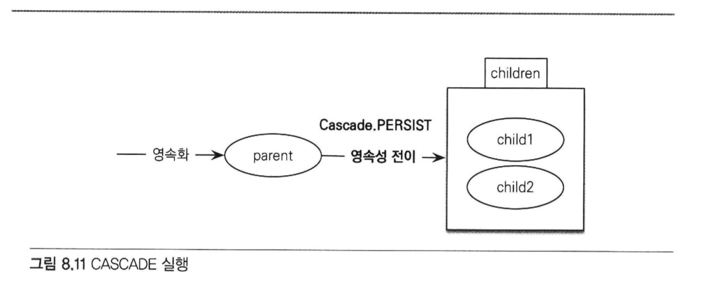
- 부모만 영속화하면 CasecadeType.PERSIST로 설정한 자식 엔티티까지 함께 영속화해서 저장함
- 영속성 전이는 연관관계를 매핑하는 것과는 아무 관련이 없음
  - 단지 엔티티를 영속화할 때 연관된 엔티티도 같이 영속화하는 편리함을 제공하는 것 뿐.
  - 그래서 예제코드를 보면 양방향 연관관계를 추가한 다음 영속 상태로 만든 것을 확인할 수 있다.
  

### 8.4.2 영속성 전이: 삭제

- CasecadeType.REMOVE로 설정하고 다음 코드처럼 부모 엔티티만 삭제하면 연관된 자식 엔티티도 함께 삭제됨.

```java
Parent findParent = em.find(Parent.class, 1L);
em.remove(findParent);
```
- 코드 실행 시 DELETE SQL을 child 수 만큼 실행.
- 부모는 물론 연관된 자식도 모두 삭제
- 삭제 순서는 자식이 먼저 삭제되고 부모 삭제
- 영속성 전이 미설정시?
  - 외래 키 제약조건으로 인해 데이터베이스에서 외래키 무결성 예외가 발생함
  
### 8.4.3 CASECADE의 종류
```java
public enum CascadeType {
    ALL,     //모두 적용
    PERSIST, //영속
    MERGE,   //병합
    REMOVE,  //삭제
    REFRESH, //REFRESH
    DETACH   //DETACH
}
```
- 여러 속성을 같이 사용할 수 있다
```java
casecade = {CascadeType.PERSIST, CasecadeType.REMOVE}
```
- 참고) 두 속성은 em.persist(), em.remove()를 실행할 때 바로 전이가 발생하지 않고
플러시를 호출할 때 전이가 발생한다.
  
## 8.5 고아 객체
> 부모 엔티티와 연관관계가 끊어진 자식 엔티티를 자동으로 삭제하는 기능
- 부모 엔티티의 컬렉션에서 자식 엔티티의 참조만 제거하면 자식 엔티티가 자동으로 삭제되도록 해보자

```java
    @Entity
    public class Parent {
        
        @Id @GeneratedValue
        private Long id;
        
        @OneToMany(mappedBy = "parent", orphanRemoval = true)
        private List<Child> children = new ArrayList<Child>();
        ...
    }
```
- 이제 컬렉션에서 제거한 엔티티는 자동으로 삭제됨
```java
Parent parent1 = em.find(Parent.class, id);
parent1.getChildren().remove(0); //자식 엔티티를 컬렉션에서 제거
```
- 사용 코드를 보면 컬렉션에서 첫 번째 자식을 제거함
- 해당 옵션으로 인해 컬렉션에서 엔티티를 제거하면 데이터베이스의 데이터도 삭제됨.
- 고아 객체 제거 기능은 영속성 컨텍스트를 플러시할 때 적용됨
  - 플러시 시점에 DELETE SQL이 실행된다.

  
- 모든 자식 엔티티를 제거하려면?
```java
parent1.getChildren().clear();
```
- 고아 객체 제거는 참조가 제거된 엔티티는 다른 곳에서 참조하지 않는 고아 객체로 보고 삭제하는 기능
- 이 기능은 참조하는 곳이 하나일 때만 사용해야 함.
- 특정 엔티티가 개인 소유하는 엔티티에만 이 기능을 적용
  - @OneToMany
  

## 8.6 영속성 전이 + 고아 객체, 생명주기
- CasecadeType.ALL + orphanRemoval = true를 동시에 사용하면?
  - 일반적으로 엔티티는 EntityManager.persist()를 통해 영속화,
  - EntityManager.remove()를 통해 제거.
    - 엔티티 스스로 생명주기를 관리한다는 의미
  
- 두 옵션을 모두 활성화하면 부모 엔티티를 통해 자식의 생명주기를 관리할 수 있음

### 자식 저장 시 부모에 등록만 하면 된다. (CASCADE)
```java
Parent parent = em.find(Parent.class, parentId);
parent.addChild(child1);
```

### 자식 삭제 시 부모에서 제거하면 된다. (orphanRemoval)
```java
Parent parent = em.find(Parent.class, parentId);
parent.getChildren().remove(removeObject);
```


## 8.7 정리
- JPA 구현체들은 객체 그래프를 마음껏 탐색할 수 있도록 지원하는데 이때 프록시 기술을 사용함
- 객체를 조회할 때 연관된 객체를 즉시 로딩하는 방법을 즉시 로딩,
  - 연관된 객체를 지연해서 로딩하는 방법을 지연 로딩이라 함.
  
- 객체를 저장하거나 삭제할 때 연관된 객체도 함꼐 저장하거나 삭제할 수 있음
  - 영속성 전이
  
- 부모 엔티티와 연관관계가 끊어진 자식 엔티티를 자동으로 삭제하려면?
  - 고아 객체 제거 기능 사용
  
