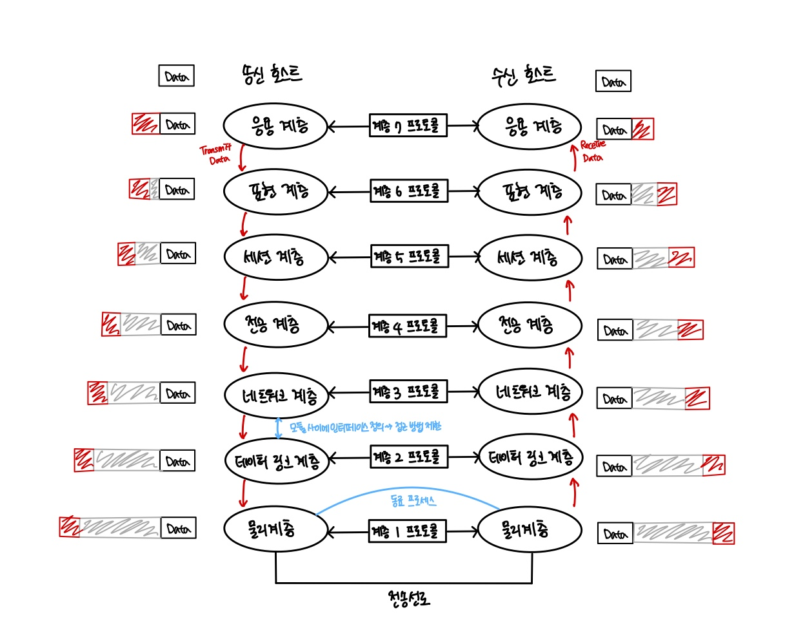

# OSI 7 계층이란?
- 네트워크 상에서 여러 대의 컴퓨터가 데이터를 주고 받으려면 이들을 서로 연동할 수 있도록 표준화된 인터페이스를 지원해야 한다.
- 국제 표준화 기구인 ISO(International Standard Organization)가 확립한 OSI(Open System Interconnection) 7계층은 개방화된
데이터 통신 환경에서 사용하는 계층적 구현 모델의 표준이다.
  

- OSI 7 계층은 이름처럼 7개의 계층으로 구성되어 있으며 각 계층마다 수행하는 역할이 다르다.
- 임의의 호스트에서 실행되는 계층 N 모듈은 상대 호스트의 계층 N 모듈과 논리적으로 통신하며 이를 N 프로토콜이라고 한다.
동일 계층에 위치한 통신 양단은 같은 프로토콜을 사용하여 통신하기 때문에 동료 프로세스라고 한다.
- 한 호스트에서 위아래로 이웃하는 계층에 위치한 모듈 사이에는 인터페이스가 정의되어 접근 방법을 제한하며 상위 계층에서는
하위 계층의 인터페이스를 통해 하위 계층의 서비스를 이용한다.
- 또한 송신 호스트에서 데이터를 전달할때는 동료 프로세스에서 직접 전달하는 것이 아니라, 하위 계층에 서비스를 요청하고
이 요청은 최하위에 위치한 물리 계층까지 반복하게 된다. 반대로 수신 호스트에서는 상위 계층으로 데이터가 전달되면서 프로토콜 기능이 동작한다.
- 각 계층의 동료 프로세스가 직접 통신하는 형태를 보이지만, 실제로는 항상 물리 계층을 통해 데이터가 전송된다.

## 각 계층별 특징
### 1계층 : 물리 계층 (Physical Layer)
- 물리적 매체(허브, 라우터, 케이블, 연결 장치)를 통해 다른 시스템에 전기적 신호를 전송하는 역할을 한다.
기계어를 전기적 신호로 바꾸어서 와이어에 실어주는 것!
- 전송 단위 : 비트(Bit)
- 프로토콜 : RS-232C 등
- 장비 : 허브, 라우터, 케이블

### 2계층 : 데이터 링크 계층 (Link Layer)
- 같은 네트워크에 있는 여러 대의 컴퓨터들이 데이터를 주고받기 위해서 필요한 모듈, 오류의 검출과 회복을 위한 오류 제어 기능을 수행하여
한 장치에서 다른 장치로 프레임(Frame, 비트의 모음)을 전달하는 역할을 한다. 또한 송신측과 수신측의 속도 차이를 해결하기 위해 흐름 제어 기능을
하며 3계층에서 정보를 받아 주소와 제어정보를 헤더와 테일에 추가한다.
- 전송 단위 : 프레임(Frame)
- 프로토콜 : 이더넷, MAC, PPP, ATM, LAN, Wifi 등
- 장비 : 브릿지, 스위치

### 3계층 : 네트워크 계층 (Network Layer)
- 다중 네트워크 링크에서 패킷(Packet)을 발신지로부터 목적지까지 전달할 책임을 가진다. 이전 계층인 데이터 계층은 노드 vs 노드 전달을 감독하는 것이고
네트워크 계층은 시작점에서 목적지까지 성공적으로 전달되로고 하는 역할을 수행한다. 수 많은 네트워크들의 연결로 이루어지는 inter-network 속에서
  어딘가에 있는 목적지 컴퓨터로 데이터를 전송하기 위해 IP 주소를 이용해서 길을 찾고 (routing) 자신 다음의 라우터에게 데이터를 넘겨주는 것
- 전송 단위 : 패킷(Packet)
- 프로토콜 : IP, ICMP 등
- 장비 : 라우터, L3 스위치

### 4계층 : 전송 계층 (Transport Layer)
- 프로세스 사이의 데이터 이동을 책임지는 역할을 한다. 데이터가 오류없이 도착하도록 해야하기 때문에 패킷의 전송이 유효한지 확인하고 전송에 실패된
패킷을 다시 보내는 것과 같은 신뢰성있는 통신을 보장하며 머리말에는 세그먼트가 포함된다. 주소 설정, 오류 및 흐름 제어, 다중화를 수행한다.
- 전송 단위 : 세그먼트(Segment)
- 프로토콜 : TCP, UDP 등
- 장비 : 게이트웨이, L4 스위치

### 5계층 : 세션 계층 (Session Layer)
- 통신 세션을 구성하는 계층으로, 포트(Port) 번호를 기반으로 연결한다. 통신장치 간의 상호작용을 설정하고 유지하며 동기화한다. 동시송수신(Duplex),
반이중(Half-Duplex), 전이중(Full-Duplex) 방식의 통신과 함께 체크 포인팅과 유후, 종료, 다시 시작 과정 등을 수행한다.
- 프로토콜 : NetBIOS, SSH, TLS

### 6계층 : 표현계층 (Presentation Layer)
- 응용 계층으로부터 받은 데이터를 하위 계층인 세션 계층에 보내기 전에 통신에 적당한 형태로 변환하고 세션 계층에서 받은 데이터는 응용 계층에 맞게
변환하는 역할을 수행한다. 코드 변환, 구문 검색, 데이터 압축 및 암호화 등의 기능을 담당한다.
- 송신측과 수신측 사이에서 데이터의 형식(png, jpg, jpeg)을 정해주는 것. 필요한 번역을 수행하여 두 장치가 일관되게 전송 데이터를 서로 이해할 수 있도록 한다.
- 프로토콜 : JPG, MPEG, SMB, AFP

### 7계층 : 응용계층 (Application Layer)
- 응용 계층은 사용자와 바로 연결되어 있으며 응용 SW를 도와주는 계층이다. 사용자로부터 정보를 입력받아 하위 계층으로 전달하고 하위 계층에서 전송한 데이터를
사용자에게 전달한다. 파일 전송, DB, 메일 전송 등 여러가지 응용 서비스를 네트워크에 연결해주는 역할을 한다.
- 프로토콜 : DNS, FTP, HTTP

> [https://steel-blue.tistory.com/80](https://steel-blue.tistory.com/80)
