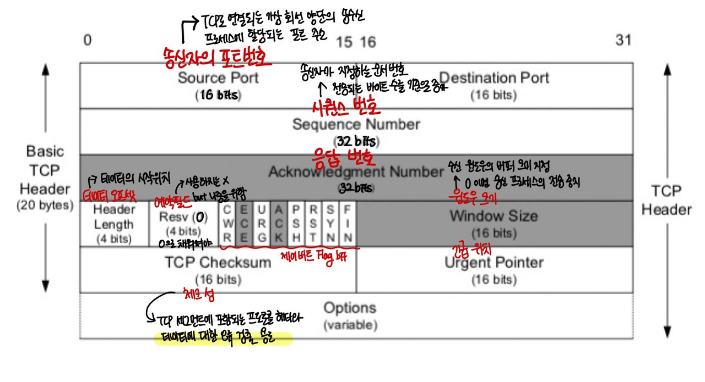
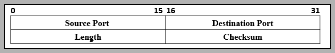
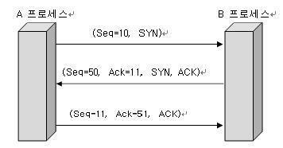
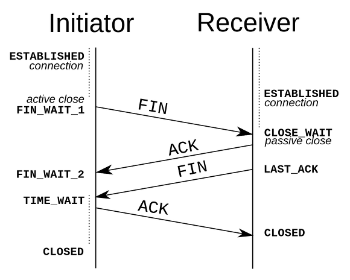

OSI 참조 모델은 말그대로 참조 모델일 뿐 실제 사용되는 인터넷 프로토콜은 OSI 7 계층 구조를 완전히 따르지 않는다.
인터넷 프로토콜 스택은 대부분 TCP/IP를 따른다.

TCP/IP 모델은 TCP와 IP의 합성어로 데이터의 흐름 관리, 정확성 확인, 패킷의 목적지 보장을 담당한다.
데이터의 정확성 확인(패킷을 추적 및 관리)은 TCP, 패킷을 목적지까지 전송하는 일은 IP가 담당한다.

TCP/IP 모델의 전송 계층은 송신자와 수신자를 연결하는 통신서비스를 제공하는 계층이다. 즉 데이터의 전달을 담당한다. 
이 데이터의 전달 과정에서 데이터를 보내기위해 사용하는 프로토콜이 TCP와 UDP가 되는 것이다.

## TCP (Transmission Control Protocol)
- 인터넷상에서 데이터를 메세지의 형태로 보내기 위해 IP와 함께 사용하는 프로토콜을 뜻한다.
- TCP는 연결형 서비스를 지원하는 프로토콜로 인터넷 환경에서 기본으로 사용한다.

### TCP의 특징
- 연결형 서비스로 가상 회선 방식을 사용한다.
    - 발신지와 수신지를 연결하여 패킷을 전송하기 위한 논리적 경로를 정한다.
- 3-way handshaking 과정을 통해 연결을 설정하고, 4-way handshaking을 통해 배정한다.
    - 목적지와 수신지를 확실히 하여 정확한 전송을 보장하기 위해 세션을 수립하는 과정을 의미한다.
- 흐름 제어 및 혼잡 케어
- 전이중(Full-Duplex), 점대점(Point to Point)방식
> 이러한 특징을 지니는 이유는 TCP가 높은 신뢰성을 보장하기 때문이다.
- 높은 신뢰성으로 인해 UDP보다 속도가 느리다. 따라서 TCP는 영속성보다 신뢰성있는 전송이 중요할 때에 사용한다.
- 사용예시 ) HTTP, Email, File Transfer

#### 패킷이란?
- 라우팅을 효율적으로 하기 위해서 데이터를 여러 개의 조각들로 나누어 전송하는데 이 조각을 패킷이라 한다.

#### TCP가 패킷을 추적, 관리하는 방법
- 패킷에 번호를 부여하여 패킷의 분실 확인과 같은 처리를 하여 목적지에서 재조립하는 과정을 진행한다.

#### 전이중, 점대점 방식
- 전이중 (Full-Duplex): 전송이 양방향으로 동시에 일어날 수 있다.
- 점대점 (Point to Point): 각 연결이 정확히 2개의 종단점을 가지고 있다.

## UDP (User Datagram Protocol)
- 데이터를 독립적인 관계를 지니는 패킷인 데이터그램 단위로 처리하는 프로토콜이다.
- TCP와 달리 연결을 위해 할당되는 논리적인 경로가 없는 비연결형 프로토콜이다.
- 각각의 패킷은 각각 다른 경로로 전송되고 독립적인 관계를 지니게 된다.
- 즉, UDP란 데이터를 서로 다른 경로로 독립적으로 처리하게 되는 프로토콜이라 할 수 있다.

### UDP의 특징
- 비연결형 서비스로 데이터그램 방식을 사용한다.
- 정보를 주고 받을 때 정보를 보내거나 받는다는 신호절차를 거치지 않는다.
- UDP 헤더의 CheckSum 필드를 통해 최소한의 오류만 검출한다.
- TCP보다 속도가 빠르지만 신뢰성이 낮다.
> 패킷에 순서를 부여하여 재조립을 하거나 흐름제어 또는 혼잡 제어와 같은 기능도 처리를 하지 않기 때문에 속도가 빠른 것
- 따라서 신뢰성보다는 영속성이 중요한 서비스에 사용한다. 
- 사용예시 ) DNS, Broadcasting, 도메인, 실시간 동영상 서비스
  
|프로토콜 종류|TCP|UDP|
|------|---|---|
|연결 방식|연결형 서비스|비연결형 서비스|
|패킷 교환 방식|가상 회선 방식|데이터그램 방식|
|전송 순서|전송 순서 보장|전송 순서가 바뀔 수 있음|
|수신 여부 확인|수신 여부를 확인함|수신 여부를 확인하지 않음|
|통신 방식|1:1 방식|1:1 OR 1:N OR N:N 통신|
|신뢰성|높다|낮다|
|속도|느리다|빠르다|

## TCP와 UDP의 헤더 분석
### TCP Header
TCP는 상위 계층으로부터 데이터를 받아 헤더를 추가해 IP로 전송한다.

|필드|내용|크기|
|------|---|---|
|Source Port, Destination Port|TCP로 연결되는 가상 회선 양단의 송수신 프로세스에 할당되는 포트 주소|16|
|Sequence Number|송신자가 지정하는 순서번호, 전송되는 바이트 수를 기준으로 증가 SYN = 1 : 초기 시퀀스 번호. ACK 번호는 이 값에 + 1|32|
|Acknowledgment(ACK) Number|수신 프로세스가 제대로 수신한 바이트의 수 응답용|32|
|Header Length(Data Offset)|TCP 헤더 길이를 4바이트 단위로 표시(최소 20, 최대 60 바이트)|4|
|Resv(Reserved)|나중을 위해 0으로 채워진 예약 필드|4|
|Flag Bit|SYN, ACK, FIN 등 제어 번호|8|
|Window Size|수신 윈도우의 버퍼 크기 지정(0이면 송신 중지). 상대방의 확인 없이 전송 가능한 최대 바이트 수|16|
|TCP Shecksum|헤더와 데이터의 에러 확인 용도|16|
|Urgent Pointer(긴급 위치)|현재 순서 번호부터 표시된 바이트까지 긴급한 데이터임을 표시, URG 플래그 비트가 지정된 경우에만 유효|16|
|Options|추가 옵션 있을 경우 표시|가변 0–320 비트, 32의 배수|

#### Flag Bit

|종류|내용|
|------|---|
|URG|긴급 위치 필드 유효 여부 설정|
|ACK|응답 유효 여부 설정. 최초의 SYN 패킷 이후 모든 패킷은 ACK 플래그 설정 필요. 데이터를 잘 받았으면 긍정 응답으로 ACK(=SYN+1) 전송|
|PSH|수신측에 버퍼링된 데이터를 상위 계층에 즉시 전달할 때|
|RST|연결 리셋 응답 혹은 유효하지 않은 세그먼트 응답|
|SYN|연결 설정 요청. 양쪽이 보낸 최초 패킷에만 SYN 플래그 설정|
|FIN|연결 종료 의사 표시|

### UDP Header

|필드|내용|크기|
|------|---|---|
|Source Port, Destination Port|송수신 애플리케이션의 포트 번호|16|
|Length|헤더와 데이터 포함 전체 길이|16|
|Checksum|헤더와 데이터의 에러 확인 용도. UDP는 에러 복수를 위한 필드가 불필요하기 때문에 TCP 헤더에 비해 간단|16|

## TCP의 3-way handshake, 4-way handshake
- TCP는 장치들 사이에 논리적인 접속을 성립하기 위하여 연결을 설정하여 신뢰성을 보장하는 연결형 서비스이다.
- 3-way handshake란 TCP 통신을 이용하여 데이터를 전송하기 위해 네트워크 연결을 설정하는 과정이고,
4-way handshake는 TCP의 연결을 해제하는 과정이다.
  
### 3-way handshake
- 양쪽 모두 데이터를 전송할 준비가 되었다는 것을 보장하고, 실제로 데이터 전달이 시작하기 전에 한 쪽이 다른 쪽이 준비되었다는 것을 알 수 있도록 한다.
즉 TCP/IP 프로토콜을 이용해서 통신을 하는 응용 프로그램이 데이터를 전송하기 전에 먼저 정확한 전송을 보장하기 위해 상대방 컴퓨터와 사전에 세션을 수립하는 과정을 의미한다.
  

1. 접속 요청 프로세스(A프로세스)가 연결요청 메시지를 전송한다. (SYN)
2. 접속 요청을 받은 프로세스(B 프로세스)가 수락한다. (SYN+ACK)
3. 마지막으로 접속 요청 프로세스가 수락 확인을 보내 연결을 맺는다. (ACK)

### 4-way handshake

1. 클라이언트가 연결을 종료하겠다는 FIN 플래그를 전송한다. (FIN)
2. 서버는 일단 확인메시지를 보내고 자신의 통신이 끝날때까지 기다린다. 이 상태가 TIME_WAIT 상태다.
그리고 전송할 데이터가 남아있다면 이어서 계속 진행한다. (ACK)
3. 서버가 통신이 끝났으면 연결이 종료되었다고 클라이언트에게 FIN 플래그를 전송한다. (FIN)
4. 클라이언트는 확인했다는 메시지를 보낸다. (ACK)

[https://steel-blue.tistory.com/81](https://steel-blue.tistory.com/81)