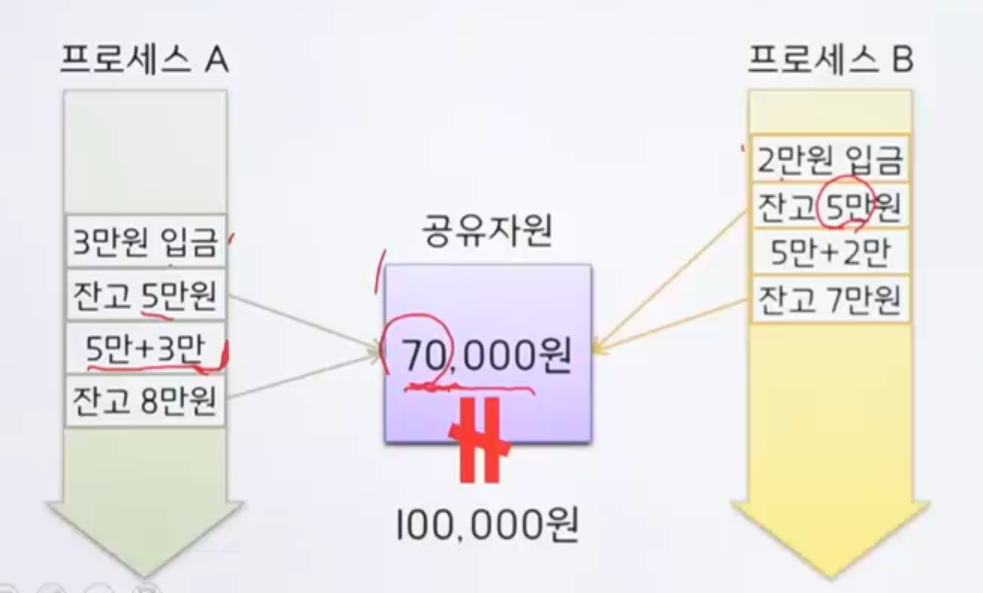

# 병행 프로세스

# 병행성

### 병행성(concurrency)

- 여러 개의 프로세스 또는 쓰레드가 동시에 실행되는 시스템의 특성

### 병행 프로세스

- 동시에 실행되는 여러 개의 프로세스 또는 쓰레드

## 병행 프로세스의 실행 형태

### CPU의 개수에 따른 병행 프로세스의 실행 형태

- 하나의 CPU에서 인터리빙 형식으로 실행
    - 하나를 잘게 쪼개서 계속 돌리면서 사용하는 방식
- 여러 개의 CPU에서 병렬 처리 형식으로 실행
    - CPU별로 프로세스 하나씩 처리 프로세스 개수 = CPU 개수

### 메모리 구조에 따른 병행 프로세스의 실행 형태

- 강결합 멀티프로세서 시스템
    - `공유 메모리 구조`
    - 하나의 메모리를 여러 CPU가 공유해서 사용
- 약결합 멀티프로세서 시스템
    - `분산 메모리 구조`
    - CPU마다 메모리가 각각 존재
    - 통신선을 활용해서 메모리를 주고받음

## 병행성 문제

### 병행 프로세스들이 상호작용 하는 경우 발생

- 공유자원 점유 문제
    - 특정 자원을 여러 프로세스들이 사용하려고 하는 것
    - 누가 사용하게 할 것인지?
- 동기화 문제
    - 프로세스 사이의 순서 관계를 정하는 문제
    - A → B 순서여야 하는데 B → A 면 안된다
- 통신 문제
    - 분산 메모리 같은 경우에 어떻게 데이터등을 주고 받을 것인지


### 상황에 따른 구분

**단일 프로세스 내의 병행성**

```java
S1 : a := x + y;
S2 : b := z + l;
S3 : c := a + b;
S4 : write(c);
```

- 이 경우 a와 b가 실행된 후 c가 실행되어야 하고, c가 실행된 후 마지막 출력문이 실행되어야 한다.
- 어떻게 해결할 수 있을까?
- `우선순위 그래프` (DAG)
    - 정점 : 문장
    - 방향 있는 간선 : 우선순위 관계

```java
(S1) (S2)
  ↘︎  ↙︎
  (S3)
   ↓
  (S4)
```

- 우선 순위에 따라서 방향 있는 간선으로 연결
- S1, S2는 서로 연결관계 X → 병행성의 관계를 가지고 있다고 볼 수 있음
- `Fork/Join 구조`
    - fork L : 2개의 병행 수행을 만듦(레이블 L 위치, fork 명령어 다음)
    - join n : 병행하는 n개의 흐름을 하나로 재결합

```java
 count := 2;
 fork L1;
 a := x + y;
 go to L2;
L1 : b := z + l;
L2 : join count;
 c := a + b;
 write(c);
```

- `병행문`
    - 1개의 프로세스가 여러 가닥의 병령 프로세스로 분할되었다가 다시 하나로 결합
    - parbegin / parend 문

```java
S0;
parbegin
 S1;
 S2;
 .
 .
 .
 Sn;
parend
Sn+1; 
```

```java
parbegin
	a := x + y;
	b := z + l;
parend
	c := a + b;
	write(c);
```

**프로세스 간의 병행성**

- `비동기 병행 프로세스`



# 동기화와 임계영역

### 프로세스 동기화

- 2개 이상의 프로세스에 대한 처리순서를 결정하는 것
- 예) 동시에 사용할 수 없는 공유자원, 한 프로세스의 처리 결과에 따라 다른 프로세스의 처리가 영향을 받는 경우

### 임계영역

- 2개 이상의 프로세스가 동시에 액세스하면 안되는 공유자원을 액세스하는 코드 영역

### 상호배제

- 2개 이상의 프로세스가 동시에 임계영역에 집입하지 못하도록 하는 것

## 임계영역의 예

### 상호배제를 통한 프로세스 동기화

- 프로세스 A가 실행되고 있을 떈 다른 프로세스가 공유자원에 접근하지 못하도록 함

### 임계영역을 갖는 프로세스의 일반적 구조

```java
repeat
 진입영역
 임계영역
 해제영역
 잔류영역
until false;
```

### 임계영역 문제 해결을 위한 요구조건

- 상호배제
    - 한 프로세스가 임계영역에서 실행 중일 때 다른 어떤 프로세스도 임계영역에서 실행될 수 없음
- 진행
    - 임계영역에서 실행 중인 프로세스가 없고, 여러 프로세스가 임계영역에 진입하고자 할 때
    - 그 중에서 적절히 한 프로세스를 결정해야 하며 이 결정은 무한정 미룰 수 없음
- 제한된 대기
    - 계속해서 대기할 수 없음. 임계영역에 들어갈 수 있는 기회를 제공해줘야 함

### 임계영역 문제 해결을 위한 도구

- `Test-and-Set` 명령어 (TS 명령어)
    - 상호배제의 하드웨어적 해결 방법
    - 분리가 불가능한 단일 기계 명령어(원자적으로 수행)

```basic
function Test_and_Set(var target: boolean): boolean;
	begin
		Test_and_Set:= target;
		target:= true;
	end
```

- 상호배제의 구현

```basic
repeat
	while Test_and_Set(lock) do skip; // lock의 초기값은 false
	임계영역
	lock:= false;
	잔류영역
until false;
```

- 문제점
    - 많은 프로세스가 임계영역에 들어가기를 원할 떄 기아가 발생할 수 있음
    - Busy waiting을 함으로써 다른 작업이 사용할 수 있는 CPU 사이클 낭비
- `세마포어` (semaphore)
    - Dijkstra 가 제안한 동기화 도구
    - 세마포어 s: 사용 가능한 자원의 수 또는 잠김/열림 등의 상태를 나타내는 값을 저장하는 정수형 공용변수
    - 세마포어 s는 두 표준단위 연산 P와 V에 의해서만 접근됨

```basic
// P(s) : 검사, 감소시키려는 시도
if ( s > 0 ) then
	s := s-1;
else
	현재의 프로세스 대기;

// V(s) : 증가
if (1개 이상의 프로세스가 대기 중) then
	그 중 1개의 프로세스만 진행;
else
	s := s+1;
```

- 상호배제의 구현

```basic
repeat
	P(mutex); // 세마포어 mutex의 초기값은 1
	임계영역
	V(mutex);
	잔류영역
until false;
```

- 동기화 문제 해결
    - 프로세스1이 문장 S1을 실행한 후
    - 프로세스2가 문장 S2를 실행하도록 동기화(block/wakeup 프로토콜)